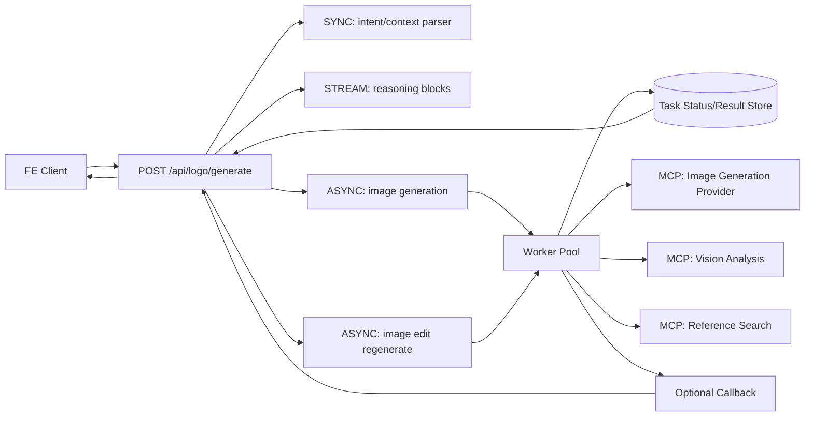

# Technical Design (POC v1) - AI Logo Design Agent

Feature: 001-logo-design-agent  
Status: POC design reset (overview-first, flexible flow)

## 1. Overview

### 1.1 POC Goal
Build a backend flow that is easy for FE to collaborate with:
- FE sends one main request with `query` (+ optional context).
- BE handles intent parsing -> reasoning stream -> image generation -> optional edit loop.
- FE receives final image outputs and can continue iteration by sending more inputs.

Target mindset for this document:
- Build a strong frame, not rigid rules.
- Keep extensibility open (fields can be added without breaking core flow).
- Make integration with ai-hub-sdk explicit and implementation-friendly.

### 1.2 Success Metrics (POC)
- API usability: FE can complete end-to-end flow with one main endpoint and predictable task status checks.
- Time to first reasoning chunk: <= 3s in normal load.
- Time to first generated batch (3-4 images): <= 45s for default provider profile.
- Completion success rate (no manual operator intervention): >= 90% in staging runs.
- Edit success usability: user can regenerate from selected image with prompt-only edit in one roundtrip.

### 1.3 Technical Constraints
- Use ai-hub-sdk serving modes as designed:
  - SYNC for fast intent/context checks.
  - STREAM for reasoning visibility.
  - ASYNC for generation/edit workloads.
- Use MCPTool for external providers (generation, vision, search).
- Do not hard-code strict state-machine transitions in API contract.
- Keep session handling optional and lightweight (context-friendly, not state-heavy).
- Prefer transparent errors and retry guidance over hidden fallback behavior.

---

## 2. POC Scope (Build vs Defer)

| Area | Build in POC | Defer after POC |
|---|---|---|
| API surface | One main orchestrator API for query -> image, plus task status/reasoning channels | Multi-workflow API families, complex workflow routing |
| Generation strategy | Single default provider profile per request/session | Dynamic multi-model router, parallel provider A/B |
| Editing | Prompt-based edit from selected output | Mask-based inpainting, smart-mark canvas tools |
| Reasoning UX | Streamed reasoning blocks before generation | Advanced interactive reasoning controls |
| Quality control | Basic validation (size/format + minimal quality checks) | Full auto-evaluator and learned scoring loop |
| Persistence | Lightweight context storage for continuity | Full history/versioning/project library |
| Governance | Basic tracing + structured errors | Cost governance, quotas, enterprise policy layers |

---

## 3. System Architecture (Most Important)

### 3.1 Backend-first pipeline (1 main API)

Primary contract from FE perspective:
- Input: `query` (+ optional fields such as reference image URL, brand hints, style hints, edit intent).
- Output: image set (initial or edited), with reasoning and task metadata.

Recommended external endpoint:
- `POST /api/logo/generate`

This endpoint is orchestration-first: it can start from scratch or continue a previous iteration depending on optional context fields.



### 3.2 Why this architecture fits ai-hub-sdk

Based on SDK docs:
- Sync API is best for quick checks and immediate decisions.
- Stream API is best for progressive output and visibility to users.
- Async API is best for tasks >30s and worker scaling with Pub/Sub + Redis status.

This naturally maps logo flow to:
1. parse intent/context quickly,
2. stream reasoning,
3. submit long-running generation/edit,
4. return result through status polling or webhook.

### 3.3 Internal sub-APIs in handle flow (not FE burden)

Inside backend orchestration, split flow into sub-calls:

1) Input Normalization (SYNC)
- Responsibility: parse raw `query`, resolve missing fields, generate assumptions.
- Output drives next steps, not rigid state transitions.

2) Reasoning Stream (STREAM)
- Responsibility: emit explainable reasoning chunks (understanding, style direction, assumptions, constraints).
- FE can render this timeline while async generation is running.

3) Image Generation (ASYNC)
- Responsibility: generate 3-4 candidate images from normalized context.
- Returns task id immediately; result retrieved by polling or callback.

4) Optional Edit Regeneration (ASYNC)
- Responsibility: if request includes `selected_image_id + edit_prompt`, regenerate variant from selected output.
- Keeps same orchestrator endpoint; FE only adds fields.

### 3.4 Tool list (MCP-centric)

Core external tools to wire:
- Image generation MCP server (default provider profile).
- Vision MCP server (reference/style extraction).
- Web/image search MCP server (optional inspiration retrieval).
- Optional embedding MCP server (semantic style matching).

Tooling principle:
- Keep least-privilege tool exposure with tool filtering.
- Start from reliable HTTP MCP connections; add SSE only if server requires it.

### 3.5 Short competitor note (from practical testing direction)

In lightweight internal comparison style (POC-level):
- DALL-E style providers: generally stable prompt adherence and predictable API UX.
- Ideogram-style providers: often stronger logo/text rendering consistency in some branding cases.
- Midjourney-like stacks: can be visually strong but integration/control overhead is typically higher for strict product flows.

POC recommendation:
- Keep one default provider profile first, log outputs and failure modes, then decide router design in next phase.

---

## 4. Data Schema and API Integration

Below are flexible Pydantic frames for each step. These are scaffolds, not rigid workflow locks.

### 4.1 Main request/response (FE-facing)

```python
from typing import Optional, List, Dict, Any
from pydantic import BaseModel, Field, HttpUrl


class GenerateLogoRequest(BaseModel):
    query: str = Field(..., min_length=1)

    # Optional context for collaboration with FE
    reference_image_url: Optional[HttpUrl] = None
    brand_name: Optional[str] = None
    style_hints: List[str] = Field(default_factory=list)
    audience_hints: List[str] = Field(default_factory=list)

    # Optional continuation/edit inputs
    selected_image_id: Optional[str] = None
    edit_prompt: Optional[str] = None

    # Optional tracing/context (not mandatory)
    session_id: Optional[str] = None
    trace_id: Optional[str] = None
    metadata: Dict[str, Any] = Field(default_factory=dict)


class GeneratedImage(BaseModel):
    image_id: str
    image_url: HttpUrl
    width: int
    height: int
    provider: str
    metadata: Dict[str, Any] = Field(default_factory=dict)


class GenerateLogoResponse(BaseModel):
    request_id: str
    status: str  # accepted | processing | completed | failed
    reasoning_stream_id: Optional[str] = None
    generation_task_id: Optional[str] = None
    images: List[GeneratedImage] = Field(default_factory=list)
    assumptions: List[str] = Field(default_factory=list)
    error: Optional[str] = None
```

### 4.2 Sub-flow schemas (internal orchestration)

```python
from typing import Literal
from pydantic import BaseModel, Field


class IntentCheckInput(BaseModel):
    query: str
    reference_image_url: Optional[HttpUrl] = None
    hints: Dict[str, Any] = Field(default_factory=dict)


class IntentCheckOutput(BaseModel):
    is_logo_request: bool
    confidence: float
    normalized_context: Dict[str, Any] = Field(default_factory=dict)
    assumptions: List[str] = Field(default_factory=list)


class ReasoningChunk(BaseModel):
    stage: Literal["input_understanding", "style_inference", "constraints", "done"]
    message: str
    bullets: List[str] = Field(default_factory=list)


class GenerationInput(BaseModel):
    normalized_context: Dict[str, Any] = Field(default_factory=dict)
    reference_image_url: Optional[HttpUrl] = None
    variation_count: int = Field(default=4, ge=1, le=4)


class GenerationOutput(BaseModel):
    images: List[GeneratedImage] = Field(default_factory=list)
    quality_notes: List[str] = Field(default_factory=list)


class EditInput(BaseModel):
    selected_image_id: str
    edit_prompt: str
    normalized_context: Dict[str, Any] = Field(default_factory=dict)


class EditOutput(BaseModel):
    image: GeneratedImage
    edit_notes: List[str] = Field(default_factory=list)
```

### 4.3 Where external APIs are called

1. Intent check (SYNC)
- Call: ai-hub-sdk compute endpoint or AIHubSyncService.
- Purpose: parse request semantics and normalize context.

2. Reasoning stream (STREAM)
- Call: ai-hub-sdk stream endpoint or AIHubStreamService.
- Purpose: push progressive reasoning chunks to FE.

3. Generation/edit (ASYNC)
- Call: ai-hub-sdk submit endpoint or AIHubAsyncService.
- Worker calls MCP tools for generation/vision/search.
- Result retrieval: task status API and optional webhook callback.

### 4.4 Suggested API set around main endpoint

- `POST /api/logo/generate`
  - One entrypoint for both initial generate and optional edit continuation.

- `GET /api/logo/tasks/{task_id}`
  - Proxy task status for FE polling.

- `GET /api/logo/streams/{stream_id}` or SSE channel
  - Deliver reasoning chunks.

These support FE collaboration without forcing strict backend state contracts.

---

## 5. Risks and Open Issues

### 5.1 Main risks

1. Latency variability
- Cause: provider queueing, network, heavy prompts, reference analysis.
- Mitigation: strict timeout budgets per tool call, early reasoning stream, explicit status updates.

2. Generation quality inconsistency
- Cause: prompt ambiguity and provider variance.
- Mitigation: normalized context + assumptions surfaced, lightweight quality checks, retry policy with clear user feedback.

3. Cost unpredictability
- Cause: repeated iteration loops and multi-call pipeline.
- Mitigation: cap variation count, cap search depth, add usage metadata to each task.

4. Tool/schema drift
- Cause: external MCP server updates.
- Mitigation: strict adapter layers and schema validation at each boundary.

### 5.2 Open technical decisions (need team alignment)

1. Default provider profile for POC launch
- Decide one default first; evaluate router only after log-based evidence.

2. Reasoning transport for FE
- Choose NDJSON stream vs SSE bridge based on frontend infra preference.

3. Persistence depth
- Decide minimum context retention window for practical edit iterations.

4. Quality gate threshold
- Define pass/fail criteria strictness for initial release.

5. Cost guardrail policy
- Decide per-request budget and handling behavior when budget is exceeded.

---

This version intentionally focuses on an overview-first, flexible backend architecture so FE can collaborate by adding inputs progressively without being blocked by rigid state contracts.
