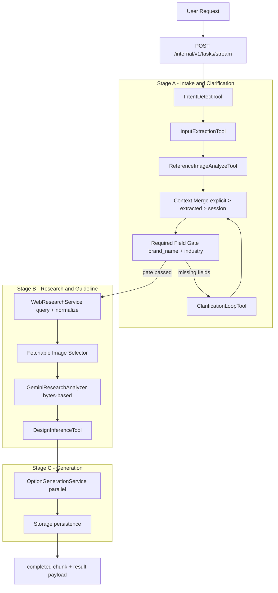
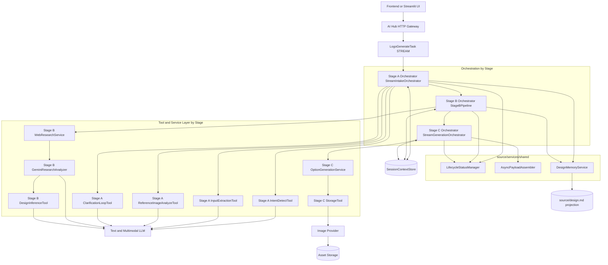
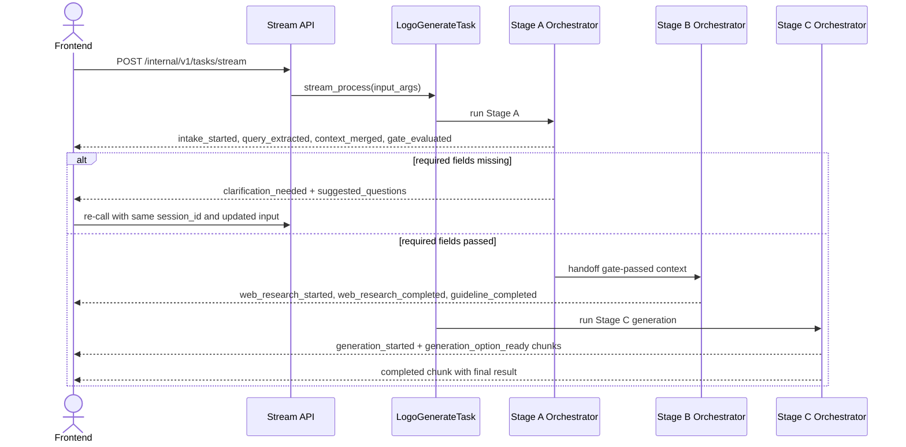

# Logo Design AI POC (As-Built)

## 1. Overview

### 1.1 POC objective

Build a logo generation backend aligned with ai-hub-sdk task contract for Step 1 -> Step 6.

In-scope:

- Step 1: intent detect.
- Step 2: input extraction + reference analysis.
- Step 2.5: web research enrichment for logo domain.
- Step 3: required-field validation and clarification loop.
- Step 4: design guideline inference.
- Step 6: generate logo options and return final payload.

Out-of-scope:

- Step 7: prompt-based editing/inpainting.
- Step 8: follow-up suggestion intelligence.

Notes:

- Step 5 "Design direction selection" is automated by Stage B via `strategic_design_directions`; there is no separate user selection step in current source.
- Current source does not implement quick-action orchestration.

### 1.2 Success metrics (POC acceptance targets)

- >= 90% requests extract or clarify `brand_name` and `industry` before generation.
- >= 90% requests that pass required-field gate produce valid `guideline`.
- >= 85% requests return valid options payload.
- p95 stream end-to-end completion target <= 40s for current POC runtime target.
- On failure, return actionable `error_code` and `error_message` in stream chunk.

### 1.3 User journey (current implemented flow)

1. User submits query with optional explicit fields and references.
2. System streams Stage A chunks (intent/extraction/merge/gate).
3. If required fields are missing, system emits `clarification_needed` with `missing_fields` and `suggested_questions`.
4. User answers and re-calls stream with same `session_id`.
5. System runs Stage B (web research + guideline inference) only after gate pass.
6. System runs Stage C and returns completed payload (`guideline`, `required_field_state`, `options`).

Key UX point:

- Current `source` implementation is stream-first end-to-end in one task execution (`ServingMode.STREAM`).
- Stage C is not executed as separate submit/poll async job in current task runtime path.

### 1.4 Technical constraints

- ai-hub-sdk task is implemented via `BaseTask` with:
  - `task_type = logo_generate`
  - `serving_mode = STREAM`
- Input schema: `LogoGenerateInput`.
- Output stream schema: `LogoGenerateTaskOutput` chunks.
- Mandatory fields before Stage B/Stage C:
  - `brand_name`
  - `industry`
- Merge precedence in current orchestrator:
  - explicit request fields > extracted fields > previous session context fallback (clarification follow-up mode).
- Session scope is per `session_id` via `SessionContextStore` checkpoints.
- Provider failures are fail-closed, no synthetic guideline/options fallback.

---

## 2. POC Scope

### 2.1 Build vs Defer

| Area | Build (current source) | Defer |
| :--- | :--- | :--- |
| Intent + input | Intent detect, extraction, reference analysis in Stage A | Multi-domain intent classifier |
| Clarification | Required-field gate + clarification chunk + stream re-call | Adaptive personalized questioning policy |
| Reasoning | Stage-level reasoning chunks and metadata in stream | Multi-agent self-critique loops |
| Research | SerpAPI query + normalization + fetchable-image selection + Gemini analysis | Automatic query backfill when fetchable image pool is insufficient |
| Guideline | Structured guideline inference from context + research | Guideline optimization loop |
| Generation | Parallel option generation and storage upload | Provider auto-routing/ranking |
| Storage/session | Session checkpoints (`SessionContextStore`) + shared status/payload services | Long-term project memory/version history |
| Editing | Deferred | Step 7 |
| Follow-up suggestion | Deferred | Step 8 |

### 2.2 Technical-design items not yet implemented

- Production BFF stream controls (retry/reconnect/backpressure/chunk flush policies).
- Queue-decoupled deployment where Stage C is isolated from stream worker.
- Explicit confidence-threshold gate policy as hard rule.
- End-to-end cost analytics by `task_id` and `session_id`.
- Asset retention and signed URL TTL runtime policy.

---

## 3. System Architecture

### 3.1 Overview

#### 3.1.1 Why this solution

Current architecture prioritizes deterministic gating and contract-safe outputs:

1. Stage A enforces required-field quality before expensive downstream work.
2. Stage B enriches context only after gate pass and only with fetchable references.
3. Stage C generates options in parallel from validated guideline concepts.
4. Session checkpointing makes clarification continuation deterministic.
5. Error handling is explicit; invalid preconditions do not silently degrade to fabricated results.

#### 3.1.2 Diagram 1 - Agent pipeline (top-down)



#### 3.1.3 Diagram 2 - System components (top-down layered)



### 3.2 Architecture principles

- Task-first:
  - Business capability is routed by one task type `logo_generate`.
- Schema-first:
  - Pydantic models enforce request/response and stage-boundary contracts.
- Context-first handoff:
  - Services produce deltas; orchestrators merge and checkpoint.
- Fail-closed:
  - Missing prerequisites/provider failures return explicit failures.
- Deterministic merge:
  - explicit > extracted > session fallback (clarification follow-up path).

#### 3.2.1 Memory flow contract (current source)

1. Orchestrators own runtime state (`task_id`, progress, stage transitions).
2. Tool services remain stateless regarding global workflow state.
3. Checkpoints are persisted into `SessionContextStore` after key stages.
4. Clarification follow-up reuses latest session state by `session_id`.
5. `context_version` is used by checkpoint helper for stale-write-safe merges.
6. `DesignMemoryService` persists per-topic snapshots into `source/design.md` at clarification and guideline checkpoints.

#### 3.2.2 POC simplification notes

- Planner/observer are logical roles embedded in orchestrators.
- Stage A, Stage B, and Stage C are executed sequentially in one stream lifecycle in current runtime path.
- Separate async queue execution for Stage C is not implemented in current `source/tasks/logo_generate.py` flow.

### 3.3 Component breakdown (tool-level)

| Component or Tool | Spec step | Role | Model Type | Notes |
| :--- | :--- | :--- | :--- | :--- |
| IntentDetectTool | Step 1 | Detect logo intent | Text LLM | Returns `is_logo_intent`, confidence, reason |
| InputExtractionTool | Step 2 | Extract brand and preferences | Text LLM structured output | Explicit-only extraction prompt policy |
| ReferenceImageAnalyzeTool | Step 2 | Analyze visual references | Multimodal LLM | Supports URL/local bytes references |
| ClarificationLoopTool | Step 3 | Generate targeted questions for missing fields | Text LLM + deterministic fallback | Emits `suggested_questions` |
| WebResearchService | Step 2.5 | Query + normalize + dedupe + fetchable filtering | SerpAPI + normalizer | Runs only after required-field gate pass |
| GeminiResearchAnalyzer | Step 2.5 | Analyze top references for strategic directions | Gemini multimodal | Backend sends image bytes |
| DesignInferenceTool | Step 4 | Build guideline JSON | Text LLM | Requires exactly 3 strategic directions |
| LogoGenerationTool | Step 6 | Generate options from concept variants | Image provider | Parallel per-option generation |
| StorageTool | Shared | Persist image outputs and return URLs | Storage API | Called in Stage C path |
| SessionContextStore | Shared | Session checkpoint persistence | Cache/DB adapter | Used by Stage A/B/C |

### 3.3.1 Shared services in source/services/shared

| Shared module | Responsibility | Used by |
| :--- | :--- | :--- |
| `LifecycleStatusManager` | Build status payloads + progress mapping | Stage A/B/C orchestrators |
| `AsyncPayloadAssembler` | Build completed/failed result payload contract | Stage C orchestrator |
| `DesignMemoryService` | Persist design context snapshots to `source/design.md` | Stage A and Stage B |

### 3.4 End-to-end pipeline

POC external task type: `logo_generate`.

#### 3.4.1 Full sequence overview (current source)



#### 3.4.2 Stage A - Intake and clarification loop (Step 1-3)

| Item | Detail |
| :--- | :--- |
| Input | `LogoGenerateInput` (`session_id`, query, optional explicit fields, references) |
| Tools used | IntentDetectTool, InputExtractionTool, ReferenceImageAnalyzeTool, ClarificationLoopTool |
| Output | Gate-passed merged context or clarification chunk |
| Gate | `brand_name` AND `industry` must be present |
| Ordering | Clarification happens before any Stage B web research |

#### 3.4.3 Stage B - Web research and guideline inference (Step 2.5 + Step 4)

| Item | Detail |
| :--- | :--- |
| Input | Gate-passed merged context |
| Tools used | WebResearchService, GeminiResearchAnalyzer, DesignInferenceTool |
| Query policy | Fixed template set from normalizer |
| Image policy | Dedupe candidate pool, keep fetchable images only |
| Failure policy | If fetchable images < configured top count, fail Stage B explicitly |
| Guideline policy | Requires exactly 3 strategic directions |
| Output | `ResearchContext` + `DesignGuideline` checkpoint |

#### 3.4.4 Stage C - Logo generation (Step 6)

| Item | Detail |
| :--- | :--- |
| Input | Guideline + `variation_count` |
| Tools used | OptionGenerationService + storage persistence |
| Output | `LogoGenerateOutput` with `guideline`, `required_field_state`, `options` |
| Concurrency | Parallel generation (`asyncio.as_completed`) |

Current option count behavior in source:

- Schema allows `variation_count` in [3, 4] with default 4.
- Guideline currently enforces exactly 3 `concept_variants`.
- Stage C count formula is `min(max(variation_count, 3), len(concept_variants))`.
- Effective full-flow output count is therefore currently 3 options.

### 3.5 Reuse and extensibility

- Add fields in extraction/guideline:
  - extend schemas and prompts; keep task contract stable.
- Add Step 7 later:
  - add `logo_edit` task and reuse session/memory contract.
- Add providers:
  - swap provider adapters while preserving output schema.

---

## 4. Data Schema and API Integration

### 4.1 Pydantic models by stage (as-built contract)

```python
class LogoGenerateInput(TaskInputBaseModel):
    session_id: str
    query: str
    brand_name: Optional[str]
    industry: Optional[str]
    style_preference: List[str] = []
    color_preference: List[str] = []
    symbol_preference: List[str] = []
    typography_direction: Optional[str]
    references: List[ReferenceImage] = []
    use_session_context: bool = True
    variation_count: int = Field(4, ge=3, le=4)

class RequiredFieldState(BaseModel):
    required_keys: List[str] = ["brand_name", "industry"]
    missing_keys: List[str] = []
    passed: bool = False

class DesignGuideline(BaseModel):
    concept_statement: str
    concept_variants: List[str]
    style_direction: List[str]
    color_palette: List[str]
    typography_direction: List[str]
    icon_direction: List[str]
    constraints: List[str]

class LogoGenerateOutput(BaseModel):
    guideline: DesignGuideline
    required_field_state: RequiredFieldState
    options: List[LogoOption]  # min 3, max 4 by schema
```

### 4.2 Validation rules and merge precedence

- `query` must be non-empty after trim.
- `variation_count` must be in [3, 4].
- Required-field gate requires both `brand_name` and `industry`.
- Merge precedence:
  - explicit request > extracted > session fallback (clarification follow-up mode).
- Empty string for optional scalar fields is normalized to `None`.
- If gate fails, stream chunk includes `missing_fields` and `suggested_questions`.

### 4.3 Endpoint mapping in current runtime path

Current execution path in `LogoGenerateTask`:

- `POST /internal/v1/tasks/stream`
  - Runs Stage A + Stage B + Stage C in one stream task.

SDK routes exist but are not primary in current task execution path:

- `POST /internal/v1/tasks/submit`
- `GET /internal/v1/tasks/{task_id}/status`

Typical stream status progression:

- `intake_started` / `intake_resumed`
- `query_extracted`
- `context_merged`
- `required_field_gate_evaluated`
- `clarification_needed` (if gate fails)
- `guideline_inference_started`
- `web_research_started`
- `web_research_completed`
- `guideline_completed`
- `generation_started`
- `generation_option_ready` (repeated)
- `completed`

### 4.4 Provider/runtime notes

- Text and multimodal inference depend on Gemini runtime availability and credentials.
- Stage C generation currently depends on Gemini image generation path.
- If provider prerequisites are missing, generation fails explicitly (`GEMINI_UNAVAILABLE`) without fabricated fallback images.

---

## 5. Risks and open issues

### 5.1 Latency

Risk:

- Stage B network retrieval + multimodal analysis can increase p95 latency.

Mitigation:

- Bounded query policy and fetchable-image filtering.
- Parallel Stage C generation.

### 5.2 Provider reliability

Risk:

- Provider internal errors or media fetch restrictions.

Mitigation:

- Keep fetchable-only research image path.
- Use bytes-based upload for multimodal requests.
- Return explicit failure chunk with error details.

### 5.3 Clarification loop quality

Risk:

- Ambiguous inputs can trigger repeated clarification turns.

Mitigation:

- Targeted clarification questions from LLM with deterministic fallback set.
- Session checkpoint reuse by `session_id`.

### 5.4 Open technical decisions

- Production BFF transport controls and stream resilience policy.
- Queue/service decoupling roadmap.
- Query backfill strategy when fetchable image count is below threshold.
- Cost tracking/reporting by task/session.
- Asset URL TTL and retention policies.
- Session store persistence strategy: current `SessionContextStore` is in-memory and does not survive process restarts.
