# Logo Design Agent - Architecture & Design

**Version**: 1.0  
**Last Updated**: March 20, 2026  
**Status**: Design Document

## Table of Contents

1. [System Architecture](#system-architecture)
2. [Core Components](#core-components)
3. [User Workflow](#user-workflow)
4. [Reasoning Engine Logic](#reasoning-engine-logic)
5. [Data Flow](#data-flow)
6. [Decision Trees](#decision-trees)
7. [Interaction Patterns](#interaction-patterns)
8. [Error Handling](#error-handling)

---

## System Architecture

### High-Level System Diagram

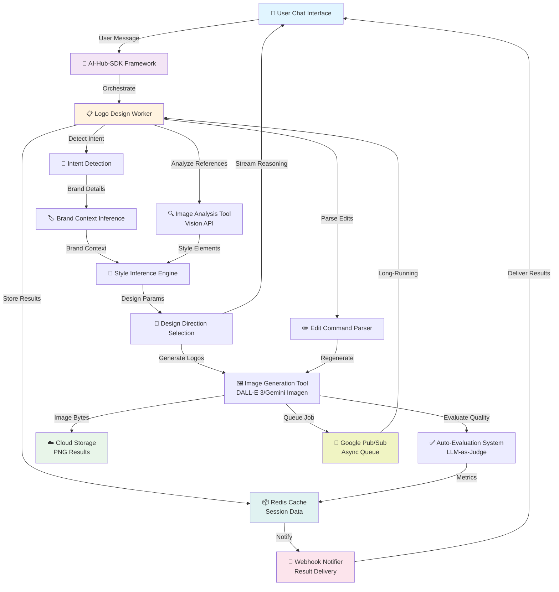

### Layered Architecture

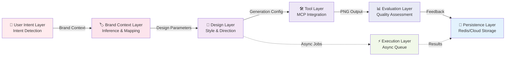

---

## Core Components

### 1. Intent Detection Module

**Purpose**: Identify logo design requests and extract key intent signals

**Inputs**: User message text  
**Outputs**: Intent confidence score, detected intent type, extracted keywords

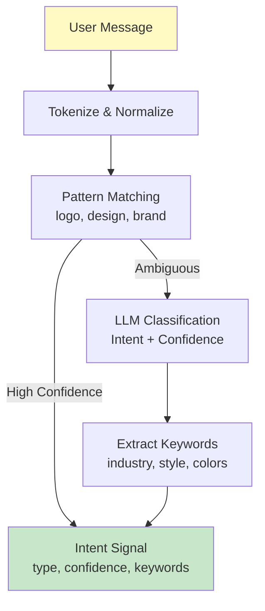

### 2. Brand Context Inference Engine

**Purpose**: Extract and structure brand information from user input

**Key Logic**:
- Extract brand name (required for context, optional for symbol-only logos)
- Detect industry/category
- Identify values, tone, target audience
- Build brand profile for inference

**Data Structure**:
```
BrandContext {
  name: str,              # Brand name (nullable for symbol-only)
  industry: str,          # tech, coffee, beauty, etc.
  values: List[str],      # core values
  tone: str,              # professional, playful, luxury, etc.
  audience: str,          # target demographic
  style_hints: List[str]  # user-provided style preferences
}
```

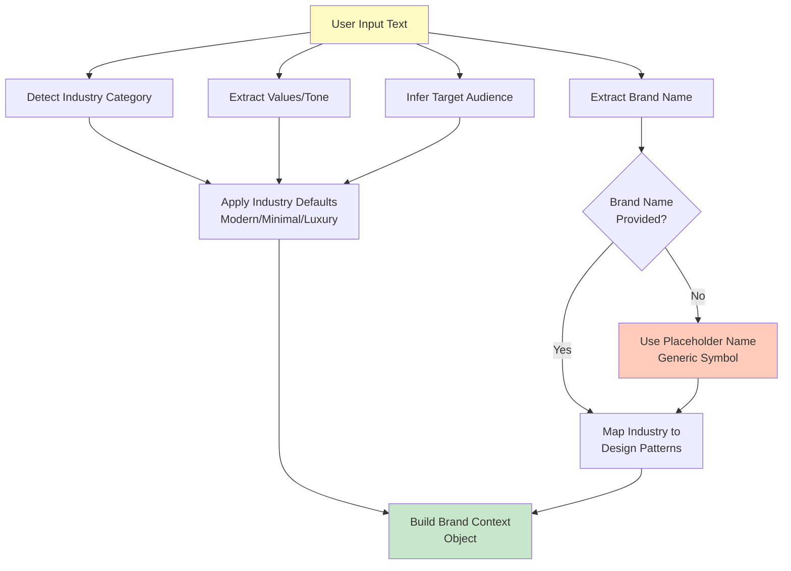

### 3. Style Inference Engine

**Purpose**: Map brand context to design principles and create design directions

**Industry Mapping Reference**:
```
tech/startup       → Modern, Minimal, Geometric
coffee/food        → Warm, Vintage, Handcrafted
beauty/luxury      → Elegant, Minimalist, Premium
healthcare/fitness → Clean, Trustworthy, Dynamic
education          → Professional, Innovative, Accessible
```

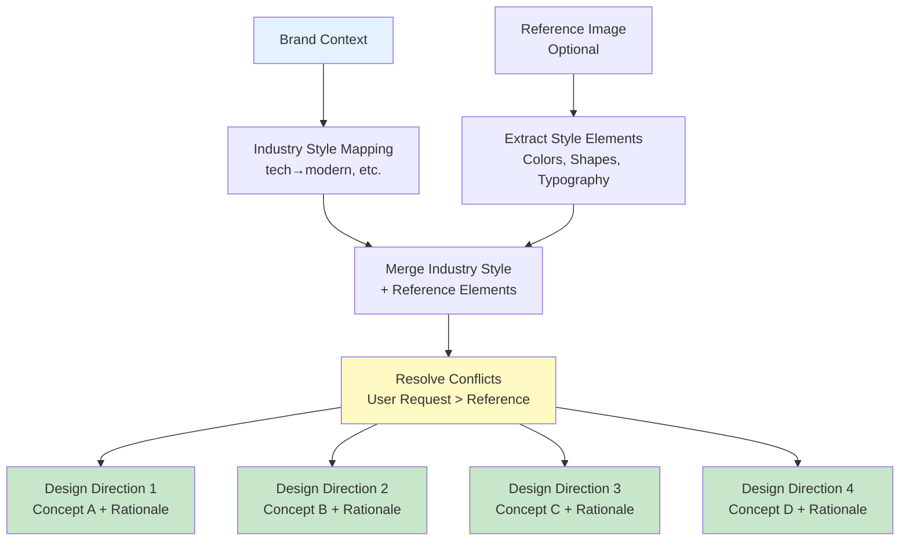

### 4. Design Direction Selection Logic

**Purpose**: Present direction options OR skip if request is specific

**Decision Tree**:
- **Specific Request** (e.g., "red circular logo, serif") → Skip selection, proceed to generation
- **Ambiguous Request** (e.g., "modern tech logo") → Present 3-4 directions, wait for selection
- **No Direction Selected** → Default to first option, document assumption

```mermaid
graph TD
    Request["User Request"]
    
    CheckSpecific{Request Contains<br/>Specific Design<br/>Details?<br/>color, shape, style}
    
    Specific["SPECIFIC PATH:<br/>Skip Direction Selection"]
    Ambiguous["AMBIGUOUS PATH:<br/>Present Directions"]
    
    GenDirections["Generate 3-4<br/>Design Direction Options"]
    Present["Present to User<br/>with Names & Descriptions"]
    UserSelect{User Selects<br/>Direction?}
    Skip["User Skips<br/>Selection"}
    
    SelectDefault["Default to Direction #1"]
    DocAssume["Document Assumption<br/>in Design Guidelines"]
    
    SelectedDir["Selected Design Direction"]
    GenLogos["Proceed to Logo<br/>Generation"]
    
    Request --> CheckSpecific
    CheckSpecific -->|Yes, specific| Specific
    CheckSpecific -->|No, ambiguous| Ambiguous
    
    Specific --> SelectedDir
    
    Ambiguous --> GenDirections
    GenDirections --> Present
    Present --> UserSelect
    
    UserSelect -->|Selects| SelectedDir
    UserSelect -->|Skips| Skip
    Skip --> SelectDefault
    SelectDefault --> DocAssume
    DocAssume --> SelectedDir
    
    SelectedDir --> GenLogos
    
    style Specific fill:#c8e6c9
    style Ambiguous fill:#ffccbc
    style SelectedDir fill:#81c784
    style GenLogos fill:#4caf50
```

---

## User Workflow

### Complete Multi-Turn Conversation Flow

```mermaid
sequenceDiagram
    actor User
    participant Chat as Chat Interface
    participant Worker as Worker Task
    participant Intent as Intent Detector
    participant Brand as Brand Inference
    participant Style as Style Engine
    participant ImgGen as Image Generator
    participant Eval as Auto-Evaluator
    participant Webhook as Webhook
    participant Redis as Redis Cache

    User->>Chat: Message: "Design logo for TechStart"
    Chat->>Worker: onMessage(user_msg)
    activate Worker
    
    Note over Worker: === PHASE 1: INPUT ANALYSIS ===
    Worker->>Intent: detect_intent(msg)
    Intent-->>Worker: {type: logo_design, confidence: 0.95}
    
    Worker->>Brand: extract_brand(msg)
    Brand-->>Worker: {name: TechStart, industry: tech, ...}
    
    Note over Worker: STREAM: "Analyzing brand context..."
    Worker->>Chat: stream("Input Understanding: TechStart, tech...")
    
    Note over Worker: === PHASE 2: STYLE INFERENCE ===
    Worker->>Style: infer_directions(brand_ctx)
    Style-->>Worker: [Direction1, Direction2, Direction3, Direction4]
    
    Worker->>Chat: stream("Inferring styles based on industry...")
    deactivate Worker
    
    Chat->>User: Display: 4 design direction options
    User->>Chat: Select: "Direction 2: Geometric Modern"
    
    Chat->>Worker: onDirectionSelected(Direction2)
    activate Worker
    
    Note over Worker: === PHASE 3: LOGO GENERATION ===
    Worker->>ImgGen: queue_generation(design_params)
    ImgGen-->>Worker: job_id: uuid-123
    
    Worker->>Redis: store_session(job_id, brand_ctx)
    ParallelGuard: Async via Pub/Sub
    
    ImgGen->>ImgGen: generate_logos() [long-running]
    ImgGen->>Redis: store_results(job_id, png_urls)
    
    Worker->>Eval: evaluate_quality(png_urls, brand_ctx)
    Eval-->>Worker: {alignment: 0.92, quality: 0.88}
    Redis->>Redis: store_eval_metrics(job_id)
    
    ImgGen->>Webhook: notify_completion(job_id)
    Webhook-->>Chat: result_ready(job_id)
    deactivate Worker
    
    Chat->>Redis: fetch_results(job_id)
    Chat->>User: Display: 3-4 PNG logos + explanations
    User->>Chat: Edit: "Change icon color to blue"
    
    Chat->>Worker: onEditCommand(edit)
    activate Worker
    
    Note over Worker: === PHASE 4: EDIT & REGENERATION ===
    Worker->>ImgGen: parse_edit_intent(edit_text)
    ImgGen-->>Worker: {target: icon, color: blue}
    
    Worker->>ImgGen: regenerate_with_edit(logo_id, edit_params)
    ImgGen->>ImgGen: regenerate() [async]
    ImgGen->>Webhook: notify_completion(job_id)
    deactivate Worker
    
    Webhook-->>Chat: updated_result()
    Chat->>User: Display: Updated logo + edit summary
    User->>Chat: "Save this version"
    Note over Chat: MVP: Single-session, no persistence
```

### Phase-by-Phase Detail: Generation Flow

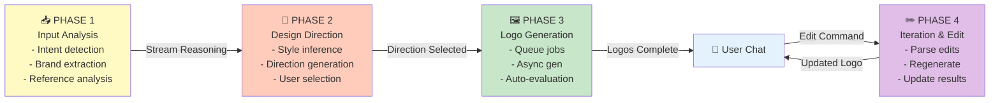

---

## Reasoning Engine Logic

### Visible Reasoning Display (FR-005a)

**Timing**: Real-time streaming BEFORE logo generation  
**Channels**: Chat interface with structured blocks (not continuous text)

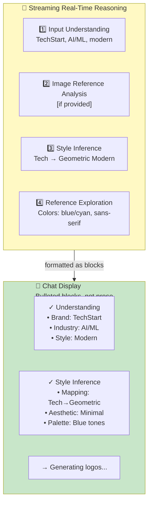

### Edit Intent Recognition Logic

**Purpose**: Parse natural language edits and map to logo modifications

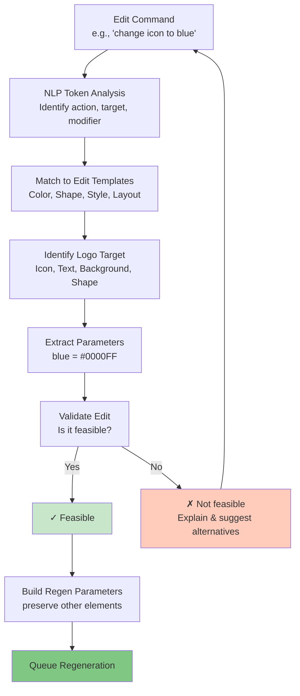

### Auto-Evaluation System (LLM-as-Judge)

**Purpose**: Assess logo quality and brand alignment  
**Scope**: Internal quality monitoring (not user-facing in MVP)

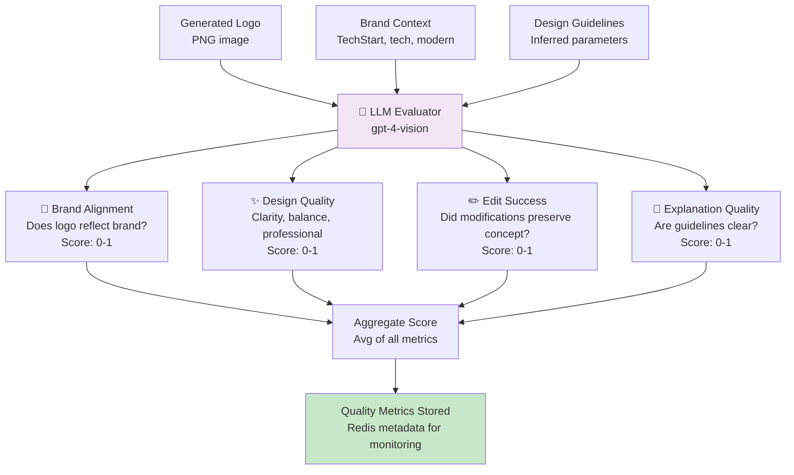

---

## Data Flow

### Complete Request/Response Data Journey

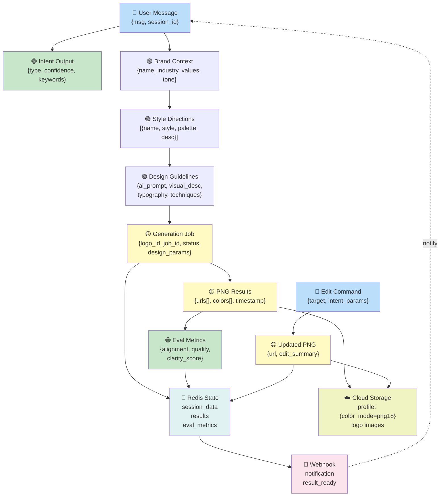

---

## Decision Trees

### 1. Request Analysis Decision Tree

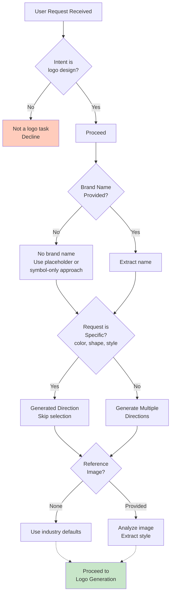

### 2. Logo Generation Decision Tree

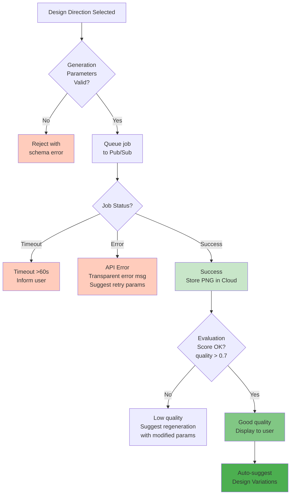

### 3. Edit Interpretation Decision Tree

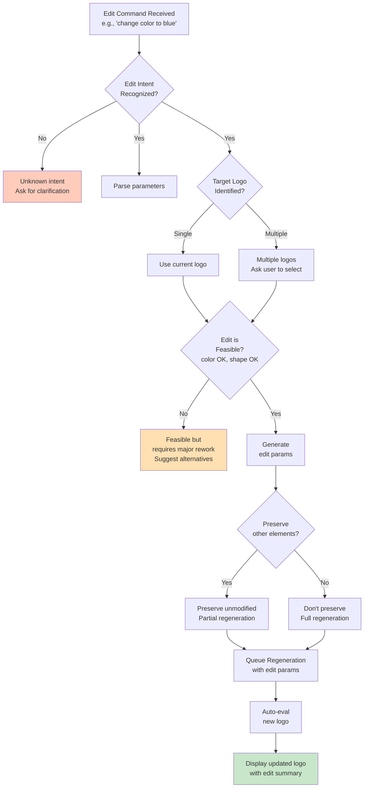

---

## Interaction Patterns

### Pattern 1: Real-Time Streaming (FR-005a)

**Service**: `AIHubStreamService`  
**Protocol**: Server-sent events (SSE) / WebSocket

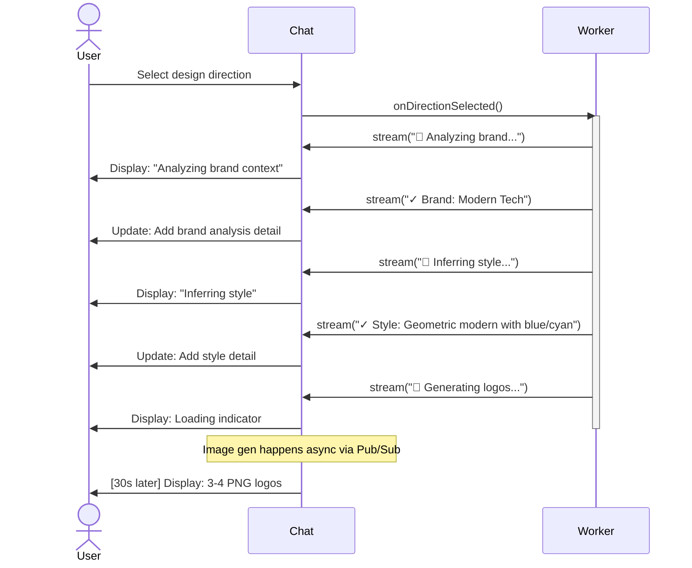

### Pattern 2: Async Generation with Webhook Notification

**Service**: `AIHubAsyncService` + Google Pub/Sub + Webhook

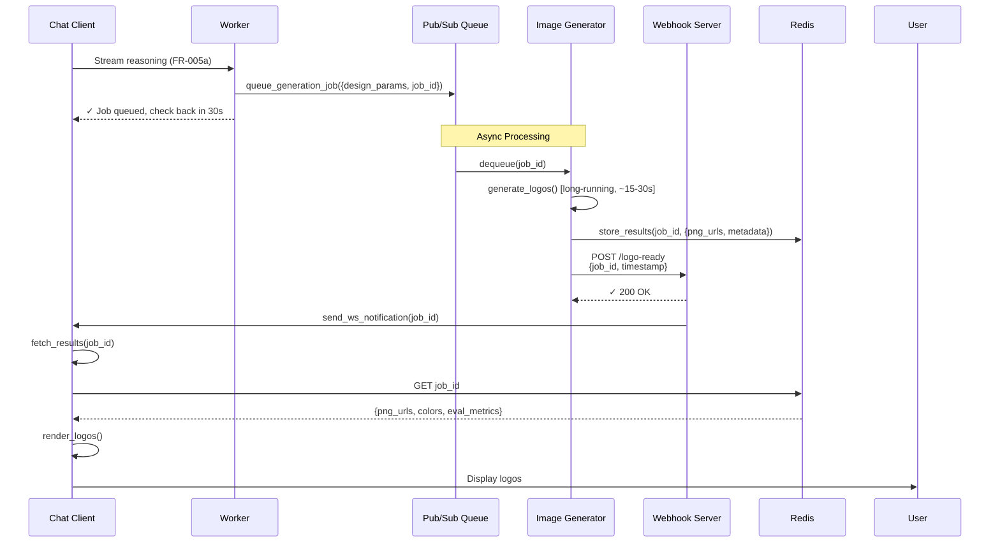

### Pattern 3: Session Data Persistence (Single-Session Model)

**Duration**: During active chat session only  
**Storage**: Redis with 1-hour TTL

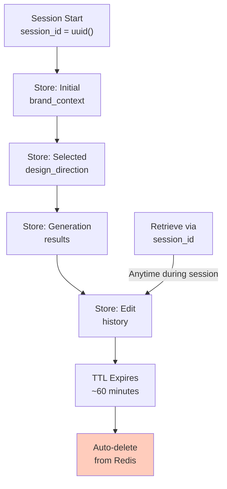

---

## Error Handling

### Error Handling Strategy: Transparent Failure (FR-014)

**Philosophy**: Surface errors immediately to user with actionable suggestions  
**No Silent Retries**: User controls retry decision

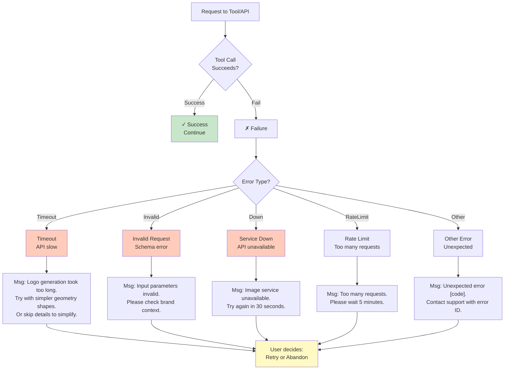

### Error Recovery Flow

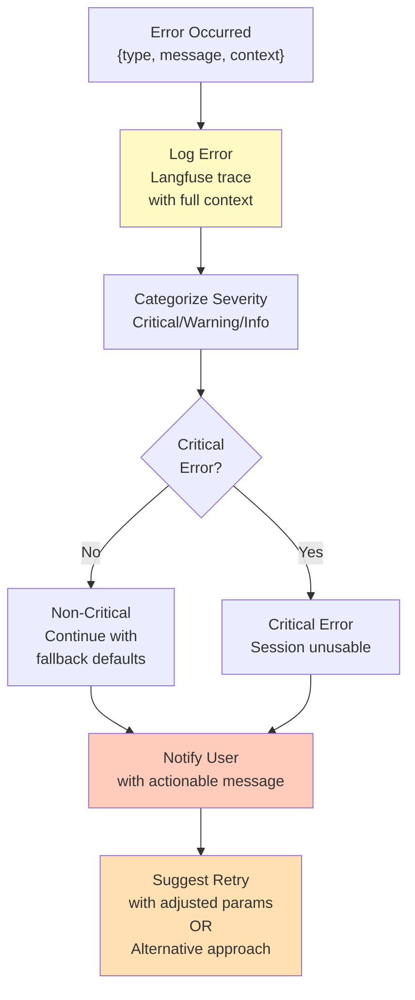

---

## Performance & Scalability

### Request Latency Targets

```
INPUT ANALYSIS
├─ Intent detection: ~100ms
├─ Brand extraction: ~200ms
└─ Total: ~300ms

REASONING STREAMING (FR-005a)
├─ Style inference: ~500ms
├─ Stream to user: real-time (progressive)
└─ Total: ~500ms visible

DESIGN DIRECTION SELECTION
├─ Generate 4 options: ~1-2s
└─ Present to user: instant

LOGO GENERATION (Async via Pub/Sub)
├─ Queue job: ~50ms
├─ DALL-E/Imagen generation: ~15-30s [async]
├─ Auto-evaluation: ~5s [parallel]
├─ Webhook notification: <2s after completion
└─ Total time from user's perspective: ~2s notification + fetch results

EDIT & REGENERATION
├─ Parse edit command: ~200ms
├─ Regenerate logo: ~15-30s [async]
└─ Notification: <2s after completion
```

### Concurrency Model

```mermaid
graph TD
    Session["Single User Session<br/>session_id"]
    
    Sync["Synchronous Operations<br/>Intent, Brand, Style<br/>User-facing, <5s"]
    Async["Asynchronous Operations<br/>Image generation, Evaluation<br/>Queued via Pub/Sub"]
    
    Stream["Real-Time Streams<br/>Reasoning, Status updates<br/>WebSocket/SSE"]
    
    Session --> Sync
    Sync --> |Reason ready| Stream
    Stream --> Async
    Async --> |Result ready| Webhook
    Webhook --> Chat["Deliver to Chat<br/>Redis + Notification"]
    
    style Sync fill:#c8e6c9
    style Async fill:#fff9c4
    style Stream fill:#e3f2fd
    style Chat fill:#81c784
```

---

## Component Responsibilities

| Component | Responsibility | Owned by |
|-----------|-----------------|----------|
| **Intent Detection** | Classify user intent (logo design vs other) | Worker + LLM |
| **Brand Inference** | Extract and structure brand info from text | Worker + NLP |
| **Style Inference** | Map brand context to design directions | Worker + Inference Engine |
| **Design Direction Selection** | Present alternatives or skip if specific | Worker + UI Logic |
| **Image Generation** | Call DALL-E/Imagen API via MCP tool | Image Gen Tool (MCP) |
| **Image Analysis** | Extract design elements from reference images | Vision API Tool (MCP) |
| **Edit Parser** | Parse natural language edit commands | Worker + NLP |
| **Auto-Evaluation** | Assess logo quality (LLM-as-judge) | Eval System (LLM) |
| **Async Execution** | Queue and execute long-running jobs | Pub/Sub + Message Queue |
| **Webhook Delivery** | Notify client of completion | Webhook Server |
| **Session Storage** | Persist session state during conversation | Redis (1-hour TTL) |
| **Cloud Storage** | Store PNG image files | Cloud Storage (GCS/S3) |

---

## Summary Architecture Principles

1. **Real-time Reasoning First**: Visible reasoning steps (FR-005a) delivered via streaming BEFORE generation
2. **Async Everything Long**: Image generation happens async via Pub/Sub; webhook notifies client
3. **Transparent Failure**: Errors surfaced immediately with actionable suggestions (no silent retry)
4. **Single-Session Simplicity**: No session persistence across visits; Redis TTL sufficient
5. **LLM-as-Judge Quality**: Auto-evaluation monitors logo quality but doesn't block delivery
6. **Conditional Directions**: Only present direction selection if request is ambiguous
7. **MCP Standardization**: All tools use MCP for consistent observability and error handling
8. **Preserve Unmentioned**: Edits preserve unmentioned regions to maintain brand consistency

