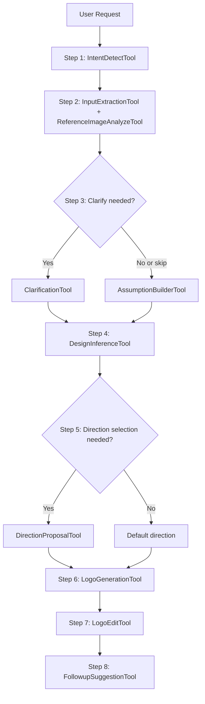
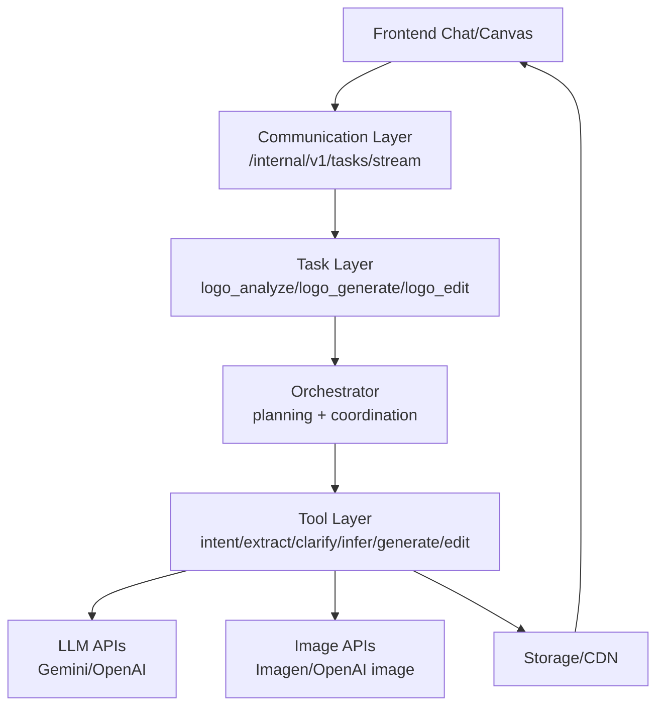
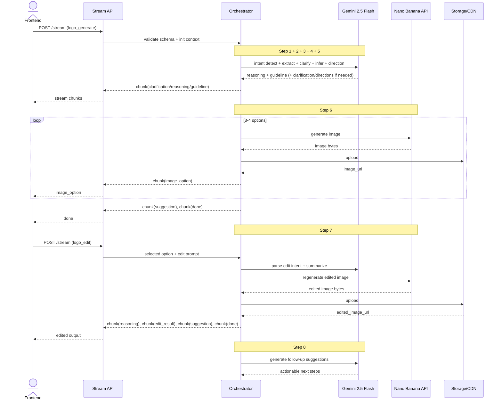

# Logo Design AI POC

## 1. Overview

### 1.1 POC objective

This POC builds a backend-driven Logo Design Service using a chat-first workflow.

- Input: user query (text, optional image references).
- Backend flow: detect intent, extract/analyze inputs, clarify conditionally, infer design direction, generate 3-4 options, support prompt-based editing.
- Output: image URLs (minimum PNG 1024x1024) and edit summary.

Business validation goals:

- Prove users can complete the full loop: request -> analyze -> guideline -> generate -> select -> edit -> regenerate.
- Prove visible reasoning is understandable and useful.
- Prove editing is usable without region-level editing tools in POC.

### 1.2 Success metrics (POC acceptance targets)

These are POC acceptance targets, not long-term SLA commitments. They are validated after benchmark and can be re-baselined before production.

- >= 90% of requests return a design guideline before image generation starts.
- >= 90% of requests return 3-4 valid logo options.
- >= 85% of sessions complete end-to-end flow without restart.
- >= 85% of edit requests reflect requested changes while preserving core concept.
- p95 time to first reasoning chunk <= 1.5s.
- p95 time to complete 3-4 logo outputs <= 25s.
- On generation/edit failure, actionable error + retry guidance returned <= 3s.

### 1.3 Technical constraints

- Primary stream endpoint is the main UX channel.
- Out of scope in POC: touch edit, smart mark, region/object-level editing.
- Session scope: single session only.
- No separate rule engine; behavior is schema-driven + prompt-driven + tool-adapter driven.
- Provider switching must not require changing FE stream contract.

---

## 2. POC Scope

### 2.1 Build vs Defer

| Area | Build (POC) | Defer |
| :--- | :--- | :--- |
| Intent + input | Detect logo intent, parse text/references, extract brand context | Multi-domain intent classifier |
| Clarification | Ask clarification when needed, allow skip with explicit assumptions | Adaptive multi-turn clarification policy |
| Reasoning | Stream reasoning blocks (input understanding, style inference, assumptions) | Multi-agent debate and self-critique loops |
| Guideline | Generate structured design guideline before generation | Auto-optimization guideline loop via evaluator |
| Direction selection | Optional 3-4 direction proposals for ambiguous requests | Personalized auto-ranking per user profile |
| Generation | Generate 3-4 PNG options from guideline | Multi-model routing and automatic quality ranking |
| Editing | Prompt-based edit on selected option + edit summary | Region/object-level editing |
| Follow-up | Return quick follow-up suggestions | Personalized recommendation engine |
| Storage/session | Persist output URLs + metadata per request/session | Project library, version history, long-term memory |

---

## 3. System Architecture

### 3.1 Overview

#### 3.1.1 Why this solution

This architecture is chosen to match the full spec execution logic (Step 1,2,3,4,5,6,7,8) while keeping the backend reusable and FE-independent.

Key reasons:

1. Every spec step has explicit tool boundary and ownership.
2. FE only needs stream rendering by chunk type and sequence.
3. Provider/model decisions are replaceable at adapter level.
4. Stream-first gives user-visible progress during long-running image operations.

#### 3.1.2 Diagram 1 - Agent pipeline (flowchart)



#### 3.1.3 Diagram 2 - System components (layered)



### 3.2 Architecture principles

- Task-first:
  - Business capabilities are task-based (`logo_analyze`, `logo_generate`, `logo_edit`).
  - Routing by `task_type`, no endpoint-specific business hardcoding.
- Schema-first:
  - All contracts validated by Pydantic.
  - New fields/features evolve by schema + prompt template extension.
- Stream-first:
  - `POST /internal/v1/tasks/stream` is default path.
  - FE renders by chunk contract, independent from provider internals.
- Tool abstraction:
  - Orchestrator calls stable tool interfaces.
  - Model/provider switching only touches adapters.

### 3.3 Component breakdown (tool-level)

| Component / Tool | Spec step | Role | Primary model/provider | Notes |
| :--- | :--- | :--- | :--- | :--- |
| IntentDetectTool | Step 1 | Detect if request is logo design intent and route flow | `gemini-2.5-flash` | Emits early `reasoning` chunk |
| InputExtractionTool | Step 2 | Extract brand_name, industry, style, color, symbol from text | `gemini-2.5-flash` | Returns structured JSON |
| ReferenceImageAnalyzeTool | Step 2 | Analyze reference image style/color/typography/iconography | `gemini-2.5-flash` multimodal | Optional when references provided |
| ClarificationTool | Step 3 | Generate clarification questions when info is insufficient | `gemini-2.5-flash` | Supports user skip |
| AssumptionBuilderTool | Step 3 | Build explicit assumptions if user skips clarification | `gemini-2.5-flash` | Stored in guideline assumptions |
| DesignInferenceTool | Step 4 | Infer style direction and design constraints | `gemini-2.5-flash` | Emits `reasoning` and `guideline` |
| DirectionProposalTool | Step 5 (optional) | Create 3-4 design directions for ambiguous briefs | `gemini-2.5-flash` | Returns direction list for selection/default |
| LogoGenerationTool | Step 6 | Generate 3-4 logo options | `nano-banana-2` | Throughput-optimized for exploration |
| LogoEditTool | Step 7 | Regenerate selected logo from edit prompt | `nano-banana-pro` | Fidelity-optimized for refinement |
| FollowupSuggestionTool | Step 8 | Suggest next edits/actions | `gemini-2.5-flash` | Quick action suggestions |
| StorageTool | Shared | Upload images and return URLs | Storage/CDN | Used by generate and edit |

### 3.4 End-to-end pipeline

#### 3.4.1 Full sequence (Step 1 -> Step 8)



#### 3.4.2 Stage A - Analyze (Step 1 to Step 5)

| Item | Detail |
| :--- | :--- |
| Input | `LogoGenerateInput` (query, references, session_id) |
| Tools used | IntentDetectTool, InputExtractionTool, ReferenceImageAnalyzeTool, ClarificationTool, AssumptionBuilderTool, DesignInferenceTool, DirectionProposalTool(optional) |
| Output chunks | `clarification` (optional), `reasoning`, `guideline`, `suggestion` (optional) |
| Target | First chunk <= 1.5s p95; guideline availability >= 90% |

#### 3.4.3 Stage B - Generate (Step 6)

| Item | Detail |
| :--- | :--- |
| Input | guideline + selected/default direction + variation_count |
| Tools used | LogoGenerationTool, StorageTool |
| Output chunks | `image_option` x 3-4, `suggestion`, `done` |
| Target | 3-4 valid outputs >= 90%; total generation <= 25s p95 |

#### 3.4.4 Stage C - Edit (Step 7)

| Item | Detail |
| :--- | :--- |
| Input | `LogoEditInput` (selected image, edit prompt, guideline) |
| Tools used | LogoEditTool, StorageTool, FollowupSuggestionTool |
| Output chunks | `reasoning`, `edit_result`, `suggestion`, `done` |
| Target | Edit success >= 85%; preserve concept consistency |

### 3.5 Reuse and extensibility

- Add fields in extraction/guideline:
  - Extend schemas and prompt templates only.
  - FE stream contract stays unchanged.
- Add/switch provider:
  - Replace adapter of LogoGenerationTool/LogoEditTool.
  - No change in orchestrator sequence or chunk contract.
- Add new capability:
  - Register new `task_type` (for example `logo_variation_regenerate`).
  - Reuse same stage tools and stream envelope.

### 3.6 Backend-frontend contract

Frontend needs to:

1. Send valid `task_type` + `input_args`.
2. Render by `chunk_type` and `sequence`.
3. Handle optional chunks: `clarification`, `warning`, `error`.
4. Keep selected option state for edit flow.

Frontend does not need to know:

- prompt templates
- provider/model names
- tool routing

### 3.7 Task and endpoint design (optimized)

Recommended design:

1. Keep one stream endpoint: `POST /internal/v1/tasks/stream`.
2. Use `task_type` to route 3 capabilities: `logo_analyze`, `logo_generate`, `logo_edit`.
3. Keep `logo_analyze` available for direct call (debug, replay, A/B tests), but in normal UX it is chained internally inside `logo_generate`.

Why this is optimal:

- Single FE integration path, lower coupling.
- Task-first backend remains reusable and testable.
- Clear separation: endpoint count is transport concern, `task_type` count is business capability concern.

---

## 4. Data Schema & API Integration

### 4.1 Pydantic models by stage

```python
from typing import Any, Dict, List, Literal, Optional
from pydantic import BaseModel, Field, HttpUrl


class ReferenceImage(BaseModel):
    source_url: Optional[HttpUrl] = None
    storage_key: Optional[str] = None


class BrandContext(BaseModel):
    brand_name: Optional[str] = None
    industry: Optional[str] = None
    style_preference: List[str] = Field(default_factory=list)
    color_preference: List[str] = Field(default_factory=list)
    symbol_preference: List[str] = Field(default_factory=list)


class Assumption(BaseModel):
    key: str
    value: str
    reason: str


class ClarificationQuestion(BaseModel):
    key: str
    question: str
    required: bool = False


class DirectionOption(BaseModel):
    direction_name: str
    short_description: str
    visual_concept_summary: str


class DesignGuideline(BaseModel):
    concept_statement: str
    style_direction: List[str]
    color_palette: List[str]
    typography_direction: List[str]
    icon_direction: List[str]
    constraints: List[str]
    assumptions: List[Assumption] = Field(default_factory=list)


class LogoGenerateInput(BaseModel):
    session_id: str
    query: str
    references: List[ReferenceImage] = Field(default_factory=list)
    allow_skip_clarification: bool = True
    variation_count: int = Field(default=4, ge=3, le=4)
    output_format: Literal["png"] = "png"
    output_size: Literal["1024x1024"] = "1024x1024"


class LogoOption(BaseModel):
    option_id: str
    image_url: HttpUrl
    prompt_used: Optional[str] = None
    seed: Optional[int] = None
    quality_flags: List[str] = Field(default_factory=list)


class LogoGenerateOutput(BaseModel):
    guideline: DesignGuideline
    directions: List[DirectionOption] = Field(default_factory=list)
    options: List[LogoOption]


class LogoEditInput(BaseModel):
    session_id: str
    selected_option_id: str
    selected_image_url: HttpUrl
    edit_prompt: str
    guideline: DesignGuideline


class LogoEditOutput(BaseModel):
    updated_image_url: HttpUrl
    edit_summary: str
    preserved_elements: List[str] = Field(default_factory=list)


class StreamEnvelope(BaseModel):
    request_id: str
    session_id: str
    task_type: Literal["logo_analyze", "logo_generate", "logo_edit"]
    status: Literal["processing", "completed", "failed"]
    chunk_type: Literal[
        "reasoning", "clarification", "guideline", "direction_options", "image_option",
        "edit_result", "suggestion", "warning", "error", "done"
    ]
    sequence: int
    payload: Dict[str, Any] = Field(default_factory=dict)
    metadata: Dict[str, Any] = Field(default_factory=dict)
```

Validation rules:

- `query` is required and non-empty after trim.
- `variation_count` must be 3 or 4.
- Edit flow requires selected image and edit prompt.
- If clarification is skipped, guideline must include explicit assumptions.

### 4.2 External APIs used by tool

- Text + reasoning tools (Step 1,2,3,4,5,8):
  - Primary: `gemini-2.5-flash`
  - Fallback adapter: OpenAI GPT mini/flagship text model
- Image generation/edit tools:
  - Primary Step 6: `nano-banana-2`
  - Primary Step 7: `nano-banana-pro`
  - Optional fallback: OpenAI `gpt-image-1.5`

Reference docs:

- Google Gemini API docs: https://ai.google.dev/gemini-api/docs
- Google Imagen docs: https://ai.google.dev/gemini-api/docs/imagen
- Google pricing docs: https://ai.google.dev/gemini-api/docs/pricing
- OpenAI pricing docs: https://openai.com/api/pricing/

### 4.3 Concrete endpoint I/O

- `POST /internal/v1/tasks/stream` (`task_type=logo_analyze`)
  - Purpose:
    - run Step 1 to Step 5 only (intent, extract/analyze, clarify, infer, direction)
    - used for internal chaining or direct debug tools
  - Output stream:
    - `clarification` (if needed)
    - `reasoning`
    - `guideline`
    - `direction_options` (optional)
    - `done`

- `POST /internal/v1/tasks/stream` (`task_type=logo_generate`)
  - Input:
    - `query`
    - `session_id`
    - `references` (optional)
    - `variation_count` (optional, 3-4)
  - Output stream:
    - `clarification` (if needed)
    - `reasoning`
    - `guideline`
    - `direction_options` (optional)
    - `image_option` x 3-4
    - `suggestion`
    - `done`

- `POST /internal/v1/tasks/stream` (`task_type=logo_edit`)
  - Input:
    - `session_id`
    - `selected_option_id`
    - `selected_image_url`
    - `edit_prompt`
    - `guideline`
  - Output stream:
    - `reasoning`
    - `edit_result`
    - `suggestion`
    - `done`

- Optional async fallback:
  - `POST /internal/v1/tasks/submit`
  - `GET /internal/v1/tasks/{task_id}/status`

### 4.4 Model benchmark (Google + OpenAI, POC-oriented)

Prices below are for planning/PO discussion and must be re-checked before release cut.

#### 4.4.1 Text model benchmark

| Vendor | Model | Input price (per 1M tokens) | Output price (per 1M tokens) | Typical latency (TTFB / full response) | POC fit |
| :--- | :--- | :--- | :--- | :--- |
| Google | `gemini-2.5-flash` | $0.30 | $2.50 | ~0.5-1.2s / ~2-6s | Strong default for low-latency reasoning + extraction |
| Google | `gemini-2.5-pro` | $1.25 (<=200k prompt) | $10.00 (<=200k prompt) | ~1.0-2.5s / ~4-12s | Better deep reasoning, higher cost |
| OpenAI | `gpt-5.4-mini` | $0.750 | $4.500 | ~0.6-1.5s / ~2-7s | Good fallback for robust tool-calling text tasks |
| OpenAI | `gpt-5.4-nano` | $0.20 | $1.25 | ~0.3-0.9s / ~1.5-5s | Best for cost-sensitive extraction/classification subtasks |
| OpenAI | `gpt-5.4` | $2.50 | $15.00 | ~1.0-3.0s / ~4-14s | High quality, expensive for high-volume POC flow |

#### 4.4.2 Image model benchmark

| Vendor | Model | Price basis | Unit price | Typical latency (single image) | POC fit |
| :--- | :--- | :--- | :--- | :--- |
| Google | `nano-banana` | token/image based | see Google pricing page | ~8-18s | Baseline image generation path in Gemini image-generation stack |
| Google | `nano-banana-2` | token/image based | see Google pricing page | ~6-14s | Better speed-quality balance for Step 6 (3-4 options) |
| Google | `nano-banana-pro` | token/image based | see Google pricing page | ~10-20s | Better fidelity for Step 7 edit on selected logo |
| Google | `imagen-4.0-fast-generate-001` | per generated image | $0.02 | ~7-15s | Alternative fast path with explicit per-image pricing |
| Google | `imagen-4.0-generate-001` | per generated image | $0.04 | ~10-20s | Alternative quality path with explicit per-image pricing |
| OpenAI | `gpt-image-1.5` | output tokens pricing | $32 per 1M output tokens | ~10-25s | Strong fallback/vendor diversification, requires token-based cost estimation |

#### 4.4.3 Selected POC decision

- Text: `gemini-2.5-flash`
- Image Step 6 (generate options): `nano-banana-2`
- Image Step 7 (edit selected): `nano-banana-pro`

Why this combination:

1. Keeps one primary vendor path for simpler operations.
2. Balances throughput speed (Step 6) and quality consistency (Step 7).
3. Keeps OpenAI fallback path ready if procurement/reliability changes.

Note:

- Price rows with explicit values come from public pricing pages.
- Latency rows are planning benchmarks (typical ranges) and must be validated in project load tests.

---

## 5. Risks & Open Issues

### 5.1 Latency

Risk:

- 3-4 image generation can exceed p95 target depending on provider queue and concurrency.

Mitigation:

- Emit reasoning early to keep UX responsive.
- Parallel generation where provider allows.
- Timeout + retry policy for transient failures.
- Near-timeout fallback from 4 outputs to 3 outputs.

### 5.2 Generation quality

Risk:

- Outputs can drift from guideline or include artifacts.

Mitigation:

- Add `quality_flags` per option.
- Keep guideline-first prompt template stable.
- Return warning and targeted edit suggestions.

### 5.3 Cost

Risk:

- Combined text reasoning + multi-image generation + edits can increase request cost quickly.

Mitigation:

- Track cost per `request_id` and `session_id`.
- Default limit on edit retries in POC.
- Reuse context/guideline within session.
- Keep benchmark table updated at each milestone.

### 5.4 Open technical decisions

- Production stream protocol finalization: NDJSON vs gRPC stream.
- Signed URL TTL policy by asset type.
- Deterministic seed policy for edit consistency.
- Quality gate policy: hard fail vs soft warning.
- OpenAI fallback trigger policy (manual switch vs automatic failover).
