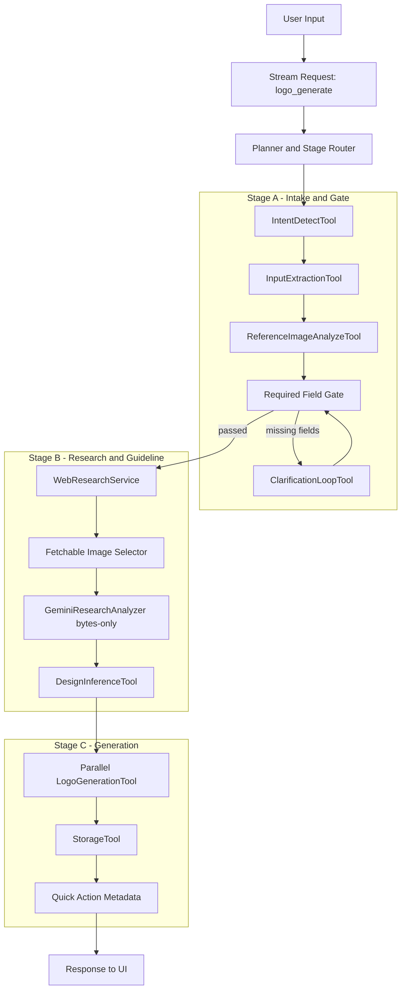
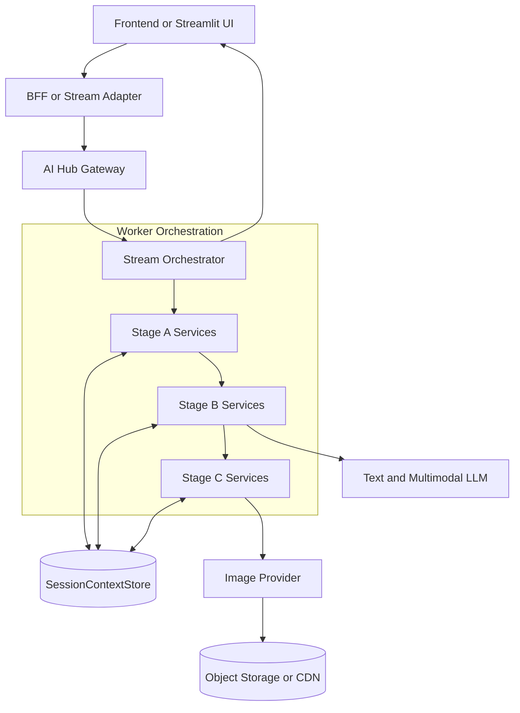
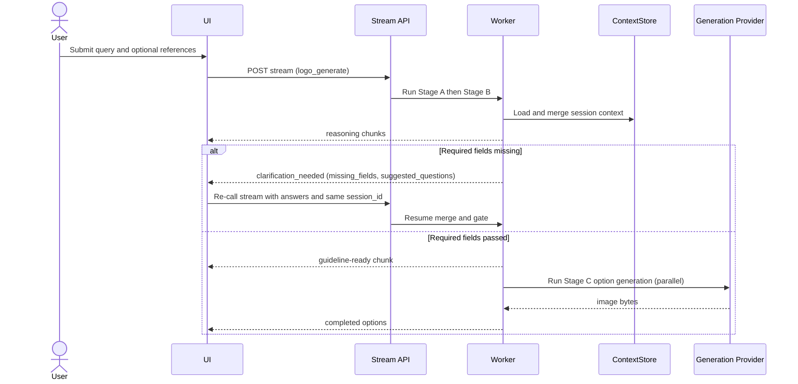

# Logo Design AI POC (System Design v2.2)

## 1. Overview

### 1.1 POC objective

Build a chat-driven Logo Design Service with deterministic orchestration for Step 1 -> Step 6.5:

- Step 1: intent detect.
- Step 2: input extraction + reference analysis.
- Step 2.5: web research enrichment for logo trends/context.
- Step 3: required-field validation and clarification loop.
- Step 4: design guideline inference.
- Step 6: generate 3-4 logo options.
- Step 6.5: quick-action-ready metadata for POC regenerate flow.

Out-of-scope core phases:

- Step 7: prompt-based editing and inpainting workflow.
- Step 8: follow-up suggestion intelligence.

Primary task type: `logo_generate`.

### 1.2 Success metrics (POC acceptance targets)

- >= 90% requests extract or clarify `brand_name` and `industry` before Stage B completes.
- >= 90% requests that pass required-field gate produce valid `guideline` before Stage C starts.
- >= 85% requests return 3-4 valid logo options.
- p95 completion time <= 40s for current POC pipeline.
- On failure, return actionable `error_code` + `error_message` (+ hints if applicable).

### 1.3 User journey (chat-first flow)

1. User submits request with optional references.
2. System streams reasoning and gate progress.
3. If fields are missing, system emits clarification questions.
4. User answers in the same session and re-calls stream.
5. System finalizes guideline and runs option generation.
6. User receives 3-4 options and supporting context.

### 1.4 Technical constraints

- AI Hub SDK service contracts are fixed and used as-is.
- Stream transport uses NDJSON over HTTP gateway (`/internal/v1/tasks/stream`).
- Required fields before Stage B/Stage C progression:
  - `brand_name`
  - `industry`
- Merge precedence is fixed:
  - explicit request fields > extracted fields from new query > session context.
- Session memory scope is bound by `session_id`.
- Provider switching must preserve task semantics and output contract.

---

## 2. POC Scope

### 2.1 Build vs defer (aligned to technical-design)

| Area | Build in v2.2 | Defer / Not fully implemented yet |
| :--- | :--- | :--- |
| Intent + input | Intent detect, extraction, reference analysis in Stage A | Multi-domain intent routing and advanced confidence policy tuning |
| Clarification | Required-field gate + clarification chunk + stream recall | Personalized adaptive questioning policy |
| Reasoning stream | Reasoning timeline and status chunks in Streamlit | Production BFF abstraction for multi-client stream fan-out |
| Research (Step 2.5) | Bounded web research + fetchable-image selection + multimodal analysis | Query backfill strategy to always guarantee 3 fetchable images before fail |
| Guideline (Step 4) | Structured guideline inference and checkpoint | Auto guideline optimization loop |
| Generation (Step 6) | Parallel Stage C generation and asset upload | Provider auto-routing/ranking by live telemetry |
| Storage/session | Session checkpointing + `design.md` projection | Long-term project memory/version library |
| Editing (Step 7) | Not implemented | Full edit/inpaint pipeline |
| Follow-up (Step 8) | Quick-action-ready metadata at POC level | Personalization-aware suggestion ranking |

### 2.2 What is added from technical-design but still pending

The following technical-design items are recognized in v2.2 but not completed yet:

- Production-grade BFF stream management (retry, reconnect, backpressure strategy).
- Formal queue boundary for Stage A/B vs Stage C in independent services.
- Confidence-threshold policy for extraction-driven clarification (explicit numerical thresholding policy).
- Signed URL TTL policy and asset retention policy.
- Full job-result retention/cleanup lifecycle.
- End-to-end cost tracking by `task_id` and `session_id`.

---

## 3. System Architecture

### 3.1 Overview

#### 3.1.1 Why this solution

This architecture prioritizes deterministic gating, explicit failure semantics, and chat UX continuity:

1. Required-field gate prevents low-quality generation with missing business context.
2. Stream-first Stage A/B provides visible reasoning and clarification in real time.
3. Session-based merge keeps follow-up behavior predictable.
4. Stage B is fail-closed: only fetchable images are analyzed; no synthetic fallback data.
5. Stage C runs parallel option generation for throughput.

#### 3.1.2 Diagram 1 - Agent pipeline (top-down)

#### 3.1.3 Diagram 2 - System components (top-down layered)

### 3.2 Architecture principles

- Task-first:
  - All business logic is routed by `task_type = logo_generate`.
- Schema-first:
  - Pydantic contracts guard boundaries and stream payload integrity.
- Context-first handoff:
  - Services return deltas; orchestrator performs merge and checkpoint.
- Fail-closed policy:
  - Invalid provider outputs and non-fetchable research assets are not silently bypassed.
- Deterministic merge precedence:
  - explicit > extracted > session context.

### 3.3 Component breakdown (tool-level)

| Component or Tool | Spec step | Role | Model/Type | Notes |
| :--- | :--- | :--- | :--- | :--- |
| IntentDetectTool | Step 1 | Detect logo intent and route | Text LLM | Keeps logo flow deterministic |
| InputExtractionTool | Step 2 | Extract `brand_name`, `industry`, style hints | Text LLM structured output | Required-field prep |
| ReferenceImageAnalyzeTool | Step 2 | Parse uploaded/reference visuals | Multimodal LLM | Optional path when refs exist |
| ClarificationLoopTool | Step 3 | Generate missing-field questions | Text LLM | Stream emits `clarification_needed` |
| WebResearchService | Step 2.5 | Query and normalize web image candidates | SerpAPI + normalizer | Bounded policy: 3 queries |
| GeminiResearchAnalyzer | Step 2.5 | Analyze selected references | Gemini multimodal | Backend uploads bytes, not remote URLs |
| DesignInferenceTool | Step 4 | Infer guideline JSON | Text LLM | Produces generation-ready contract |
| LogoGenerationTool | Step 6 | Generate 3-4 options | Image model provider | Parallel execution |
| StorageTool | Shared | Upload and return public URLs | Storage API | Option asset persistence |
| SessionContextStore | Shared | Checkpoint state by `session_id` | Cache/DB adapter | Used across all stages |

### 3.4 End-to-end pipeline

#### 3.4.1 Full sequence overview (top-down)

#### 3.4.2 Stage A - Intake and clarification loop (Step 1-3)

| Item | Detail |
| :--- | :--- |
| Input | `LogoGenerateInput` with `session_id`, query, optional fields/references |
| Tools used | IntentDetectTool, InputExtractionTool, ReferenceImageAnalyzeTool, ClarificationLoopTool |
| Output | Either gate-passed context or `clarification_needed` chunk |
| Gate | `brand_name` AND `industry` must both exist |
| Current behavior | Session continuation works with deterministic precedence |

#### 3.4.3 Stage B - Web research and guideline inference (Step 2.5 + Step 4)

| Item | Detail |
| :--- | :--- |
| Input | Gate-passed context |
| Tools used | WebResearchService, GeminiResearchAnalyzer, DesignInferenceTool |
| Selection policy | Pick from deduped pool, then keep only fetchable images |
| Failure policy | If < 3 fetchable images, fail explicitly (no synthetic fallback) |
| Gemini input mode | Bytes uploaded by backend (`Part.from_bytes` path) |
| Output | `ResearchContext` + `DesignGuideline` |

#### 3.4.4 Stage C - Logo generation (Step 6)

| Item | Detail |
| :--- | :--- |
| Input | Guideline + variation count |
| Tools used | LogoGenerationTool, StorageTool |
| Output | 3-4 option URLs + metadata |
| Concurrency | Parallel per-option generation |

### 3.5 Reuse and extensibility

- Add new guideline fields:
  - extend schemas and prompt templates without changing task contract.
- Add Step 7 in future:
  - register `logo_edit` and reuse same session/memory contract.
- Add provider:
  - swap provider adapter while preserving output schema.

---

## 4. Data Schema and API Integration

### 4.1 Core models by stage

Core entities:

- `LogoGenerateInput`
- `BrandContext`
- `RequiredFieldState`
- `ResearchContext`
- `DesignGuideline`
- `LogoOption`
- `JobStatusResponse`

### 4.2 Validation and merge rules

- `query` must be non-empty.
- `variation_count` must be in range 3..4.
- Required-field gate blocks progression if either `brand_name` or `industry` is missing.
- Merge precedence is fixed: explicit > extracted > session.
- Empty string for required scalar fields is treated as missing.

### 4.3 Endpoint mapping (AI Hub SDK native)

- Stream reasoning and clarification:
  - `POST /internal/v1/tasks/stream`
- Async submit (when used by deployment mode):
  - `POST /internal/v1/tasks/submit`
- Async poll:
  - `GET /internal/v1/tasks/{task_id}/status`

Status and failure contract baseline:

- `status`: `pending|processing|completed|failed`
- `error_code`
- `error_message`
- `missing_fields` (if gate fail)
- `suggested_questions` (if clarification needed)

### 4.4 Current benchmark direction (POC policy)

- Text primary: Gemini flash-class model for extraction/inference.
- Image primary: fast image generation model.
- Cross-vendor fallback is planned at provider adapter level.

---

## 5. Risks and Open Issues

### 5.1 Latency risk

Risk:

- Stage B network + multimodal analysis can inflate p95.

Mitigation:

- Keep bounded query policy (3 templates, capped URLs/query).
- Preserve parallel Stage C generation.

### 5.2 Provider reliability risk

Risk:

- Multimodal provider may return internal errors.

Mitigation:

- Fail clearly with explicit error code and stop unsafe continuation.

### 5.3 Data quality risk

Risk:

- Malformed extracted payload can pollute downstream steps.

Mitigation:

- Normalize and validate payloads at stage boundaries.

### 5.4 Open technical decisions (from technical-design, not fully closed)

- BFF stream timeout/reconnect and chunk flush policy.
- Signed URL TTL by asset type.
- Job result retention and cleanup lifecycle.
- Session TTL/reset policy.
- Query backfill strategy when fetchable-image pool is below threshold.

---

## 6. Implementation Status (v2.2)

### 6.1 Implemented

- Stream clarification loop and same-session continuation.
- Deterministic merge precedence with session checkpoints.
- Stage B bounded research query strategy.
- Fetchable-image-only main path before Gemini analysis.
- Gemini bytes-based multimodal input (no provider URL fetch dependency).
- Parallel Stage C generation and upload.
- Streamlit conversation UI with reasoning + references + canvas.

### 6.2 Not implemented yet (technical-design gap)

- Full Step 7 editing/inpainting flow.
- Step 8 personalized follow-up intelligence.
- Production-grade BFF stream abstraction and resilience controls.
- Explicit confidence-threshold policy automation for clarification routing.
- Comprehensive cost analytics per job/session.

