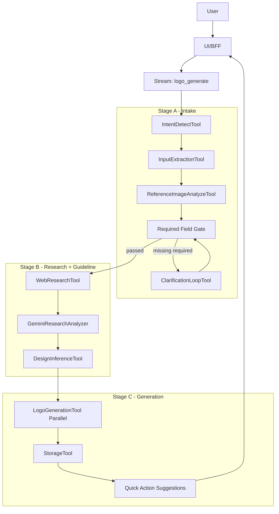
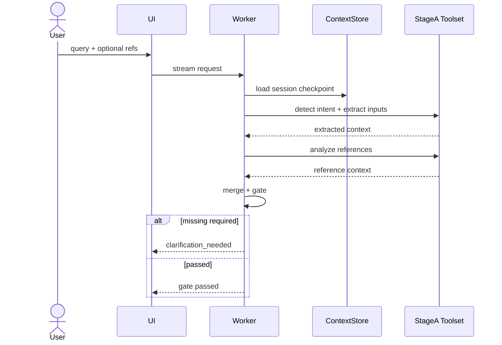
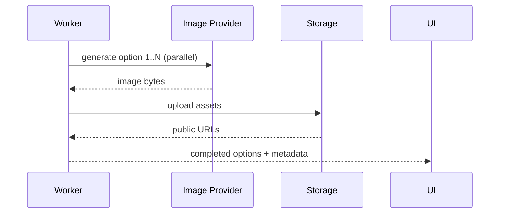

# Logo Design AI POC (v2.1)

## 1. Overview

### 1.1 Objective

Build a chat-driven logo generation backend and UI with a deterministic full flow:

- Step 1: intent detection.
- Step 2: input extraction + reference analysis.
- Step 2.5: logo-focused web research enrichment.
- Step 3: required-field gate and clarification loop.
- Step 4: guideline inference.
- Step 6: 3-4 option generation.
- Step 6.5: quick-action-ready metadata (POC-level regenerate loop).

Primary task type: `logo_generate`.

### 1.2 In Scope

- Streaming reasoning during Stage A/B.
- Session-based clarification continuation (`session_id`).
- Research context with citations before guideline inference.
- Parallel Stage C image generation.
- `design.md` projection from session checkpoints.

### 1.3 Out of Scope

- Full free-form canvas editing and inpainting.
- Long-term personalization/ranking learning.
- Multi-agent planning and self-critique loops.

### 1.4 Success Targets

- >= 90%: `brand_name` and `industry` extracted or clarified before Stage B completes.
- >= 90%: requests that pass gate produce valid guideline payload.
- >= 85%: requests return 3-4 valid options.
- p95 completion time target: <= 40s (POC target).

## 2. System Architecture

### 2.1 High-Level Pipeline

### 2.2 Component Roles

| Component | Role | Notes |
| :--- | :--- | :--- |
| Stream Orchestrator | Runs Stage A/B and emits reasoning chunks | Clarification-first contract |
| SessionContextStore | Stores checkpoints by session | Merge precedence enforced |
| WebResearchService | Runs SerpAPI queries + normalization | Bounded query policy |
| GeminiResearchAnalyzer | Multimodal analysis on top images | Strict failure on provider internal error |
| Stage C Generator | Parallel option generation and upload | Returns 3-4 URLs |
| Streamlit UI | Chat, reasoning, references, canvas | Single conversation loop |

## 3. Execution Model

### 3.1 Mode Split

- Stage A/B: stream mode for user-visible reasoning and clarification.
- Stage C: async style generation behavior (within current backend orchestration) for long-running image creation.

### 3.2 Required Field Contract

Mandatory fields before Stage B inference:

- `brand_name`
- `industry`

Merge precedence:

1. Explicit request fields.
2. Extracted fields from current query.
3. Existing session context.

If missing after merge, return clarification chunk with `missing_fields` + `suggested_questions`.

## 4. Stage Design

### 4.1 Stage A - Intake and Clarification

### 4.2 Stage B - Web Research and Guideline

Research query policy (current):

- `logo design trends 2026 {industry}`
- `{industry} brand visual identity examples`
- `{industry} logo design best practices`

Latency cap policy:

- 3 queries only.
- Max 3 image URLs/query (effective cap in client).

Gemini behavior:

- Unfetchable URL (`Cannot fetch content...`): skip and retry with fetchable subset.
- Gemini `500 INTERNAL`: fail normally (`RESEARCH_ANALYSIS_FAILED`), no synthetic fallback data.

### 4.3 Stage C - Generation

Output includes:

- `guideline`
- `required_field_state`
- `options` (3-4)

## 5. Data Contract

Core entities used across stages:

- `LogoGenerateInput`
- `BrandContext`
- `RequiredFieldState`
- `ResearchContext`
- `DesignGuideline`
- `LogoOption`

Error contract baseline:

- `error_code`
- `error_message`
- `missing_fields` (when applicable)
- `suggested_questions` (when applicable)

## 6. UI Contract (POC Streamlit)

UI responsibilities:

- Render reasoning timeline inside conversation flow.
- Display uploaded references immediately.
- Display top websearch references with source URLs and analysis snippets.
- Display generated options in canvas panel.

Conversation behavior:

- Single session continuation by `session_id`.
- Follow-up answers should continue clarification context.

## 7. Observability and Memory

Checkpoint writes:

- Stage A: merged context + gate state.
- Stage B: research context + guideline.
- Stage C: generated option IDs/URLs.

`design.md` acts as a readable projection of session/topic state with versioned updates.

## 8. Risks and Controls

### 8.1 Provider Reliability

Risk:

- Gemini may return `500 INTERNAL` on multimodal analysis.

Policy:

- Surface failure clearly and stop Stage B (no fabricated fallback).

### 8.2 Data Quality

Risk:

- Extracted fields may have malformed types (e.g., string instead of list).

Policy:

- Normalize payloads before merge and keep strict schema validation at boundaries.

### 8.3 Latency

Risk:

- Research and multimodal analysis may increase p95.

Policy:

- 3 query templates only, max 3 URLs/query, dedupe before analysis.

## 9. Implementation Status (v2.1)

Implemented:

- Stream clarification loop.
- Session merge precedence.
- Bounded web research query strategy.
- Strict Gemini Stage B failure behavior for internal provider errors.
- Parallel Stage C option generation.
- Conversation-first Streamlit UI with reference gallery and canvas.

Deferred:

- Full Step 7 inpainting/edit pipeline.
- Personalization-aware quick action ranking.
- Production-grade BFF stream abstraction.

