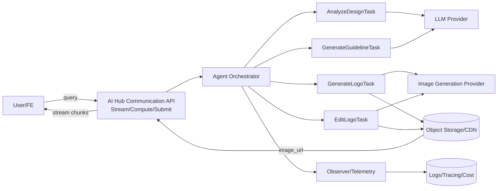
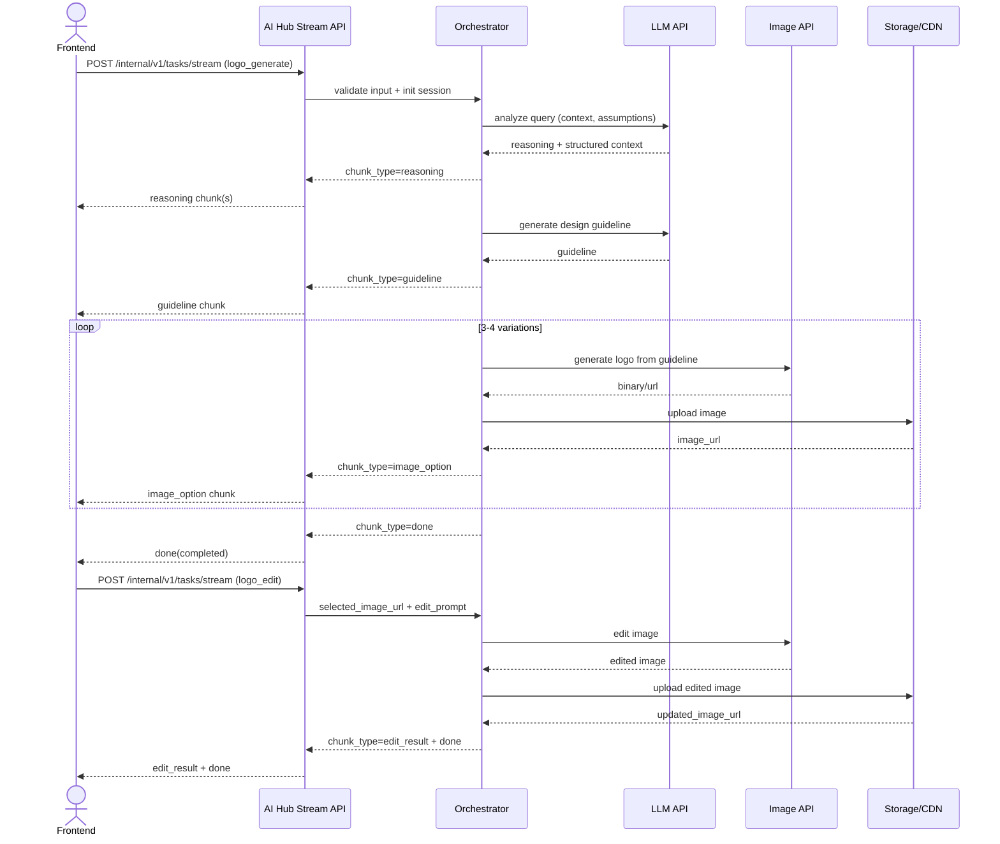

# Technical Design: AI Logo Design Agent (POC Phase 1)

## 1. Overview

### 1.1 Mục tiêu POC
Xây dựng một backend pipeline theo mô hình input query -> xử lý có reasoning -> output image, bám đúng scope của spec `001-logo-design-agent`:

- Nhận mô tả thương hiệu từ người dùng.
- Phân tích ngữ cảnh và xuất reasoning minh bạch theo từng chunk.
- Tạo design guideline rõ ràng trước khi generate ảnh.
- Sinh trực tiếp 3-4 phương án logo PNG.
- Cho phép chọn 1 logo và chỉnh sửa bằng prompt tự nhiên.
- Trả về ảnh đã chỉnh sửa + edit summary.

### 1.2 Success Metrics (POC)
Bám theo spec và chuyển thành metric kỹ thuật có thể đo trên backend:

- >= 90% request có design guideline trước khi image generation bắt đầu.
- >= 90% request trả về đủ 3-4 logo options hợp lệ.
- >= 85% phiên hoàn thành đầy đủ flow generate -> select -> edit mà không reset session.
- p95 time to first reasoning chunk <= 1.5s.
- p95 time to completed 3-4 outputs <= 25s.
- Khi lỗi generation/edit, phản hồi lỗi + retry guidance <= 3s.

### 1.3 Technical Constraints

- POC chỉ dùng single image generation model để giảm rủi ro tích hợp.
- Không build rule engine cứng; logic phải data-driven bằng prompt/template + structured schema.
- Không triển khai region editing, touch edit, smart mark trong Phase 1.
- Session scope là single-session, không làm project persistence dài hạn.
- Ưu tiên Stream API để FE nhận reasoning/incremental output theo thời gian thực.

---

## 2. POC Scope

### 2.1 Build vs Defer

| Area | Build (Phase 1) | Defer (Phase 2+) |
|---|---|---|
| Input handling | Parse query + brand context extraction + optional clarification | Multi-turn profile memory across sessions |
| Reasoning | Stream reasoning chunks (Input Understanding, Style Inference, Assumptions) | Deep chain-of-thought variants và automatic critique loop |
| Generation | Guideline-first + generate 3-4 PNG logo options | Multi-model routing, A/B model comparison |
| Editing | Prompt-based edit trên selected logo | Region-level editing, smart mark, mask-based editing |
| API mode | Stream-first + optional async submit/status for fallback | Advanced orchestration workflow UI actions |
| Quality control | Basic visual checks + explicit assumption disclosure | Judge-model auto-evaluation, quality scorer pipeline |
| Observability | Trace usage/cost/latency và step logs | Full experiment platform + offline replay tools |

### 2.2 Nguyên tắc mở rộng

- Task-oriented architecture: mỗi capability là một task riêng, có input/output schema độc lập.
- Config-driven: prompt/model/settings nằm ở config/provider thay vì hardcode rule logic.
- Composable pipeline: thêm input mới sẽ map qua context extraction + guideline generation mà không phải sửa khung core.
- Contract-first với FE: stream chunk types và payload cố định để FE render ổn định.

---

## 3. System Architecture

### 3.1 End-to-End Flow (BE)

1. FE gửi request generate với query text.
2. BE tạo `session_id`, validate input schema.
3. `AnalyzeDesignTask` stream reasoning chunks + assumptions.
4. `GenerateGuidelineTask` tạo design guideline có cấu trúc.
5. `GenerateLogoTask` gọi image model để tạo 3-4 outputs.
6. BE stream từng output chunk về FE ngay khi có ảnh.
7. FE chọn logo và gửi edit prompt.
8. `EditLogoTask` regenerate ảnh dựa trên selected logo + guideline + edit prompt.
9. BE trả edit summary + output ảnh mới.

### 3.2 Logical Components

- Communication Layer:
  - REST/gRPC endpoints cho submit/compute/stream.
  - Stream endpoint là default cho trải nghiệm POC.
- Task Layer:
  - `AnalyzeDesignTask`
  - `GenerateGuidelineTask`
  - `GenerateLogoTask`
  - `EditLogoTask`
- Agent/Orchestrator Layer:
  - Điều phối tool calls và runtime context.
  - Quản lý reasoning sequence theo chunk order.
- Tool Layer:
  - `BrandContextTool`
  - `StyleInferenceTool`
  - `GuidelineBuilderTool`
  - `ImageGenerationTool` (adapter tới external model)
  - `ImageEditTool`
  - `QualityCheckTool` (POC-level checks)
- Model Layer:
  - LLM cho reasoning/guideline.
  - Single image model cho generate/edit.
- Observer/Telemetry:
  - Trace latency, usage, cost, error taxonomy.

### 3.3 FE Collaboration Contract (streaming)

BE stream NDJSON/gRPC chunks với `chunk_type` thống nhất:

- `reasoning`: văn bản reasoning incremental.
- `guideline`: object guideline hoàn chỉnh.
- `image_option`: một logo option mới.
- `edit_result`: ảnh sau chỉnh sửa.
- `warning`: assumption/conflict resolution.
- `error`: lỗi có retry suggestion.
- `done`: kết thúc stage hoặc kết thúc request.

FE chỉ cần render theo chunk_type, không phụ thuộc vào internal implementation của task.

### 3.4 Mermaid Diagram - High-Level Architecture



### 3.5 Mermaid Diagram - Query to Image Sequence



---

## 4. Data Schema & API Integration

## 4.1 Pydantic Models theo từng bước

```python
from typing import Any, Dict, List, Literal, Optional
from pydantic import BaseModel, Field

class ClarificationQuestion(BaseModel):
    key: str
    question: str
    required: bool = False

class Assumption(BaseModel):
    key: str
    value: str
    reason: str

class BrandContext(BaseModel):
    brand_name: Optional[str] = None
    industry: Optional[str] = None
    target_audience: Optional[str] = None
    style_intent: List[str] = Field(default_factory=list)
    keywords: List[str] = Field(default_factory=list)

class AnalyzeInput(BaseModel):
    session_id: str
    query: str
    allow_skip_clarification: bool = True

class AnalyzeOutput(BaseModel):
    context: BrandContext
    clarification_questions: List[ClarificationQuestion] = Field(default_factory=list)
    assumptions: List[Assumption] = Field(default_factory=list)

class DesignGuideline(BaseModel):
    concept_statement: str
    style_direction: List[str]
    color_palette: List[str]
    typography_direction: List[str]
    symbol_direction: List[str]
    constraints: List[str]
    dominant_interpretation: str

class GenerateLogoInput(BaseModel):
    session_id: str
    query: str
    context: BrandContext
    guideline: DesignGuideline
    variation_count: int = Field(default=4, ge=3, le=4)
    size: str = "1024x1024"
    output_format: Literal["png"] = "png"

class LogoOption(BaseModel):
    option_id: str
    image_url: str
    thumbnail_url: Optional[str] = None
    prompt_used: Optional[str] = None
    seed: Optional[int] = None
    quality_flags: List[str] = Field(default_factory=list)

class GenerateLogoOutput(BaseModel):
    options: List[LogoOption]
    guideline: DesignGuideline
    assumptions: List[Assumption] = Field(default_factory=list)

class EditLogoInput(BaseModel):
    session_id: str
    selected_option_id: str
    selected_image_url: str
    guideline: DesignGuideline
    edit_prompt: str

class EditLogoOutput(BaseModel):
    updated_image_url: str
    edit_summary: str
    preserved_elements: List[str] = Field(default_factory=list)
```

## 4.2 Stream Envelope (BE -> FE)

```python
class StreamEnvelope(BaseModel):
    request_id: str
    session_id: str
    task_type: Literal["analyze", "generate", "edit"]
    status: Literal["processing", "completed", "failed"]
    chunk_type: Literal[
        "reasoning", "guideline", "image_option", "edit_result", "warning", "error", "done"
    ]
    sequence: int
    payload: Dict[str, Any] = Field(default_factory=dict)
    metadata: Dict[str, Any] = Field(default_factory=dict)
```

## 4.3 API Integration Points

### External APIs được gọi ở đâu

- LLM API:
  - Gọi trong `AnalyzeDesignTask` và `GenerateGuidelineTask`.
  - Mục đích: trích context, suy luận style, tạo guideline có cấu trúc.
- Image Generation API:
  - Gọi trong `GenerateLogoTask` với prompt được dựng từ guideline.
  - Sinh batch 3-4 options hoặc loop từng option.
- Image Edit API:
  - Gọi trong `EditLogoTask` với selected image + edit prompt + guideline context.

### I/O cụ thể theo endpoint

- `POST /internal/v1/tasks/stream` với task `logo_generate`
  - Input:
    - `query`
    - `session_id`
    - optional: `brand_context_hint`, `variation_count`
  - Output stream:
    - reasoning chunks
    - guideline chunk
    - 3-4 image_option chunks
    - done chunk

- `POST /internal/v1/tasks/stream` với task `logo_edit`
  - Input:
    - `session_id`
    - `selected_option_id`, `selected_image_url`
    - `edit_prompt`
    - `guideline`
  - Output stream:
    - reasoning/edit-interpreting chunk
    - edit_result chunk
    - done chunk

- Optional fallback async:
  - `POST /internal/v1/tasks/submit`
  - `GET /internal/v1/tasks/{task_id}/status`

### Error I/O chuẩn hoá

Mọi lỗi phải trả về:

- `error_code`
- `message`
- `retryable` (true/false)
- `suggested_action`

Ví dụ lỗi:

- `MODEL_TIMEOUT`
- `INVALID_EDIT_PROMPT`
- `IMAGE_PROVIDER_UNAVAILABLE`
- `VALIDATION_ERROR`

---

## 5. Risks & Open Issues

### 5.1 Latency

Rủi ro:

- Tạo 3-4 ảnh có thể vượt target p95 25s nếu model chậm hoặc queue dài.

Giảm thiểu:

- Stream reasoning sớm để FE hiển thị tiến trình.
- Parallel hóa generate options khi provider hỗ trợ.
- Timeout + retry 1 lần có backoff.
- Fallback giảm từ 4 xuống 3 options khi gần timeout budget.

### 5.2 Generation Quality

Rủi ro:

- Output không bám guideline hoặc có artifacts (text rác, pixelation).

Giảm thiểu:

- QualityCheckTool kiểm tra tiêu chí tối thiểu của spec.
- Prompt template chuẩn hóa theo guideline-first pattern.
- Trả warning rõ nếu output đạt chưa đầy đủ và gợi ý edit tiếp.

### 5.3 Cost

Rủi ro:

- Chi phí tăng nhanh do 2 tầng model (LLM + image) và loop edit.

Giảm thiểu:

- Ghi usage/cost theo request_id, session_id.
- Giới hạn mặc định vòng edit trong POC.
- Cache reasoning/guideline trong session để tránh regenerate không cần thiết.

### 5.4 Open Technical Decisions

- Dùng REST stream NDJSON hay gRPC stream làm kênh chính cho FE production?
- Chính sách lưu ảnh: object storage nội bộ, TTL bao lâu, có cần signed URL rotate không?
- Có cần deterministic seed strategy cho tái tạo gần giống khi edit nhiều vòng?
- Mức độ strict của quality gate: hard fail hay soft warning trong POC?
- Session state lưu toàn bộ ở Redis hay giữ ephemeral trong worker memory?

---

## 6. Proposed Implementation Plan (4 tuần)

### Week 1

- Chốt schema + stream envelope contract với FE.
- Dựng `AnalyzeDesignTask` + `GenerateGuidelineTask`.
- Tích hợp prompt provider và telemetry cơ bản.

### Week 2

- Dựng `GenerateLogoTask` + adapter image model.
- Trả 3-4 options qua stream, có sequence ordering.
- Bổ sung quality checks mức cơ bản.

### Week 3

- Dựng `EditLogoTask` + edit summary.
- Chốt FE flow: select option -> edit -> replace preview in place.
- Chuẩn hóa error mapping + retry guidance.

### Week 4

- E2E validation theo FR/NFR/SC.
- Tuning latency/cost và hardening logging/observability.
- Freeze POC release notes + backlog Phase 2.

---

## 7. Definition of Done (POC)

- Đạt các success metrics chính của spec.
- FE nhận stream ổn định theo contract chunk_type.
- Flow đầy đủ chạy pass: query -> reasoning/guideline -> 3-4 logos -> select -> edit -> updated image.
- Lỗi chính đều có actionable retry response.
- Kiến trúc task/tool/model có thể mở rộng mà không cần build rule engine cứng.
