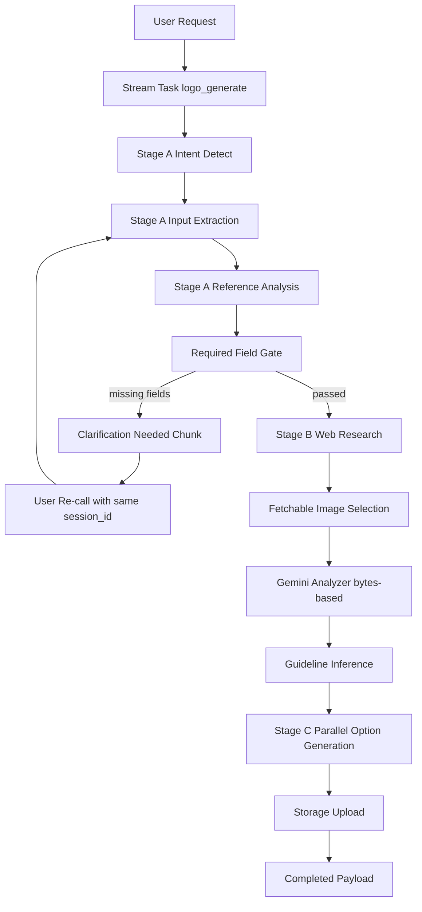
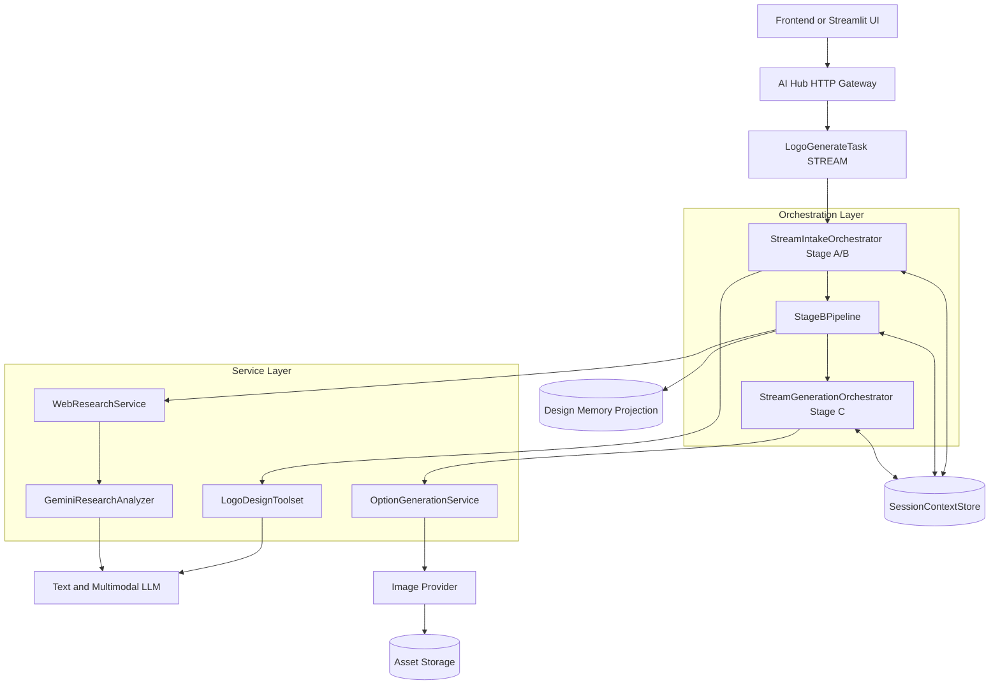
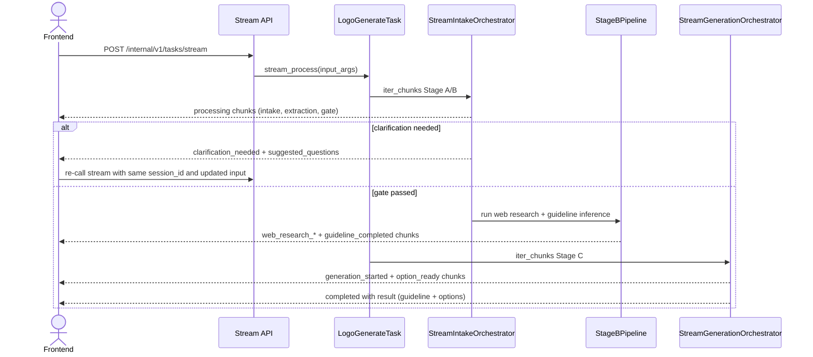

# Logo Design AI POC (System Design v2.3)

## 1. Overview

### 1.1 POC objective

Build a logo generation backend aligned with ai-hub-sdk task contract, covering Step 1 -> Step 6.

In-scope:

- Step 1: intent detect.
- Step 2: input extraction + reference analysis.
- Step 2.5: web research enrichment for design context.
- Step 3: required-field validation and clarification loop.
- Step 4: design guideline inference.
- Step 6: generate logo options and return final payload.

Out-of-scope:

- Step 7: prompt-based editing/inpainting.
- Step 8: follow-up suggestion intelligence.

Note:

- Step 5 "Design direction selection" is automated by Stage B through `strategic_design_directions` and does not expose a separate user selection phase.
- Current source does not implement quick-action engine. Any quick-action wording is removed from this document.

### 1.2 Success metrics (POC acceptance targets)

- >= 90% requests extract or clarify `brand_name` and `industry` before generation.
- >= 90% requests that pass required-field gate produce valid `guideline`.
- >= 85% requests return valid options payload.
- p95 stream end-to-end completion target <= 40s for current POC.
- On failure, return actionable `error_code` and `error_message` in stream chunk.

### 1.3 User journey (current implementation)

1. User submits query with optional explicit fields and references.
2. System streams Stage A chunks (intent, extraction, merge, gate).
3. If required fields are missing, system emits `clarification_needed` with suggested questions.
4. User answers and re-calls stream with same `session_id`.
5. System runs Stage B (web research + guideline inference), then Stage C generation.
6. System returns final completed payload with guideline + options.

Key UX point:

- Current implementation is stream-first end-to-end inside one task execution (`ServingMode.STREAM`).
- Stage C is not submitted as a separate async task in current source.

### 1.4 Technical constraints

- ai-hub-sdk task is implemented as `BaseTask` with `serving_mode = STREAM`.
- Input schema is `LogoGenerateInput`; output chunk schema is `LogoGenerateTaskOutput`.
- Required fields before moving past gate:
  - `brand_name`
  - `industry`
- Merge precedence in current orchestrator:
  - explicit request fields > extracted fields > previous session context (only in clarification follow-up mode).
- Session memory is scoped by `session_id` and persisted through `SessionContextStore` checkpoints.
- Provider failures must fail closed; no synthetic guideline/options are fabricated.

---

## 2. POC Scope

### 2.1 Build vs defer

| Area | Build (current source) | Defer |
| :--- | :--- | :--- |
| Intent + input | Intent detect, extraction, reference analysis in Stage A | Multi-domain intent classifier |
| Clarification | Required-field gate + clarification chunk + stream re-call | Adaptive personalized questioning policy |
| Reasoning stream | NDJSON-like stream chunks with stage metadata and reasoning | Production BFF fan-out/reconnect controls |
| Research | SerpAPI query + dedupe + fetchable image filter + Gemini analysis | Automatic query backfill when fetchable pool < threshold |
| Guideline | Structured guideline inference with strict prerequisite checks | Guideline optimization loop |
| Generation | Parallel option generation using concept variants and storage upload | Dynamic model routing/ranking |
| Storage/session | Context checkpoints and design memory projection | Long-term project library/versioning |
| Editing | Deferred | Step 7 |
| Follow-up suggestion | Deferred | Step 8 |

### 2.2 Technical-design items not yet implemented

- Production BFF transport layer (timeout, reconnect, chunk flush policy).
- Separate queue/service split for Stage A/B vs Stage C.
- Explicit confidence-threshold routing policy (for example < 0.7 auto-clarify) as a hard gate.
- Cost telemetry pipeline per `task_id` and `session_id` for dashboard-level observability.
- Asset retention and signed URL TTL policy as formal runtime policy.

---

## 3. System Architecture

### 3.1 Overview

#### 3.1.1 Why this solution

Current architecture prioritizes deterministic gating and contract-safe outputs for ai-hub-sdk stream mode:

1. Stage A validates required fields early to avoid low-quality generation.
2. Stage B enriches context using web research but only with fetchable image inputs.
3. Stage C generates options in parallel using validated guideline concepts.
4. Session checkpoints make clarification follow-up deterministic.
5. Failure paths are explicit and do not fabricate fallback result data.

#### 3.1.2 Diagram 1 - Agent pipeline (top-down)



#### 3.1.3 Diagram 2 - System components (top-down layered)



### 3.2 Architecture principles

- Task-first:
  - Business flow is exposed via one task type `logo_generate`.
- Schema-first:
  - Pydantic models gate all major boundaries.
- Context-first handoff:
  - Services return deltas; orchestrators merge and checkpoint.
- Fail-closed:
  - Missing prerequisites or provider failures produce explicit failure status.
- Deterministic merge:
  - explicit > extracted > session fallback in clarification follow-up.

#### 3.2.1 Memory flow contract

1. Worker-level orchestrators own execution state (`task_id`, stage progress, stream chunks).
2. Tool/service classes do not own global mutable workflow state.
3. Stage outputs are merged into `SessionContextStore` with checkpoint semantics.
4. Clarification follow-up reuses same `session_id` and merges with latest checkpoint.
5. `DesignMemoryService` projects readable checkpoint data for downstream observation.

#### 3.2.2 POC simplification notes

- Planner/observer are logical roles embedded in orchestrator services.
- Stage A/B and Stage C are executed in one stream lifecycle in current source.
- No separate async queue boundary in current implementation path.

### 3.3 Component breakdown (tool-level)

| Component or Tool | Spec step | Role | Runtime Type | Notes |
| :--- | :--- | :--- | :--- | :--- |
| IntentDetectTool | Step 1 | Detect logo intent | Text LLM | Returns `is_logo_intent`, confidence, reason |
| InputExtractionTool | Step 2 | Extract brand and optional preferences | Text LLM structured output | Explicit-only extraction, no guessing policy in prompt |
| ReferenceImageAnalyzeTool | Step 2 | Analyze reference visual signals | Multimodal LLM | Supports remote URLs and local bytes path |
| ClarificationLoopTool | Step 3 | Suggest questions for missing fields | Text LLM + deterministic fallback | Emits `suggested_questions` |
| WebResearchService | Step 2.5 | Query, normalize, dedupe, select fetchable images | SerpAPI + normalizer | Requires enough fetchable images to continue |
| GeminiResearchAnalyzer | Step 2.5 | Analyze top web references | Gemini multimodal | Backend fetches bytes then sends to provider |
| DesignInferenceTool | Step 4 | Produce guideline JSON | Text LLM | Requires exactly 3 strategic directions |
| LogoGenerationTool | Step 6 | Generate options from guideline concepts | Image provider | Parallel per option |
| StorageTool | Shared | Persist generated image assets | File/object storage | Returns public URL |
| SessionContextStore | Shared | Persist session checkpoints | Memory/cache adapter | Used by all stages |

### 3.4 End-to-end pipeline

Current external task type: `logo_generate`.

#### 3.4.1 Full sequence overview (current source)



#### 3.4.2 Stage A - Intake and clarification loop (Step 1-3)

| Item | Detail |
| :--- | :--- |
| Input | `LogoGenerateInput` (`session_id`, query, optional explicit fields, references) |
| Tools used | IntentDetectTool, InputExtractionTool, ReferenceImageAnalyzeTool, ClarificationLoopTool |
| Output | Gate-passed merged context, or clarification chunk |
| Gate rule | `brand_name` and `industry` are mandatory |
| Session rule | Clarification follow-up can reuse previous session context as fallback |

#### 3.4.3 Stage B - Web research and guideline inference (Step 2.5 + Step 4)

| Item | Detail |
| :--- | :--- |
| Input | Gate-passed merged context |
| Tools used | WebResearchService, GeminiResearchAnalyzer, DesignInferenceTool |
| Query policy | 3 template queries (built by normalizer) |
| Image policy | Dedupe then keep fetchable images only |
| Failure policy | If fetchable images < configured top count, fail Stage B |
| Guideline policy | Requires exactly 3 strategic directions |
| Output | `ResearchContext` + `DesignGuideline` checkpoint |

#### 3.4.4 Stage C - Logo generation (Step 6)

| Item | Detail |
| :--- | :--- |
| Input | Guideline from Stage B and `variation_count` |
| Tools used | OptionGenerationService + storage persistence |
| Output | `LogoGenerateOutput` with `guideline`, `required_field_state`, `options` |
| Concurrency | Parallel generation using `asyncio.as_completed` |

Important current behavior for option count:

- Schema allows `variation_count` in range 3..4 (default 4).
- Current guideline inference enforces exactly 3 concept variants.
- Stage C computes count as `min(max(variation_count, 3), len(concept_variants))`.
- Therefore current full flow effectively returns 3 options by default in existing source.

### 3.5 Reuse and extensibility

- Add fields in guideline or context:
  - extend schema + prompts, keep task contract stable.
- Add Step 7 later:
  - add new task flow (for example `logo_edit`) reusing session/memory contracts.
- Add providers:
  - swap provider adapters while preserving output schema.

---

## 4. Data Schema and API Integration

### 4.1 Pydantic models by stage (current contract)

```python
class LogoGenerateInput(TaskInputBaseModel):
    session_id: str
    query: str
    brand_name: Optional[str]
    industry: Optional[str]
    style_preference: List[str] = []
    color_preference: List[str] = []
    symbol_preference: List[str] = []
    typography_direction: Optional[str]
    references: List[ReferenceImage] = []
    use_session_context: bool = True
    variation_count: int = Field(4, ge=3, le=4)

class RequiredFieldState(BaseModel):
    required_keys: List[str] = ["brand_name", "industry"]
    missing_keys: List[str] = []
    passed: bool = False

class DesignGuideline(BaseModel):
    concept_statement: str
    concept_variants: List[str]  # current policy expects exactly 3
    style_direction: List[str]
    color_palette: List[str]
    typography_direction: List[str]
    icon_direction: List[str]
    constraints: List[str]

class LogoGenerateOutput(BaseModel):
    guideline: DesignGuideline
    required_field_state: RequiredFieldState
    options: List[LogoOption]  # min 3, max 4
```

### 4.2 Validation and precedence rules

- `query` must be non-empty after trim.
- `variation_count` must be 3..4.
- Required-field gate requires both `brand_name` and `industry`.
- Merge precedence:
  - explicit request > extracted > session fallback (clarification mode).
- Empty string for optional scalar fields is normalized to `None`.
- If gate fails, stream emits clarification payload with `missing_fields` and `suggested_questions`.

### 4.3 Concrete endpoint mapping (current ai-hub-sdk usage)

Current implemented execution path:

- Stream endpoint:
  - `POST /internal/v1/tasks/stream`
  - Used for Stage A + Stage B + Stage C chunks in one task stream.

SDK capability available but not primary current flow path in source task:

- Submit endpoint:
  - `POST /internal/v1/tasks/submit`
- Status endpoint:
  - `GET /internal/v1/tasks/{task_id}/status`

Current stream chunk progression (typical):

- `intake_started` or `intake_resumed`
- `query_extracted`
- `context_merged`
- `required_field_gate_evaluated`
- `clarification_needed` (if missing fields)
- `guideline_inference_started`
- `web_research_started`
- `web_research_completed`
- `guideline_completed`
- `generation_started`
- `generation_option_ready` (repeated)
- `completed`

### 4.4 Model/provider notes (current source behavior)

- Text + multimodal reasoning paths depend on Gemini availability/config.
- Stage C generation currently requires Gemini image generation availability in runtime path.
- If provider prerequisites are missing, generation fails explicitly (no mock fabrication path in this flow).

---

## 5. Risks and open issues

### 5.1 Latency

Risk:

- Stage B external retrieval + multimodal analysis can push p95 higher.

Mitigation:

- Bounded query and image selection policy.
- Parallel option generation in Stage C.

### 5.2 Provider reliability

Risk:

- Provider internal errors or media fetch limitations.

Mitigation:

- Fetchable-image filter before analysis.
- Bytes-based multimodal upload path.
- Explicit failure signaling with error code/message.

### 5.3 Gate quality

Risk:

- Ambiguous user input can cause repeated clarification loops.

Mitigation:

- Clarification questions from LLM with deterministic fallback set.
- Session checkpoint reuse in follow-up turns.

### 5.4 Open technical decisions

- Production BFF policy for transport retry/reconnect/backpressure.
- Async queue boundary and decoupled services plan.
- Query backfill strategy when fetchable references are insufficient.
- Cost tracking pipeline by task/session.
- Asset URL TTL and retention lifecycle.

---

## 6. Implementation status (v2.3)

### 6.1 Implemented in source

- ai-hub-sdk task adapter with stream mode (`logo_generate`).
- Stage A deterministic intake and required-field gate.
- Clarification loop with session continuation.
- Stage B web research, fetchable-only image selection, Gemini analysis, guideline checkpoint.
- Stage C parallel generation, upload, and completed result emission.
- Output contract containing `guideline`, `required_field_state`, and options list.

### 6.2 Not implemented yet

- Step 7 editing/inpainting flow.
- Step 8 follow-up suggestion engine.
- Quick-action orchestration engine (not present in current source).
- Production BFF abstraction and queue-decoupled deployment architecture.
