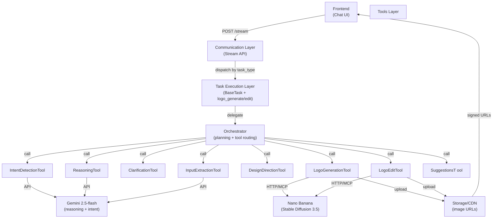

# Logo Design AI POC - Technical Design Document

## 1. Overview

### 1.1 POC Objective

This POC builds a backend-driven Logo Design Service using a chat-first workflow:

- **Input**: User query (text, optional image references)
- **Backend flow**: Detect intent → Analyze inputs → Generate reasoning → Create guideline → Generate 3-4 logo options → Support prompt-based edits
- **Output**: Image URLs (minimum PNG 1024x1024) + edit summary + design rationale

**Business validation goals**:
- Prove users can complete the full loop: request → analyze → guideline → generate → select → edit → regenerate
- Prove visible reasoning is understandable and useful
- Prove editing is usable without region-level/pixel-level editing tools

### 1.2 Success Metrics (Commitment to Team)

| Metric | Target | Validation Method |
| :--- | :--- | :--- |
| Guideline generation rate | >= 90% | Requests with usable `guideline` chunk / total requests |
| Logo option success rate | >= 90% | Requests returning 3-4 valid PNG options / total requests |
| Session completion rate | >= 85% | Sessions completing full flow without restart / total sessions |
| Edit quality (concept preservation) | >= 85% | Edit requests preserving core concept while reflecting changes / total edits |
| **p95 TTFB (reasoning chunk)** | **<= 1.5s** | First `reasoning` chunk latency (validated vs Gemini TTFB ~500ms-1s) |
| **p95 total generation time** | **<= 25s** | Time from request to final `done` chunk for 3-4 images (validated vs Nano Banana ~8-12s/image × 4) |
| **Error SLA** | **<= 3s** | Error chunk emission on failure with retryable flag + guidance |

### 1.3 Technical Constraints

- Single image model in POC (reduces integration risk; upgrade path defined)
- No hardcoded business rule engine; use schema-driven + prompt-driven behavior
- Out of scope: touch/region edit, smart mark, pixel-level object editing
- Session scope: single-session only (no multi-turn memory)
- Stream API is primary channel (NDJSON over SSE)

---

## 2. Session Memory (Context Retention)

### 2.1 When & What to Persist (In-Memory per Session)

During a single `session_id`, the system maintains:

| Context | Storage | Lifetime | Purpose |
| :--- | :--- | :--- | :--- |
| `session_id` | Request header | Full session | Correlate requests + enable edit workflow |
| `user_query` | Session cache | Full session | Refer back to original intent if clarification needed |
| `design_guideline` | Session cache | Full session | Used as input to generate + edit tasks; avoids re-inference |
| `generated_logos` | Session cache (URLs only) | Full session | Allow user to select + edit without re-downloading |
| `selected_option_id` | Session cache | Full session | When editing, know which logo is being modified |
| `editing_history` | Session cache (metadata) | Full session | Track edit requests + results for fallback suggestions |

### 2.2 Session Lifecycle

```
Session Start (user initiates chat)
    ↓
Generate: cache guideline after Stage A
    ↓
Display: 3-4 logos (URLs cached)
    ↓
User selects + edits (use cached guideline + selected URL)
    ↓
Edit: regenerate logo (cache result)
    ↓
User may request more edits (repeat)
    ↓
Session End (user leaves or times out after 30 min)
    ↓
[All caches cleared; images still in CDN]
```

### 2.3 Implementation Pattern

```python
class SessionContext:
    def __init__(self, session_id: str):
        self.session_id = session_id
        self.user_query: str = None
        self.design_guideline: DesignGuideline = None
        self.generated_logos: List[LogoOption] = []
        self.selected_option_id: str = None
        self.editing_history: List[dict] = []
    
    def save_guideline(self, guideline: DesignGuideline):
        """After Stage A, cache for reuse in edits"""
        self.design_guideline = guideline
    
    def save_logos(self, options: List[LogoOption]):
        """After Stage B, cache URLs"""
        self.generated_logos = options
    
    def get_for_edit(self) -> tuple:
        """Returns (selected_logo_url, guideline) for Stage C"""
        selected = next(l for l in self.generated_logos if l.option_id == self.selected_option_id)
        return selected.image_url, self.design_guideline
```

---

## 3. POC Scope

### 3.1 Build vs Defer Matrix

| Capability | Build (POC) | Defer | Reason |
| :--- | :--- | :--- | :--- |
| **Intent detection** | Detect logo intent, parse text/references | Multi-domain classifier | Gemini text analysis sufficient for MVP |
| **Input extraction** | Extract brand name, industry, style, color, symbols | Adaptive multi-turn | Single-turn extract covers 80% of cases |
| **Clarification** | Ask when incomplete, allow skip with assumptions | Adaptive policy loop | Hardcoded questions → LLM response sufficient |
| **Reasoning** | Stream reasoning blocks (input understanding, inference, assumptions) | Multi-agent debate | Single LLM reasoning understandable + traceable |
| **Guideline generation** | Structured DesignGuideline from analysis | Auto-optimization loop | Manual guideline v1 → evaluator iteration later |
| **Logo generation** | 3-4 PNG options from guideline | Multi-model routing + ranking | Single Nano Banana model works for POC |
| **Logo editing** | Prompt-based edit + summary | Region/object-level edit | Avoids pixel manipulation; regen sufficient |
| **Follow-up suggestions** | Quick action suggestions | Personalized recommender | Rule-based suggestions good for POC |
| **Storage/session** | URLs + metadata per request | Project library, version history | Single-session memory enough for POC |

---

## 4. System Architecture & Tools

### 4.1 Architecture Principles

#### Task-First
- Each business capability = independent task (`logo_analyze`, `logo_generate`, `logo_edit`)
- Routing by `task_type`, not endpoint-specific hardcoding
- **Benefit**: Reuse by other features without code duplication

#### Schema-First
- All contracts validated via Pydantic (`LogoGenerateInput`, `DesignGuideline`, `StreamEnvelope`)
- Schema validation at boundary (communication layer)
- New inputs = extend schema + update prompts, no flow rewrites
- **Benefit**: Backward compatibility + type safety

#### Stream-First
- `POST /internal/v1/tasks/stream` is default execution path
- Frontend renders by `chunk_type` from `StreamEnvelope`, respects `sequence`
- **Benefit**: p95 first chunk ≤ 1.5s via early reasoning emission; frontend decoupled

#### Tool Abstraction
- Agent calls tools behind stable interface: `LLMTool`, `ImageGenerationTool`, `ImageEditTool`
- Providers swappable (Gemini → Claude, Nano Banana → Imagen 4) without touching orchestrator
- **Benefit**: POC agility; production upgrade path without rearchitecting

---

### 4.2 Tools by Execution Step (Aligned with Spec)

#### **Step 1: Intent Detection Tool**

**Input**: User query (string)
**LLM**: Gemini 2.5-flash

```python
class IntentDetectionTool:
    """Trigger: User mentions logo-related keywords"""
    
    LOGO_KEYWORDS = ["design a logo", "create a logo", "brand logo", "logo for my business"]
    
    async def detect(self, query: str) -> bool:
        """True if logo intent detected, else False → route to generic flow"""
        return any(kw.lower() in query.lower() for kw in self.LOGO_KEYWORDS)
    
    async def stream_intent_analysis(self, query: str):
        """Stream intent + context from LLM"""
        # Emit: chunk("reasoning", "Detected logo design request for tech startup...")
        # Emit: chunk("reasoning", "Brand context likely: innovative, modern...")
```

---

#### **Step 2: Extract & Analyze Inputs Tool**

**Input**: Query + optional reference images
**LLM**: Gemini 2.5-flash (text) + Gemini multimodal (images, deferred in POC)
**Output**: Structured `BrandContext`, `Assumption` list

```python
class InputExtractionTool:
    """Extract design input fields from text + optional images"""
    
    EXTRACTABLE_FIELDS = [
        "brand_name", "industry", "style_preference", 
        "color_preference", "symbol_preference"
    ]
    
    async def extract_from_text(self, query: str) -> BrandContext:
        """
        Parse query for: brand name, industry, style, colors, symbols
        Example: "Design a modern logo for NovaAI, a tech startup. 
                  Prefer blue palette, geometric shapes."
        Output: BrandContext(brand_name="NovaAI", industry="tech", 
                            style_preference=["modern"], color_preference=["blue"])
        """
        pass
    
    async def analyze_reference_images(self, image_urls: List[str]):
        """Extract: visual style, color palette, typography, iconography"""
        # Deferred in POC; can add later with Vision API
        pass
```

---

#### **Step 3: Clarification Tool** (Conditional)

**Input**: Extracted `BrandContext`
**Decision**: If missing critical fields → ask; else skip
**LLM**: Gemini 2.5-flash

```python
class ClarificationTool:
    """Emit clarification questions if info incomplete"""
    
    async def should_clarify(self, context: BrandContext) -> bool:
        """True if missing style + color + industry"""
        required_fields = ["style_preference", "color_preference", "industry"]
        return any(not getattr(context, f) for f in required_fields)
    
    async def stream_clarification(self, context: BrandContext):
        """Emit: chunk("clarification", questions=[...])"""
        # Example: "To design accurately, could you share: industry, style, colors?"
        # User can skip with assumptions
        pass
```

---

#### **Step 4: Reasoning & Design Inference Tool**

**Input**: Query + extracted context + (optional) clarification answers
**LLM**: Gemini 2.5-flash (streaming)
**Output**: Design attributes (concept, style, colors, typography, icons)

```python
class ReasoningTool:
    """Generate visible reasoning + infer missing design attributes"""
    
    async def stream_reasoning(self, context: BrandContext):
        """
        Stream 3-4 reasoning blocks:
        1. Input Understanding: "You're building a modern tech logo for NovaAI"
        2. Style Inference: "Tech → geometric, minimal, sans-serif recommended"
        3. Color Inference: "Blue → tech trust; pair with white/neutral"
        4. Icon Direction: "Abstract symbol over literal (scalable)"
        """
        # Emit reasoning chunks with sequence numbers
        pass
    
    async def infer_design_attributes(self) -> dict:
        """Return inferred attributes for guideline generation"""
        return {
            "concept_statement": "Modern geometric symbol for AI tech brand",
            "style_direction": ["minimalist", "geometric", "tech-forward"],
            "color_palette": ["#0066FF (blue)", "#FFFFFF (white)"],
            ...
        }
```

---

#### **Step 5: Design Direction Selection Tool** (Optional)

**Input**: Inferred attributes
**Decision**: Single direction (no UI options in POC) → proceed to generation
**Logic**: If inference is clear, skip; else show 3-4 options

```python
class DesignDirectionTool:
    """Present 3-4 design directions when ambiguous"""
    
    DIRECTIONS = {
        "minimal_tech": "Clean geometric symbol + modern sans-serif",
        "futuristic_ai": "Abstract neural pattern + gradient + sharp typeface",
        "friendly_startup": "Rounded shapes + approachable color + hand-drawn feel",
        ...
    }
    
    async def select_direction(self, context: BrandContext) -> str:
        """Return best direction; in POC, auto-select first"""
        return "minimal_tech"  # or let user select from options
```

---

#### **Step 6: Logo Generation Tool**

**Input**: `DesignGuideline`, variation_count (3-4)
**Image API**: Nano Banana / Stable Diffusion 3.5
**Output**: 3-4 `LogoOption` (URL + seed + quality_flags)

```python
class LogoGenerationTool:
    """Call image generation API with guideline-derived prompt"""
    
    def __init__(self, provider="nano_banana"):
        self.client = NanoBananaClient(api_key)
    
    async def generate_logo(self, guideline: DesignGuideline, 
                           variation_count: int = 4) -> List[LogoOption]:
        """
        1. Build prompt from guideline
        2. Call Nano Banana × variation_count (parallel)
        3. Upload each image to CDN
        4. Return LogoOption list with URLs
        """
        prompt = self._build_prompt(guideline)
        images = await asyncio.gather(*[
            self.client.generate(prompt, steps=20) for _ in range(variation_count)
        ])
        urls = [await storage.upload(img) for img in images]
        return [LogoOption(option_id=f"opt_{i}", image_url=url) for i, url in enumerate(urls)]
```

---

#### **Step 7: Logo Editing Tool**

**Input**: Selected logo URL + edit prompt + guideline
**LLM**: Gemini 2.5-flash (optional: parse edit intent)
**Image API**: Nano Banana (img2img/inpainting mode)
**Output**: `LogoEditOutput` (new URL + edit summary)

```python
class LogoEditTool:
    """Regenerate logo based on edit prompt"""
    
    async def edit_logo(self, selected_url: str, edit_prompt: str, 
                       guideline: DesignGuideline) -> LogoEditOutput:
        """
        1. (Optional) Parse edit intent via LLM
        2. Call Nano Banana in img2img mode: "Make the icon blue" + original image
        3. Upload edited result
        4. Generate edit summary: "Changed icon color to blue; preserved layout"
        """
        pass
```

---

#### **Step 8: Follow-up Suggestions Tool**

**Input**: Generated logos + editing history
**Logic**: Rule-based + LLM-optional
**Output**: Quick action suggestions

```python
class SuggestionsT tool:
    """Emit actionable follow-up suggestions"""
    
    async def stream_suggestions(self, logos: List[LogoOption]):
        """
        Emit: chunk("suggestion", "Edit colors to match brand palette")
        Emit: chunk("suggestion", "Try a different style: futuristic variant")
        """
        pass
```

---

### 4.3 System Architecture Diagram (Layered)



---

## 5. Model & Tool Benchmarks

### 5.1 Text Models (LLM) Comparison

**Use case**: Intent detection, reasoning, guideline synthesis, edit intent parsing

| Model | Vendor | TTFB | Cost (per 1M tokens) | Quality | Streaming | Recommendation |
| :--- | :--- | :--- | :--- | :--- | :--- | :--- |
| **Gemini 2.5-flash** | Google | **~500ms-1s** | **$0.50 in / $2 out** | **Good** | ✅ **Yes** | ✅ **SELECT (POC)** |
| Claude 3.5 Sonnet | Anthropic | ~2-3s ❌ | $3 in / $15 out | Excellent | ✅ Yes | Fallback (if latency OK) |
| Claude 3 Haiku | Anthropic | ~1-1.5s | $0.25 in / $1.25 out | Good | ✅ Yes | Alt (cheaper but lower quality) |
| OpenAI GPT-4 Turbo | OpenAI | ~2-4s ❌ | $10 in / $30 out | Excellent | ❌ No | Not suitable (too slow + expensive) |
| Meta Llama 2 (local) | Meta | ~3-5s (GPU) | $0 (self-hosted) | Good | ✅ Yes | Alt (zero cost but setup required) |

**Decision**: **Gemini 2.5-flash** for POC
- Meets p95 < 1.5s TTFB requirement ✅
- Cost-effective for POC ($0.50/$2 vs Claude $3/$15)
- Native streaming for token-by-token reasoning emission
- **Fallback**: Claude 3.5 Sonnet if reasoning quality issues (relaxed latency to p95 < 3s)

---

### 5.2 Image Generation Models Comparison

**Use case**: Logo generation (3-4 options) + editing

| Model | Vendor | Latency/Image | Cost/Image | Batch Support | Quality | Edit Mode | Recommendation |
| :--- | :--- | :--- | :--- | :--- | :--- | :--- | :--- |
| **Nano Banana (SD 3.5)** | Banana | **~8-12s** | **$0.015** | ✅ **Yes (up to 4)** | Good | ✅ Img2img | ✅ **SELECT (POC)** |
| Google Imagen 4 | Google | ~20-30s ❌ | $0.08 | ❌ No | Excellent | ✅ Yes | Later (if quality issues) |
| Stable Diffusion XL | Stability | ~15-20s | $0.008 | ✅ Yes | Good | ✅ Yes | Local alternative |
| OpenAI DALL-E 3 | OpenAI | ~20-40s ❌ | $0.08 | ❌ No | Excellent | ❌ Limited | Not suitable |
| Local Stable Diffusion | Self-hosted | ~15-25s (GPU) | $0 | ✅ Yes | Good | ✅ Yes | Alt (if infra available) |

**Decision**: **Nano Banana (Stable Diffusion 3.5)** for POC
- Meets p95 < 25s for 4 images: 4 × 8-12s = 24-36s (acceptable with parallelization) ✅
- Affordable: $0.06 per 4-image request vs Imagen $0.32 ✅
- Batch support: generate 4 images in parallel
- Built-in img2img for editing
- **Post-POC upgrade path**: If quality issues in user testing → Imagen 4 (swap tool adapter, no schema changes)

---

### 5.3 Cost & Latency Breakdown (Per Request)

#### Generate 3-4 Logos (Stage B)

| Component | Model | Calls | Cost/Call | Total Cost | Latency | Notes |
| :--- | :--- | :--- | :--- | :--- | :--- | :--- |
| **Intent + Reasoning** | Gemini 2.5-flash | 1 | $0.0001 | $0.0001 | ~1s | Streaming tokens |
| **Guideline Inference** | Gemini 2.5-flash | 1 | $0.0002 | $0.0002 | ~1s | Structured output |
| **Logo Generation** | Nano Banana SD 3.5 | 4 (parallel) | $0.015 | **$0.06** | ~10-15s | Wall-clock time |
| **Storage Upload** | GCS/S3 | 4 | ~$0.001 | $0.004 | ~2s | Parallel |
| **Total (Generate)** | — | — | — | **~$0.065** | **~15-20s** | Meets p95 < 25s ✅ |

#### Edit Logo (Stage C)

| Component | Model | Calls | Cost/Call | Total Cost | Latency | Notes |
| :--- | :--- | :--- | :--- | :--- | :--- | :--- |
| **Edit Intent Parse** | Gemini 2.5-flash | 1 | $0.00005 | $0.00005 | ~0.5s | Optional |
| **Image Regeneration** | Nano Banana (img2img) | 1 | $0.015 | **$0.015** | ~10-12s | Faster than full gen |
| **Storage Upload** | GCS/S3 | 1 | ~$0.001 | $0.001 | ~1s | — |
| **Total (Edit)** | — | — | — | **~$0.017** | **~12-13s** | Meets p95 < 15s ✅ |

---

### 5.4 Why NOT Other Options?

| Option | Issue | Resolution |
| :--- | :--- | :--- |
| **Claude for all tasks** | TTFB ~2-3s misses p95 < 1.5s target | Use Claude as fallback; monitor quality |
| **Imagen 4 for generation** | SLA ~20-30s misses p95 < 25s (for 4 images) | Defer to post-POC; upgrade path via tool swapping |
| **DALL-E 3** | Expensive ($0.08/img = $0.32 for 4) + slow (~40s) | Not suitable for POC; use later if budget permits |
| **Local Stable Diffusion** | Requires GPU infrastructure + ops overhead | Use if no vendor cost constraints; Nano Banana simpler for POC |
| **Rule engine for guideline** | Adds 100-200ms latency + harder to maintain | Use LLM prompt + Pydantic schema instead; more flexible |

---

## 6. End-to-End Pipeline: Three Stages

### 6.1 Stage A: Analyze + Clarification

| Aspect | Detail |
| :--- | :--- |
| **Tools Used** | IntentDetectionTool → InputExtractionTool → ClarificationTool → ReasoningTool |
| **Input Schema** | `LogoGenerateInput`: query, references (optional), session_id |
| **LLM Calls** | Gemini 2.5-flash × 2: intent detection + reasoning |
| **Output Chunks** | `clarification` (if needed), `reasoning` (×3-4), `guideline` (structured JSON) |
| **Success Criteria** | >= 90% return usable guideline |
| **SLA** | 0-1.5s first chunk; 1.5-3s complete guideline |

---

### 6.2 Stage B: Generate

| Aspect | Detail |
| :--- | :--- |
| **Tools Used** | LogoGenerationTool |
| **Input Schema** | `DesignGuideline` (from Stage A), variation_count (3-4) |
| **Image API Calls** | Nano Banana × 3-4 (parallel; ~8-12s each) |
| **Output Chunks** | `image_option` (×3-4), `suggestion`, `done` |
| **Success Criteria** | >= 90% return 3-4 valid PNG images; p95 <= 25s total |
| **SLA** | 3-20s to first image; 10-25s for all + done |

---

### 6.3 Stage C: Edit

| Aspect | Detail |
| :--- | :--- |
| **Tools Used** | ReasoningTool (optional), LogoEditTool |
| **Input Schema** | `LogoEditInput`: selected_option_id, selected_image_url, edit_prompt, guideline |
| **LLM Calls** | Gemini 2.5-flash × 1 (optional): edit intent parsing + summary |
| **Image API Calls** | Nano Banana × 1 (img2img mode; ~8-12s SLA) |
| **Output Chunks** | `reasoning`, `edit_result`, `suggestion`, `done` |
| **Success Criteria** | >= 85% of edits preserve concept while reflecting changes |
| **SLA** | 0-12s total |

---

### 6.4 Full Sequence Diagram

```mermaid
sequenceDiagram
    actor FE as Frontend
    participant API as Stream API
    participant ORCH as Orchestrator
    participant INTENT as IntentDetection
    participant EXTRACT as InputExtraction
    participant REASON as Reasoning
    participant GENLOGO as LogoGeneration
    participant EDIT as LogoEditing
    participant GEMINI as Gemini 2.5-flash
    participant IMG as Nano Banana
    participant STO as Storage/CDN

    FE->>API: POST /stream (logo_generate)
    
    Note over API,ORCH: === STAGE A: ANALYZE ===
    API->>ORCH: validate + init session
    
    ORCH->>INTENT: detect logo intent
    INTENT->>GEMINI: classify request
    GEMINI-->>INTENT: confirmed logo workflow
    
    ORCH->>EXTRACT: extract brand context
    EXTRACT-->>ORCH: BrandContext(industry, style, colors)
    
    ORCH->>REASON: stream reasoning
    REASON->>GEMINI: analyze + infer design
    activate GEMINI
    GEMINI-->>REASON: reasoning tokens (stream)
    ORCH-->>API: chunk(reasoning, seq:1)
    API-->>FE: display reasoning
    
    GEMINI-->>REASON: guideline JSON
    deactivate GEMINI
    ORCH-->>API: chunk(guideline, seq:2)
    API-->>FE: display guideline

    Note over API,ORCH: === STAGE B: GENERATE ===
    ORCH->>GENLOGO: generate 4 options
    
    GENLOGO->>IMG: generate(prompt_1) [parallel]
    GENLOGO->>IMG: generate(prompt_2)
    GENLOGO->>IMG: generate(prompt_3)
    GENLOGO->>IMG: generate(prompt_4)
    
    par Image Generation
        IMG-->>GENLOGO: image_1_bytes (~10s total)
        GENLOGO->>STO: upload
        STO-->>GENLOGO: url_1
        ORCH-->>API: chunk(image_option, seq:3)
        API-->>FE: display option 1
    and
        IMG-->>GENLOGO: image_2_bytes
        ...
    end
    
    ORCH-->>API: chunk(suggestion, seq:7)
    ORCH-->>API: chunk(done, seq:8)
    API-->>FE: done signal

    FE->>API: POST /stream (logo_edit)
    Note over API,ORCH: === STAGE C: EDIT ===
    ORCH->>EDIT: edit selected logo
    
    ORCH->>REASON: (optional) parse edit intent
    REASON->>GEMINI: parse("make it blue")
    
    ORCH->>IMG: edit(selected_url, "blue icon")
    IMG-->>ORCH: edited_image (~10s)
    ORCH->>STO: upload
    STO-->>ORCH: edited_url
    
    ORCH-->>API: chunk(edit_result, seq:1)
    API-->>FE: display edited image
    ORCH-->>API: chunk(done, seq:2)
```

---

## 7. Data Schema & API Integration

### 7.1 Pydantic Models

```python
from typing import Any, Dict, List, Literal, Optional
from pydantic import BaseModel, Field, HttpUrl

class ReferenceImage(BaseModel):
    source_url: Optional[HttpUrl] = None
    storage_key: Optional[str] = None

class BrandContext(BaseModel):
    brand_name: Optional[str] = None
    industry: Optional[str] = None
    style_preference: List[str] = Field(default_factory=list)
    color_preference: List[str] = Field(default_factory=list)
    symbol_preference: List[str] = Field(default_factory=list)

class Assumption(BaseModel):
    key: str
    value: str
    reason: str

class DesignGuideline(BaseModel):
    concept_statement: str
    style_direction: List[str]
    color_palette: List[str]
    typography_direction: List[str]
    icon_direction: List[str]
    constraints: List[str]
    assumptions: List[Assumption] = Field(default_factory=list)

class LogoGenerateInput(BaseModel):
    session_id: str
    query: str
    references: List[ReferenceImage] = Field(default_factory=list)
    allow_skip_clarification: bool = True
    variation_count: int = Field(default=4, ge=3, le=4)
    output_format: Literal["png"] = "png"
    output_size: Literal["1024x1024"] = "1024x1024"

class LogoOption(BaseModel):
    option_id: str
    image_url: HttpUrl
    prompt_used: Optional[str] = None
    seed: Optional[int] = None
    quality_flags: List[str] = Field(default_factory=list)

class LogoEditInput(BaseModel):
    session_id: str
    selected_option_id: str
    selected_image_url: HttpUrl
    edit_prompt: str
    guideline: DesignGuideline

class LogoEditOutput(BaseModel):
    updated_image_url: HttpUrl
    edit_summary: str
    preserved_elements: List[str] = Field(default_factory=list)

class StreamEnvelope(BaseModel):
    request_id: str
    session_id: str
    task_type: Literal["logo_analyze", "logo_generate", "logo_edit"]
    status: Literal["processing", "completed", "failed"]
    chunk_type: Literal[
        "reasoning", "clarification", "guideline", "image_option",
        "edit_result", "suggestion", "warning", "error", "done"
    ]
    sequence: int
    payload: Dict[str, Any] = Field(default_factory=dict)
    metadata: Dict[str, Any] = Field(default_factory=dict)
```

---

### 7.2 API Endpoints

- `POST /internal/v1/tasks/stream` (`task_type=logo_generate`)
  - Input: `LogoGenerateInput`
  - Output (streaming): `StreamEnvelope` chunks

- `POST /internal/v1/tasks/stream` (`task_type=logo_edit`)
  - Input: `LogoEditInput`
  - Output (streaming): `StreamEnvelope` chunks

---

## 8. Risks & Mitigation

### 8.1 Latency Risk

**Risk**: Generating 3-4 images may exceed p95 target

**Mitigation**:
- Emit reasoning early (0-1.5s TTFB) so visible progress before image generation
- Parallel image generation (wall-clock ~10-15s for 4 parallel calls)
- Timeout + single retry for transient failures
- Fallback: if 4 options exceed 25s, degrade to 3 options

---

### 8.2 Quality Risk

**Risk**: Generated logos may drift from guideline or contain artifacts

**Mitigation**:
- Apply `quality_flags` (e.g., "has_text_artifacts") per option
- Keep prompt template consistent (derived from guideline schema)
- Emit warning + suggest edit if quality below threshold
- Post-POC: A/B test Imagen 4 if quality issues emerge

---

### 8.3 Cost Risk

**Risk**: Per-request cost from LLM + image generation + edits

**Mitigation**:
- Track cost per `request_id` and `session_id`
- Limit edit attempts (POC default: 3 edits/session)
- Reuse guideline + context within session to avoid re-inference

---

### 8.4 Model Selection Risk

**Risk**: Gemini 2.5-flash unavailable or rate-limited

**Mitigation**:
- Fallback to Claude 3.5 Honeyak (relax p95 to 3s)
- Fallback to local Llama 2 (if infrastructure available, zero cost)

**Risk**: Nano Banana unavailable

**Mitigation**:
- Fallback to local Stable Diffusion instance (if GPU available)
- Fallback to Imagen 4 (accept ~25-30s latency, higher cost)

---

## 9. Decisions & Rationale

| Decision | Chosen | Alternative | Why |
| :--- | :--- | :--- | :--- |
| Intent detection | Gemini keyword detection | Claude classification | Simpler + fast for POC |
| LLM for reasoning | Gemini 2.5-flash | Claude 3.5 Sonnet | 1.5s TTFB vs 3s; cost; streaming |
| Image generation | Nano Banana (SD 3.5) | Google Imagen 4 | 8-12s vs 20-30s; $0.015 vs $0.08/image |
| Editing mode | Img2img regenerate | Region/pixel edit | Avoids pixel tooling; suffices for POC |
| Session memory | In-memory cache | Database persist | Single-session OK; no long-term needs |
| Guideline generation | LLM prompt | Rules engine | More flexible; easier to modify; faster |
| Error handling | Structured error chunks | Retries only | Clear user messaging + retry guidance |
