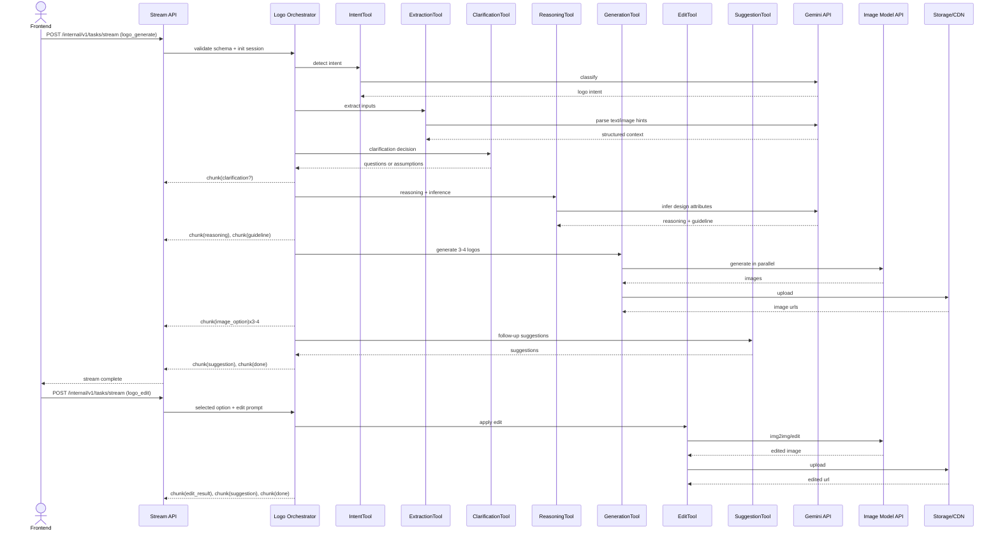

# Logo Design AI POC - Technical Design Document

## 1. Overview

### 1.1 POC Objective

This POC builds a backend-driven Logo Design Service with a chat-first workflow:

- Input: user query (text, optional image references)
- Backend flow: detect intent -> extract/analyze inputs -> clarification (conditional) -> reasoning/inference -> optional direction selection -> generate 3-4 logo options -> prompt-based edit -> regenerate -> follow-up suggestions
- Output: image URLs (PNG 1024x1024 minimum), edit summary, and visible reasoning/guideline

### 1.2 Success Metrics (Team Commitments)

| Metric | Target | Validation Method |
| :--- | :--- | :--- |
| Guideline generation rate | >= 90% | Requests with valid guideline chunk / total generate requests |
| Logo option success rate | >= 90% | Requests returning 3-4 valid PNG URLs / total generate requests |
| Session completion rate | >= 85% | Sessions completing request -> generate -> edit without restart |
| Edit quality (concept preservation) | >= 85% | Human review: edit reflects request while preserving concept |
| p95 time to first reasoning chunk | <= 1.5s | `reasoning` first chunk latency |
| p95 time to complete 3-4 logos | <= 25s | request start -> final `done` chunk |
| Error response SLA | <= 3s | failure detection -> `error` chunk emission with actionable guidance |

### 1.3 Constraints

- POC uses one primary image model at runtime (with documented fallback path)
- No dedicated business rule engine; behavior comes from schema + prompt + tool adapters
- Out of scope: region/pixel-level editing, touch edit, smart mark
- Session scope is single session (no long-term user memory)
- Streaming endpoint is primary UX channel

---

## 2. Scope Alignment with Spec

### 2.1 Build vs Defer

| Area | Build (POC) | Defer |
| :--- | :--- | :--- |
| Intent detection | Detect logo-design intent from natural language | Multi-domain intent classifier |
| Input extraction | Text/image extraction for brand context and style hints | Full visual search pipeline at scale |
| Clarification | Ask questions when critical inputs missing; allow skip | Adaptive multi-turn clarification policy |
| Reasoning and inference | Stream visible reasoning and inferred attributes | Multi-agent debate / evaluator loops |
| Direction selection | Support optional 3-4 directions when ambiguous | Rich direction voting and ranking |
| Generation | Generate 3-4 logo options from guideline | Multi-model auto-routing and ranking |
| Editing | Prompt-based edit on selected option + summary | Region/object-level editing |
| Follow-up suggestions | Quick actionable suggestions | Personalized recommendation engine |
| Session persistence | In-memory session context + URL metadata | Project library and long-term design history |

---

## 3. System Architecture

### 3.1 Architecture Principles

- Task-first:
  - Capabilities are split by task type (`logo_analyze`, `logo_generate`, `logo_edit`)
  - Routing by `task_type` keeps API generic and reusable
- Schema-first:
  - Inputs/outputs validated by Pydantic at boundaries
  - New fields are added by extending schemas, not rewriting orchestration
- Stream-first:
  - `POST /internal/v1/tasks/stream` is primary path
  - Frontend renders by chunk contract (`chunk_type`, `sequence`)
- Tool abstraction:
  - Orchestrator uses stable tool interfaces for LLM/image providers
  - Providers can be swapped with minimal orchestration changes

### 3.2 Layered Runtime Components

| Layer | Responsibility | Key Components |
| :--- | :--- | :--- |
| Communication | Request validation, dispatch, stream output | Stream API, task router |
| Task Execution | Task lifecycle and serving mode | BaseTask, task registry, ServingMode.STREAM |
| Orchestration | Planning, tool coordination, fallback/error mapping | Logo Orchestrator |
| Tool Layer | External API adapters | IntentTool, ExtractionTool, ReasoningTool, GenerationTool, EditTool, SuggestionTool |
| Storage/Observability | Image URL persistence and telemetry | Object storage/CDN, Langfuse tracing |

### 3.3 External APIs Used

- Gemini API (text/reasoning, optional multimodal):
  - https://ai.google.dev/gemini-api/docs/
- Image generation options in evaluation:
  - Google Imagen (via Gemini/Vertex ecosystem)
  - Nano Banana (Stable Diffusion service)
  - OpenAI image generation option (benchmark comparison)

---

## 4. Tools by Spec Step (Clearly Separated)

### Step 1 - Detect Logo Design Intent

- Tool: `IntentDetectionTool`
- Input: user query
- Output: `is_logo_intent`, confidence, route decision
- Why: switch from generic image flow to logo-design flow early

```python
class IntentDetectionTool:
    async def detect(self, query: str) -> dict:
        # returns {"is_logo_intent": bool, "confidence": float, "reason": str}
        ...
```

### Step 2 - Extract and Analyze Inputs (Text/Image)

- Tool: `InputExtractionTool`
- Input: query + optional references
- Output: `BrandContext` (brand_name, industry, style, color, symbol) + image analysis summary
- Why: normalize unstructured input into generation-ready structure

```python
class InputExtractionTool:
    async def extract(self, query: str, references: list[str]) -> dict:
        ...
```

### Step 3 - Clarify Request (Conditional)

- Tool: `ClarificationTool`
- Input: extracted context
- Output: clarification questions or skip decision + assumptions
- Why: reduce garbage-in generation while allowing user to skip

```python
class ClarificationTool:
    async def decide(self, context: dict) -> dict:
        # returns questions[] or assumptions[]
        ...
```

### Step 4 - Request Analysis and Design Inference

- Tool: `ReasoningTool`
- Input: context + clarification answers/assumptions
- Output: visible reasoning chunks + inferred design attributes
- Why: produce transparent rationale before generation

```python
class ReasoningTool:
    async def infer(self, context: dict) -> dict:
        # returns concept/style/colors/typography/icon direction
        ...
```

### Step 5 - Design Direction Selection (Optional)

- Tool: `DirectionSelectionTool`
- Input: inferred attributes
- Output: selected direction (or candidate directions)
- Why: handle ambiguous requests by narrowing creative direction

```python
class DirectionSelectionTool:
    async def select(self, inferred: dict) -> dict:
        ...
```

### Step 6 - Logo Generation

- Tool: `LogoGenerationTool`
- Input: `DesignGuideline` + `variation_count` (3-4)
- Output: `LogoOption[]` with URL, seed, metadata
- Why: convert structured guideline to visual options

```python
class LogoGenerationTool:
    async def generate(self, guideline: dict, variation_count: int = 4) -> list[dict]:
        ...
```

### Step 7 - Prompt-Based Logo Editing

- Tool: `LogoEditTool`
- Input: selected option URL + edit prompt + guideline
- Output: edited image URL + edit summary + preserved elements
- Why: iterative refinement while keeping original concept

```python
class LogoEditTool:
    async def edit(self, selected_image_url: str, edit_prompt: str, guideline: dict) -> dict:
        ...
```

### Step 9 - Follow-up Suggestions

- Tool: `SuggestionTool`
- Input: generated options + edit history
- Output: short actionable follow-up suggestions
- Why: guide next action and reduce user dead-end

```python
class SuggestionTool:
    async def suggest(self, session_state: dict) -> list[str]:
        ...
```

---

## 5. End-to-End Pipeline

### 5.1 Stage Mapping from Spec

- Stage A (Analyze): Step 1, 2, 3, 4, 5
- Stage B (Generate): Step 6
- Stage C (Edit + Follow-up): Step 7, Step 9

### 5.2 Sequence Diagram



### 5.3 Error Handling Contract

- All failures are mapped to structured error chunks within 3 seconds:
  - `MODEL_TIMEOUT`
  - `INVALID_INPUT_SCHEMA`
  - `PROVIDER_UNAVAILABLE`
  - `STORAGE_UPLOAD_FAILED`
  - `RATE_LIMIT_EXCEEDED`
- Error chunk includes: message, retryable flag, suggested action

---

## 6. Session Memory Design

### 6.1 Session State (Per `session_id`)

| Field | Purpose |
| :--- | :--- |
| `session_id` | Correlation across generate/edit requests |
| `user_query` | Preserve original request context |
| `brand_context` | Reuse extracted context for edits |
| `design_guideline` | Prevent re-inference before each edit |
| `generated_options` | Keep candidate URLs/metadata |
| `selected_option_id` | Target for edit |
| `edit_history` | Show what was changed and propose next suggestions |

### 6.2 Lifecycle

- Start: session created on first valid logo request
- During generate: save context + guideline + options
- During edit: read selected option + guideline from session, append `edit_history`
- End: session TTL expiration (e.g., 30 minutes of inactivity) or explicit close

### 6.3 Storage Choice for POC

- Primary: in-memory cache for speed and simplicity
- Optional upgrade: Redis for multi-instance scaling and resilience

---

## 7. Model Benchmark and Selection Rationale

### 7.1 Benchmark Notes

- Scope requested by PO: compare latency, cost, and suitability
- Costs and latency are indicative (verify during procurement and pilot runs)
- Measurement in implementation uses Langfuse traces (`request_id`, `session_id`, `task_type`, model tag)

### 7.2 Text Model Benchmark (Gemini + OpenAI)

| Model | Vendor | Typical TTFB | Cost Orientation | Strength | Weakness | Fit for POC |
| :--- | :--- | :--- | :--- | :--- | :--- | :--- |
| Gemini 2.5 Flash | Google | Low (~sub-2s) | Low to medium | Fast streaming reasoning and low latency | Slightly lower deep reasoning than larger models | Primary text model |
| Gemini 2.5 Pro | Google | Medium | Medium to high | Higher quality reasoning | Slower and costlier than Flash | Optional fallback for hard cases |
| GPT-4.1 mini | OpenAI | Low to medium | Medium | Good balance of quality and speed | Costlier than Flash in many workloads | Alternative/fallback |
| GPT-4.1 | OpenAI | Medium | High | Strong reasoning quality | Higher cost and latency | Not default for POC speed target |

Decision for text:
- Default: Gemini 2.5 Flash for intent, reasoning, guideline, and clarification
- Fallback: Gemini 2.5 Pro or GPT-4.1 mini for quality-sensitive flows

### 7.3 Image Model Benchmark (PO-Facing Cost/Speed Table)

| Model/Provider | Typical Latency per Image | Cost Orientation | Batch/Parallel | Edit Support | Output Quality (Logo Use Case) | Fit for POC |
| :--- | :--- | :--- | :--- | :--- | :--- | :--- |
| Nano Banana (SD-based service) | Low to medium | Low | Good | Good (img2img style) | Good | Primary image model |
| Google Imagen | Medium to high | Medium to high | Moderate | Good | Very good | Quality-first fallback |
| OpenAI image generation option | Medium to high | Medium to high | Moderate | Moderate | Good to very good | Comparison candidate |

Decision for image:
- Default: Nano Banana to satisfy cost/speed target for 3-4 options in one request
- Fallback/upgrade path: Imagen when quality target is not met in pilot evaluations
- OpenAI image model remains benchmark alternative for PO comparison

### 7.4 Why This Final Model Choice

- Meets p95 responsiveness target more reliably at POC scale
- Lower per-session cost for 3-4 options + iterative edits
- Still provides clear upgrade path if quality KPI underperforms
- Keeps architecture neutral: swap provider at tool adapter level

---

## 8. Data Contracts and APIs

### 8.1 Core Schemas

```python
from typing import Any, Dict, List, Literal, Optional
from pydantic import BaseModel, Field, HttpUrl

class ReferenceImage(BaseModel):
    source_url: Optional[HttpUrl] = None
    storage_key: Optional[str] = None

class BrandContext(BaseModel):
    brand_name: Optional[str] = None
    industry: Optional[str] = None
    style_preference: List[str] = Field(default_factory=list)
    color_preference: List[str] = Field(default_factory=list)
    symbol_preference: List[str] = Field(default_factory=list)

class Assumption(BaseModel):
    key: str
    value: str
    reason: str

class DesignGuideline(BaseModel):
    concept_statement: str
    style_direction: List[str]
    color_palette: List[str]
    typography_direction: List[str]
    icon_direction: List[str]
    constraints: List[str]
    assumptions: List[Assumption] = Field(default_factory=list)

class LogoGenerateInput(BaseModel):
    session_id: str
    query: str
    references: List[ReferenceImage] = Field(default_factory=list)
    allow_skip_clarification: bool = True
    variation_count: int = Field(default=4, ge=3, le=4)
    output_format: Literal["png"] = "png"
    output_size: Literal["1024x1024"] = "1024x1024"

class LogoOption(BaseModel):
    option_id: str
    image_url: HttpUrl
    prompt_used: Optional[str] = None
    seed: Optional[int] = None
    quality_flags: List[str] = Field(default_factory=list)

class LogoEditInput(BaseModel):
    session_id: str
    selected_option_id: str
    selected_image_url: HttpUrl
    edit_prompt: str
    guideline: DesignGuideline

class LogoEditOutput(BaseModel):
    updated_image_url: HttpUrl
    edit_summary: str
    preserved_elements: List[str] = Field(default_factory=list)

class StreamEnvelope(BaseModel):
    request_id: str
    session_id: str
    task_type: Literal["logo_analyze", "logo_generate", "logo_edit"]
    status: Literal["processing", "completed", "failed"]
    chunk_type: Literal[
        "reasoning", "clarification", "guideline", "image_option",
        "edit_result", "suggestion", "warning", "error", "done"
    ]
    sequence: int
    payload: Dict[str, Any] = Field(default_factory=dict)
    metadata: Dict[str, Any] = Field(default_factory=dict)
```

### 8.2 Endpoints

- `POST /internal/v1/tasks/stream` (`task_type=logo_generate`)
  - Input: `LogoGenerateInput`
  - Output: stream chunks (`reasoning`, `guideline`, `image_option`, `suggestion`, `done`)

- `POST /internal/v1/tasks/stream` (`task_type=logo_edit`)
  - Input: `LogoEditInput`
  - Output: stream chunks (`reasoning`, `edit_result`, `suggestion`, `done`)

---

## 9. Risks and Mitigations

### 9.1 Latency Risk

- Risk: 3-4 image generation exceeds p95 target
- Mitigation:
  - stream reasoning immediately
  - parallel image generation
  - timeout + single retry
  - fallback to 3 options when near timeout

### 9.2 Quality Risk

- Risk: output drifts from guideline
- Mitigation:
  - quality flags in `LogoOption`
  - consistent prompt template derived from `DesignGuideline`
  - warning + follow-up edit suggestion

### 9.3 Cost Risk

- Risk: generation + edits increase cost per session
- Mitigation:
  - trace cost per `request_id` and `session_id` in Langfuse
  - set edit-attempt cap in POC defaults
  - reuse guideline/context from session memory

### 9.4 Provider Risk

- Risk: primary provider unavailable/rate-limited
- Mitigation:
  - fallback provider configured in tool adapter layer
  - clear error chunk with retry guidance

---

## 10. Final Decision Summary

| Decision Item | Final Choice | Why |
| :--- | :--- | :--- |
| Intent/Reasoning model | Gemini 2.5 Flash | Best latency/quality trade-off for streaming UX |
| Primary image generation | Nano Banana | Better cost/speed for 3-4 options in POC |
| Quality-first fallback image model | Imagen | Better quality when needed, accepted cost/latency trade-off |
| Architecture style | Task-first + tool abstraction | Easy to extend, benchmark, and swap models |
| Session memory | In-memory (POC) | Simple and fast, enough for single-session workflow |
| Observability | Langfuse tracing | Enables SLA/quality/cost evidence for PO review |
