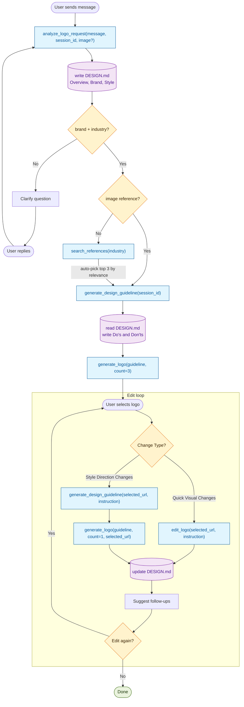
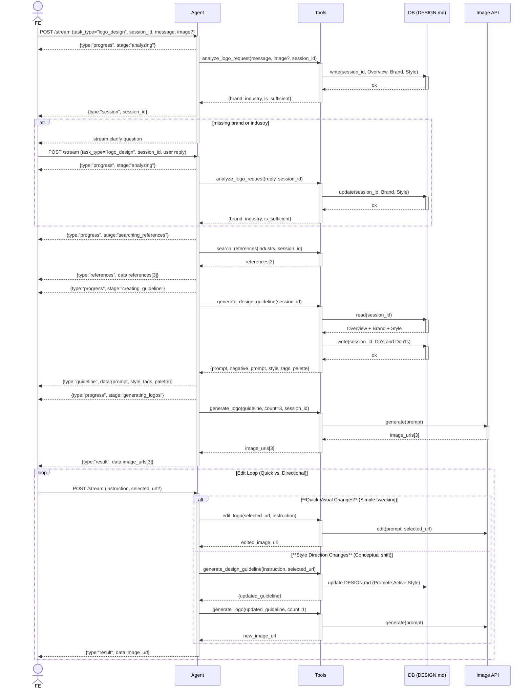

# Logo Design AI — Technical Design

## 1. Overview

### 1.1 Objective
Build a simplified logo generation and editing backend for a **POC** using the **Agents SDK**. The system uses a lean **Agent + Tools** pattern where an LLM-based Agent acts as the coordinator, determining the execution path based on user input and conversation state.

---

## 2. User Journey (The Pipeline)

The system follows a chronological journey from brand discovery to final asset delivery.

| Phase | Journey Step | System Action | Output |
|:---|:---|:---|:---|
| **1. Briefing** | User defines brand (Text + Image) | **Analyze**: Extracts Name, Industry, and Tone. Asks clarification if essential info is missing. | Validated Brand Identity |
| **2. Research** | AI looks for inspirations | **Search**: Visual reference lookup based on industry (skip if user provided images). | 3 Ref. Images |
| **3. Logic** | AI analyzes research + intent | **Synthesize**: Writes `DESIGN.md` with a Core DNA and 3 "Directional Variants". | Design Artifact |
| **4. Creative** | System renders initial concepts | **Generate**: Produces 3 high-quality logos (1 per direction). | 3 Initial Logos |
| **5. Refine** | User picks one & iterates | **Iterate**: <br>- **Quick Visual Changes**: Direct image edit.<br>- **Style Direction Changes**: Updates guideline then regenerates. | Refined Final Logo |

---

## 3. Scope & Metrics

### 3.1 Scope (In vs. Out)

| Area | In-Scope (POC) | Out-of-Scope |
|:---|:---|:---|
| **Analysis** | Consolidated `analyze_logo_request` tool | Multi-domain intent routing |
| **Research** | `search_references` via Search API | Automated inspiration gallery |
| **Format** | `DESIGN.md` (Markdown per session) | DB-driven state management |
| **Logic** | **Agents SDK (Turn-based logic)** | Complex Orchestration engines |

### 3.2 Success Metrics
- **Extraction Accuracy**: >= 90% success rate for `brand_name` + `industry`.
- **Generation Speed**: End-to-end full flow (Steps 1-4) under 40s.
- **Iteration Speed**: Quick visual tweak turnaround under 15s.

### 3.3 Technical Constraints & Stack
- **Framework**: Agents SDK (built on `openai-agents`).
- **State**: Persistent Markdown-based artifact (`DESIGN.md`).
- **Architecture**: Dynamic Agent-Tool Loop.

---

## 4. System Architecture

### 4.1 Overview (The Big Picture)

Logo design is inherently **iterative and non-linear**. Static pipelines often fail when a user wants to jump back to research or refine a concept based on new inspiration.

**Why the Agents SDK?**
- **Dynamic Planning**: Instead of a hard-coded path, the Agent (The Brain) evaluates every turn. It decides whether to search, synthesize, or edit based on the current context.
- **Optimized Execution (Bifurcation)**: We can differentiate between **Quick Visual Changes** (Direct edit) and **Style Direction Changes** (Full regeneration). This significantly reduces latency and cost for 80% of common edits.
- **Transparent Memory**: By using `DESIGN.md` as a living document, both the human and the AI align on the design's "soul" in real-time.

#### 4.1.1 Diagram — Full flow (flowchart)




#### 3.1.2 Diagram — Sequence diagram



### 3.2 Architecture principles

1. **Agent-Centric Coordination**: The Agent serves as the "brain" (Agents SDK compatible), using conversation context and tool outputs to decide the next action. This simplifies the orchestration for the POC.
2. **Tool Atomicity**: Logic is concentrated in 5 atomic tools. For example, `analyze_logo_request` is a multi-extraction tool that handles both text and visual inputs.
3. **State as Markdown**: The "Design Context" is treated as a living Markdown document. This maximizes readability for both the Agent (LLM) and the User.

#### 3.2.1 Design Artifact Store (Design Context Manager)

The Design Context is the "living memory" of the logo's identity. For the POC, we must choose a storage strategy that balances **UI flexibility** (allowing users to edit the file directly) with **machine precision** (allowing tools to read/update specific fields).

##### Selection Guide: Storage Strategy Benchmark

| Strategy | **FE UI** | BE Format | Mapping Logic | Pros | Cons | Recommendation |
|:---|:---|:---|:---|:---|:---|:---|
| **#1 Logic Driven**| **Markdown** | Markdown | Regex / Split | Simple code; Zero overhead; Fast. | Fragile for multi-step logic. | Good for R&D |
| **#2 LLM-Sync** | **Markdown** | JSON | LLM-assisted | Smart; Understands user's intent even if headers change. | Higher cost/latency. | Good for alpha |
| **#3 Hybrid (Locked)**| **Markdown** | **JSON** | **Static Logic** | **Deterministic**; UI stays as .md; Safe for production logic. | User must keep headers intact. | **POC Choice** |

> [!NOTE]
> **User Requirement**: Regardless of the BE strategy, the **UI must remain a DESIGN.md file** to allow users to edit brand context as a natural document.

##### Robust "No-LLM" Sync Logic (Strategy #4)

To keep the system fast and deterministic without extra LLM calls for storage, we use **Section-Locked Logic**:

1.  **Fixed Headers**: The system expects fixed headers (e.g., `## Brand Identity`, `## Visual Style`).
2.  **Logic-based Extraction**:
    -   BE splits the `.md` file by `##` markers.
    -   Regex or String matching maps the text under `## Tone` to the `tone` field in the JSON database.
3.  **UI Feedback**: If a user deletes a required header, the UI/BE can throw a validation error or auto-regenerate the missing section with a placeholder.
4.  **Auto-Fill (LLM)**: An LLM is **only** used to suggest values for empty fields (e.g., suggesting a 1024-px symbol description if the user left it blank), not for the basic act of saving/reading.

##### Summary of Logic Flow (Strategy #4)

1.  **Update Trigger**: Every tool execution (Step 1-5) pushes a JSON update to the DB, which then triggers an auto-generation of the `DESIGN.md` for the FE.
2.  **Manual Edit Sync**: When a user saves the `.md` file, the BE parses the content using section-locked headers. 
3.  **Compaction & Promotion**:
    -   While exploring, **Directional Variants** are preserved.
    -   Upon selection of a logo, the chosen direction is **promoted** to the `## Visual Style` section, and others are moved to a `## Concept History` archive.

---

##### Design Context Template (Optimized)

```markdown
## Overview
[General description of the design intent]

## Brand Identity
- **Name**: [Mandatory]
- **Industry**: [Mandatory]
- **Target Audience**: [Optional - AI will fill based on industry if blank]
- **Tone**: [Core vibes, e.g., Professional, Playful]

## Visual Style (Active)
- **Direction**: [e.g., Minimalist, Retro, 3D]
- **Logo Type**: [Icon only, Wordmark, Combination]
- **Color Palette**: [Hex codes or names]
- **Typography**: [Font family, weight, style]

## Directional Variants (Initial Exploration)
- **Direction 1 [Selected Variant Name]**: [Visual details for Concept 1]
- **Direction 2 [Selected Variant Name]**: [Visual details for Concept 2]
- **Direction 3 [Selected Variant Name]**: [Visual details for Concept 3]

## Symbol & Concepts
- **Core Symbol**: [Specific icon requirements, e.g., "A rising sun"]
- **Positioning**: [Icon on top, Icon on left, etc.]

## Do's and Don'ts
- [Do include specific elements]
- [Don't use specific styles]
```

#### 3.2.2 Concept Exploration & Selection

To provide variety during the initial generation, the system explores multiple directions simultaneously while maintaining a single core brand identity.

**The Selection Life Cycle:**

1.  **Exploration Phase**:
    -   `generate_design_guideline` analyzes references and writes 3 unique directions into the `## Directional Variants` section.
    -   `generate_logo` creates 3 images, each linked to a specific Direction (stored in JSON metadata).
2.  **Selection Phase**:
    -   User selects a favorite logo to refine.
    -   The Agent **Promotes** that logo's Direction context to the `## Visual Style (Active)` section.
3.  **Compaction Phase**:
    -   The rejected directions are moved to a `## Concept History` archive at the bottom of the file.
    -   This prevents the Agent's context window from getting cluttered with irrelevant concepts, ensuring high-fidelity edits.

### 3.3 Component breakdown

#### 3.3.1 Agent Layer (The Brain)

The Agent is initialized using the **Agents SDK**. Success depends on a robust **Instruction Strategy**.

##### Instruction Strategy (OpenAI Agents Standard)

| Principle | Implementation |
|:---|:---|
| **Persona** | Define the Agent as a "Senior Brand Identity Designer & Planner". |
| **Goal-Oriented** | "Your primary goal is to maintain a high-quality `DESIGN.md` and produce logos that strictly adhere to it." |
| **Step-by-Step Logic** | Explicitly define the priority: 1. Analyze -> 2. Clarify (if needed) -> 3. Research -> 4. Guideline Sync -> 5. Generate -> 6. Edit Loop. |
| **State-Awareness** | Instruction: "Always read the tool output carefully to see if `DESIGN.md` is updated before calling the next tool." |
| **Tool Constraint** | "Do not call `generate_logo` until `brand_name` and `industry` are confirmed and `generate_design_guideline` has been executed." |
| **Semantic Tooling** | Use high-fidelity **Function Docstrings**. The Agent relies on these for discovery. Tool names must be action-oriented (e.g., `analyze_logo_request` vs. `analyzer`). |
| **Turn Guardrails** | "After each tool call, summarize the progress to the user and wait for feedback before proceeding to visual generation." |
2. **Tools Layer**:
    - `analyze_logo_request`: Multi-extract text + images.
    - `search_references`: Inspiration fetcher.
    - `generate_design_guideline`: Context merger & instruction writer.
    - `generate_logo`: Visual producer.
    - `edit_logo`: Targeted modification loop.

### 3.4 Execution Pipeline

The execution follow a turn-based loop:
1. **Analyze**: Initial extraction and image assessment.
2. **Clarification (Optional)**: If mandatory fields are missing.
3. **Research & Guidelines**: Fetching visual references and synthesizing the Design Context.
4. **Generation**: Final visual output.
5. **Editing**: Continuous loop based on user feedback, updating the Design Context to ensure style consistency.
alled | Image Edit API | LLM (guideline) + Image Generation API |
| DESIGN.md | Update Style section if changed | Update Do's and Don'ts section |
| Output | Single edited image | Single regenerated image |

#### 3.4.4 Stream status progression

Generate flow:
```
analyzing → [clarification_needed → analyzing] → searching_references → creating_guideline → generating_logos → completed
```

Edit flow (image edit):
```
editing_logo → completed
```

Edit flow (style change / regeneration):
```
updating_guideline → generating_logos → completed
```


---

## 4. Image Editing Phase (Step 7)

### 4.1 Phase objective

- Enable controlled edits on generated logos.
- Prioritize region accuracy, output consistency, and response speed.
- Capture measurable metrics for latency, cost, quality, and user satisfaction.

### 4.2 Three editing cases

| Case | Purpose | Frontend Input | Backend Handling | Output | Key Risks |
|:---|:---|:---|:---|:---|:---|
| Case 1: FE Mask + BE Inpainting | Precise local edit with clear protected area | Source image + Binary mask (white=edit, black=keep) + Prompt | Inpainting model edits white region, preserves black region, blends edges | Edited image + trace metadata | Wrong mask quality, boundary artifacts |
| Case 2: Minimal Edit (No Mask) | Fast editing with lowest UI complexity | Source image + Prompt only | Edit/generation model receives image+prompt; no hard mask constraint | Edited image + trace metadata | Over-editing outside target area |
| Case 3: Crop-guided Edit | Keep FE simple while still using mask constraints | Source image + Bounding-box crop image + Prompt | BE runs segmenter on source+crop to create mask, then inpainting | Edited image + generated mask + trace metadata | Crop too loose/tight, mask derivation errors |

### 4.3 Case details

#### 4.3.1 Case 1 — FE Mask + BE Inpainting

**Step 1: Frontend (Data Initialization)**
1. User clicks a detail on the generated logo.
2. FE runs a segmentation model (e.g., SAM) in browser and creates `Mask_Image` (white = edit region, black = keep region).
3. FE setup: load segmentation ONNX weights (lazy-load on first click), inference via WebAssembly/WebGPU.
4. User enters edit instruction (e.g., "Turn this shape into a fire dragon").
5. FE calls `POST /edit` with: `Original_Image`, `Mask_Image`, `Raw_Prompt`.

**Step 2: Backend (Inpainting Execution)**
1. BE calls an Image Edit / Inpainting API with `image`, `mask`, `prompt`.
2. Model behavior: keep 100% of black-mask pixels, regenerate white-mask region, auto-blend boundaries.

#### 4.3.2 Case 2 — Minimal Edit (1 image + 1 prompt)

**Step 1: Frontend**
1. FE sends only `Original_Image` and `Raw_Prompt`.

**Step 2: Backend**
1. BE calls Image Edit API with image+prompt.
2. Model understands prompt semantically; internal attention acts as implicit mask.
3. BE injects preservation instruction (keep layout/style where possible).
4. Return edited image and trace metadata.

#### 4.3.3 Case 3 — Source + Crop + Prompt (Mask generated in BE)

**Step 1: Frontend**
1. FE sends: `Original_Image`, `Crop_Image` (bounding-box crop of target region), `Raw_Prompt`.

**Step 2: Backend**
1. Locate crop region against original image.
2. Run segmentation model (e.g., SAM or another segmenter) in backend to convert crop into binary mask.
3. Run inpainting with `Original_Image` + generated mask + `Raw_Prompt`.
4. Return edited image, optional debug mask, and trace metadata.

### 4.4 Edit tool integration

The `edit_logo` tool (see Section 3.3.2 and Section 6.1) handles all three cases via auto-detection:

- `mask_image` present → Case 1 (FE mask + BE inpainting)
- `crop_image` present → Case 3 (crop-guided edit with BE-generated mask)
- Neither → Case 2 (prompt-only edit)

For schema details, see `EditLogoInput` / `EditLogoOutput` in Section 6.1.

---

## 5. Models & API Benchmark

This section lists **all configurable external providers** used across the pipeline. Specific provider selection is a PO decision based on benchmark results below. The backend is provider-agnostic — any listed option can be swapped via configuration.

### 5.1 Text / Multimodal LLM (used in Step 1–3)

Used by: `analyze_logo_request`, `generate_design_guideline`, Agent (Agents SDK).

| Name | Pricing | Avg Cost / 1K tokens | Avg Latency | Recommended Use Case | Note |
|:---|:---|:---|:---|:---|:---|
| google/gemini-2.5-flash | $0.15/1M input, $0.60/1M output | ~$0.0006 (output) | ~1–3s | Fast text reasoning, planning, extraction | Low cost, good for high-throughput |
| google/gemini-2.5-pro | $1.25/1M input, $10/1M output | ~$0.01 (output) | ~3–8s | Complex reasoning, guideline generation | Higher quality, higher cost |
| openai/gpt-4.1 | $2/1M input, $8/1M output | ~$0.008 (output) | ~2–6s | General-purpose text reasoning | Strong instruction following |
| openai/gpt-4.1-mini | $0.40/1M input, $1.60/1M output | ~$0.0016 (output) | ~1–3s | Cost-effective text tasks | Good balance of quality and cost |
| openai/gpt-4.1-nano | $0.10/1M input, $0.40/1M output | ~$0.0004 (output) | ~0.5–2s | Ultra-low-cost, simple extraction | Fastest, cheapest |
| anthropic/claude-sonnet-4 | $3/1M input, $15/1M output | ~$0.015 (output) | ~3–8s | Complex analysis, nuanced reasoning | Strong at structured output |

### 5.2 Image Search API (used in Step 2)

Used by: `search_references`.

| Name | Pricing | Avg Cost / request | Rate Limit | Coverage | Note |
|:---|:---|:---|:---|:---|:---|
| SerpAPI — Google Images | $50/5K searches (paid plan) | ~$0.01/search | 100/month (free), 5K/month (paid) | Google Image index | Most comprehensive coverage, structured metadata |
| SerpAPI — Bing Images | $50/5K searches (paid plan) | ~$0.01/search | Same as above | Bing Image index | Alternative index, good for diversity |
| Pinterest API | Free (with developer access) | Free | Rate-limited per app | Pinterest visual content | Strong for design/aesthetic references; limited to Pinterest content |

### 5.3 Image Generation API (used in Step 4)

Used by: `generate_logo`.

| Name | Pricing | Avg Cost | Avg Latency | Recommended Use Case | Note |
|:---|:---|:---|:---|:---|:---|
| google/gemini-2.5-flash-image | $30/1M output tokens; ~1,290 tokens/1024px (~$0.039/image) | $0.039 (1024px) | ~6s | Low-cost bulk generation, rapid prototyping | Free tier exists with rate limits |
| google/gemini-3.1-flash-image-preview | ~$0.045–$0.151/image; 1024px ~$0.067 | $0.067 (1024px) | 23–56s (avg ~37.6s) | High-quality premium generation | Preview-phase variability |
| google/gemini-3-pro-image-preview | ~$0.02–$0.08/image | ~$0.05 | 3–12s | Professional-grade, stronger text rendering | Supports up to 4K-class outputs |
| openai/gpt-image-1 | Low $0.011, Medium $0.042, High $0.167 | $0.042 (medium) | ~45–50s | General-purpose generation | Token-based billing in some modes |
| openai/gpt-image-1.5 | Low $0.009–$0.052, Medium $0.034–$0.051, High $0.133–$0.200 | $0.034 (medium) | 15–45s | Premium generation, stronger prompt adherence | Faster than gpt-image-1 |

### 5.4 Image Edit API (used in Step 5)

Used by: `edit_logo`.

| Name | Pricing | Avg Cost | Avg Latency | Latency vs Output Token | Recommended Use Case | Case Fit | Note |
|:---|:---|:---|:---|:---|:---|:---|:---|
| google/gemini-2.5-flash-image | $30/1M output tokens; ~$0.039/image | $0.039 (1024px) | ~6s | Positive — grows with token count | Low-cost prompt-only editing, rapid iteration | Case 2 | Free tier exists with rate limits |
| google/gemini-3.1-flash-image-preview | ~$0.045–$0.151/image | $0.067 (1024px) | 23–56s (avg ~37.6s) | Weak/unclear correlation | High-quality premium editing | Case 2 | Preview-phase variability |
| google/gemini-3-pro-image-preview | ~$0.02–$0.08/image | ~$0.05 | 3–12s | Increases with resolution | Professional-grade editing, text rendering | Case 2 | Supports up to 4K-class outputs |
| openai/gpt-image-1 | Low $0.011, Medium $0.042, High $0.167 | $0.042 (medium) | ~45–50s | Higher quality tiers increase latency | General-purpose editing | Case 2 | Token-based billing in some modes |
| openai/gpt-image-1.5 | Low $0.009–$0.052, Medium $0.034–$0.051, High $0.133–$0.200 | $0.034 (medium) | 15–45s | Increases with quality tier | Premium marketing edits, prompt adherence | Case 2 | Faster than gpt-image-1 |
| black-forest-labs/flux-fill-pro | Fixed ~$0.05/exec | $0.05 | ~9s | Minimal — fixed-size inpainting | Inpainting, local replacement, content-aware fill | **Case 1, Case 3** | Good for production edit pipelines |
| black-forest-labs/flux-kontext-pro | ~$0.04/image | $0.04 | ~7s | Low sensitivity | Fast iterative editing with content preservation | Case 2, Case 3 | Good trade-off for interactive tools |
| black-forest-labs/flux-kontext-max | ~$0.08/image (premium) | $0.08 | N/A | N/A | Highest-fidelity editing, final-asset polishing | Case 2, Case 3 | Premium tier for quality |
| black-forest-labs/flux-kontext-dev | ~$0.025/image | $0.025 | N/A | N/A | Development, experimentation, low-cost testing | Case 2 (R&D), Case 3 (R&D) | Often non-commercial license |
| prunaai/flux-kontext-fast | ~$0.005/image | $0.005 | Sub-second to few seconds | Scales with resolution/steps | Real-time creative apps, low-latency web | Case 2 | Very cost-effective for prototyping |
| black-forest-labs/flux-2-flex | ~$0.06/image | $0.06 | ~13s | Scales with diffusion steps | Balanced quality/speed for production | Case 2, Case 3 | Tunable quality-speed trade-off |
| black-forest-labs/flux-2-dev | ~$0.025/image | $0.025 | N/A | N/A | Open-weight experimentation | Case 2 (R&D), Case 3 (R&D) | Self-host option possible |

### 5.5 Recommended provider selection (for PO review)

> These are starting-point recommendations. Final selection should be made by PO after benchmark validation.

| Pipeline Stage | Recommended Primary | Recommended Fallback | Rationale |
|:---|:---|:---|:---|
| Text / Multimodal LLM (Step 1–5) | To be benchmarked | To be benchmarked | Depends on quality/cost/latency trade-off per step |
| Image Search (Step 4) | To be benchmarked | To be benchmarked | Depends on coverage and rate limit requirements |
| Image Generation (Step 6) | To be benchmarked | To be benchmarked | Depends on logo quality and cost budget |
| Image Edit — Case 1 (FE Mask) | To be benchmarked | To be benchmarked | Must support mask-based inpainting |
| Image Edit — Case 2 (Minimal) | To be benchmarked | To be benchmarked | Best cost/latency ratio for prompt-only editing |
| Image Edit — Case 3 (Crop-guided) | To be benchmarked | To be benchmarked | Strong content preservation with backend mask generation |

### 5.6 Benchmark template

#### Dataset

| ID | Benchmark Result |
|:---|:---|
| 1 |  |

**Testcase:**

**Testcase explanation**

**Input**

| Input |  |
|:---|:---|
| Model / API |  |
| Output |  |

**Result**

| Result |  |
|:---|:---|
|  |  |

| ID | Benchmark Result |
|:---|:---|
| 2 |  |

**Testcase:**

**Testcase explanation**

**Input**

| Text Input |  |
|:---|:---|
| Image Input |  |
| Model / API |  |
| Output |  |

**Result**

| Result |  |
|:---|:---|
|  |  |

#### Benchmark notes
- Use the same source image set across all models for Image Edit benchmarks.
- Record prompt, resolution, latency, cost, and user feedback for each run.
- For Case 1, validate black-region preservation and white-region edit fidelity.
- For Case 3, store crop alignment diagnostics and backend-generated mask path.
- For Case 2, track layout drift and over-edit frequency due to implicit masking behavior.
- When a model is listed as Case 2 only, avoid using it for strict masked inpainting.
- For Text/Multimodal LLM benchmarks, measure extraction accuracy, structured output compliance, and latency.
- For Image Search API benchmarks, measure result relevance, fetchable image ratio, and rate limit headroom.

---

## 6. Data Schema and API Integration

### 6.1 Pydantic models

```python
# --- Tool IO (5 tools) ---

### 6.1 Pydantic models

```python
# --- Tool IO (5 tools) ---

# analyze_logo_request (Step 1)
class AnalyzeLogoRequestInput(BaseModel):
    message: str
    session_id: str
    images: list[str] = []              # URLs or base64

class AnalyzeLogoRequestOutput(BaseModel):
    # Core (Mandatory for next phase)
    brand_name: str | None = None
    industry: str | None = None
    
    # Visuals (Optional - extracted from user input)
    style_direction: str | None = None
    color_preference: str | None = None
    symbol_preference: str | None = None
    typography_direction: str | None = None
    concept_direction: str | None = None
    tone: str | None = None
    
    # State
    is_sufficient: bool
    missing_fields: list[str] = []
    clarification_question: str | None = None

# search_references (Step 2)
class SearchReferencesInput(BaseModel):
    industry: str
    session_id: str

class SearchReferencesOutput(BaseModel):
    references: list[dict] = []         # [{url, title, relevance_score}]

# generate_design_guideline (Step 3)
class GenerateGuidelineInput(BaseModel):
    session_id: str
    references: list[dict] = []         # Optional enrichment
    user_markdown_edit: str | None = None # Full MD from FE if user manually edited

class GenerateGuidelineOutput(BaseModel):
    # Metadata for generation
    prompt: str
    negative_prompt: str
    
    # 3 Distinct Concepts (Active during Exploration Phase)
    concept_variants: list[dict] = []     # [{id: "dir_1", name: "Minimalist", details: "..."}]
    
    # Visual state (Promoted Active Direction)
    style_tags: list[str] = []
    palette: list[str] = []
    typography_details: str | None = None
    
    # Documentation
    updated_markdown: str                # Full MD to be synced to FE

# generate_logo (Step 4)
class GenerateLogoInput(BaseModel):
    session_id: str
    guidelines: dict = {}               # From GenerateGuidelineOutput
    selected_direction_id: str | None = None # For count=1 edits
    count: int = 3                      # [1, 4]

class GenerateLogoOutput(BaseModel):
    image_urls: list[str] = []
    generation_metadata: dict = {}

# edit_logo (Step 5)
class EditLogoInput(BaseModel):
    image_url: str
    instruction: str
    session_id: str
    mask_image: str | None = None       # Case 1: base64 or URL
    crop_image: str | None = None       # Case 3: base64 or URL

class EditLogoOutput(BaseModel):
    edited_image_url: str
    editing_case: str                   # "case_1", "case_2", "case_3"
    updated_markdown: str | None = None # Updated MD if style changed
    suggestions: list[str] = []
```
```

### 6.2 Tool input/output schemas

Tool functions use the Agents SDK convention — Python functions with type-annotated parameters that are auto-converted to tool schemas.

```python
from agents import function_tool

@function_tool
async def analyze_logo_request(
    message: str,
    session_id: str,
    images: list[str] | None = None,
) -> AnalyzeLogoRequestOutput:
    """Extract brand context from user message and optional reference images.
    Validates required fields (brand_name, industry).
    Writes Overview, Brand, Style sections to DESIGN.md."""
    ...

@function_tool
async def search_references(
    industry: str,
    session_id: str,
) -> SearchReferencesOutput:
    """Search visual design references via Image Search API based on industry.
    Returns top 3 results by relevance."""
    ...

@function_tool
async def generate_design_guideline(
    session_id: str,
    references: list[dict] | None = None,
) -> GenerateGuidelineOutput:
    """Read DESIGN.md context, generate design guidelines.
    Writes Do's and Don'ts section to DESIGN.md."""
    ...

@function_tool
async def generate_logo(
    session_id: str,
    guidelines: dict | None = None,
    count: int = 3,
) -> GenerateLogoOutput:
    """Generate logo images from design guidelines via Image Generation API."""
    ...

@function_tool
async def edit_logo(
    image_url: str,
    instruction: str,
    session_id: str,
    mask_image: str | None = None,
    crop_image: str | None = None,
) -> EditLogoOutput:
    """Edit an existing logo image. Auto-detects editing case:
    mask → Case 1, crop → Case 3, neither → Case 2.
    Updates DESIGN.md if style changed."""
    ...
```

### 6.3 Validation and Sync Rules

| Rule Category | Description |
|:---|:---|
| **Mandatory Fields** | `brand_name` and `industry` MUST be defined before moving to Guideline phase. |
| **Optional Auto-Fill** | `Color`, `Symbol`, `Typography`, and `Concept` are optional. If the user does not provide them, the `generate_design_guideline` tool will **auto-fill** them based on the analyzed tone and industry. |
| **FE-to-BE Sync** | If a user edits the Markdown on the FE, the `user_markdown_edit` field in `GenerateGuidelineInput` is populated. The BE takes this Markdown as the **new gold standard**, parsing it into the internal state. |
| **LLM Precedence** | User-provided specific requirements (e.g., "I want blue") always override the LLM's auto-suggestions. |
| **Compaction Rule** | The design state is "compacted" into a single Markdown block. Previous experimental branches are saved as snapshots for version recovery but are not part of the active context window. |
| **Versioning** | Every success of `generate_logo` or `edit_logo` increments the version (e.g., V1, V2). User can revert to any prior V via the FE. |

### 6.4 Endpoint mapping

```
POST /stream (task_type="logo_design")
  → Generate flow: analyze → [clarification] → search → guideline → generate
  → Edit flow (image edit): edit_logo (with selected_url + instruction + optional mask/crop)
  → Edit flow (regeneration): guideline → generate (with updated style)
```

Stream status progression — see Section 3.4.4.

### 6.5 Configuration

```python
class LogoDesignSettings(BaseSettings):
    # Agent
    agent_model: str = "gpt-4.1"              # Agents SDK model
    agent_api_key: str | None = None

    # Text/Multimodal LLM (for tools)
    text_llm_model: str = "gemini-2.5-flash"  # configurable text model
    google_api_key: str | None = None

    # Limits
    max_clarification_rounds: int = 2
    tool_timeout_seconds: float = 90.0
    default_logo_count: int = 3

    # Storage
    assets_base_dir: str = "generated-assets"
```

---

## 7. Risks and open issues

### 7.1 Latency

**Risk:** Web research + multimodal analysis can increase p95 latency for the generate flow.

**Mitigation:**
- Bounded query policy and fetchable-image filtering.
- Parallel guideline inference (`asyncio.gather`) as future optimization.
- Agent can skip search when user provides sufficient reference images.

### 7.2 Provider reliability

**Risk:** Provider internal errors, media fetch restrictions, or API unavailability.

**Mitigation:**
- Tool-level retry logic (configurable attempts).
- Timeout per tool call (configurable `tool_timeout_seconds`).
- Agent propagates explicit error messages to the user.
- Model fallback strategy per editing case (see Section 5.5).

### 7.3 Clarification loop quality

**Risk:** Ambiguous inputs can trigger repeated clarification turns.

**Mitigation:**
- Max clarification rounds enforced by agent instructions (`max_clarification_rounds = 2`).
- Targeted clarification questions generated by `analyze_logo_request` tool.
- DESIGN.md preserves context across clarification turns.

### 7.4 Edit quality

**Risk:** Over-editing outside target area (Case 2), mask quality issues (Case 1), crop-to-mask conversion errors (Case 3).

**Mitigation:**
- Model selection strategy per case (see Section 5.5).
- Preservation instruction injection for Case 2.
- Segmentation-based mask validation for Case 3.
- Trace metadata capture for quality diagnostics.

### 7.5 Agent tool-calling reliability

**Risk:** LLM agent may call tools in wrong order, skip required tools, or misinterpret edit instructions as style changes (or vice versa).

**Mitigation:**
- Detailed system instructions with explicit workflow steps and decision criteria.
- Agents SDK `output_guardrail` for validating agent responses.
- Tool-level input validation (Pydantic models reject invalid inputs).
- Logging and tracing of all tool calls for debugging.
- Future: Add explicit FE edit-mode selection to remove ambiguity.

### 7.6 Design Artifact Store

**Risk:** File-based `DESIGN.md` does not survive process restarts for conversation context; file parsing relies on section-header convention.

**Mitigation:**
- File artifacts persist on disk (survive restarts); conversation context is separate.
- Clear section-header parsing contract (`## Heading` convention).
- Validation of parsed sections before use.
- Migration path to JSON/DB storage documented in Section 3.2.1.

### 7.7 Open technical decisions

- Segmentation model deployment strategy for Case 1 (FE ONNX) and Case 3 (BE inference).
- Default provider selection for each pipeline stage (PO decision after benchmarks).
- Multi-candidate ranking before edit output.
- Acceptable cost/request threshold for editing.
- Session conversation persistence strategy (current in-memory → Redis/DB).
- DESIGN.md migration plan (current file-based → JSON/DB, see Section 3.2.1).
- Production BFF transport controls and stream resilience policy.
- Queue/service decoupling roadmap for heavy generation nodes.
- Cost tracking/reporting by task_id and session_id.
- Asset URL TTL and retention policies.
- Whether mask should be mandatory for small or dense typography edits.
- Explicit FE edit-mode selection (image edit vs. style change) to reduce agent ambiguity.

---

## 8. Rollout recommendation

- **Phase 1:** Ship generate flow + Case 2 (image+prompt) editing to collect fast feedback.
- **Phase 2:** Add Case 1 mask-assisted inpainting for high-precision edits.
- **Phase 3:** Add Case 3 crop-to-mask conversion and model auto-routing.
- **Phase 4:** Optimize multi-candidate ranking, cost analytics, and production infrastructure.

---

## 9. References

### 9.1 Source code

| Module | Path |
|:---|:---|
| Package root | `source_v2/__init__.py` |
| Configuration | `source_v2/config.py` |
| README | `source_v2/README.md` |

**Agent:**

| File | Purpose |
|:---|:---|
| `source_v2/agents/logo_design_agent.py` | `LogoDesignAgent` — Agents SDK agent with 5 tools |

**Tools:**

| File | Purpose |
|:---|:---|
| `source_v2/tools/analyze_logo_request.py` | Extract brand context + validate required fields (Step 1) |
| `source_v2/tools/search_references.py` | Search visual references via Image Search API (Step 2) |
| `source_v2/tools/generate_design_guideline.py` | Generate design guidelines, write DESIGN.md (Step 3) |
| `source_v2/tools/generate_logo.py` | Generate logo images via Image Generation API (Step 4) |
| `source_v2/tools/edit_logo.py` | Edit existing logo (Case 1/2/3), update DESIGN.md (Step 5) |

**Schemas:**

| File | Purpose |
|:---|:---|
| `source_v2/schemas/tool_io.py` | Tool input/output Pydantic models |
| `source_v2/schemas/design_md.py` | DESIGN.md parsing and section management utilities |

### 9.2 Design references

- Image editing phase template: `image-editing-phase-template.en.md`
- Root SDK overview: `README.md`
