# System Design - High-Level Architecture

## Overview

This project implements a **chat assistant with session memory** that demonstrates two core capabilities:

1. **Session Memory via Summarization**: Automatically compresses conversation history when context exceeds 1,200 tokens
2. **Query Understanding & Disambiguation**: Detects ambiguous queries and asks clarifying questions

Built with LangGraph orchestration, Google Gemini LLM, and SQLite persistence.

## System Architecture Diagram


**Component Flow:**
1. **Streamlit UI** - User interface with real-time token counter showing "Context: X / 1200 tokens"
2. **Context Agent** - Loads unsummarized messages, counts tokens, checks threshold
3. **Summarizer Agent** - Compresses context when tokens > 1200, marks messages as summarized
4. **Ambiguity Resolver** - Detects unclear queries, generates interpretations
5. **Response Generator** - Creates final answer with conversation context
6. **Database** - Persists messages (with is_summarized flag) and summaries

## Component Responsibilities

### 1. Streamlit UI (`app.py`)

**Purpose**: User interface and presentation layer

**Key Features**:
- Chat interface with message history
- Real-time token counter showing `Context: X / 1200 tokens`
- Session management sidebar:
  - Create new conversations (🆕 New)
  - Load existing sessions (click on conversation)
  - Export to JSONL (💾 Export in 3-dot menu)
  - Delete sessions (🗑️ Delete in 3-dot menu)
- Inline metadata display (expand message to see query analysis)
- Session summaries displayed at bottom when triggered

**Token Display Logic**:
```python
# Only count unsummarized messages
context_tokens = db.count_total_tokens(
    session_id=session_id,
    exclude_summarized=True
)
st.metric("Context", f"{context_tokens} / 1200 tokens")
```

### 2. LangGraph Workflow (`graph.py`)

**Purpose**: Orchestrates agent execution flow

**Workflow Graph**:
```python
# Simplified view
START → Context Agent
       ↓
       ├─ if needs_summarization → Summarizer Agent
       │
       └─ else → Ambiguity Resolver Agent
                 ↓
                 Response Generator Agent
                 ↓
                 END (save to DB)
```

## Conditional Routing**:
- If `context_tokens > 1200`: Route to Summarizer
- After summarization: Continue to Query Agent (context already reset)
- Normal flow: Context → (optional Summarizer) → Query Agent → Response


### 3. Agents (`agents.py`)

Collection of 4 specialized agents, each with specific responsibility:

#### 3.1 Context Agent

**Purpose**: Load conversation history and check token limits

**Logic**:
```python
def context_agent(state):
    # 1. Load unsummarized messages
    messages = db.get_messages(
        session_id=session_id,
        exclude_summarized=True  # Only active messages
    )
    
    # 2. Load summaries
    summaries = db.get_summaries(session_id)
    
    # 3. Count tokens
    context_tokens = sum(msg.token_count for msg in messages)
    summary_tokens = sum(count_tokens(s) for s in summaries)
    total_tokens = context_tokens + summary_tokens
    
    # 4. Check threshold
    if total_tokens > 1200:
        return {**state, "needs_summarization": True}
    
    return {**state, "needs_summarization": False}
```

**Key Point**: Uses `exclude_summarized=True` to only count active context

#### 3.2 Summarizer Agent

**Purpose**: Compress old messages when threshold exceeded

**Process**:
1. Receive all unsummarized messages
2. Generate structured summary via LLM:
   - User profile (preferences, constraints)
   - Key facts from conversation
   - Decisions made
   - Open questions
   - Pending todos
3. **Calculate absolute indices** in database (not relative to list!)
4. Save summary to `session_summaries` table
5. **Mark messages as `is_summarized=1`** (critical!)

**Index Calculation** (critical logic):
```python
# Get ALL messages (including already summarized)
all_messages = db.get_messages(session_id, exclude_summarized=False)
total_in_db = len(all_messages)
unsummarized_count = len(messages)  # Current batch

# Calculate absolute position in DB
from_index = total_in_db - unsummarized_count
to_index = total_in_db - 1

# Example:
# - Total messages in DB: 20
# - Unsummarized: 12 messages (messages 8-19)
# - from_index = 20 - 12 = 8 ✅
# - to_index = 20 - 1 = 19 ✅
```

**Why Absolute Indices Matter**:
- Bug: Using `from_index=0, to_index=len(messages)-1` marks wrong messages
- Correct: Calculate position from total DB state
- Result: Proper message marking, context resets correctly

#### 3.3 Ambiguity Resolver Agent

**Purpose**: Detect and handle unclear queries (Feature 2)

**Analysis Output**:
```python
QueryUnderstanding(
    is_ambiguous: bool,  # True if query unclear
    rewritten_query: Optional[str],  # Clarified version
    possible_interpretations: List[str],  # 2-3 meanings
    needed_context_from_memory: List[str],  # What to recall
    clarifying_questions: List[str],  # Questions to ask
    final_augmented_context: str  # Enriched query
)
```

**Example** (from session_20260131_232650.jsonl):
```
User: "I need to find out who will leave"

Analysis:
  is_ambiguous: true
  possible_interpretations:
    - "Build a machine learning model to predict customer churn"
    - "Identify customers at risk based on predefined rules"
    - "Perform descriptive analysis of past churners"
  clarifying_questions:
    - "Do you have historical churn data?"
    - "Are you looking to build a predictive model?"
```

#### 3.4 Response Generator Agent

**Purpose**: Generate final response using augmented context

**Logic**:
- If query ambiguous: Present interpretations + ask clarifying questions
- If query clear: Direct answer using conversation history
- Always includes context from summaries when available

### 4. Database Layer (`database.py`)

**Purpose**: SQLite persistence and data management

#### Schema: `messages` table

```sql
CREATE TABLE messages (
    id INTEGER PRIMARY KEY AUTOINCREMENT,
    session_id TEXT NOT NULL,
    role TEXT NOT NULL,           -- 'user' or 'assistant'
    content TEXT NOT NULL,
    timestamp TEXT NOT NULL,
    token_count INTEGER NOT NULL,  -- Per-message count
    metadata TEXT,                 -- JSON: query_analysis
    is_summarized INTEGER DEFAULT 0  -- 0=active, 1=compressed
)
```

#### Schema: `session_summaries` table

```sql
CREATE TABLE session_summaries (
    id INTEGER PRIMARY KEY AUTOINCREMENT,
    session_id TEXT NOT NULL,
    summary TEXT NOT NULL,         -- JSON: SessionMemoryOutput
    timestamp TEXT NOT NULL,
    from_message_index INTEGER,    -- Start of range
    to_message_index INTEGER,      -- End of range
    created_at TEXT NOT NULL
)
```

#### Key Methods

```python
# Load messages (with optional filtering)
def get_messages(session_id, exclude_summarized=False):
    query = "SELECT * FROM messages WHERE session_id = ?"
    if exclude_summarized:
        query += " AND is_summarized = 0"  # Only active
    # Result: Only unsummarized messages returned

# Mark messages after summarization
def mark_messages_as_summarized(session_id, from_index, to_index):
    UPDATE messages SET is_summarized = 1
    WHERE session_id = ? AND id IN (
        SELECT id FROM messages
        WHERE session_id = ?
        ORDER BY timestamp ASC
        LIMIT ? OFFSET ?
    )
    # Result: Messages excluded from future context calculations

# Count active tokens
def count_total_tokens(session_id, exclude_summarized=True):
    SELECT SUM(token_count) FROM messages
    WHERE session_id = ?
    AND is_summarized = 0  -- Only unsummarized
```

### 5. Token Counting (`utils.py`)

**Purpose**: Calculate token counts for messages

**Implementation**:
```python
class TokenCounter:
    def __init__(self, model="gemini-2.5-flash"):
        self.encoding = tiktoken.get_encoding("cl100k_base")
    
    def count_tokens(self, text: str) -> int:
        return len(self.encoding.encode(text))
```

**Per-Message Token Count**:
```python
token_count = count_tokens(content) + count_tokens(role) + 4
# Example: "Hello" = 1 + 1 + 4 = 6 tokens
```

**Why +4?**: ChatML format overhead (message boundaries)

**Context Calculation**:
```python
# Active context (displayed in UI)
context_tokens = sum(
    msg.token_count 
    for msg in messages 
    if not msg.is_summarized
)

# Example:
# - Message 1-8: marked is_summarized=1 → NOT counted
# - Message 9-12: is_summarized=0 → counted
# - Total active context: sum(tokens from 9-12)
```

## Real Session Example

From `session_20260131_232650.jsonl`:


**Initial State** (Message 1-10):
```
Total messages: 10
Context tokens: ~600 (below threshold)
Summaries: 0
```

**After Message 10** (threshold exceeded):
```
Total messages: 10  
Context tokens: 1,220 (> 1200) ⚠️
Action: Trigger summarization
```

**After Summarization**:
```
Total messages: 10 (marked is_summarized=1)
Summary: 1 entry (~50-80 tokens)
Context tokens: ~80 ✅ (reset!)
New messages: 11-20
Active context: 80 (summary) + tokens from 11-20
```

**Second Summarization** (Message 20):
```
Context: 1,230 tokens (summary + messages 11-20)
Action: Trigger second summarization
Result: Summary 2 created, messages 11-20 marked
Context: ~160 tokens (2 summaries)
```

## Data Flow: Normal Query

```
1. User: "I have a dataset of 10k customers"
   ↓
2. Context Agent:
   - Load messages: 0 previous
   - Context: 23 tokens (current query)
   - should_summarize: False
   ↓
3. Ambiguity Resolver:
   - Analysis: Query is ambiguous
   - Interpretations: [
       "Build ML model",
       "Rule-based identification",
       "Descriptive analysis"
     ]
   - Clarifying questions generated
   ↓
4. Response Generator:
   - Presents 3 interpretations
   - Asks clarifying questions
   ↓
5. Save to Database:
   - User message: 23 tokens, is_summarized=0
   - Assistant message: 372 tokens, is_summarized=0
   - Total context: 395 tokens
```

## Data Flow: Summarization Triggered

```mermaid
sequenceDiagram
    participant U as User
    participant C as Context Agent
    participant S as Summarizer Agent
    participant D as Database
    participant A as Ambiguity Resolver
    participant R as Response Generator
    
    U->>C: "What is the next step?"
    Note over C: Load messages 1-9<br/>Total: 1,211 tokens > 1200
    C->>C: needs_summarization = True
    C->>S: Trigger summarization
    Note over S: Generate summary<br/>Calculate indices<br/>from_index=0, to_index=8
    S->>D: Save summary (~70 tokens)
    S->>D: Mark messages 0-8 as is_summarized=1
    S->>C: Retry context check
    Note over C: Load unsummarized: 0<br/>Load summaries: 1<br/>Total: 81 tokens ✅
    C->>A: Continue normal flow
    A->>R: Query analysis complete
    R->>D: Save response
    D->>U: Display response
```



```
1. User: "What is the next step?" (message #10)
   ↓
2. Context Agent (first call):
   - Load messages 1-9: 1,200 tokens
   - Current query: 11 tokens
   - Total: 1,211 tokens > 1200 ⚠️
   - should_summarize: True
   ↓
3. Summarizer Agent:
   - Receives messages 1-9
   - LLM generates structured summary
   - Calculates: from_index=0, to_index=8
   - Saves summary (~70 tokens)
   - Marks messages 0-8 as is_summarized=1
   ↓
4. Context Agent (retry):
   - Load messages: exclude_summarized=True
   - Result: 0 unsummarized messages (9 is current)
   - Load summaries: 1 summary (~70 tokens)
   - Total context: 70 + 11 = 81 tokens ✅
   - needs_summarization: False
   ↓
5. Normal flow continues:
   - Ambiguity Resolver
   - Response Generator
   - Save to DB (message 9-10)
```

## Technology Stack

| Component | Technology | Version | Purpose |
|-----------|-----------|---------|---------|
| Frontend | Streamlit | 1.31.0 | Interactive UI |
| Orchestration | LangGraph | Latest | Agent workflow |
| LLM | Google Gemini | 2.5-flash | Language model |
| Database | SQLite3 | Built-in | Persistence |
| Token Counter | tiktoken | Latest | Token counting |
| Validation | Pydantic | v2 | Data schemas |
| Language | Python | 3.10+ | Implementation |

## Configuration

**Environment Variables** (`.env`):
```bash
GOOGLE_API_KEY=your_key_here
MODEL_NAME=gemini-2.5-flash
TOKEN_THRESHOLD=1200  # Summarization trigger
```

**Why 1,200 tokens?**
- Balances context richness with response latency
- ~8-12 messages before summarization
- Gemini Flash handles this efficiently (~2-3s response time)
- After summary: Context resets to ~80 tokens (95% compression)

## Performance Characteristics

**Latency**:
- Normal query: ~2-3s (Gemini API call)
- Query with summarization: ~5-8s (one-time cost)
- After summarization: Back to ~2-3s

**Token Compression**:
- Input: ~1,200 tokens
- Output: ~80 tokens
- Compression ratio: 93-95%

**Cost** (Gemini 2.5 Flash):
- Per query (normal): ~$0.0009
- Per query (with summary): ~$0.0015
- After summarization: ~$0.0002 per query (80% savings)

## Error Handling

**Graceful Degradation**:
1. LLM returns invalid JSON → Use empty summary, mark messages anyway
2. LLM returns `null` for lists → Sanitize to `[]` before validation
3. Database error → Log and re-raise (don't mark messages if save fails)

**Example**:
```python
try:
    summary = json.loads(llm_response)
except JSONDecodeError:
    # Fallback: empty summary
    summary = SessionSummary(key_facts=[], decisions=[], ...)
    # Still mark messages to reset context
```

## Security & Data Safety

1. **API Keys**: Stored in `.env`, never committed to git
2. **SQL Injection**: All queries use parameterized statements
3. **Data Persistence**: Messages saved immediately (no in-memory state)
4. **Transaction Safety**: Summary save + message marking in same transaction

## Critical Bug Fixes Applied

### Bug #1: Missing `mark_messages_as_summarized()`
**Problem**: Method existed but was never called
**Impact**: Context never reset, cascading summaries
**Fix**: Added call after `save_summary()`

### Bug #2: Incorrect Index Calculation
**Problem**: Used relative indices from `messages` list
**Impact**: Only first summary worked, subsequent ones marked wrong range
**Fix**: Calculate absolute indices from total DB state

```python
# ❌ Before (broken):
from_index = 0
to_index = len(messages) - 1  # Relative to list!

# ✅ After (fixed):
all_messages = db.get_messages(session_id, exclude_summarized=False)
from_index = len(all_messages) - len(messages)  # Absolute position
to_index = len(all_messages) - 1
```

## Summary

This architecture implements:
- ✅ **Session Memory** via automatic summarization at 1,200 tokens
- ✅ **Query Understanding** via LLM-based ambiguity detection
- ✅ **Efficient Context Management** via is_summarized flagging
- ✅ **Incremental Compression** supporting unlimited conversation length
- ✅ **Graceful Error Handling** preventing crashes from LLM variations

The system successfully demonstrates both required features with clean separation of concerns and production-ready error handling.
