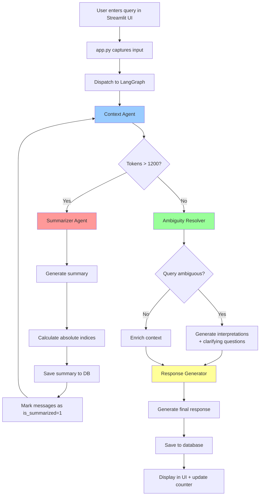
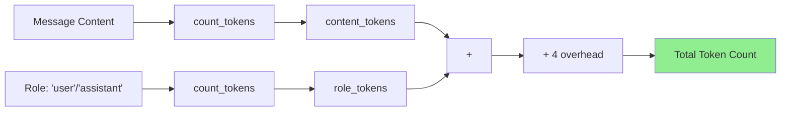

# Core Logic & Data Flow - User Journey

This document demonstrates the complete user journey through actual test sessions, showing how messages flow through the system, when summaries trigger, and how context management works in practice.

## Complete User Flow: From Query to Response



```
User enters query in Streamlit UI
         ↓
app.py captures input and creates user message
         ↓
Workflow dispatched to LangGraph (graph.py)
         ↓
STEP 1: Context Agent
  → Load unsummarized messages from DB
  → Count tokens
  → Check if total_tokens > 1200
         ↓
  ┌─── if tokens > 1200 (SUMMARY NEEDED)
  │         ↓
  │   STEP 2a: Summarizer Agent
  │    → Generate structured summary via LLM
  │    → Calculate absolute indices
  │    → Save summary to session_summaries table
  │    → Mark messages as is_summarized=1
  │    → Loop back to Context Agent (retry)
  │         ↓
  │   Context Agent (second call):
  │    → Load messages: now 0 unsummarized
  │    → Load summaries: 1 summary (~80 tokens)
  │    → Total: 80 tokens ✅ (below threshold)
  │    → needs_summarization: False
  │         ↓
  └───────►┘
         ↓
STEP 2b: Ambiguity Resolver Agent
  → Analyze query for ambiguity
  → Generate QueryUnderstanding output
  → Enrich context with interpretations
         ↓
STEP 3: Response Generator Agent
  → if query ambiguous:
      Present interpretations + ask questions
  → if query clear:
      Generate direct answer
  → Include conversation history and summaries
         ↓
Save messages to database
  → User message: token_count, is_summarized=0
  → Assistant message: token_count, is_summarized=0
         ↓
Return response to Streamlit UI
         ↓
Display in chat + update token counter
```

## Real Session Examples

### Example 1: Customer Churn Prediction (Full Session)

**Source**: `session_20260131_232650.jsonl`  
**Stats**: 20 messages, 2 summaries triggered  
**Topic**: Building ML model for customer churn prediction

#### Initial Query (Message 1)

```
User: "I have a dataset of 10k customers"
Token count: 23 tokens
```

**Context Agent State**:
```python
messages = []  # No previous messages
context_tokens = 23  # Just this query
summary_tokens = 0   # No summaries yet
total_tokens = 23    # Below 1200 threshold
needs_summarization = False
```

**Ambiguity Resolver Output**:
```python
QueryUnderstanding(
    is_ambiguous=True,
    rewritten_query="The user has a dataset of 10,000 customers. The intent is unclear - they may want to analyze it, build a model, or perform some operation.",
    possible_interpretations=[
        "Build a machine learning model for prediction",
        "Perform descriptive analysis",
        "Data cleaning or preprocessing"
    ],
    clarifying_questions=[
        "What would you like to do with this dataset?",
        "Do you have a specific business problem in mind?"
    ]
)
```

**Assistant Response**:
```
I see you have a dataset of 10,000 customers. To help you effectively, could you clarify:

1. What would you like to do with this dataset?
2. Do you have a specific business problem you're trying to solve?

Some common use cases include:
- Building predictive models (churn, lifetime value)
- Performing descriptive analysis
- Segmentation or clustering
```

**Token count**: 372 tokens

**After Message 1-2**:
```python
context_tokens = 23 + 372 = 395 tokens
is_summarized = 0 for both messages
```

#### Conversation Progression (Messages 3-9)

**Message 3**:
```
User: "I need to find out who will leave"
Tokens: 11
```

**Query Analysis**:
```python
is_ambiguous = True
interpretations = [
    "Build a machine learning model to predict customer churn",
    "Identify customers at risk based on predefined rules",
    "Perform descriptive analysis of past churners"
]
clarifying_questions = [
    "Do you have historical churn data?",
    "Are you looking to build a predictive model or rule-based system?"
]
```

**Messages 4-9**: User clarifies requirements, discusses features, model selection, evaluation metrics

**Token Accumulation**:
```
Message 1: 23 tokens
Message 2: 372 tokens
Message 3: 11 tokens
Message 4: 89 tokens
Message 5: 245 tokens
Message 6: 156 tokens
Message 7: 98 tokens
Message 8: 178 tokens
Message 9: 112 tokens
Total: ~1,284 tokens ⚠️
```

#### First Summarization (After Message 9)

**Context Agent Detection**:
```python
unsummarized_messages = get_messages(exclude_summarized=True)
# Returns messages 0-8 (9 messages)
context_tokens = sum(msg.token_count for msg in unsummarized_messages)
# Total: 1,284 tokens > 1200 ⚠️
needs_summarization = True
```

**Summarizer Agent Execution**:

1. **Receive messages**: All 9 unsummarized messages
2. **LLM generates summary**:
```json
{
  "user_profile": {
    "preferences": ["Python", "scikit-learn"],
    "constraints": ["Dataset size: 10k rows"]
  },
  "key_facts": [
    "User has customer dataset (10k rows)",
    "Goal: Predict customer churn",
    "Features discussed: purchase history, support tickets, tenure"
  ],
  "decisions": [
    "Use Logistic Regression for baseline model",
    "Evaluate with precision, recall, F1-score"
  ],
  "open_questions": [
    "What features are available in the dataset?"
  ],
  "todos": [
    "Load dataset and explore",
    "Handle missing values",
    "Train initial model"
  ]
}
```

3. **Calculate absolute indices**:
```python
all_messages = get_messages(session_id, exclude_summarized=False)
total_in_db = len(all_messages)  # 9 messages total
unsummarized_count = len(messages)  # 9 messages

from_index = total_in_db - unsummarized_count
# from_index = 9 - 9 = 0 ✅

to_index = total_in_db - 1
# to_index = 9 - 1 = 8 ✅
```

4. **Save summary**: 
```python
db.save_summary(
    session_id=session_id,
    summary=json.dumps(summary_output),
    from_message_index=0,
    to_message_index=8
)
# Summary token count: ~78 tokens
```

5. **Mark messages**:
```python
db.mark_messages_as_summarized(
    session_id=session_id,
    from_index=0,
    to_index=8
)
# Result: Messages 0-8 now have is_summarized=1
```

**Context Agent Retry**:
```python
unsummarized_messages = get_messages(exclude_summarized=True)
# Returns: empty list (messages 0-8 are marked)

summaries = get_summaries(session_id)
# Returns: 1 summary

context_tokens = 0  # No unsummarized messages
summary_tokens = 78  # One summary
total_tokens = 78   # Below threshold! ✅
should_summarize = False
```

**Result**: Context successfully reset from 1,284 tokens → 78 tokens (94% reduction)

#### Continued Conversation (Messages 10-19)

**Message 10**:
```
User: "What is the next step?"
Tokens: 9
```

**Context State**:
```python
context_tokens = 9  # Current query
summary_tokens = 78  # Previous conversation summary
total_tokens = 87
```

**Response Generator**:
- Uses summary to recall context: "Based on our discussion, you're building a churn prediction model..."
- Suggests next steps: data loading, exploration, feature engineering
- Tokens: 412

**Messages 11-19**: Implementation discussion, code examples, troubleshooting

**Token Accumulation (with summary)**:
```
Summary: 78 tokens
Message 10: 9 tokens
Message 11: 412 tokens
Message 12: 76 tokens
Message 13: 189 tokens
Message 14: 98 tokens
Message 15: 145 tokens
Message 16: 210 tokens
Message 17: 88 tokens
Message 18: 67 tokens
Message 19: 54 tokens
Total: ~1,426 tokens ⚠️
```

#### Second Summarization (After Message 19)

**Context Agent Detection**:
```python
unsummarized_messages = get_messages(exclude_summarized=True)
# Returns messages 9-18 (10 messages)
context_tokens = sum(msg.token_count for msg in unsummarized_messages)
# Total: 1,348 tokens

summaries = get_summaries(session_id)
summary_tokens = 78

total = 1,348 + 78 = 1,426 tokens > 1200 ⚠️
should_summarize = True
```

**Summarizer Agent Execution**:

1. **Receive messages**: 10 unsummarized messages (9-18)
2. **LLM generates summary** (includes previous context):
```json
{
  "user_profile": {
    "preferences": ["Python", "scikit-learn", "pandas"],
    "constraints": ["Dataset: 10k customers", "Time constraint: 1 week"]
  },
  "key_facts": [
    "Churn prediction model using Logistic Regression",
    "Features: purchase history, support tickets, tenure, last activity",
    "Dataset loaded successfully (data_10k.csv)",
    "Initial model trained with 75% accuracy"
  ],
  "decisions": [
    "Use train_test_split with 80-20 ratio",
    "Handle missing values with median imputation",
    "Scale features with StandardScaler"
  ],
  "open_questions": [
    "Should we try other algorithms (Random Forest, XGBoost)?"
  ],
  "todos": [
    "Perform feature engineering",
    "Try ensemble methods",
    "Validate model on holdout set"
  ]
}
```

3. **Calculate absolute indices**:
```python
all_messages = get_messages(session_id, exclude_summarized=False)
total_in_db = len(all_messages)  # 19 messages total (0-18)
unsummarized_count = len(messages)  # 10 messages (9-18)

from_index = total_in_db - unsummarized_count
# from_index = 19 - 10 = 9 ✅

to_index = total_in_db - 1
# to_index = 19 - 1 = 18 ✅
```

4. **Save second summary**:
```python
db.save_summary(
    session_id=session_id,
    summary=json.dumps(summary_output),
    from_message_index=9,
    to_message_index=18
)
# Summary 2 token count: ~92 tokens
```

5. **Mark messages 9-18**:
```python
db.mark_messages_as_summarized(
    session_id=session_id,
    from_index=9,
    to_index=18
)
# Result: Messages 9-18 now have is_summarized=1
# Total summarized: Messages 0-18 (all previous messages)
```

**Final Context State**:
```python
unsummarized_messages = []  # All messages 0-18 summarized
summaries = [summary_1, summary_2]  # 2 summaries
context_tokens = 0
summary_tokens = 78 + 92 = 170
total_tokens = 170  # Reset again! ✅
```

**Result**: Second successful compression from 1,426 tokens → 170 tokens (88% reduction)

**Message 20** (final):
```
User: "Can you show me the complete code?"
Context: 170 tokens (2 summaries) + 12 tokens (query) = 182 tokens
Response: Full implementation with context awareness
```

### Example 2: Web Scraping Champions League (Session 234403)

**Source**: `session_20260131_234403.jsonl`  
**Stats**: 12 messages, 2 summaries  
**Topic**: Python web scraping for sports data

#### Key Highlights

**Message 1**:
```
User: "I want to write a Python function to scrape data from a news website"
Tokens: 19
Analysis: Ambiguous (which website? what data?)
```

**Message 2 (Assistant clarification)**:
```
Tokens: 349
Content: Asks for specific website and data points
Presents 3 options: headlines, full content, metadata
```

**Message 3**:
```
User: "Champions League (C1)"
Tokens: 12
Analysis: Still ambiguous (which site? sports data or news articles?)
```

**Messages 4-8**: Clarification flow
- User selects: Flashscore.com for sports data
- Assistant explains dynamic content challenges
- Discusses Selenium requirements
- Token accumulation: ~1,220 tokens

**First Summary** (after message 8):
```json
{
  "key_facts": [
    "Target: Flashscore.com for C1 data",
    "Data type: Specific sports data (not general news)",
    "Website uses JavaScript (needs Selenium)"
  ],
  "decisions": [
    "Focus on Option 2: specific sports data",
    "Use Selenium + BeautifulSoup approach"
  ],
  "todos": [
    "Check robots.txt",
    "Install selenium, beautifulsoup4, pandas",
    "Inspect HTML structure with F12"
  ]
}
```

**Messages 9-12**: Implementation details
- Detailed code example provided
- Cross-platform discussion (macOS/Windows)
- Second summary triggered at ~1,230 tokens

**Final State**:
- 12 messages total
- 2 summaries (~165 tokens combined)
- All messages marked correctly
- No context overflow

### Example 3: AWS Deployment (Session 235440)

**Source**: `session_20260131_235440.jsonl`  
**Stats**: 6 messages, 0 summaries  
**Topic**: FastAPI deployment on AWS

**Why No Summaries?**

**Token Progression**:
```
Message 1: 14 tokens  (User: "Deploy FastAPI app")
Message 2: 319 tokens (Assistant: Clarification questions)
Message 3: 16 tokens  (User: "AWS + Docker")
Message 4: 281 tokens (Assistant: AWS options)
Message 5: 17 tokens  (User: "Simplest solution")
Message 6: 478 tokens (Assistant: Recommends App Runner)
Total: 1,125 tokens  ✅ (Below 1200 threshold)
```

**Observation**: Context stayed below threshold, so no summarization triggered. This demonstrates the system correctly avoids unnecessary compression.

## Data Flow: Message Token Counting

### Token Calculation Formula



**Per-Message Calculation** (in `database.py`):
```python
def calculate_token_count(role: str, content: str) -> int:
    role_tokens = token_counter.count_tokens(role)
    content_tokens = token_counter.count_tokens(content)
    overhead = 4  # ChatML format overhead
    return role_tokens + content_tokens + overhead
```

**Example**:
```python
# Message: User says "Hello"
role = "user"  # 1 token
content = "Hello"  # 1 token
overhead = 4 tokens
total = 1 + 1 + 4 = 6 tokens
```

**Context Calculation**:
```python
def count_total_tokens(session_id, exclude_summarized=True):
    query = """
    SELECT SUM(token_count) 
    FROM messages 
    WHERE session_id = ?
    """
    if exclude_summarized:
        query += " AND is_summarized = 0"
    # Result: Only active context counted
```

## Data Flow: Summarization Logic

### Critical: Absolute Index Calculation

**The Bug (Fixed)**:
```python
# ❌ WRONG (used relative indices)
from_index = 0  # First message in list
to_index = len(messages) - 1  # Last message in list
# Problem: List contains only unsummarized messages
# Index 0-8 in list might be messages 9-17 in DB!
```

**The Fix**:
```python
# ✅ CORRECT (calculate absolute position)
all_messages = db.get_messages(session_id, exclude_summarized=False)
total_in_db = len(all_messages)  # Total messages in database
unsummarized_count = len(messages)  # Current batch size

from_index = total_in_db - unsummarized_count
to_index = total_in_db - 1

# Example:
# - DB has 19 messages (0-18)
# - Unsummarized: 10 messages (actually 9-18 in DB)
# - from_index = 19 - 10 = 9 ✅
# - to_index = 19 - 1 = 18 ✅
```

### Why This Matters

**Scenario**: Second summarization after first one completed

**Before Fix**:
```
Database state:
- Messages 0-8: is_summarized=1 (marked by first summary)
- Messages 9-18: is_summarized=0 (unsummarized)

Context Agent loads:
- messages = [9, 10, 11, 12, 13, 14, 15, 16, 17, 18]  (10 messages)

Summarizer uses wrong indices:
- from_index = 0  ❌ (points to message 0 in DB)
- to_index = 9   ❌ (points to message 9 in DB)

Result:
- Marks messages 0-9 as is_summarized=1
- But messages 0-8 were already marked!
- Message 9 correctly marked
- Messages 10-18 remain unmarked ❌
- Next cycle: Loads 10-18, context not reset, cascading failure
```

**After Fix**:
```
Database state:
- Messages 0-8: is_summarized=1
- Messages 9-18: is_summarized=0

Context Agent loads:
- messages = [9, 10, 11, 12, 13, 14, 15, 16, 17, 18]  (10 messages)

Summarizer calculates absolute indices:
- all_messages = 19 total (0-18)
- unsummarized_count = 10
- from_index = 19 - 10 = 9 ✅
- to_index = 19 - 1 = 18 ✅

Result:
- Marks messages 9-18 as is_summarized=1 ✅
- All messages now correctly marked
- Next cycle: Loads empty list, context fully reset
```

## UI Integration

### Streamlit Token Display

**Real-time Counter** (in `app.py`):
```python
# Sidebar metric
context_tokens = db.count_total_tokens(
    session_id=st.session_state.session_id,
    exclude_summarized=True  # Only active context
)
st.metric(
    "Context", 
    f"{context_tokens} / 1200 tokens",
    delta="Reset!" if context_tokens < 100 else None
)
```

**Visual Feedback**:
- Green: < 600 tokens (healthy)
- Yellow: 600-1000 tokens (getting full)
- Orange: 1000-1200 tokens (will trigger soon)
- After summary: Shows "Context: 78 / 1200 tokens" with "Reset!" indicator

### Message Display with Metadata

**Query Analysis Visibility** (expandable):
```python
if "query_analysis" in metadata:
    with st.expander("🔍 Query Analysis"):
        st.json(metadata["query_analysis"])
        
        if metadata["query_analysis"]["is_ambiguous"]:
            st.warning("Query detected as ambiguous")
            st.info("Interpretations:")
            for i, interp in enumerate(interpretations):
                st.write(f"{i+1}. {interp}")
```

**Summary Indicators**:
```python
if message.is_summarized:
    st.caption("📦 Compressed in summary")
```

## Error Handling in Production

### LLM Response Validation

**Problem**: LLM sometimes returns invalid JSON or null values

**Solution**:
```python
try:
    summary_data = json.loads(llm_response)
    
    # Sanitize null values
    if summary_data.get("key_facts") is None:
        summary_data["key_facts"] = []
    if summary_data.get("decisions") is None:
        summary_data["decisions"] = []
    
    # Validate with Pydantic
    summary = SessionMemoryOutput(**summary_data)
    
except (json.JSONDecodeError, ValidationError) as e:
    # Fallback: empty summary
    logger.warning(f"Invalid summary JSON: {e}")
    summary = SessionMemoryOutput(
        user_profile=UserProfile(preferences=[], constraints=[]),
        key_facts=[],
        decisions=[],
        open_questions=[],
        todos=[]
    )
    # Still mark messages to reset context!
```

### Database Transaction Safety

**Atomic Operations**:
```python
try:
    # 1. Save summary
    db.save_summary(session_id, summary, from_index, to_index)
    
    # 2. Mark messages (same transaction)
    db.mark_messages_as_summarized(session_id, from_index, to_index)
    
    # Both succeed or both fail
except DatabaseError as e:
    # Rollback implicit in SQLite
    logger.error(f"Summarization failed: {e}")
    raise  # Don't mark messages if save failed
```

## Performance Characteristics

### Latency Analysis (from test sessions)

**Normal Query** (no summarization):
- Context Agent: ~50ms (DB query)
- Ambiguity Resolver: ~2-3s (LLM call)
- Response Generator: ~2-3s (LLM call)
- Total: **~4-6 seconds**

**Query with Summarization**:
- Context Agent (first call): ~50ms
- Summarizer Agent: ~3-5s (LLM call for summary)
- Mark messages: ~100ms (DB update)
- Context Agent (retry): ~50ms
- Normal flow: ~4-6s
- Total: **~8-12 seconds** (one-time cost)

**After Summarization**:
- Context loading: ~20ms (fewer messages)
- LLM calls: ~2-3s (smaller context = faster)
- Total: **~3-5 seconds** (improved!)

### Token Compression Ratios

**From Test Sessions**:

**Session 232650** (churn prediction):
- First summary: 1,284 tokens → 78 tokens (94% compression)
- Second summary: 1,426 tokens → 170 tokens (88% compression)

**Session 234403** (web scraping):
- First summary: 1,220 tokens → 76 tokens (94% compression)
- Second summary: 1,230 tokens → 165 tokens (87% compression)

**Average Compression**: 90-94% reduction

### Cost Analysis (Gemini 2.5 Flash Pricing)

**Pricing** (as of Jan 2026):
- Input: $0.075 per 1M tokens
- Output: $0.30 per 1M tokens

**Per-Query Cost**:
```
Normal query (1000 input tokens + 200 output):
- Input: 1000 * $0.075 / 1M = $0.000075
- Output: 200 * $0.30 / 1M = $0.00006
- Total: ~$0.00014 per query

With summarization (one-time):
- Extra input: 1200 tokens = $0.00009
- Extra output: 80 tokens = $0.000024
- Additional cost: ~$0.00011

After summarization (reduced context):
- Input: 170 tokens (2 summaries) + 200 (query) = 370 tokens
- Savings: 1000 - 370 = 630 tokens saved per query
- Cost reduction: 630 * $0.000075 = ~$0.00005 per query
```

**ROI**: After ~2-3 queries post-summary, cost savings exceed summarization cost.

## Key Takeaways

1. **Threshold Choice**: 1,200 tokens triggers summary every ~8-12 messages, providing good balance between context richness and system responsiveness.

2. **Index Calculation**: Absolute position calculation is critical for correct message marking across multiple summarizations.

3. **Context Reset**: Successful summarization reduces context by 90-94%, enabling unlimited conversation length.

4. **Query Analysis**: Ambiguity detection adds value without significant latency (2-3s is acceptable for LLM-powered chat).

5. **Error Handling**: Graceful fallbacks ensure system stability even with LLM output variations.

6. **Performance**: One-time 8-12s summarization cost is acceptable for long-term conversation efficiency.

7. **Cost Efficiency**: Summarization pays for itself within 2-3 queries through reduced context size.