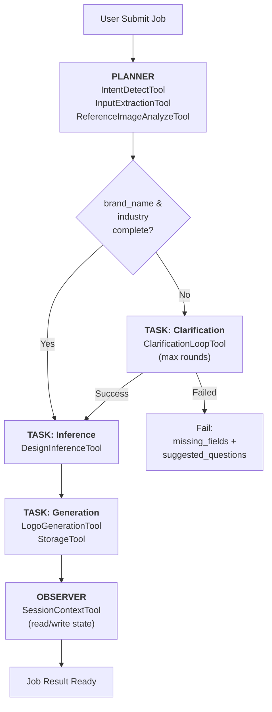
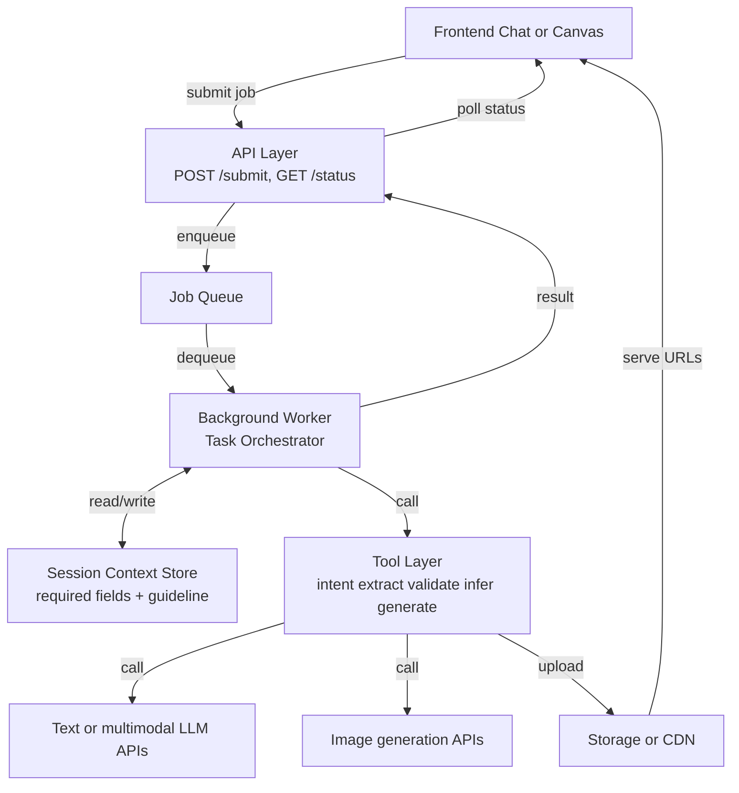
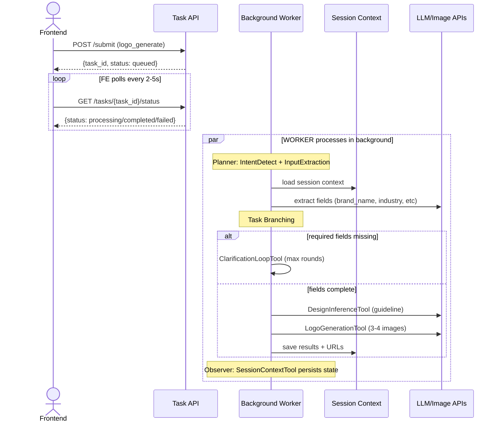

# Logo Design AI POC

## 1. Overview

### 1.1 POC objective

Backend-driven Logo Design Service using async job orchestration (Steps 1→6 only from spec).

In-scope: Intent detection → Input extraction → Required-field clarification → Design inference → Image generation  
Out-of-scope: Editing (Step 7) and follow-up suggestions (Step 8)

Goals: Demonstrate async job contract, validate required-field extraction quality, prove 3-4 option generation within latency targets.

### 1.2 Success metrics

- ≥ 90% requests extract brand_name + industry
- ≥ 85% requests generate 3-4 valid options
- p95 completion ≤ 30s; p95 first transition ≤ 5s
- Failure response with structured hints ≤ 5s

### 1.3 Technical constraints

- **Endpoints**: `POST /internal/v1/tasks/submit`, `GET /internal/v1/tasks/{task_id}/status` (job-based, async polling)
- **Required fields**: brand_name, industry (validation gate before generation)
- **Optional fields**: style_preference, color_preference (non-blocking, inferred if missing)
- **Precedence**: explicit request > extracted query > session context
- **Session reuse**: `session_id`-scoped cross-job context
- **Provider resilience**: fallback paths required for text and image models

---

## 2. POC Scope

### 2.1 Build vs Defer

| Area | Build (POC) | Defer |
| :--- | :--- | :--- |
| Intent + input | Detect logo intent, parse text/references, extract brand context | Multi-domain intent classifier |
| Clarification | Fail-fast required-field validation with suggested follow-up questions | Adaptive personalized questioning policy |
| Reasoning | Internal reasoning for extraction and inference | Multi-agent self-critique loops |
| Guideline | Generate structured design guideline before generation | Automatic guideline optimization loop |
| Generation | Generate 3-4 PNG options from guideline | Auto model-routing and ranking |
| Storage/session | Persist output URLs + session context per `session_id` | Project library, version history, long-term memory |
| Editing | Deferred | Step 7 in next phase |
| Follow-up suggestion | Deferred | Step 8 in next phase |

---

## 3. System Architecture

### 3.1 Overview

#### 3.1.1 Why this solution

This architecture is designed for strict quality gating in POC with simple async job semantics: submit once, get complete output.

Key reasons:

1. Fail-fast required-field validation enforces required design inputs before generation begins.
2. Async execution keeps FE simple: submit job, poll status, render output when ready.
3. All processing happens server-side; FE does not hold the connection.
4. Session context is explicit and propagated between tools for deterministic behavior.

#### 3.1.2 Diagram 1 - Agent pipeline (Planner-Tasks-Observer pattern)



#### 3.1.3 Diagram 2 - System components (layered)



### 3.2 Architecture principles and Planner-Tasks-Observer pattern

This design follows a **multi-agent research pattern** (inspired by Exa's deep research architecture) with three components:

#### **PLANNER Phase** (steps 1-2)
Analyzes initial user context and generates research tasks:
- IntentDetectTool: Classify logo intent and route flow
- InputExtractionTool: Parse query for brand_name, industry, style, color, symbol
- ReferenceImageAnalyzeTool: Analyze visual references
- Output: merged BrandContext with required-field state

#### **TASKS Phase** (steps 3-6)
Independent processing units running conditionally:
- **Clarification Task** (if fields missing): ClarificationLoopTool iterates until brand_name + industry present or max rounds hit
- **Inference Task** (if fields complete): DesignInferenceTool generates guideline JSON
- **Generation Task**: LogoGenerationTool + StorageTool creates 3-4 PNG options

Each task receives only the required context snapshot it needs; tasks do not share intermediate reasoning states.

#### **OBSERVER** (shared session layer)
SessionContextTool maintains full state visibility across all tools:
- Reads initial context by session_id
- Tracks merged field state and required-field gate
- Persists guideline + option URLs at checkpoints
- Enables context handoff with optimistic concurrency via context_version

#### Architecture benefits
1. **Dynamic task routing**: Clarification task only runs if fields missing (fail-fast filtering)
2. **Context isolation**: Each task reads snapshot, writes deltas; no shared memory corruption
3. **Resilience**: Task failures don't block other independent research
4. **Observability**: All planning, reasoning, outputs recorded in session context

---

### 3.3 Schema-first and async-first design

Key design principles:
- **Task-first**: Business capability exposed as `logo_generate`, routed by task_type
- **Schema-first**: Pydantic validation on all contracts; required-field gate is schema-enforced
- **Async job-based**: `POST /submit` (single request), `GET /status` (poll result), deterministic JSON output
- **Context-first tool handoff**: Every tool accesses consistent session context via SessionContextTool

| Component or Tool | Spec step | Role | Model Type | Notes |
| :--- | :--- | :--- | :--- | :--- |
| IntentDetectTool | Step 1 | Detect logo design intent and route flow | Low-latency text LLM | Deterministic classifier; if logo intent is detected, switch from generic image generation flow to Logo Design flow |
| InputExtractionTool | Step 2 | Extract brand_name, industry, style, color, symbol from text | Text LLM with structured output | Returns structured JSON (style/color optional) |
| ReferenceImageAnalyzeTool | Step 2 | Analyze reference image style/color/typography/iconography | Multimodal LLM | Optional when references provided |
| ClarificationLoopTool | Step 3 | Ask targeted clarification questions for missing required fields and update context | Text LLM for question generation | Loop until brand_name AND industry are complete, then continue to Step 4; if max rounds reached, fail with missing_fields + suggested_questions |
| DesignInferenceTool | Step 4 | Infer final guideline from completed context | Text LLM for design reasoning | Returns guideline JSON |
| LogoGenerationTool | Step 6 | Generate 3-4 logo options | Fast image generation model | Throughput-optimized |
| StorageTool | Shared | Upload images and return URLs | Cloud storage API | Used by generation |
| SessionContextTool | Shared | Read/update context snapshot per session and key job checkpoints | Context adapter over cache or DB | Required for deterministic tool swap |

### 3.4 End-to-end pipeline

POC exposes one external task type: `logo_generate`.

#### 3.4.1 Async polling flow (simplified)



#### 3.4.2 Stages A-C - Intake and clarification loop (Step 1-3)

| Item | Detail |
| :--- | :--- |
| Input | `LogoGenerateInput` (query, optional explicit brand fields, references, session_id) |
| Tools used | IntentDetectTool, InputExtractionTool, ReferenceImageAnalyzeTool, ClarificationLoopTool |
| Output | Either (a) merged fields with brand_name + industry guaranteed, or (b) failed job payload with `error_code`, `missing_fields`, `suggested_questions` after max rounds |
| Gate | brand_name AND industry must both be present before Step 4; otherwise continue clarification loop until max rounds |
| Target | Complete within first 10s of job start |

#### 3.4.3 Stage B - Request analysis and guideline inference (Step 4)

| Item | Detail |
| :--- | :--- |
| Input | Completed required fields + optional context |
| Tools used | DesignInferenceTool |
| Output | DesignGuideline JSON |
| Target | Guideline coverage >= 90% |

#### 3.4.4 Stage C - Logo generation (Step 6)

| Item | Detail |
| :--- | :--- |
| Input | guideline + variation_count |
| Tools used | LogoGenerationTool, StorageTool |
| Output | LogoGenerateOutput with 3-4 option URLs |
| Target | 3-4 valid outputs >= 85%, generation <= 30s total per job |

#### 3.4.5 Async job execution strategy

POC uses pure async (simple input-output model):

- Submit once: `POST /internal/v1/tasks/submit` with single request per job (input may be partial when `use_session_context=true`).
- Poll for result: `GET /internal/v1/tasks/{task_id}/status` (simple short-polling recommended for POC).
- Single output: result contains full guideline + option URLs when job completes.

Why this is simple for POC:

1. No streaming protocol complexity on FE (no NDJSON or gRPC streaming).
2. Required-field validation runs server-side with fail-fast behavior; if brand_name or industry is missing after merge, return failed job with machine-readable hints.
3. FE logic is straightforward: submit, poll, render.
4. Perfect for learning: output contract is deterministic JSON, not chunk-by-chunk parsing.

Note on fail-fast validation in async mode:

- Required fields are resolved using fixed precedence: explicit request > extracted query > stored session context.
- If brand_name or industry is missing after merge, job fails immediately.
- Failed response includes `error_code`, `missing_fields`, and `suggested_questions` so FE can submit a new job.
- Optional fields (style_preference, color_preference) are inferred from query or defaults; they do not block generation.

#### 3.4.6 Session context and tool swap contract

Design rule:

- Tool swap is allowed only if input/output context contract is unchanged.

Clarification:

- "Context handoff" means each step can read a consistent context and write delta updates.
- It does not require passing full serialized `SessionContextState` payload on every internal call.
- Recommended approach: pass lightweight execution context + context reference/version, fetch full state from SessionContextTool when needed.

Mandatory context handoff on every tool call:

- `session_id`
- `required_field_state` (brand_name, industry, passed/not)
- latest extracted `BrandContext`
- latest approved `DesignGuideline` (if available)
- `sequence` counter
- `context_version` (for optimistic concurrency)

Context model split:

- Execution context (per `task_id`):
  - `task_id`, `session_id`, `sequence`, `current_step`, `required_field_state`, trace metadata.
  - Used to keep one async job deterministic from Step 1 -> Step 6.
- Session context (per `session_id`):
  - latest `BrandContext`, latest `DesignGuideline`, generated option history, optional confirmed preferences.
  - Used for cross-job reuse (for example, after one completed generation, user asks to generate more options).

Implementation notes:

- Worker owns task execution state for single job.
- SessionContextTool persists snapshot at key checkpoints (after gate passes, after guideline generated, after options generated).
- Each tool reads required context fields and returns delta updates (not full-state overwrite).
- Worker merges deltas and advances task state.
- Use `context_version` (or ETag-like revision) to prevent stale writes when multiple jobs share one session.

Precedence rule (fixed and mandatory):

1. explicit fields in request
2. extracted fields from new query
3. stored session context

### 3.5 Reuse and extensibility

- Add fields in extraction or guideline:
  - Extend schema and prompt templates only.
  - API contract stays unchanged.
- Add edit phase in next release:
  - Register `logo_edit` task type and add Stage D for Step 7.
  - Reuse same context and job semantics.
- Add provider:
  - Replace generation adapter only.
  - No change in worker state machine.

---

## 4. Data Schema and API Integration

### 4.1 Pydantic models by stage

```python
from typing import Any, Dict, List, Literal, Optional
from pydantic import BaseModel, Field, HttpUrl


class ReferenceImage(BaseModel):
    source_url: Optional[HttpUrl] = None
    storage_key: Optional[str] = None


class BrandContext(BaseModel):
    brand_name: Optional[str] = None
    industry: Optional[str] = None
    style_preference: List[str] = Field(default_factory=list)
    color_preference: List[str] = Field(default_factory=list)
    symbol_preference: List[str] = Field(default_factory=list)


class SuggestedQuestion(BaseModel):
    key: Literal["brand_name", "industry"]
    question: str


class RequiredFieldState(BaseModel):
    # Only 2 required fields for POC
    required_keys: List[str] = Field(default_factory=lambda: [
        "brand_name",      # Company or product name (MANDATORY)
        "industry",        # Business category or context (MANDATORY)
    ])
    missing_keys: List[str] = Field(default_factory=list)
    passed: bool = False


class DesignGuideline(BaseModel):
    concept_statement: str
    style_direction: List[str]
    color_palette: List[str]
    typography_direction: List[str]
    icon_direction: List[str]
    constraints: List[str]


class SessionContextState(BaseModel):
    session_id: str
    latest_brand_context: Optional[BrandContext] = None
    latest_guideline: Optional[DesignGuideline] = None
    required_field_state: RequiredFieldState = Field(default_factory=RequiredFieldState)
    generated_option_ids: List[str] = Field(default_factory=list)


class LogoGenerateInput(BaseModel):
    session_id: str
    query: str
    brand_name: Optional[str] = None
    industry: Optional[str] = None
    style_preference: List[str] = Field(default_factory=list)
    color_preference: List[str] = Field(default_factory=list)
    symbol_preference: List[str] = Field(default_factory=list)
    references: List[ReferenceImage] = Field(default_factory=list)
    use_session_context: bool = True
    variation_count: int = Field(default=4, ge=3, le=4)
    output_format: Literal["png"] = "png"
    output_size: Literal["1024x1024"] = "1024x1024"


class LogoOption(BaseModel):
    option_id: str
    image_url: HttpUrl
    prompt_used: Optional[str] = None
    seed: Optional[int] = None
    quality_flags: List[str] = Field(default_factory=list)


class LogoGenerateOutput(BaseModel):
    guideline: DesignGuideline
    required_field_state: RequiredFieldState
    options: List[LogoOption]


class JobSubmitResponse(BaseModel):
    task_id: str
    status: Literal["queued"]
    created_at: str  # ISO8601


class JobStatusResponse(BaseModel):
    task_id: str
    status: Literal["queued", "processing", "completed", "failed"]
    progress_percent: Optional[int] = None  # 0-100 if processing
    result: Optional[LogoGenerateOutput] = None  # populated when completed
    error_code: Optional[str] = None  # populated when failed (e.g., MISSING_REQUIRED_FIELDS)
    error: Optional[str] = None  # populated when failed
    missing_fields: List[str] = Field(default_factory=list)  # populated when failed
    suggested_questions: List[SuggestedQuestion] = Field(default_factory=list)  # populated when failed
    retry_after_seconds: Optional[int] = None  # populated when failed
```

Validation rules:

- `query` is required and non-empty after trim.
- `variation_count` must be 3 or 4.
- Required-field gate: brand_name AND industry must both be present before guideline generation.
- Merge precedence is fixed: explicit fields in request > extracted fields from new query > stored context for same `session_id`.
- Empty-value precedence policy:
  - explicit empty string (e.g., `brand_name=""`) is treated as missing and does not override non-empty extracted/session value.
  - explicit `null` is treated as "not provided" and falls through to lower-precedence sources.
  - explicit empty optional lists (e.g., `style_preference=[]`) are valid explicit overrides.
- If `use_session_context=true`, backend may use stored context as the last precedence layer.
- If required fields are still missing after merge, return failed job with `error_code`, `missing_fields`, and `suggested_questions`.
- On `status="failed"` with `error_code="MISSING_REQUIRED_FIELDS"`, `missing_fields` and `suggested_questions` must be populated.

### 4.2 External APIs and model selection

Model selection strategy:

- Text models: choose by latency, reasoning quality, and cost.
- Image models: choose by generation speed, quality fidelity, and throughput.
- Fallback path: maintain secondary provider to reduce lock-in and improve reliability.

Reference docs:

- Google Gemini API docs: https://ai.google.dev/gemini-api/docs
- Google Imagen docs: https://ai.google.dev/gemini-api/docs/imagen
- Google Nano Banana docs: https://ai.google.dev/gemini-api/docs/image-generation
- Google pricing docs: https://ai.google.dev/gemini-api/docs/pricing
- OpenAI pricing docs: https://openai.com/api/pricing/
- OpenAI models docs: https://platform.openai.com/docs/models

### 4.3 Concrete endpoint I/O

- `POST /internal/v1/tasks/submit` (submit job)
  - Input:
    - `task_type` (required: `logo_generate`)
    - `session_id` (required)
    - `query` (required: user request for extraction)
    - `brand_name` (optional explicit override)
    - `industry` (optional explicit override)
    - `style_preference` (optional explicit override)
    - `color_preference` (optional explicit override)
    - `symbol_preference` (optional explicit override)
    - `references` (optional: list of ReferenceImage)
    - `use_session_context` (optional, default true)
    - `variation_count` (optional, default 4, range 3-4)
    - `output_format` (optional, default "png")
    - `output_size` (optional, default "1024x1024")
  - Output (JobSubmitResponse):
    ```json
    {
      "task_id": "uuid",
      "status": "queued",
      "created_at": "2026-03-24T12:00:00Z"
    }
    ```

- `GET /internal/v1/tasks/{task_id}/status` (check job status)
  - Path params: `task_id`
  - Output (JobStatusResponse, while processing):
    ```json
    {
      "task_id": "uuid",
      "status": "processing",
      "progress_percent": 45
    }
    ```
  - Output (JobStatusResponse, when completed):
    ```json
    {
      "task_id": "uuid",
      "status": "completed",
      "result": {
        "guideline": { /* DesignGuideline */ },
        "required_field_state": { /* RequiredFieldState */ },
        "options": [ /* List[LogoOption] */ ]
      }
    }
    ```
  - Output (JobStatusResponse, if failed):
    ```json
    {
      "task_id": "uuid",
      "status": "failed",
      "error_code": "MISSING_REQUIRED_FIELDS",
      "error": "Missing required fields after merge precedence",
      "missing_fields": ["brand_name", "industry"],
      "suggested_questions": [
        {
          "key": "brand_name",
          "question": "What is your company or product name?"
        },
        {
          "key": "industry",
          "question": "What industry is your business in?"
        }
      ],
      "retry_after_seconds": 60
    }
    ```
  - Context behavior:
    - merge precedence is fixed: explicit request fields > extracted query fields > stored context in same `session_id`
    - fail-fast for required fields: if brand_name or industry is missing after merge, return failed job immediately
    - result metadata includes final `required_field_state`

### 4.4 Model benchmark by vendor (POC-oriented)

Important: prices and latency below are for planning and must be re-checked before release.

#### 4.4.1 Google models

Text Models

| Model | Input ($/ 1M tokens) | Output ($/ 1M tokens) | TTFB (typical) | Full response (typical) | Best for |
| :--- | :--- | :--- | :--- | :--- | :--- |
| `gemini-2.5-flash` | $0.30 | $2.50 | 0.5-1.2s | 2-6s | POC default for extraction, clarification, inference |
| `gemini-2.5-pro` | $1.25 (<=200k) | $10.00 (<=200k) | 1.0-2.5s | 4-12s | Higher-depth reasoning fallback |

Image Models

| Model | Pricing type | Unit price | Latency (per image) | Best for |
| :--- | :--- | :--- | :--- | :--- |
| `gemini-2.5-flash-image` | Per 1M tokens | $0.039 per 1024x1024 | 8-18s | Baseline fast generation |
| `gemini-3.1-flash-image-preview` | Per 1M tokens | ~$0.067 per 1024x1024 | 6-14s | POC primary for 3-4 option generation |
| `imagen-4.0-fast-generate-001` | Per image | $0.02 | 7-15s | Alternative fast path |
| `imagen-4.0-generate-001` | Per image | $0.04 | 10-20s | Alternative quality path |

#### 4.4.2 OpenAI models

Text Models

| Model | Input ($/ 1M tokens) | Output ($/ 1M tokens) | TTFB (typical) | Full response (typical) | Best for |
| :--- | :--- | :--- | :--- | :--- | :--- |
| `gpt-5.4-nano` | $0.20 | $1.25 | 0.3-0.9s | 1.5-5s | Cost-sensitive extraction |
| `gpt-5.4-mini` | $0.750 | $4.500 | 0.6-1.5s | 2-7s | POC fallback with strong structured output |
| `gpt-5.4` | $2.50 | $15.00 | 1.0-3.0s | 4-14s | High quality, high cost |

Image Models

| Model | Pricing type | Unit price | Latency (per image) | Best for |
| :--- | :--- | :--- | :--- | :--- |
| `gpt-image-1.5` | Output tokens | $32 per 1M tokens | 10-25s | Fallback image provider |

#### 4.4.3 POC model selection rationale

Recommended primary path:

- Text: `gemini-2.5-flash`
- Image generation: `gemini-3.1-flash-image-preview`

Recommended fallback path:

- Text: `gpt-5.4-mini`
- Image generation: `gpt-image-1.5`

Why this combination:

1. Async + low-latency text model supports fast initial clarification processing.
2. Main image model balances speed and quality for 3-4 options.
3. Fallback path provides resilience and reduces vendor lock-in.
4. This path aligns with p95 timing targets in Section 1.2.

---

## 5. Risks and open issues

### 5.1 Latency

Risk:

- Job completion may exceed p95 target depending on provider queue and image generation latency.

Mitigation:

- Parallel image generation where provider permits.
- Timeout + retry for transient provider failures.
- Queue scaling policy when backlog grows.
- Circuit breaker for provider outages.

### 5.2 Required-field validation quality

Risk:

- User intent may not include brand_name or industry explicitly; fail-fast may increase first-attempt failure rate.

Mitigation:

- Extract brand_name and industry early (Step 2) with high-confidence NLP.
- Return structured failure payload (`error_code`, `missing_fields`, `suggested_questions`) for FE-guided resubmission.
- Prioritize targeted suggested questions (e.g., "What is your company name?" before "What industry?").
- Allow inference from context (e.g., "design a logo for a fintech startup" → industry=fintech).

### 5.3 Cost

Risk:

- Failed attempts (missing required fields) and 3-4 image outputs increase cost per successful request.

Mitigation:

- Track cost per `task_id` and `session_id`.
- Cache extracted context in session and avoid redundant re-analysis.
- Keep benchmark table refreshed each milestone.

### 5.4 Open technical decisions

- Polling mechanism: simple HTTP polling vs webhook vs Server-Sent Events (SSE) for result notification.
- Signed URL TTL policy by asset type.
- Job result retention: how long to keep completed job results available.
- Session context TTL and reset policy (auto expiry only vs manual reset endpoint).
- Default guideline style when `style_preference` is not provided (infer from industry vs hardcoded default).
- Fallback generation model if primary `gemini-3.1-flash-image-preview` fails mid-job.
