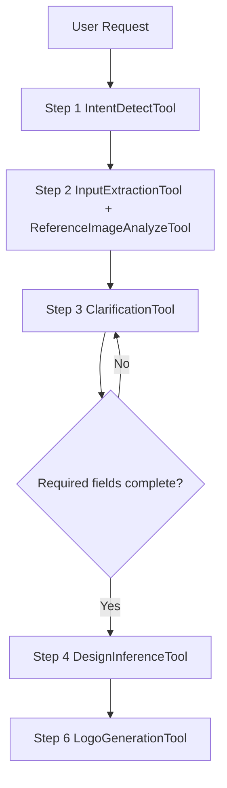
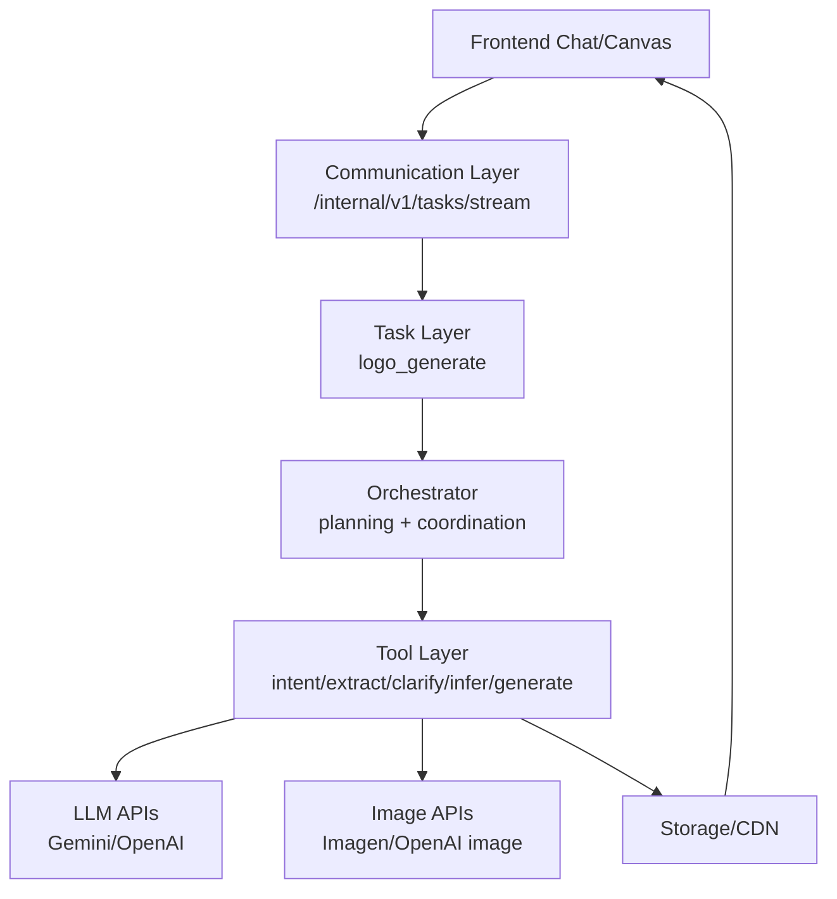
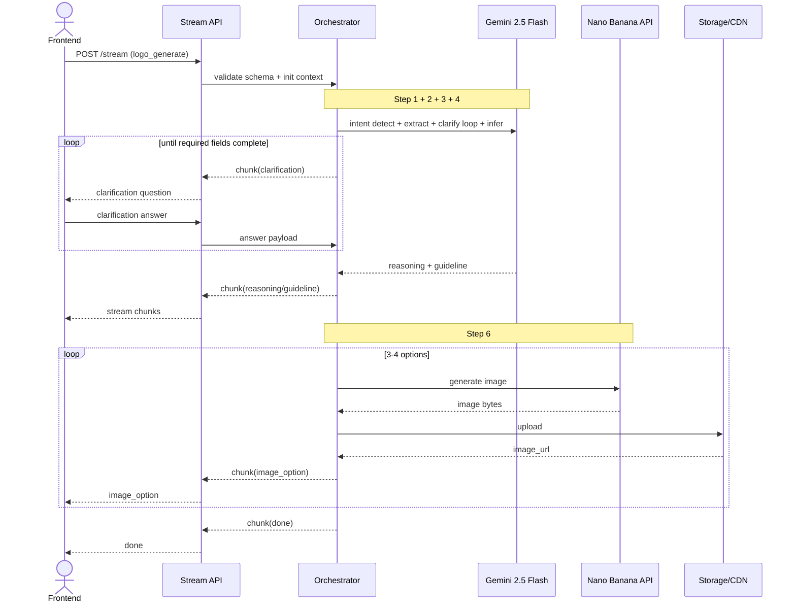

# Logo Design AI POC

## 1. Overview

### 1.1 POC objective

This POC builds a backend-driven Logo Design Service using a chat-first workflow.

- Input: user query (text, optional image references).
- Backend flow: detect intent, extract/analyze inputs, run mandatory clarification loop for required fields, infer design guideline, generate 3-4 options.
- Output: image URLs (minimum PNG 1024x1024) and generation summary.
- Scope boundary: POC execution stops at original spec Step 6 (logo generation). Step 7 (edit) and Step 8 (follow-up) are deferred to next phase.

Business validation goals:

- Prove users can complete the full loop: request -> analyze -> mandatory clarify -> guideline -> generate.
- Prove visible reasoning is understandable and useful.
- Prove mandatory input collection improves output quality consistency.

### 1.2 Success metrics (POC acceptance targets)

These are committed POC acceptance targets (Phase 1 baseline) after initial benchmark survey for a simplified generation-only flow. Targets are intentionally buffered for implementation risk and can be tightened in a later phase.

- >= 85% of requests return a design guideline before image generation starts.
- >= 95% of requests satisfy required fields (brand_name, style_preference, color_preference) before generation starts.
- >= 85% of requests return 3-4 valid logo options.
- >= 85% of sessions complete end-to-end flow without restart.
- p95 time to first reasoning chunk <= 3.0s.
- p95 time to complete 3-4 logo outputs <= 40s.
- On generation failure, actionable error + retry guidance returned <= 5s.

### 1.3 Technical constraints

- Primary stream endpoint is the main UX channel; async submit/status supports long-running or unstable client sessions.
- Out of scope in POC: touch edit, smart mark, region/object-level editing.
- Session scope: single session only, with short-term context memory reused across requests in the same `session_id`.
- No separate rule engine; behavior is schema-driven + prompt-driven + tool-adapter driven.
- Provider switching must not require changing FE stream contract.

---

## 2. POC Scope

### 2.1 Build vs Defer

| Area | Build (POC) | Defer |
| :--- | :--- | :--- |
| Intent + input | Detect logo intent, parse text/references, extract brand context | Multi-domain intent classifier |
| Clarification | Mandatory clarify loop until required fields are complete (brand name, style, color) | Adaptive policy by user profile |
| Reasoning | Stream reasoning blocks (input understanding, style inference, constraint checks) | Multi-agent debate and self-critique loops |
| Guideline | Generate structured design guideline before generation | Auto-optimization guideline loop via evaluator |
| Generation | Generate 3-4 PNG options from guideline | Multi-model routing and automatic quality ranking |
| Storage/session | Persist output URLs + metadata and session context state per `session_id` | Project library, version history, long-term memory |

---

## 3. System Architecture

### 3.1 Overview

#### 3.1.1 Why this solution

This architecture is chosen to match a POC-focused execution logic up to original spec Step 6 (with Step 5 direction selection removed in POC) while keeping the backend reusable and FE-independent.

Key reasons:

1. Every spec step has explicit tool boundary and ownership.
2. FE only needs stream rendering by chunk type and sequence.
3. Provider/model decisions are replaceable at adapter level.
4. Stream-first gives user-visible progress; async mode reuses the same task contract for unstable/mobile clients.

#### 3.1.2 Diagram 1 - Agent pipeline (flowchart)



#### 3.1.3 Diagram 2 - System components (layered)



### 3.2 Architecture principles

- Task-first:
  - Business capability in POC is task-based (`logo_generate`).
  - Routing by `task_type`, no endpoint-specific business hardcoding.
- Schema-first:
  - All contracts validated by Pydantic.
  - New fields/features evolve by schema + prompt template extension.
- Stream-first:
  - `POST /internal/v1/tasks/stream` is default path.
  - FE renders by chunk contract, independent from provider internals.
- Tool abstraction:
  - Orchestrator calls stable tool interfaces.
  - Model/provider switching only touches adapters.

### 3.3 Component breakdown (tool-level)

| Component / Tool | Spec step | Role | Model Type | Notes |
| :--- | :--- | :--- | :--- | :--- |
| IntentDetectTool | Step 1 | Detect if request is logo design intent and route flow | Low-latency text LLM for classification | Emits early `reasoning` chunk |
| InputExtractionTool | Step 2 | Extract brand_name, industry, style, color, symbol from text | Text LLM with structured output capability | Returns structured JSON |
| ReferenceImageAnalyzeTool | Step 2 | Analyze reference image style/color/typography/iconography | Multimodal LLM for image understanding | Optional when references provided |
| ClarificationTool | Step 3 | Run mandatory clarify loop until required fields are complete | Text LLM for targeted question generation | No skip in POC |
| DesignInferenceTool | Step 4 | Infer style direction and design constraints | Text LLM for design reasoning | Emits `reasoning` and `guideline` |
| LogoGenerationTool | Step 5 | Generate 3-4 logo options | Fast image generation model for exploration | Throughput-optimized for exploration |
| StorageTool | Shared | Upload images and return URLs | Cloud storage API | Used by generation |

### 3.4 End-to-end pipeline

POC exposes 1 external task type: `logo_generate`. Analyze and mandatory clarify are internal stages within `logo_generate`. This POC maps to original spec Step 1,2,3,4,6 and defers Step 5,7,8.

#### 3.4.1 Full sequence (Step 1 -> Step 6, with Step 5 deferred)



  #### 3.4.2 Stage A - Analyze + mandatory clarify loop (Step 1 to Step 4)

| Item | Detail |
| :--- | :--- |
| Input | `LogoGenerateInput` (query, references, session_id) |
| Tools used | IntentDetectTool, InputExtractionTool, ReferenceImageAnalyzeTool, ClarificationTool, DesignInferenceTool |
| Output chunks | `clarification` (repeat until required fields complete), `reasoning`, `guideline` |
| Target | First chunk <= 1.5s p95; required-field completion >= 95%; guideline availability >= 90% |

#### 3.4.3 Stage B - Generate (Step 6)

| Item | Detail |
| :--- | :--- |
| Input | guideline + variation_count |
| Tools used | LogoGenerationTool, StorageTool |
| Output chunks | `image_option` x 3-4, `done` |
| Target | 3-4 valid outputs >= 90%; total generation <= 25s p95 |

#### 3.4.4 Session context memory (POC)

- Scope:
  - Memory is limited to one active `session_id` timeline.
  - No cross-session personalization in this POC.
- What is stored:
  - latest extracted `BrandContext`
  - latest approved `DesignGuideline`
  - required-field completion state and latest clarification answers
  - generated asset URLs and generation metadata
- How it is used:
  - New `logo_generate` calls in the same `session_id` merge new prompt details with stored context.
  - Clarification loop only asks still-missing required fields.
  - Every response returns updated context metadata for deterministic FE state updates.
- Expiry policy:
  - Session context uses TTL (for example 24h) and is cleared when expired or explicitly reset.

### 3.5 Reuse and extensibility

- Add fields in extraction/guideline:
  - Extend schemas and prompt templates only.
  - FE stream contract stays unchanged.
- Add/switch provider:
  - Replace adapter of LogoGenerationTool.
  - No change in orchestrator sequence or chunk contract.
- Add new capability:
  - Register new `task_type` later (for example `logo_edit` or `logo_variation_regenerate`).
  - Reuse same stage tools and stream envelope.

---

## 4. Data Schema & API Integration

### 4.1 Pydantic models by stage

```python
from typing import Any, Dict, List, Literal, Optional
from pydantic import BaseModel, Field, HttpUrl


class ReferenceImage(BaseModel):
    source_url: Optional[HttpUrl] = None
    storage_key: Optional[str] = None


class BrandContext(BaseModel):
    brand_name: Optional[str] = None
    industry: Optional[str] = None
    style_preference: List[str] = Field(default_factory=list)
    color_preference: List[str] = Field(default_factory=list)
    symbol_preference: List[str] = Field(default_factory=list)


class ClarificationQuestion(BaseModel):
    key: str
    question: str
  required: bool = True


class DesignGuideline(BaseModel):
    concept_statement: str
    style_direction: List[str]
    color_palette: List[str]
    typography_direction: List[str]
    icon_direction: List[str]
    constraints: List[str]


class SessionContextState(BaseModel):
    session_id: str
    latest_brand_context: Optional[BrandContext] = None
    latest_guideline: Optional[DesignGuideline] = None
    required_fields: Dict[str, bool] = Field(default_factory=dict)
    clarification_answers: Dict[str, str] = Field(default_factory=dict)
    generated_option_ids: List[str] = Field(default_factory=list)


class LogoGenerateInput(BaseModel):
    session_id: str
    query: str
    references: List[ReferenceImage] = Field(default_factory=list)
    use_session_context: bool = True
    required_fields: List[Literal["brand_name", "style_preference", "color_preference"]] = Field(
        default_factory=lambda: ["brand_name", "style_preference", "color_preference"]
    )
    variation_count: int = Field(default=4, ge=3, le=4)
    output_format: Literal["png"] = "png"
    output_size: Literal["1024x1024"] = "1024x1024"


class LogoOption(BaseModel):
    option_id: str
    image_url: HttpUrl
    prompt_used: Optional[str] = None
    seed: Optional[int] = None
    quality_flags: List[str] = Field(default_factory=list)


class LogoGenerateOutput(BaseModel):
    guideline: DesignGuideline
    options: List[LogoOption]


class StreamEnvelope(BaseModel):
    request_id: str
    session_id: str
    task_type: Literal["logo_generate"]
    status: Literal["processing", "completed", "failed"]
    chunk_type: Literal[
        "reasoning", "clarification", "guideline", "image_option", "warning", "error", "done"
    ]
    sequence: int
    payload: Dict[str, Any] = Field(default_factory=dict)
    metadata: Dict[str, Any] = Field(default_factory=dict)
```

Validation rules:

- `query` is required and non-empty after trim.
- `variation_count` must be 3 or 4.
- Clarification loop is mandatory until all `required_fields` are complete before generation starts.
- POC default required fields are `brand_name`, `style_preference`, `color_preference`.
- If `use_session_context=true`, backend merges request with stored context for the same `session_id`.
- Clarification completion state is persisted in session context and reused in subsequent requests.

### 4.2 External APIs and model selection

Model selection strategy:

- **Text models**: Choose based on latency, reasoning capability, and cost trade-off.
- **Image models**: Choose based on generation speed, quality fidelity, and throughput requirements.
- **Fallback path**: Maintain secondary provider to reduce vendor lock-in and improve reliability.

Reference docs:

- Google Gemini API docs: https://ai.google.dev/gemini-api/docs
- Google Imagen docs: https://ai.google.dev/gemini-api/docs/imagen
- Google Nano Banana docs: https://ai.google.dev/gemini-api/docs/image-generation
- Google pricing docs: https://ai.google.dev/gemini-api/docs/pricing
- OpenAI pricing docs: https://openai.com/api/pricing/
- OpenAI models docs: https://platform.openai.com/docs/models

### 4.3 Concrete endpoint I/O

- `POST /internal/v1/tasks/stream` (`task_type=logo_generate`)
  - Input:
    - `query`
    - `session_id`
    - `use_session_context` (optional, default true)
    - `references` (optional)
    - `required_fields` (optional, defaults to `brand_name`, `style_preference`, `color_preference`)
    - `variation_count` (optional, 3-4)
  - Output stream:
    - `clarification` (repeat until all required fields are complete)
    - `reasoning`
    - `guideline`
    - `image_option` x 3-4
    - `done`
  - Context behavior:
    - if `use_session_context=true`, merge new query with stored context in same `session_id`
    - stream metadata includes updated session context snapshot/version and required-field completion map

- Async mode with same task contract:
  - `POST /internal/v1/tasks/submit` (`task_type=logo_generate`, same payload as stream)
  - `GET /internal/v1/tasks/{task_id}/status`
  - `GET /internal/v1/tasks/{task_id}/result` (returns final chunks/materialized output)

### 4.4 Model benchmark by vendor (POC-oriented)

**Important**: Prices and latency below are for planning/PO discussion and must be re-checked before release cut. Latency estimates are typical ranges and must be validated in project load tests.
Observed trace numbers in this section are from one benchmark run in [logs/model_traces_benchmark_all.json](logs/model_traces_benchmark_all.json) and should be treated as directional, not final SLA.

#### 4.4.1 Google models

**Text Models**

| Model | Input ($/ 1M tokens) | Output ($/ 1M tokens) | TTFB (typical) | Full response (typical) | Best for |
| :--- | :--- | :--- | :--- | :--- | :--- |
| `gemini-2.5-flash` | $0.30 | $2.50 | 0.5-1.2s | 2-6s | Cost-effective text path with strong structured reasoning |
| `gemini-2.5-pro` | $1.25 (≤200k) | $10.00 (≤200k) | 1.0-2.5s | 4-12s | Deep reasoning, complex multi-turn tasks, higher cost |

**Image Models**

| Model | Pricing type | Unit price | Latency (per image) | Best for |
| :--- | :--- | :--- | :--- | :--- |
| `gemini-2.5-flash-image` (Nano Banana) | Per 1M tokens | $0.039 per 1024x1024 | 8-18s | Baseline fast generation, legacy option |
| `gemini-3.1-flash-image-preview` (Nano Banana 2) | Per 1M tokens | ~$0.067 per 1024x1024 | 6-14s | Quality-oriented Google image option |
| `gemini-3-pro-image-preview` (Nano Banana Pro) | Per 1M tokens | ~$0.134 per 1024x1024 | 10-20s | Optional higher-fidelity generation path in later phase |
| `imagen-4.0-fast-generate-001` | Per image | $0.02 | 7-15s | **POC primary Step 6 candidate**: best throughput for 3-4 outputs |
| `imagen-4.0-generate-001` | Per image | $0.04 | 10-20s | Alternative quality path with explicit pricing |

#### 4.4.2 OpenAI models

**Text Models**

| Model | Input ($/ 1M tokens) | Output ($/ 1M tokens) | TTFB (typical) | Full response (typical) | Best for |
| :--- | :--- | :--- | :--- | :--- | :--- |
| `gpt-5.4-nano` | $0.20 | $1.25 | 0.3-0.9s | 1.5-5s | Cost-sensitive extraction, classification subtasks |
| `gpt-5.4-mini` | $0.750 | $4.500 | 0.6-1.5s | 2-7s | **POC primary text candidate** from observed benchmark |
| `gpt-5.4` | $2.50 | $15.00 | 1.0-3.0s | 4-14s | High quality, expensive for high-volume flows |

**Image Models**

| Model | Pricing type | Unit price | Latency (per image) | Best for |
| :--- | :--- | :--- | :--- | :--- |
| `gpt-image-1.5` (state-of-the-art) | Output tokens | $32 per 1M tokens | 10-25s | **POC fallback**: Vendor diversification, strong quality, token-based cost |

#### 4.4.3 POC model selection rationale

**Recommended primary path (based on observed trace for POC Step 6 throughput):**
- Text reasoning + clarification: `gpt-5.4-mini` (fastest observed text latency among traced text models).
- Image generation (3-4 options): `imagen-4.0-fast-generate-001` (fastest observed image latency and returns 4 images in one call in benchmark run).

**Recommended fallback path:**
- Text: `gemini-2.5-flash` (cost-effective and stable structured reasoning).
- Image: `imagen-4.0-generate-001` for higher-fidelity alternative, or `gpt-image-1.5` for vendor diversification.

**Why this combination:**

1. **Measured speed advantage**: In the benchmark run, `gpt-5.4-mini` and `imagen-4.0-fast-generate-001` delivered the best end-to-end latency profile for generation-only POC.
2. **Output-count fit**: `imagen-4.0-fast-generate-001` returned 4 images in one request, directly matching POC requirement (3-4 options).
3. **Operational resilience**: Keeping both OpenAI and Google in fallback path reduces provider risk.
4. **Phase alignment**: This selection optimizes Step 6 throughput first; quality-first model upgrades can be evaluated in next phase.

#### 4.4.4 Observed benchmark snapshot (from trace run)

Run reference:
- Source: [logs/model_traces_benchmark_all.json](logs/model_traces_benchmark_all.json)
- Date (UTC): 2026-03-24
- Trace id: `trace-e70166b1f1f4`

Observed text latency:

| Model | Provider | Latency ms | Note |
| :--- | :--- | :---: | :--- |
| `gpt-5.4-mini` | OpenAI | 2894 | Fastest text model in this run |
| `gpt-5.4-nano` | OpenAI | 3434 | Second fastest text model |
| `gemini-2.5-flash` | Google | 6708 | Slower than OpenAI mini/nano in this run |
| `gpt-5.4` | OpenAI | 7963 | Higher latency with likely stronger reasoning depth |
| `gemini-2.5-pro` | Google | 16209 | Highest latency text model in this run |

Observed image latency and output count:

| Model | Provider | Latency ms | Image count | Note |
| :--- | :--- | :---: | :---: | :--- |
| `imagen-4.0-fast-generate-001` | Google | 5143 | 4 | Best throughput fit for POC generation |
| `gemini-2.5-flash-image` | Google | 6015 | 1 | Fast single-image response |
| `imagen-4.0-generate-001` | Google | 10471 | 4 | Slower but still multi-image |
| `gemini-3.1-flash-image-preview` | Google | 21253 | 1 | Slower in this run |
| `gemini-3-pro-image-preview` | Google | 23131 | 1 | Highest Google image latency in this run |
| `gpt-image-1.5` | OpenAI | 28961 | 1 | Slowest image latency in this run |

Benchmark caveats:
- Single-run snapshot, not p95/p99 statistics.
- Prompt and provider-side load can significantly shift results.
- Quality score was not measured in this trace; selection here is throughput-oriented for POC.

---

## 5. Risks & Open Issues

### 5.1 Latency

Risk:

- 3-4 image generation can exceed p95 target depending on provider queue and concurrency.

Mitigation:

- Emit reasoning early to keep UX responsive.
- Parallel generation where provider allows.
- Timeout + retry policy for transient failures.
- Near-timeout fallback from 4 outputs to 3 outputs.

### 5.2 Generation quality

Risk:

- Outputs can drift from guideline or include artifacts.

Mitigation:

- Add `quality_flags` per option.
- Keep guideline-first prompt template stable.
- Return warning and targeted regeneration guidance.

### 5.3 Cost

Risk:

- Combined text reasoning + multi-image generation can increase request cost quickly.

Mitigation:

- Track cost per `request_id` and `session_id`.
- Reuse context/guideline within session.
- Keep benchmark table updated at each milestone.

### 5.4 Open technical decisions

- Production stream protocol finalization: NDJSON vs gRPC stream.
- Signed URL TTL policy by asset type.
- Deterministic seed policy for generation consistency.
- Quality gate policy: hard fail vs soft warning.
- OpenAI fallback trigger policy (manual switch vs automatic failover).
- Session context TTL and reset policy (automatic expiry only vs manual reset endpoint).
