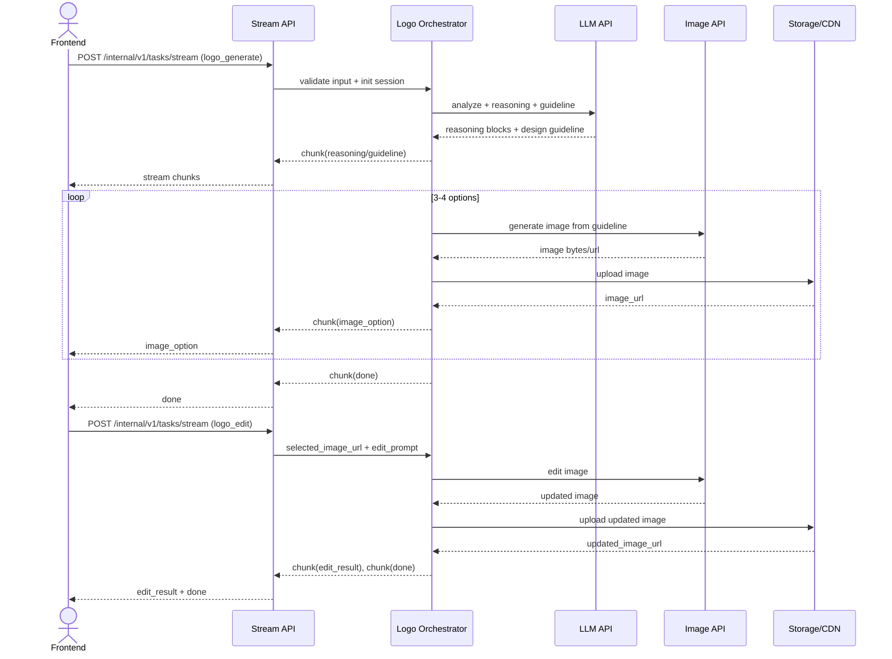

# Logo Design AI POC

## 1. Overview

### 1.1 Muc tieu POC

POC xay dung Logo Design Service theo flow chat-first:

- Input: query (text va co the kem image reference).
- Backend: phan tich yeu cau, tao reasoning + design guideline, generate 3-4 logo options, cho phep edit bang prompt.
- Output: image URLs (PNG 1024x1024 toi thieu) va edit summary.

Muc tieu nghiep vu:

- Chung minh user co the hoan thanh full flow: request -> analyze -> guideline -> generate -> select -> edit -> regenerate.
- Chung minh reasoning hien thi la huu ich va de hieu.
- Chung minh edit flow don gian, khong can region editing.

### 1.2 Success metrics

- >= 90% request tra ve design guideline truoc khi generate image.
- >= 90% request tra ve du 3-4 logo options.
- >= 85% phien hoan thanh full flow ma khong can restart session.
- >= 85% edit request cho ket qua phan anh dung y chinh sua va giu concept.
- p95 time to first reasoning chunk <= 1.5s.
- p95 time to complete 3-4 logo outputs <= 25s.
- Loi generation/edit tra ve ly do + retry guidance <= 3s.

### 1.3 Technical constraints

- Chi dung single image model trong POC.
- Khong build rule engine cung; uu tien schema-driven va prompt-driven.
- Khong lam touch edit/smart mark/region-level editing trong phase nay.
- Session la single-session, khong can cross-session persistence.
- Stream API la kenh chinh de FE nhan reasoning va ket qua incrementally.

---

## 2. POC Scope

### 2.1 Build vs Defer

| Area | Build (POC) | Defer |
| :--- | :--- | :--- |
| Intent + Input | Detect logo intent, parse text/reference image, extract brand context | Intent classifier mo rong da nganh |
| Clarification | Ask clarification khi thieu du lieu, cho phep skip + assumptions | Adaptive multi-turn clarification policy |
| Reasoning | Stream reasoning blocks: input understanding, style inference, assumptions | Advanced self-critique/multi-agent debate |
| Guideline | Tao design guideline co cau truc truoc generation | Auto-optimization guideline bang evaluator loop |
| Generation | Generate 3-4 logo PNG options tu guideline | Multi-model routing, auto ranking |
| Editing | Prompt-based edit tren selected logo, tra edit summary | Region/object editing chi tiet |
| Follow-up | Tra quick follow-up suggestions sau generation/edit | Intelligent recommendation engine ca nhan hoa |
| Storage/Session | Luu output URL + metadata theo request/session | Version history, project library, long-term memory |

---

## 3. System Architecture

### 3.1 Agent pipeline

1. Intent Gate
   - Xac dinh request co phai logo design khong.
2. Input Analysis
   - Trich xuat brand context tu text va optional image reference.
3. Clarification Gate
   - Neu thieu thong tin: hoi clarification.
   - Neu user skip: tao assumptions co giai thich.
4. Planning & Reasoning
   - Agent lap ke hoach generation va stream reasoning cho FE.
5. Guideline Synthesis
   - Tao design guideline co cau truc (style, color, typography, icon, constraints).
6. Logo Generation
   - Goi image provider de tao 3-4 options.
7. Selection & Editing
   - User chon 1 option -> gui edit prompt.
8. Regeneration
   - Goi image edit provider -> tra updated image + edit summary.
9. Follow-up Suggestions
   - Tra quick actions de user tiep tuc refine.

### 3.2 Logical components

- Communication Layer
  - REST/gRPC gateway cua ai-hub-sdk.
  - Stream endpoint la default.
- Orchestrator
  - Quan ly state theo request/session.
  - Dieu phoi task va tool calls.
  - Dam bao thu tu chunk theo sequence.
- Task Layer
  - logo_analyze
  - logo_generate
  - logo_edit
- Tool Layer
  - BrandContextTool
  - ImageReferenceAnalysisTool (optional in POC path)
  - GuidelineBuilderTool
  - ImageGenerationTool
  - ImageEditTool
  - FollowUpSuggestionTool
- Model Layer
  - LLM cho planning/reasoning/guideline.
  - Single image model cho generation/edit.
- Infra/Observability
  - Object storage/CDN cho image output.
  - Tracing + latency/cost logging.

### 3.3 Sequence diagram



---

## 4. Data Schema & API Integration

### 4.1 Pydantic models theo tung buoc

```python
from typing import Any, Dict, List, Literal, Optional
from pydantic import BaseModel, Field, HttpUrl


class ReferenceImage(BaseModel):
    source_url: Optional[HttpUrl] = None
    storage_key: Optional[str] = None


class BrandContext(BaseModel):
    brand_name: Optional[str] = None
    industry: Optional[str] = None
    style_preference: List[str] = Field(default_factory=list)
    color_preference: List[str] = Field(default_factory=list)
    symbol_preference: List[str] = Field(default_factory=list)


class Assumption(BaseModel):
    key: str
    value: str
    reason: str


class ClarificationQuestion(BaseModel):
    key: str
    question: str
    required: bool = False


class DesignGuideline(BaseModel):
    concept_statement: str
    style_direction: List[str]
    color_palette: List[str]
    typography_direction: List[str]
    icon_direction: List[str]
    constraints: List[str]
    assumptions: List[Assumption] = Field(default_factory=list)


class LogoGenerateInput(BaseModel):
    session_id: str
    query: str
    references: List[ReferenceImage] = Field(default_factory=list)
    allow_skip_clarification: bool = True
    variation_count: int = Field(default=4, ge=3, le=4)
    output_format: Literal["png"] = "png"
    output_size: Literal["1024x1024"] = "1024x1024"


class LogoOption(BaseModel):
    option_id: str
    image_url: HttpUrl
    prompt_used: Optional[str] = None
    seed: Optional[int] = None
    quality_flags: List[str] = Field(default_factory=list)


class LogoGenerateOutput(BaseModel):
    guideline: DesignGuideline
    options: List[LogoOption]


class LogoEditInput(BaseModel):
    session_id: str
    selected_option_id: str
    selected_image_url: HttpUrl
    edit_prompt: str
    guideline: DesignGuideline


class LogoEditOutput(BaseModel):
    updated_image_url: HttpUrl
    edit_summary: str
    preserved_elements: List[str] = Field(default_factory=list)


class StreamEnvelope(BaseModel):
    request_id: str
    session_id: str
    task_type: Literal["logo_analyze", "logo_generate", "logo_edit"]
    status: Literal["processing", "completed", "failed"]
    chunk_type: Literal[
        "reasoning", "clarification", "guideline", "image_option",
        "edit_result", "suggestion", "warning", "error", "done"
    ]
    sequence: int
    payload: Dict[str, Any] = Field(default_factory=dict)
    metadata: Dict[str, Any] = Field(default_factory=dict)
```

Validation rules:

- query bat buoc khong rong sau trim.
- variation_count chi cho phep 3 hoac 4.
- edit flow bat buoc selected image + edit prompt.
- khi skip clarification, assumptions phai duoc tra ve trong guideline.

### 4.2 External APIs goi o dau

- LLM API
  - logo_analyze: intent detection, input understanding, style inference.
  - logo_generate: tao guideline va reasoning blocks.
- Vision API (optional)
  - phan tich image references de trich style/color/iconography.
- Image API
  - logo_generate: tao 3-4 logo options.
  - logo_edit: regenerate image theo edit prompt tren selected logo.

### 4.3 I/O cu the theo endpoint

- POST /internal/v1/tasks/stream (task_type=logo_generate)
  - Input:
    - query
    - session_id
    - references (optional)
    - variation_count (optional, 3-4)
  - Output stream:
    - clarification (neu can)
    - reasoning
    - guideline
    - image_option x 3-4
    - suggestion
    - done

- POST /internal/v1/tasks/stream (task_type=logo_edit)
  - Input:
    - session_id
    - selected_option_id
    - selected_image_url
    - edit_prompt
    - guideline
  - Output stream:
    - reasoning
    - edit_result
    - suggestion
    - done

- Optional async fallback
  - POST /internal/v1/tasks/submit
  - GET /internal/v1/tasks/{task_id}/status

---

## 5. Risks & Open Issues

### 5.1 Latency

Risk:

- Generate 3-4 images co the vuot p95 target.

Mitigation:

- Stream reasoning som de FE co progress feedback.
- Parallel generation neu provider ho tro.
- Timeout + 1 lan retry cho transient failures.
- Near-timeout fallback tu 4 ve 3 options.

### 5.2 Generation quality

Risk:

- Output khong sat guideline hoac co artifact (noise/text loi/pixelation).

Mitigation:

- Quality flags theo moi logo option.
- Prompt template guideline-first nhat quan.
- Return warning + goi y edit tiep neu ket qua chua dat ky vong.

### 5.3 Cost

Risk:

- Cost tang nhanh do ket hop LLM + image generation + nhieu lan edit.

Mitigation:

- Theo doi cost theo request_id/session_id.
- Gioi han so lan edit trong POC.
- Tai su dung guideline/context trong session de giam goi model khong can thiet.

### 5.4 Open technical decisions

- Chot kenh stream chinh cho FE production: NDJSON hay gRPC stream.
- Chinh sach TTL/signed URL cho image output.
- Co can deterministic seed de edit consistency khong.
- Muc do quality gate: hard fail hay soft warning.
