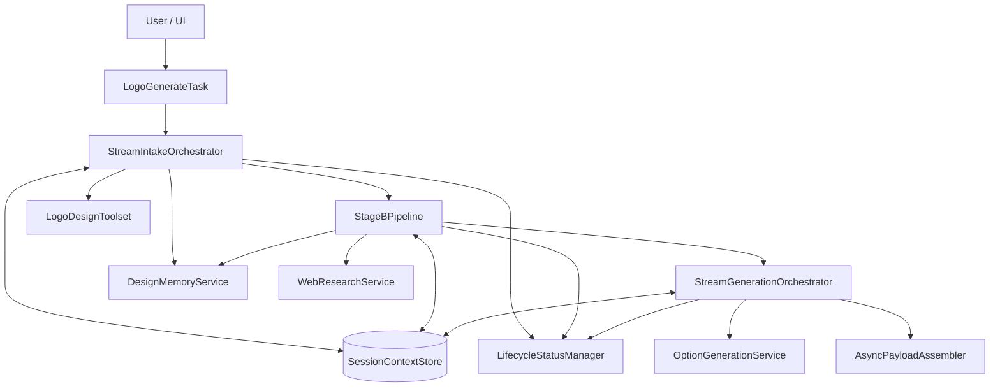
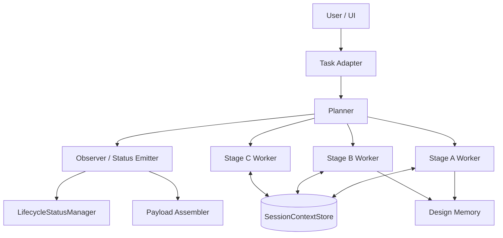

# Tóm tắt cấu trúc source hệ thống Logo Design

Tài liệu này tổng hợp cách source hiện tại đang tổ chức, từng file/hàm chính làm gì, và nếu refactor theo mô hình Planner / Worker / Observer thì nên tách ra như thế nào.

## 1. Kết luận nhanh

Source hiện tại không đi theo mô hình Planner / Task Worker / Observer như một requirement cứng của SDK. Nó đang đi theo mô hình orchestrator-centric:

- `LogoGenerateTask` là lớp bọc SDK mỏng.
- Stage A, B, C được tách thành các orchestrator riêng.
- `LifecycleStatusManager` và các chunk status đóng vai trò observer/status emitter.
- `SessionContextStore` giữ checkpoint theo `session_id`.

Nói ngắn gọn: hiện tại đã đúng contract và đủ rõ cho POC, nhưng nếu muốn code dễ test hơn và tách trách nhiệm sắc hơn thì refactor theo Planner / Worker / Observer là hợp lý.

---

## 2. Sơ đồ hiện tại

### Ý nghĩa sơ đồ hiện tại

- `LogoGenerateTask` chỉ làm nhiệm vụ adapter cho AI Hub SDK.
- `StreamIntakeOrchestrator` xử lý Stage A: intent, extraction, merge context, gate required fields, clarification.
- `StageBPipeline` xử lý Stage B: web research và guideline inference.
- `StreamGenerationOrchestrator` xử lý Stage C: sinh options và build payload completed.
- `LifecycleStatusManager` chuẩn hóa status chunk/progress.
- `DesignMemoryService` ghi snapshot audit/trace.

---

## 3. Từng file hiện đang làm gì

## 3.1 Task adapter

### `source/tasks/logo_generate.py`

Đây là entrypoint của task `logo_generate`.

#### Các lớp / hàm chính

- `LogoGenerateTaskOutput`: schema output cho stream task.
- `LogoGenerateTask`: adapter triển khai `BaseTask`.
- `LogoGenerateTask.initialize()`: khởi tạo singleton service cho worker.
- `LogoGenerateTask.cleanup()`: giải phóng singleton khi shutdown.
- `LogoGenerateTask.stream_process()`: chạy toàn bộ flow stream, wrap chunk thành `LogoGenerateTaskOutput`.
- `register_tasks()`: registry tương thích cho bootstrap/test cũ.

#### Tác dụng thực tế

File này không chứa nghiệp vụ domain nặng. Nó chỉ:

- nhận input schema của SDK,
- khởi tạo service dùng chung,
- gọi Stage A/B/C theo thứ tự,
- chuyển chunk sang format mà SDK hiểu.

---

## 3.2 Stage A

### `source/services/stage_a/orchestrator.py`

Đây là nơi xử lý intake và clarification.

#### Các lớp / hàm chính

- `StreamIntakeOrchestrator`: orchestrator chính của Stage A.
- `_next_task_id()`: sinh task id stream.
- `_merge_explicit_with_extracted()`: merge explicit input với context trích xuất.
- `_summarize_context()`: tạo chuỗi tóm tắt context để debug/status.
- `_evaluate_gate()`: kiểm tra `brand_name` và `industry`.
- `build_status()`: wrap `LifecycleStatusManager` thành dict chunk.
- `emit_with_delay()`: thêm delay nhỏ giữa các chunk stream.
- `_build_clarification_payload()`: build payload clarification khi thiếu field.
- `iter_chunks()`: luồng chính Stage A/B stream.
- `handle()`: chạy stream xong và trả payload cuối cùng.

#### Tác dụng thực tế

Stage A làm 4 việc:

1. detect intent.
2. extract input + analyze reference.
3. merge context theo precedence.
4. gate required fields và tạo clarification nếu thiếu.

Điểm quan trọng hiện tại:

- `InputExtractionTool` và `ReferenceImageAnalyzeTool` đang chạy song song bằng `asyncio.gather()` sau khi intent pass.
- Nếu thiếu `brand_name` hoặc `industry`, flow dừng ở clarification thay vì đi tiếp Stage B.

---

### `source/services/stage_a/toolset.py`

Đây là bộ tool domain của Stage A.

#### Nhiệm vụ chính

- detect intent logo,
- extract brand/context từ query,
- analyze reference images,
- đề xuất câu hỏi clarification,
- infer guideline ở đầu Stage B.

#### Ý nghĩa

`toolset` là lớp “thực thi domain logic” cho orchestrator. Orchestrator quyết định thứ tự, còn toolset làm phần xử lý nội dung.

---

### `source/services/stage_a/checkpoint.py`

#### Hàm chính

- `persist_with_cas()`: ghi checkpoint vào `SessionContextStore` theo kiểu compare-and-set.

#### Tác dụng thực tế

- Tránh overwrite checkpoint cũ khi có version conflict.
- Giữ `session_id` có thể resume cho clarification follow-up.

---

## 3.3 Stage B

### `source/services/stage_b/orchestrator.py`

Đây là nơi xử lý web research và guideline inference.

#### Các thành phần chính

- `missing_research_enrichment_fields()`: xác định field optional nào còn thiếu để request research hợp lý hơn.
- `StageBPipeline`: orchestrator của Stage B.
- `iter_chunks()`: chạy research, phân tích, infer guideline, rồi checkpoint.

#### Tác dụng thực tế

Stage B làm 3 việc:

1. gọi research theo industry/context,
2. lọc và phân tích ảnh fetchable,
3. tạo `DesignGuideline` rồi lưu checkpoint.

Điểm đáng chú ý:

- Stage B chỉ chạy sau khi gate Stage A pass.
- Đây là stage network-heavy nhất, nên latency và error handling là vùng cần chú ý nhất.

---

### `source/services/stage_b/web_research_service.py`

#### Nhiệm vụ

- build query,
- gọi search backend,
- normalize kết quả,
- dedupe,
- lọc ảnh fetchable,
- tạo research context đầu vào cho guideline.

#### Tác dụng thực tế

Đây là lớp “research ingestion” trước khi đi vào phân tích LLM.

---

## 3.4 Stage C

### `source/services/stage_c/orchestrator.py`

Đây là nơi sinh logo options và hoàn thiện payload cuối.

#### Các lớp / hàm chính

- `StreamGenerationOrchestrator`: orchestrator Stage C.
- `iter_chunks()`: kiểm tra guideline đã có chưa, emit generation_started, sinh options, rồi build completed payload.

#### Tác dụng thực tế

- load `latest_guideline` từ session,
- fail nếu guideline chưa có,
- sinh option theo `variation_count`,
- gom kết quả và trả `completed` chunk.

---

### `source/services/stage_c/generator.py`

#### Nhiệm vụ

- sinh từng option logo,
- upload asset,
- trả metadata cho mỗi option.

#### Tác dụng thực tế

Đây là lớp thực thi generation thật, còn `StreamGenerationOrchestrator` chỉ điều phối và stream status.

---

## 3.5 Shared services

### `source/services/shared/lifecycle_status.py`

#### Các phần chính

- `LifecycleStatusManager`: chuẩn hóa progress/status.
- `resolve_progress()`: tính progress hợp lệ 0..100.
- `build_status_response()`: build `JobStatusResponse`.

#### Tác dụng thực tế

Đây là lớp “observer/status emitter” ở mức kỹ thuật. Nó không quyết định business flow, nhưng quyết định format chunk và trạng thái hiển thị.

---

### `source/services/shared/payload_assembler.py`

#### Lớp chính

- `AsyncPayloadAssembler`.
- `build_completed()`: build payload final completed cho Stage C.

#### Tác dụng thực tế

Nó gom guideline + required_field_state + options thành payload cuối hợp đồng.

---

### `source/services/shared/design_memory.py`

#### Lớp chính

- `DesignMemoryService`.
- `persist_async()`: ghi trace snapshot theo topic/session.

#### Tác dụng thực tế

Đây là lớp audit/trace projection. Nó không phải source of truth để restore runtime state sau restart.

---

## 4. Sơ đồ sau khi refactor

Nếu refactor theo concept Planner / Worker / Observer, mình sẽ tách như sau:

### Ý nghĩa của từng vai trò sau refactor

#### Planner

- Chỉ quyết định bước tiếp theo.
- Không trực tiếp gọi provider hoặc xử lý dữ liệu nặng.
- Là nơi đặt rules: intent, gate, clarification, stage handoff.

#### Worker

- Chỉ làm việc chuyên môn của từng stage.
- Ví dụ:
  - Stage A worker: detect/extract/merge/gate.
  - Stage B worker: research/infer guideline.
  - Stage C worker: generate/upload.

#### Observer

- Chỉ lo status, progress, chunk format, error mapping.
- Không chứa business logic.

---

## 5. Khác nhau giữa hiện tại và refactor

### Hiện tại

- Orchestrator vừa có vai trò lập kế hoạch, vừa điều phối, vừa emit chunk.
- Task adapter vẫn cần biết đủ nhiều về flow stream.
- Status chunk và business flow được trộn trong cùng lớp ở một số chỗ.

### Sau refactor

- `TaskAdapter` mỏng hơn nữa.
- `Planner` tách logic quyết định flow ra khỏi logic thực thi.
- `Worker` tách rõ xử lý domain.
- `Observer` gom toàn bộ status/progress/error payload.
- Dễ test unit theo từng vai trò hơn.

---

## 6. Gợi ý refactor thực tế

Nếu làm từng bước, thứ tự hợp lý là:

1. Tách planner nội bộ từ `StreamIntakeOrchestrator`.
2. Tách status emitter/observer riêng khỏi orchestrator.
3. Giữ Stage A/B/C worker theo interface chung.
4. Chuẩn hóa input/output delta giữa planner và worker.
5. Chỉ khi thật cần mới tách tiếp sang service/process riêng.

Cách này ít rủi ro hơn so với rewrite toàn bộ kiến trúc ngay lập tức.

---

## 7. Kết luận

Bản chất source hiện tại là:

- task adapter mỏng,
- orchestrator làm planner + coordinator,
- stage services làm worker,
- lifecycle manager/payload assembler làm observer/status layer.

Nếu mục tiêu là POC và code đang chạy ổn, kiến trúc hiện tại chấp nhận được. Nếu mục tiêu là codebase dễ mở rộng và dễ test hơn, refactor theo Planner / Worker / Observer là hướng nên đi, nhưng nên làm theo từng lớp trách nhiệm thay vì tách service vật lý ngay từ đầu.
