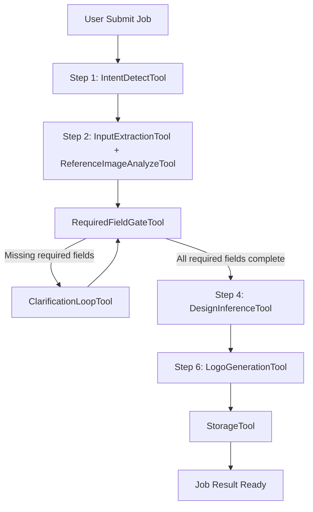
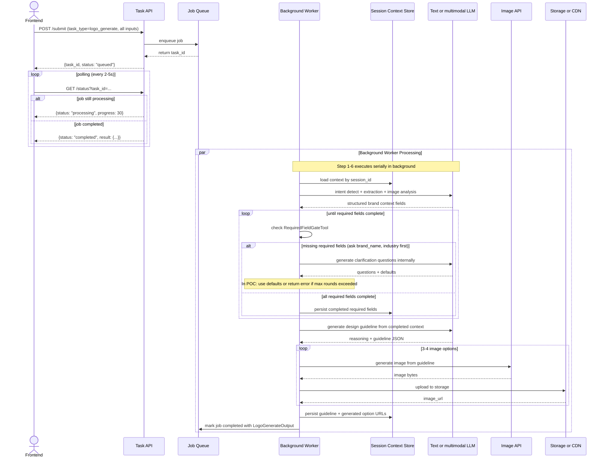

# Logo Design AI POC

## 1. Overview

### 1.1 POC objective

This POC builds a backend-driven Logo Design Service using an async job-based workflow and only covers Step 1 -> Step 6 from spec.

POC in-scope flow:

- Step 1: Detect logo design intent.
- Step 2: Extract and analyze user inputs (text/reference image).
- Step 3: Clarify in loop until required fields are complete.
- Step 4: Analyze request and infer design guideline.
- Step 6: Generate 3-4 logo options.

Out of scope for this POC:

- Step 7: Prompt-based logo editing.
- Step 8: Follow-up suggestions.

Business validation goals:

- Prove users can submit a request and receive complete output (guideline + options) in one async job.
- Prove strict clarification loop improves output quality consistency.
- Prove async execution provides simple input-output contract for FE integration.

### 1.2 Success metrics (POC acceptance targets)

These are committed Phase 1 POC targets for Step 1 -> Step 6 only.

- >= 90% requests produce valid `guideline` before image generation starts.
- >= 90% requests satisfy must-have fields before generation.
- >= 85% requests return 3-4 valid logo options.
- p95 job completion time <= 30s.
- p95 time to first status update (enter processing) <= 5s.
- On failure, actionable error and retry hint returned <= 5s.

### 1.3 Technical constraints

- Primary endpoints: async `POST /internal/v1/tasks/submit` and `GET /internal/v1/tasks/{task_id}/status`.
- Primary task type for this POC: `logo_generate`.
- Clarification is strict: generation must not run until required fields are complete.
- Required fields (mandatory before generation):
  - `brand_name` (company/product name)
  - `industry` (business category or context)
  - At least one `style_preference`
  - At least one `color_preference`
- Single job submission: input all parameters at once, receive full output (guideline + option URLs) on completion.
- Session scope is per `session_id` with optional short-term memory reuse across multiple job submissions.
- No separate rule engine; behavior is schema-driven + prompt-driven + tool-adapter driven.
- Provider switching must not change task semantics or output contract.

---

## 2. POC Scope

### 2.1 Build vs Defer

| Area | Build (POC) | Defer |
| :--- | :--- | :--- |
| Intent + input | Detect logo intent, parse text/references, extract brand context | Multi-domain intent classifier |
| Clarification | Mandatory clarification loop until required fields are complete | Adaptive personalized questioning policy |
| Reasoning | Internal reasoning for extraction and inference | Multi-agent self-critique loops |
| Guideline | Generate structured design guideline before generation | Automatic guideline optimization loop |
| Generation | Generate 3-4 PNG options from guideline | Auto model-routing and ranking |
| Storage/session | Persist output URLs + session context per `session_id` | Project library, version history, long-term memory |
| Editing | Deferred | Step 7 in next phase |
| Follow-up suggestion | Deferred | Step 8 in next phase |

---

## 3. System Architecture

### 3.1 Overview

#### 3.1.1 Why this solution

This architecture is designed for strict quality gating in POC with simple async job semantics: submit once, get complete output.

Key reasons:

1. Clarification loop enforces required design inputs before generation begins.
2. Async execution keeps FE simple: submit job, poll status, render output when ready.
3. All processing happens server-side; FE does not hold the connection.
4. Session context is explicit and propagated between tools for deterministic behavior.

#### 3.1.2 Diagram 1 - Agent pipeline (flowchart)



#### 3.1.3 Diagram 2 - System components (layered)


### 3.2 Architecture principles

- Task-first:
  - Business capability exposed as `logo_generate` in this phase.
  - Routing by `task_type`, no endpoint-specific business hardcoding.
- Schema-first:
  - All contracts validated by Pydantic.
  - Required-field gate is encoded as schema and validator rules.
- Async job-based:
  - `POST /internal/v1/tasks/submit` accepts complete input once.
  - `GET /internal/v1/tasks/{task_id}/status` polls for result.
  - FE receives deterministic JSON output when ready, no streaming chunks.
- Context-first tool handoff:
  - Every tool invocation receives the same `SessionContextState` snapshot.
  - Tool swap must preserve context I/O contract, not implicit memory.

### 3.3 Component breakdown (tool-level)

| Component or Tool | Spec step | Role | Model Type | Notes |
| :--- | :--- | :--- | :--- | :--- |
| IntentDetectTool | Step 1 | Detect logo design intent and route flow | Low-latency text LLM | Deterministic classifier |
| InputExtractionTool | Step 2 | Extract brand_name, industry, style, color, symbol from text | Text LLM with structured output | Returns structured JSON |
| ReferenceImageAnalyzeTool | Step 2 | Analyze reference image style/color/typography/iconography | Multimodal LLM | Optional when references provided |
| RequiredFieldGateTool | Step 3 | Validate required fields completeness (brand_name, industry, style_preference, color_preference) | Deterministic validator | Signals missing fields or gate pass |
| ClarificationLoopTool | Step 3 | Ask targeted questions only for missing required fields; prioritize brand_name + industry | Text LLM for question generation | Loop until gate passes or max rounds reached |
| DesignInferenceTool | Step 4 | Infer final guideline from completed context | Text LLM for design reasoning | Returns guideline JSON |
| LogoGenerationTool | Step 6 | Generate 3-4 logo options | Fast image generation model | Throughput-optimized |
| StorageTool | Shared | Upload images and return URLs | Cloud storage API | Used by generation |
| SessionContextTool | Shared | Read/update context snapshot per job | Context adapter over cache or DB | Required for deterministic tool swap |

### 3.4 End-to-end pipeline

POC exposes one external task type: `logo_generate`.

#### 3.4.1 Full sequence (Step 1 -> Step 6, async)



#### 3.4.2 Stage A - Intake and mandatory clarification loop (Step 1-3)

| Item | Detail |
| :--- | :--- |
| Input | `LogoGenerateInput` (query, references, session_id, allow_defaults) |
| Tools used | IntentDetectTool, InputExtractionTool, ReferenceImageAnalyzeTool, RequiredFieldGateTool, ClarificationLoopTool |
| Output | Structured fields JSON (after clarification completes) |
| Gate | Must pass required-field gate before Step 4 |
| Target | Complete within first 10s of job start |

#### 3.4.3 Stage B - Request analysis and guideline inference (Step 4)

| Item | Detail |
| :--- | :--- |
| Input | Completed required fields + optional context |
| Tools used | DesignInferenceTool |
| Output | DesignGuideline JSON |
| Target | Guideline coverage >= 90% |

#### 3.4.4 Stage C - Logo generation (Step 6)

| Item | Detail |
| :--- | :--- |
| Input | guideline + variation_count |
| Tools used | LogoGenerationTool, StorageTool |
| Output | LogoGenerateOutput with 3-4 option URLs |
| Target | 3-4 valid outputs >= 85%, generation <= 30s total per job |

#### 3.4.5 Async job execution strategy

POC uses pure async (simple input-output model):

- Submit once: `POST /internal/v1/tasks/submit` with complete input.
- Poll for result: `GET /internal/v1/tasks/{task_id}/status` (simple short-polling recommended for POC).
- Single output: result contains full guideline + option URLs when job completes.

Why this is simple for POC:

1. No streaming protocol complexity on FE (no NDJSON or gRPC streaming).
2. Clarification loop runs entirely server-side; if user input is incomplete, system fills defaults or errors after max rounds.
3. FE logic is straightforward: submit, poll, render.
4. Perfect for learning: output contract is deterministic JSON, not chunk-by-chunk parsing.

Note on clarification in async mode:

- Clarification questions are processed server-side, not returned to FE as interactive chunks.
- If required fields are missing after extraction, the system can either:
  - Apply default assumptions and continue (if `allow_defaults=true`)
  - Return a clarification error with missing field list and retry hint
- For POC, recommend: clarify-then-default for brand_name/industry, return error if style_preference or color_preference are fully missing.

#### 3.4.6 Session context and tool swap contract

Design rule:

- Tool swap is allowed only if input/output context contract is unchanged.

Mandatory context handoff on every tool call:

- `session_id`
- `required_field_state` (missing keys, rounds, passed/not)
- latest extracted `BrandContext`
- latest approved `DesignGuideline` (if available)
- `allow_defaults` flag
- `sequence` counter

Implementation notes:

- Worker owns task execution state for single job.
- SessionContextTool persists snapshot at key checkpoints (after gate passes, after guideline generated).
- Each tool reads context snapshot and returns delta updates.
- Worker merges deltas and advances task state.

### 3.5 Reuse and extensibility

- Add fields in extraction or guideline:
  - Extend schema and prompt templates only.
  - API contract stays unchanged.
- Add edit phase in next release:
  - Register `logo_edit` task type and add Stage D for Step 7.
  - Reuse same context and job semantics.
- Add provider:
  - Replace generation adapter only.
  - No change in worker state machine.

---

## 4. Data Schema and API Integration

### 4.1 Pydantic models by stage

```python
from typing import Any, Dict, List, Literal, Optional
from pydantic import BaseModel, Field, HttpUrl


class ReferenceImage(BaseModel):
    source_url: Optional[HttpUrl] = None
    storage_key: Optional[str] = None


class BrandContext(BaseModel):
    brand_name: Optional[str] = None
    industry: Optional[str] = None
    style_preference: List[str] = Field(default_factory=list)
    color_preference: List[str] = Field(default_factory=list)
    symbol_preference: List[str] = Field(default_factory=list)


class ClarificationQuestion(BaseModel):
    key: str
    question: str
    required: bool = True


class RequiredFieldState(BaseModel):
    required_keys: List[str] = Field(default_factory=lambda: [
        "brand_name",      # Company or product name (mandatory)
        "industry",        # Business category or context (mandatory)
        "style_preference",  # At least one style preference (mandatory)
        "color_preference",  # At least one color preference (mandatory)
    ])
    missing_keys: List[str] = Field(default_factory=list)
    passed: bool = False
    clarification_round: int = 0
    # Note: clarify brand_name and industry first, then style + color


class DesignGuideline(BaseModel):
    concept_statement: str
    style_direction: List[str]
    color_palette: List[str]
    typography_direction: List[str]
    icon_direction: List[str]
    constraints: List[str]


class SessionContextState(BaseModel):
    session_id: str
    latest_brand_context: Optional[BrandContext] = None
    latest_guideline: Optional[DesignGuideline] = None
    required_field_state: RequiredFieldState = Field(default_factory=RequiredFieldState)
    generated_option_ids: List[str] = Field(default_factory=list)


class LogoGenerateInput(BaseModel):
    session_id: str
    query: str
    references: List[ReferenceImage] = Field(default_factory=list)
    use_session_context: bool = True
    allow_defaults: bool = False  # If true, auto-fill missing fields with defaults
    max_clarification_rounds: int = Field(default=3, ge=1, le=5)
    variation_count: int = Field(default=4, ge=3, le=4)
    output_format: Literal["png"] = "png"
    output_size: Literal["1024x1024"] = "1024x1024"


class LogoOption(BaseModel):
    option_id: str
    image_url: HttpUrl
    prompt_used: Optional[str] = None
    seed: Optional[int] = None
    quality_flags: List[str] = Field(default_factory=list)


class LogoGenerateOutput(BaseModel):
    guideline: DesignGuideline
    required_field_state: RequiredFieldState
    options: List[LogoOption]


class JobSubmitResponse(BaseModel):
    task_id: str
    status: Literal["queued"]
    created_at: str  # ISO8601


class JobStatusResponse(BaseModel):
    task_id: str
    status: Literal["queued", "processing", "completed", "failed"]
    progress_percent: Optional[int] = None  # 0-100 if processing
    result: Optional[LogoGenerateOutput] = None  # populated when completed
    error: Optional[str] = None  # populated when failed
    retry_after_seconds: Optional[int] = None  # populated when failed
```

Validation rules:

- `query` is required and non-empty after trim.
- `variation_count` must be 3 or 4.
- Required-field gate must pass before `guideline` and `options` are generated.
- If `use_session_context=true`, backend merges request with stored context for same `session_id`.
- If `max_clarification_rounds` is reached and required fields still missing, return error with missing key list.
- If `allow_defaults=true`, missing style_preference and color_preference use template defaults.

### 4.2 External APIs and model selection

Model selection strategy:

- Text models: choose by latency, reasoning quality, and cost.
- Image models: choose by generation speed, quality fidelity, and throughput.
- Fallback path: maintain secondary provider to reduce lock-in and improve reliability.

Reference docs:

- Google Gemini API docs: https://ai.google.dev/gemini-api/docs
- Google Imagen docs: https://ai.google.dev/gemini-api/docs/imagen
- Google Nano Banana docs: https://ai.google.dev/gemini-api/docs/image-generation
- Google pricing docs: https://ai.google.dev/gemini-api/docs/pricing
- OpenAI pricing docs: https://openai.com/api/pricing/
- OpenAI models docs: https://platform.openai.com/docs/models

### 4.3 Concrete endpoint I/O

- `POST /internal/v1/tasks/submit` (submit job)
  - Input:
    - `task_type` (required: `logo_generate`)
    - `session_id` (required)
    - `query` (required: user request)
    - `references` (optional: list of ReferenceImage)
    - `use_session_context` (optional, default true)
    - `allow_defaults` (optional, default false)
    - `max_clarification_rounds` (optional)
    - `variation_count` (optional, default 4, range 3-4)
    - `output_format` (optional, default "png")
    - `output_size` (optional, default "1024x1024")
  - Output (JobSubmitResponse):
    ```json
    {
      "task_id": "uuid",
      "status": "queued",
      "created_at": "2026-03-24T12:00:00Z"
    }
    ```

- `GET /internal/v1/tasks/{task_id}/status` (check job status)
  - Query params: `task_id`
  - Output (JobStatusResponse, while processing):
    ```json
    {
      "task_id": "uuid",
      "status": "processing",
      "progress_percent": 45
    }
    ```
  - Output (JobStatusResponse, when completed):
    ```json
    {
      "task_id": "uuid",
      "status": "completed",
      "result": {
        "guideline": { /* DesignGuideline */ },
        "required_field_state": { /* RequiredFieldState */ },
        "options": [ /* List[LogoOption] */ ]
      }
    }
    ```
  - Output (JobStatusResponse, if failed):
    ```json
    {
      "task_id": "uuid",
      "status": "failed",
      "error": "reason (e.g., 'Required fields missing: style_preference, color_preference after 3 rounds')",
      "retry_after_seconds": 60
    }
    ```
  - Context behavior:
    - if `use_session_context=true`, system merges new query with stored context in same `session_id`
    - result metadata includes final `required_field_state`

### 4.4 Model benchmark by vendor (POC-oriented)

Important: prices and latency below are for planning and must be re-checked before release.

#### 4.4.1 Google models

Text Models

| Model | Input ($/ 1M tokens) | Output ($/ 1M tokens) | TTFB (typical) | Full response (typical) | Best for |
| :--- | :--- | :--- | :--- | :--- | :--- |
| `gemini-2.5-flash` | $0.30 | $2.50 | 0.5-1.2s | 2-6s | POC default for extraction, clarification, inference |
| `gemini-2.5-pro` | $1.25 (<=200k) | $10.00 (<=200k) | 1.0-2.5s | 4-12s | Higher-depth reasoning fallback |

Image Models

| Model | Pricing type | Unit price | Latency (per image) | Best for |
| :--- | :--- | :--- | :--- | :--- |
| `gemini-2.5-flash-image` | Per 1M tokens | $0.039 per 1024x1024 | 8-18s | Baseline fast generation |
| `gemini-3.1-flash-image-preview` | Per 1M tokens | ~$0.067 per 1024x1024 | 6-14s | POC primary for 3-4 option generation |
| `imagen-4.0-fast-generate-001` | Per image | $0.02 | 7-15s | Alternative fast path |
| `imagen-4.0-generate-001` | Per image | $0.04 | 10-20s | Alternative quality path |

#### 4.4.2 OpenAI models

Text Models

| Model | Input ($/ 1M tokens) | Output ($/ 1M tokens) | TTFB (typical) | Full response (typical) | Best for |
| :--- | :--- | :--- | :--- | :--- | :--- |
| `gpt-5.4-nano` | $0.20 | $1.25 | 0.3-0.9s | 1.5-5s | Cost-sensitive extraction |
| `gpt-5.4-mini` | $0.750 | $4.500 | 0.6-1.5s | 2-7s | POC fallback with strong structured output |
| `gpt-5.4` | $2.50 | $15.00 | 1.0-3.0s | 4-14s | High quality, high cost |

Image Models

| Model | Pricing type | Unit price | Latency (per image) | Best for |
| :--- | :--- | :--- | :--- | :--- |
| `gpt-image-1.5` | Output tokens | $32 per 1M tokens | 10-25s | Fallback image provider |

#### 4.4.3 POC model selection rationale

Recommended primary path:

- Text: `gemini-2.5-flash`
- Image generation: `gemini-3.1-flash-image-preview`

Recommended fallback path:

- Text: `gpt-5.4-mini`
- Image generation: `gpt-image-1.5`

Why this combination:

1. Async + low-latency text model supports fast initial clarification processing.
2. Main image model balances speed and quality for 3-4 options.
3. Fallback path provides resilience and reduces vendor lock-in.
4. This path aligns with p95 timing targets in Section 1.2.

---

## 5. Risks and open issues

### 5.1 Latency

Risk:

- Job completion may exceed p95 target depending on provider queue and clarification rounds.

Mitigation:

- Parallel image generation where provider permits.
- Timeout + retry for transient provider failures.
- Queue scaling policy when backlog grows.
- Circuit breaker for provider outages.

### 5.2 Clarification loop quality

Risk:

- Default assumptions may not match user intent; max rounds may be too strict or too loose.

Mitigation:

- Ask only for missing required fields.
- Prioritize brand_name + industry first, then style + color.
- Cap rounds by `max_clarification_rounds` and return actionable error with missing fields.
- Provide `allow_defaults=true` option for fast-path use cases.

### 5.3 Cost

Risk:

- Repeated clarification rounds and 3-4 image outputs increase cost per request.

Mitigation:

- Track cost per `task_id` and `session_id`.
- Cache extracted context in session and avoid redundant re-analysis.
- Keep benchmark table refreshed each milestone.

### 5.4 Open technical decisions

- Clarification fallback policy: hard fail on missing fields vs `allow_defaults=true` auto-fill with templates.
- Polling mechanism: simple HTTP polling vs webhook vs Server-Sent Events (SSE) for result notification.
- Signed URL TTL policy by asset type.
- Job result retention: how long to keep completed job results available.
- Session context TTL and reset policy (auto expiry only vs manual reset endpoint).
- Fine-tune required-field set for production (brand_name + industry mandatory vs optional industry).
