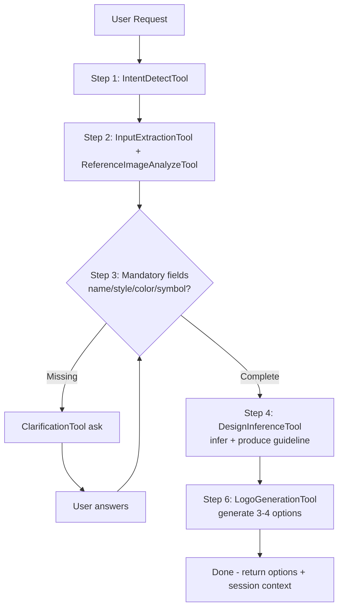
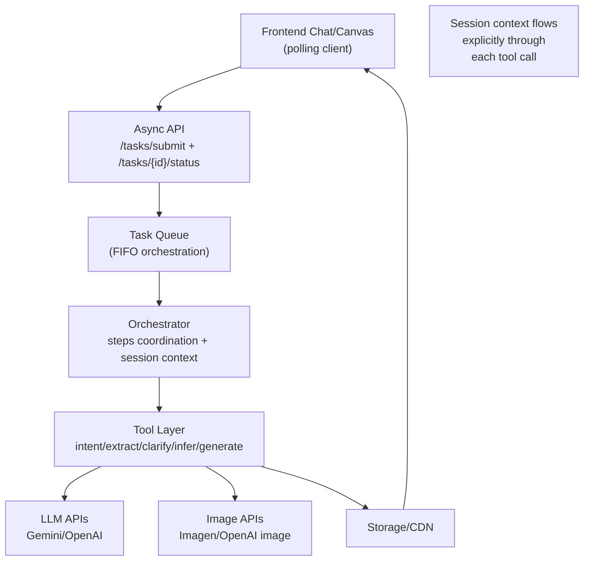

# Logo Design AI POC

## 1. Overview

### 1.1 POC objective

This POC builds a backend-driven Logo Design Service using an **async task-based** workflow.

- Input: user query (text, optional image references).
- Backend flow (simplified, 6 steps):
  1. Detect intent
  2. Extract/analyze inputs + reference images
  3. Clarify via **mandatory field validation loop** (new—replaces optional clarification + skip)
  4. Infer design direction + produce guideline (directly, no Step 5 selection)
  5. Generate 3-4 PNG options
  6. Return guideline + options + session context
- Output: structured guideline + 3-4 image URLs + updated session_context
- Edit (Step 7) and Follow-up (Step 8) **deferred to Phase 2**

Business validation goals:

- Prove users can request → analyze → get guideline → receive 3-4 options in one async flow
- Prove mandatory field validation produces consistently good guidelines (>= 85% quality)
- Prove visible reasoning is understandable and useful
- Prove session context threading works correctly across provider changes

### 1.2 Success metrics (POC acceptance targets)

These are committed POC acceptance targets (Phase 1 baseline) for the simplified 4-step async flow. Targets are intentionally buffered for implementation risk and can be tightened in a later phase.

**Analyze + Generate phase (Steps 1-6, async):**
- >= 85% of requests produce validated `guideline` after mandatory field loop completes
- >= 85% of requests return 3-4 valid logo options
- >= 100% of sessions that reach generation stage produce images without restart (no retry needed)
- p95 time for Steps 1-4 (analyze + infer) <= 2.5s
- p95 time for Step 6 (generate 3-4 options) <= 35s
- On clarification loop, user receives clear mandatory field questions within <= 2.5s
- On generation failure, actionable error message returned <= 5s

**Rationale**: Simplified POC (skip Step 5 direction selection, Steps 7-8 edit/follow-up) reduces orchestrator complexity. Clarification becomes **validation loop** (not optional), improving guideline quality from ground up. Async pattern with explicit session context threadsing makes each step independent and debuggable.

### 1.3 Technical constraints (POC-scoped)

- Primary endpoint pattern is **async (task submit + polling)**, not stream
  - Reason: Clarification loop naturally requires user interaction between steps; async with task resumption fits better than streaming
  - Session context is **explicitly passed** through all tool calls (input/output parameters), not hidden in stream state
- Out of scope in POC: 
  - Step 5 (DirectionProposalTool) - Removed, DesignInferenceTool infers single best direction
  - Step 7 (Edit) - Deferred to Phase 2
  - Step 8 (Follow-up) - Deferred to Phase 2
  - Touch edit, smart mark, region/object-level editing
- Clarification becomes **mandatory validation loop**:
  - Orchestrator keeps asking until all mandatory fields (`name`, `style`, `color`, `symbol`) satisfied
  - No skip-with-assumptions; every request must produce fully validated guideline
- Session scope: single session only, with short-term context memory reused across requests in the same `session_id`
- No separate rule engine; behavior is schema-driven + prompt-driven + tool-adapter driven
- Provider switching must not require changing FE polling contract or session context schema

---

## 2. POC Scope

### 2.1 Build vs Defer

| Area | Build (POC) | Defer |
| :--- | :--- | :--- |
| Intent + input | Detect logo intent, parse text/references, extract brand context | Multi-domain intent classifier |
| Clarification | Mandatory field validation loop: ask until `{name, style, color, symbol}` provided | Adaptive multi-turn clarification policy |
| Reasoning | Step 4 inference produces guideline directly; no separate direction selection | Multi-agent debate and self-critique loops |
| Guideline | Generate structured design guideline before generation (Step 4 output) | Auto-optimization guideline loop via evaluator |
| Direction selection | **SKIP - Removed**: DesignInferenceTool infers single best direction directly | Personalized auto-ranking per user profile |
| Generation | Generate 3-4 PNG options from guideline (Step 6) | Multi-model routing and automatic quality ranking |
| Editing | **SKIP - Deferred to Phase 2** | Region/object-level editing, prompt-based refinement |
| Follow-up | **SKIP - Deferred to Phase 2** | Personalized recommendation engine |
| Storage/session | Persist guideline + image URLs + session context state per `session_id` | Project library, version history, long-term memory |

---

## 3. System Architecture

### 3.1 Overview

#### 3.1.1 Why this solution

This architecture is chosen to match the full spec execution logic (Step 1,2,3,4,5,6,7,8) while keeping the backend reusable and FE-independent.

Key reasons:

1. Every spec step has explicit tool boundary and ownership.
2. FE only needs stream rendering by chunk type and sequence.
3. Provider/model decisions are replaceable at adapter level.
4. Stream-first gives user-visible progress during long-running image operations.

#### 3.1.2 Diagram 1 - Agent pipeline (POC-scoped, simplified)



**POC-scoped design**: Removed Step 5 (DirectionProposalTool) and Steps 7-8 (Edit/Follow-up). Clarification becomes a **validation loop** until mandatory fields satisfied.

#### 3.1.3 Diagram 2 - System components (async pattern)



**Async advantages for POC**:
- No need for streaming protocol complexity
- Clarification loop naturally integrates with task resumption
- Each LLM step is independently retryable
- Session context state is **deterministic** at each checkpoint

### 3.2 Architecture principles (POC-optimized)

- Task-first:
  - Business capabilities are task-based (`logo_generate`)
  - Routing by `task_type`, no endpoint-specific business hardcoding
  - POC Phase 2 can add `logo_edit` as separate task_type
- Schema-first:
  - All contracts validated by Pydantic
  - New fields/features evolve by schema + prompt template extension
- Async-first (POC):
  - `POST /internal/v1/tasks/submit` returns task_id immediately
  - FE polls `GET /internal/v1/tasks/{task_id}/status` for results
  - Reason: Clarification loop requires user input; async fits naturally
  - Phase 2 can introduce streaming if needed for image output performance
- Tool abstraction + session context threading:
  - Orchestrator calls stable tool interfaces with **explicit session_context parameters**
  - Each tool receives session_context, updates it, returns updated copy
  - Provider/model switching only touches adapters
  - No hidden state mutations; session context is auditable at every step

### 3.3 Component breakdown (POC-scoped tools only)

| Component / Tool | Spec step | Role | Model Type | In POC? |
| :--- | :--- | :--- | :--- | :--- |
| IntentDetectTool | Step 1 | Detect logo design intent and route flow | Low-latency text LLM for classification | ✅ Yes |
| InputExtractionTool | Step 2 | Extract brand_name, industry, style, color, symbol from text | Text LLM with structured output capability | ✅ Yes |
| ReferenceImageAnalyzeTool | Step 2 | Analyze reference image style/color/typography/iconography | Multimodal LLM for image understanding | ✅ Yes (optional) |
| ClarificationTool | Step 3 | **Loop**: ask mandatory field questions until `{name, style, color, symbol}` all satisfied | Text LLM for question generation | ✅ Yes |
| AssumptionBuilderTool | Step 3 | Build explicit assumptions if user skips clarification | Text LLM for reasoning | ❌ Skipped |
| DesignInferenceTool | Step 4 | Infer best design direction and produce guideline from validated fields | Text LLM for design reasoning | ✅ Yes |
| DirectionProposalTool | Step 5 (optional) | Create 3-4 design directions for selection | Text LLM for option generation | ❌ Skipped |
| LogoGenerationTool | Step 6 | Generate 3-4 PNG options from guideline | Fast image generation model for exploration | ✅ Yes |
| LogoEditTool | Step 7 | Regenerate edited logo from edit prompt | High-fidelity image generation model | ❌ Deferred Phase 2 |
| FollowupSuggestionTool | Step 8 | Suggest next edits/actions | Text LLM for action suggestion | ❌ Deferred Phase 2 |
| StorageTool | Shared | Upload images and return signed URLs | Cloud storage API | ✅ Yes |

### 3.4 End-to-end pipeline

POC exposes 2 external task types only: `logo_generate` and `logo_edit`. Analyze is an internal stage within `logo_generate`.

#### 3.4.1 POC flow (Step 1 -> Step 6, async pattern)

```mermaid
sequenceDiagram
    actor FE as Frontend
    participant API as Async API
    participant QUEUE as Task Queue
    participant ORCH as Orchestrator
    participant LLM as Gemini 2.5 Flash
    participant IMG as Image API
    participant STO as Storage/CDN

    Note over FE,API: PHASE 1: SUBMIT (Async)
    FE->>API: POST /internal/v1/tasks/submit (logo_generate)
    API->>QUEUE: enqueue task_id + session_id + logo_generate request
    API-->>FE: return task_id + session_token

    Note over ORCH,LLM: PHASE 2: PROCESS (Orchestrator)
    QUEUE->>ORCH: dequeue task (logo_generate + session_context)
    ORCH->>LLM: Step 1 + 2: intent detect + extract
    LLM-->>ORCH: extracted brand_context

    loop Step 3: Clarification validation
        ORCH->>ORCH: check: has name, style, color, symbol?
        alt Missing mandatory fields
            ORCH-->>FE: emit chunk(clarification_needed) + session_token
            FE-->>API: user answers → re-submit with clarification_context
            QUEUE->>ORCH: resume task with updated context
        else Complete
            break All mandatory fields satisfied
        end
    end

    ORCH->>LLM: Step 4: design inference (produce guideline)
    LLM-->>ORCH: guideline + design direction

    loop Step 6: Generate 3-4 options
        ORCH->>IMG: generate image (variant i)
        IMG-->>ORCH: image bytes
        ORCH->>STO: upload image
        STO-->>ORCH: image_url
        ORCH->>ORCH: save to session_context
    end

    ORCH->>QUEUE: mark task complete
    FE->>API: GET /internal/v1/tasks/{task_id}/status
    API-->>FE: return guideline + 3-4 image URLs + updated session_context

    Note over FE,API: Task returned to FE; session_id ready for Phase 2 (future: edit/regeneration)
```

**Advantages of async pattern for POC:**
- Each LLM step is **independent and stateless** (easier to test/debug)
- Clarification loop naturally integrates with task resumption
- Session context **explicitly threaded** through task state
- Orchestrator can **parallelize image generation** within Step 6 without blocking API response

#### 3.4.2 Stage A - Analyze + Validate (Steps 1-4, POC-scoped)

| Item | Detail |
| :--- | :--- |
| Input | `LogoGenerateInput` (query, references, session_id) |
| Tools used | IntentDetectTool, InputExtractionTool, ReferenceImageAnalyzeTool, ClarificationTool (loop), DesignInferenceTool |
| **Key difference** | **ClarificationTool runs in a loop** until all mandatory fields (`name`, `style`, `color`, `symbol`) are satisfied; no skip-with-assumptions allowed |
| Output chunks | `guideline` (from Step 4), session context updated with validated brand_context |
| Target | All 1-4 steps complete in p95 <= 2.5s; 100% guideline availability (mandatory validation) |

#### 3.4.3 Stage B - Generate (Step 6, POC endpoint)

| Item | Detail |
| :--- | :--- |
| Input | guideline (from Stage A) + session_context + variation_count (3-4) |
| Tools used | LogoGenerationTool, StorageTool |
| Output | 3-4 image URLs + updated session_context (selected_option_id for next phase) |
| Target | 3-4 valid outputs >= 85%; p95 generation time <= 35s |

**Note**: Edit (Step 7) and Follow-up (Step 8) are **deferred to Phase 2**. POC ends when 3-4 options returned with guidelines.

#### 3.4.5 Session context threading (critical for tool swaps)

**Problem**: When tools are swapped (e.g., provider change), session context must flow **through all tool calls**. This must be **explicit**, not implicit.

**Solution - Session context is passed as method parameter in all tool interfaces:**

```python
class ClarificationTool:
    def ask_mandatory_fields(
        self,
        extracted_context: BrandContext,
        session_context: SessionContextState,  # ← explicit in
        **kwargs
    ) -> Tuple[ClarificationQuestions, SessionContextState]:  # ← explicit out
        """Ask which mandatory fields are missing, return updated session."""
        
class DesignInferenceTool:
    def infer_guideline(
        self,
        brand_context: BrandContext,
        session_context: SessionContextState,  # ← explicit in
        **kwargs
    ) -> Tuple[DesignGuideline, SessionContextState]:  # ← explicit out
        """Infer best direction + guideline, return updated session."""

class LogoGenerationTool:
    def generate_batch(
        self,
        guideline: DesignGuideline,
        session_context: SessionContextState,  # ← explicit in
        variation_count: int = 3,
        **kwargs
    ) -> Tuple[List[LogoOption], SessionContextState]:  # ← explicit out
        """Generate 3-4 images, return updated session + image URLs."""
```

**Benefits:**
- Session context is **deterministic and auditable** (no hidden state mutations)
- Tool adapter can be swapped without breaking session flow
- Clarification loop progress is **tracked in session_context** (question count, answered fields)
- Each tool **only consumes what it needs** from context (clear contract)

### 3.5 Reuse and extensibility

- Add fields in extraction/guideline:
  - Extend schemas and prompt templates only.
  - FE stream contract stays unchanged.
- Add/switch provider:
  - Replace adapter of LogoGenerationTool/LogoEditTool.
  - No change in orchestrator sequence or chunk contract.
- Add new capability:
  - Register new `task_type` (for example `logo_variation_regenerate`).
  - Reuse same stage tools and stream envelope.

---

## 4. Data Schema & API Integration

### 4.1 Pydantic models by stage

```python
from typing import Any, Dict, List, Literal, Optional
from pydantic import BaseModel, Field, HttpUrl


class ReferenceImage(BaseModel):
    source_url: Optional[HttpUrl] = None
    storage_key: Optional[str] = None


class BrandContext(BaseModel):
    brand_name: Optional[str] = None
    industry: Optional[str] = None
    style_preference: List[str] = Field(default_factory=list)
    color_preference: List[str] = Field(default_factory=list)
    symbol_preference: List[str] = Field(default_factory=list)


class Assumption(BaseModel):
    key: str
    value: str
    reason: str


class ClarificationQuestion(BaseModel):
    key: str
    question: str
    required: bool = False


class DirectionOption(BaseModel):
    direction_name: str
    short_description: str
    visual_concept_summary: str


class DesignGuideline(BaseModel):
    concept_statement: str
    style_direction: List[str]
    color_palette: List[str]
    typography_direction: List[str]
    icon_direction: List[str]
    constraints: List[str]
    assumptions: List[Assumption] = Field(default_factory=list)


class SessionContextState(BaseModel):
    session_id: str
    latest_brand_context: Optional[BrandContext] = None
    latest_guideline: Optional[DesignGuideline] = None
    selected_option_id: Optional[str] = None
    selected_image_url: Optional[HttpUrl] = None
    latest_edit_summary: Optional[str] = None
    assumptions: List[Assumption] = Field(default_factory=list)
    generated_option_ids: List[str] = Field(default_factory=list)


class LogoGenerateInput(BaseModel):
    session_id: str
    query: str
    references: List[ReferenceImage] = Field(default_factory=list)
    use_session_context: bool = True
    allow_skip_clarification: bool = True
    variation_count: int = Field(default=4, ge=3, le=4)
    output_format: Literal["png"] = "png"
    output_size: Literal["1024x1024"] = "1024x1024"


class LogoOption(BaseModel):
    option_id: str
    image_url: HttpUrl
    prompt_used: Optional[str] = None
    seed: Optional[int] = None
    quality_flags: List[str] = Field(default_factory=list)


class LogoGenerateOutput(BaseModel):
    guideline: DesignGuideline
    directions: List[DirectionOption] = Field(default_factory=list)
    options: List[LogoOption]


class LogoEditInput(BaseModel):
    session_id: str
    selected_option_id: Optional[str] = None
    selected_image_url: Optional[HttpUrl] = None
    edit_prompt: str
    guideline: Optional[DesignGuideline] = None


class LogoEditOutput(BaseModel):
    updated_image_url: HttpUrl
    edit_summary: str
    preserved_elements: List[str] = Field(default_factory=list)


class StreamEnvelope(BaseModel):
    request_id: str
    session_id: str
    task_type: Literal["logo_generate", "logo_edit"]
    status: Literal["processing", "completed", "failed"]
    chunk_type: Literal[
        "reasoning", "clarification", "guideline", "direction_options", "image_option",
        "edit_result", "suggestion", "warning", "error", "done"
    ]
    sequence: int
    payload: Dict[str, Any] = Field(default_factory=dict)
    metadata: Dict[str, Any] = Field(default_factory=dict)
```

Validation rules:

### 4.1 Pydantic models (POC Phase 1)

```python
from typing import Any, Dict, List, Optional
from pydantic import BaseModel, Field, HttpUrl


class ReferenceImage(BaseModel):
   source_url: Optional[HttpUrl] = None
   storage_key: Optional[str] = None


class BrandContext(BaseModel):
   """Extracted user input. All fields are optional initially; some become mandatory through validation loop."""
   brand_name: Optional[str] = None
   industry: Optional[str] = None
   style_preference: List[str] = Field(default_factory=list)  # Mandatory: >= 1 style after clarification
   color_preference: List[str] = Field(default_factory=list)  # Mandatory: >= 1 color after clarification
   symbol_preference: List[str] = Field(default_factory=list)


class Assumption(BaseModel):
   key: str
   value: str
   reason: str


class ClarificationQuestion(BaseModel):
   key: str  # e.g., "industry", "style", "color"
   question: str
   required: bool = True


class DesignGuideline(BaseModel):
   """Output of Step 4 inference. All fields populated only after full validation loop."""
   concept_statement: str  # Synthesized from brand_context
   style_direction: List[str]  # >= 1, inferred or provided
   color_palette: List[str]  # >= 1, inferred or provided
   typography_direction: List[str]
   icon_direction: List[str]
   constraints: List[str] = Field(default_factory=list)


class SessionContextState(BaseModel):
   """Persists across requests in same session_id for Phase 2 (edit) reuse."""
   session_id: str
   latest_brand_context: Optional[BrandContext] = None
   latest_guideline: Optional[DesignGuideline] = None
   generated_option_ids: List[str] = Field(default_factory=list)


class LogoGenerateInput(BaseModel):
   """Request to generate logo."""
   task_type: str = "logo_generate"
   session_id: str
   query: str
   references: List[ReferenceImage] = Field(default_factory=list)
   use_session_context: bool = True  # Merge with stored context in same session_id
   variation_count: int = Field(default=4, ge=3, le=4)
   output_size: str = "1024x1024"


class LogoOption(BaseModel):
   option_id: str
   image_url: HttpUrl
   quality_flags: List[str] = Field(default_factory=list)  # e.g., ["artifact_detected"], or []


class LogoGenerateOutput(BaseModel):
   """Response from Step 6 (generate). No directions (Step 5 removed)."""
   guideline: DesignGuideline
   options: List[LogoOption]  # 3-4 images
```

Validation rules (POC Phase 1):

- `query` is required and non-empty after trim.
- `variation_count` must be 3 or 4.
- Clarification loop is **mandatory**: orchestrator keeps asking until `{name, style, color, symbol}` are all satisfied.
- If `use_session_context=true`, backend merges request with stored `latest_guideline` and `latest_brand_context` in same `session_id`.
- LogoEditInput/Output deferred to Phase 2.

### 4.2 External APIs and model selection

Model selection strategy:

- **Text models**: Choose based on latency, reasoning capability, and cost trade-off.
- **Image models**: Choose based on generation speed, quality fidelity, and throughput requirements.
- **Fallback path**: Maintain secondary provider to reduce vendor lock-in and improve reliability.

Reference docs:

- Google Gemini API docs: https://ai.google.dev/gemini-api/docs
- Google Imagen docs: https://ai.google.dev/gemini-api/docs/imagen
- Google Nano Banana docs: https://ai.google.dev/gemini-api/docs/image-generation
- Google pricing docs: https://ai.google.dev/gemini-api/docs/pricing
- OpenAI pricing docs: https://openai.com/api/pricing/
- OpenAI models docs: https://platform.openai.com/docs/models

### 4.3 Concrete endpoint I/O (POC async pattern)

**POC endpoints (Async, non-streaming):**

#### POST `/internal/v1/tasks/submit` (logo_generate)

**Request body** (`LogoGenerateInput`):
```json
{
  "task_type": "logo_generate",
  "session_id": "sess-abc123",
  "query": "Design a logo for Azure Bean Vietnamese coffee",
  "references": [],
  "use_session_context": true
}
```

**Response** (202 Accepted):
```json
{
  "task_id": "task-xyz789",
  "session_token": "token-abc",
  "status": "PENDING",
  "message": "Task queued. Poll status endpoint for progress."
}
```

#### GET `/internal/v1/tasks/{task_id}/status`

**Response** (200 OK, after completion):
```json
{
  "task_id": "task-xyz789",
  "session_id": "sess-abc123",
  "status": "COMPLETED",
  "result": {
    "guideline": {
      "concept_statement": "...",
      "style_direction": ["minimal", "modern"],
      "color_palette": ["#001f3f", "#ff6b35"],
      "typography_direction": ["sans-serif"],
      "icon_direction": ["abstract geometry"],
      "constraints": []
    },
    "options": [
      {
        "option_id": "opt-1",
        "image_url": "https://cdn.../logo_opt1.png",
        "generated_at": "2026-03-24T10:00:00Z"
      },
      {
        "option_id": "opt-2",
        "image_url": "https://cdn.../logo_opt2.png",
        "generated_at": "2026-03-24T10:00:00Z"
      }
    ]
  },
  "session_context": {
    "session_id": "sess-abc123",
    "latest_brand_context": {
      "brand_name": "Azure Bean",
      "industry": "F&B / Coffee",
      "style_preference": ["minimal", "modern"],
      "color_preference": ["#001f3f", "#ff6b35"],
      "symbol_preference": ["abstract bean + wave"]
    },
    "generated_option_ids": ["opt-1", "opt-2", "opt-3"]
  }
}
```

**Response** (200 OK, clarification needed - awaiting user input):
```json
{
  "task_id": "task-xyz789",
  "session_id": "sess-abc123",
  "status": "AWAITING_INPUT",
  "clarification_needed": {
    "missing_mandatory_fields": ["industry", "color_preference"],
    "clarification_message": "To create better guidelines, please provide:\n1) Your business industry\n2) Preferred color palette"
  },
  "session_token": "token-abc"
}
```

**User's next action**: Submit re-request with clarification answers → orchestrator resumes task → polling continues.

#### (Future Phase 2) logo_edit endpoint

_Edit feature (Step 7) deferred to Phase 2._

**Why async instead of stream for POC?**
- Clarification loop requires **user interaction** between LLM calls → async with polling is more natural than streaming
- Session context threading is **explicit** and easier to audit than streaming state mutations
- Each LLM/image step is **independent task** that can be debugged/retried independently
- Image generation can **parallelize** internally without blocking API response stream
- Phase 2 can re-introduce stream for **image streaming output** if needed (separate from logic flow)

### 4.4 Model benchmark by vendor (POC-oriented)

**Important**: Prices and latency below are for planning/PO discussion and must be re-checked before release cut. Latency estimates are typical ranges and must be validated in project load tests.

#### 4.4.1 Google models

**Text Models**

| Model | Input ($/ 1M tokens) | Output ($/ 1M tokens) | TTFB (typical) | Full response (typical) | Best for |
| :--- | :--- | :--- | :--- | :--- | :--- |
| `gemini-2.5-flash` | $0.30 | $2.50 | 0.5-1.2s | 2-6s | **POC default**: Low-latency classification, extraction, reasoning chains |
| `gemini-2.5-pro` | $1.25 (≤200k) | $10.00 (≤200k) | 1.0-2.5s | 4-12s | Deep reasoning, complex multi-turn tasks, higher cost |

**Image Models**

| Model | Pricing type | Unit price | Latency (per image) | Best for |
| :--- | :--- | :--- | :--- | :--- |
| `gemini-2.5-flash-image` (Nano Banana) | Per 1M tokens | $0.039 per 1024x1024 | 8-18s | Baseline fast generation, legacy option |
| `gemini-3.1-flash-image-preview` (Nano Banana 2) | Per 1M tokens | ~$0.067 per 1024x1024 | 6-14s | **POC primary Step 6**: Fast 3-4 option generation |
| `gemini-3-pro-image-preview` (Nano Banana Pro) | Per 1M tokens | ~$0.134 per 1024x1024 | 10-20s | Phase 2 (edit/refinement) |
| `imagen-4.0-fast-generate-001` | Per image | $0.02 | 7-15s | Alternative fast path with explicit pricing |
| `imagen-4.0-generate-001` | Per image | $0.04 | 10-20s | Alternative quality path with explicit pricing |

#### 4.4.2 OpenAI models

**Text Models**

| Model | Input ($/ 1M tokens) | Output ($/ 1M tokens) | TTFB (typical) | Full response (typical) | Best for |
| :--- | :--- | :--- | :--- | :--- | :--- |
| `gpt-5.4-nano` | $0.20 | $1.25 | 0.3-0.9s | 1.5-5s | Cost-sensitive extraction, classification subtasks |
| `gpt-5.4-mini` | $0.750 | $4.500 | 0.6-1.5s | 2-7s | **POC fallback**: Robust tool-calling, structured output |
| `gpt-5.4` | $2.50 | $15.00 | 1.0-3.0s | 4-14s | High quality, expensive for high-volume flows |

**Image Models**

| Model | Pricing type | Unit price | Latency (per image) | Best for |
| :--- | :--- | :--- | :--- | :--- |
| `gpt-image-1.5` (state-of-the-art) | Output tokens | $32 per 1M tokens | 10-25s | **POC fallback**: Vendor diversification, strong quality, token-based cost |

#### 4.4.3 POC model selection rationale (simplified for Phase 1)

**POC Phase 1 (Steps 1-6 only):**
- Text reasoning: `gemini-2.5-flash` (lowest latency, cost-effective for Steps 1-4)
- Image generation: `gemini-3.1-flash-image-preview` / Nano Banana 2 (fast, good quality for 3-4 exploration options)

**Recommended fallback path:**
- Text: `gpt-5.4-mini` (robust tool-calling, structured output)
- Image: `gpt-image-1.5` (vendor diversification, strong quality)

**Why this combination (Phase 1):**

1. **Primary path**: Single vendor (Google) simplifies operations; Nano Banana 2 is optimized for fast exploration (6-14s per image = ~20-50s for 3-4 options).
2. **Fallback path**: OpenAI models ensure reliability and reduce vendor lock-in.
3. **Cost-quality balance**: Minimal cost for POC validation; ample quality for guideline + 3-4 concepts.
4. **Latency targets**: Gemini 2.5 Flash TTFB (0.5-1.2s) fits p95 <=2.5s for Steps 1-4; Nano Banana 2 (6-14s per image) fits p95 <=35s for Step 6.

**Phase 2 (when edit added):**
- Upgrade image model to Nano Banana Pro OR evaluate OpenAI for refinement quality
- Keep same LLM models unless performance requires upgrade

---

## 5. Risks & Open Issues

### 5.1 Latency

Risk:

- 3-4 image generation can exceed p95 target (35s) depending on provider queue and concurrency.

Mitigation:

- Parallelize image generation within Step 6 where possible.
- Timeout + retry policy for transient failures.
- Near-timeout fallback: if approaching 35s limit, reduce from 4 outputs to 3 outputs.
- Monitor per-image latency percentiles to detect provider degradation early.

### 5.2 Generation quality

Risk:

- Outputs can drift from guideline or include artifacts.
- Guideline may be underspecified if mandatory field validation is insufficient.

Mitigation:

- Add `quality_flags` per option (e.g., "artifact_detected", "off_guideline").
- Keep guideline-first prompt template stable and well-validated.
- Collect user feedback signal: thumbs-up/down on generated options to improve validation loop.
- Phase 2 can add guideline refinement based on feedback.

### 5.3 Cost

Risk:

- Text reasoning (Steps 1-4) + multi-image generation (Step 6) cost can accumulate if many clarification loops.

Mitigation:

- Track cost per `request_id` and `session_id`.
- Limit clarification loop retries (e.g., max 3 rounds of questions).
- Reuse context/guideline within session to avoid re-processing same request.
- Keep model benchmark table updated; rotate to cheaper models if quality parity achieved.

### 5.4 Open technical decisions (Phase 1)

- Task queue implementation: in-memory vs Redis vs cloud queue service?
- Clarification loop max rounds policy: hard limit vs adaptive per user behavior?
- Signed URL TTL policy by asset type (guideline vs generated images)?
- Session context TTL and reset policy (automatic 24h expiry vs manual reset endpoint)?
- OpenAI fallback trigger policy: manual switch vs automatic failover on error?
- Phase 2 decisions (deferred): Edit step quality gate, deterministic seed policy for reproducibility.
