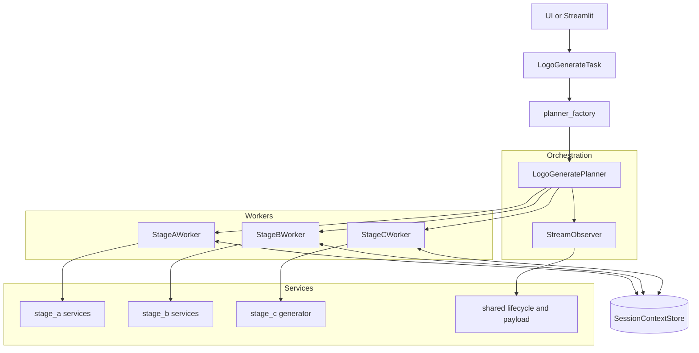

# Source Architecture Summary - Logo Design Flow

Tài liệu này mô tả đúng code hiện tại trong `source/`: kiến trúc runtime, mức độ chạy song song, và phân tích theo từng file (import chính, class kế thừa, cách xử lý).

## 1. Trả lời nhanh câu hỏi về parallel và UI chunk

### 1.1 Vì sao UI vẫn hiện từng chunk 1/3, 2/3, 3/3 dù chạy parallel?

Điều này là đúng theo thiết kế stream:

- Stage C tạo 3 task generation song song bằng `asyncio.to_thread(...)`.
- Kết quả được consume theo `asyncio.as_completed(...)`, nghĩa là option nào xong trước thì emit chunk trước.
- Worker Stage C phát mỗi option thành 1 chunk `generation_option_ready`.

Nên việc hiển thị:

- Generation Started
- Generated option 1/3
- Generated option 2/3
- Generated option 3/3

là expected behavior của streaming incremental, không phải dấu hiệu "không chạy parallel".

### 1.2 Code hiện tại có parallel ở SerpAPI / analyze / generate không?

Có, cả 3 đều đang parallel:

1. SerpAPI parallel:
- `source/services/stage_b/web_research_service.py`
- `run_async()` dùng `asyncio.gather(*[self._serpapi.search_async(query) ...])`.

2. Analyze top images parallel:
- `source/services/stage_b/gemini_analyzer.py`
- `analyze_async()` tạo list task `_analyze_single_image_async(...)` rồi `await asyncio.gather(*tasks)`.

3. Generate 3 options parallel:
- `source/services/stage_c/generator.py`
- `iter_generate_async()` tạo list `asyncio.to_thread(self._generate_single_option, ...)` rồi consume bằng `asyncio.as_completed(tasks)`.

## 2. Kiến trúc runtime hiện tại

Code hiện tại đã theo model Planner / Worker / Observer:

## 3. AI Hub SDK integration points

Các điểm tích hợp trực tiếp với `ai_hub_sdk`:

1. `source/tasks/logo_generate.py`
- `LogoGenerateTask(BaseTask)` kế thừa SDK task contract.
- `LogoGenerateTaskOutput(TaskOutputBaseModel)` kế thừa SDK output model.
- `serving_mode = ServingMode.STREAM`.

2. `source/schemas/domain.py`
- `LogoGenerateInput(TaskInputBaseModel)` kế thừa SDK input contract.

3. `source/services/stage_a/llm_runtime.py`
- Sử dụng `LLMModelFactory` để gọi mô hình Gemini từ SDK layer.

4. `source/services/stage_b/gemini_analyzer.py`
- Sử dụng `LLMModelFactory` cho phân tích Gemini multimodal/text.

## 4. Full inventory theo từng file trong source

## 4.1 Root package

### source/__init__.py
- Import chính: không có.
- Class kế thừa SDK: không có.
- Vai trò: marker package.

### source/config.py
- Import chính: `dotenv`, `os`, `pathlib.Path`.
- Class: `Config`, `DevelopmentConfig(Config)`, `ProductionConfig(Config)`, `TestConfig(Config)`.
- Hàm: `get_config()`.
- Vai trò: đọc env + cung cấp cấu hình runtime (API keys, timeout, asset path, model names).

### source/logger.py
- Import chính: `logging`, `sys`, `Path`.
- Hàm: `configure_logging()`, `get_logger()`.
- Vai trò: chuẩn hóa logger format/handler cho toàn bộ source.

## 4.2 Context layer

### source/context/__init__.py
- Re-export: `SessionContextStore`, `ContextVersionConflictError`.
- Vai trò: public API gọn cho context package.

### source/context/session_store.py
- Import chính: `SessionContextState`.
- Class: `ContextVersionConflictError(RuntimeError)`, `SessionContextStore`.
- Vai trò:
  - lưu state theo `session_id` trong memory,
  - hỗ trợ version check để CAS update,
  - source of truth runtime cho clarification/resume giữa Stage A/B/C trong cùng process.

## 4.3 Orchestration layer

### source/orchestration/__init__.py
- Import chính: không có.
- Vai trò: namespace package.

### source/orchestration/planner/__init__.py
- Re-export: `LogoGeneratePlanner`, `PlannerOptions`.
- Vai trò: planner package API.

### source/orchestration/planner/plan_types.py
- Import chính: `dataclass`.
- Class: `PlannerOptions`.
- Vai trò: config flags cho planner (ví dụ include generation).

### source/orchestration/planner/logo_generate_planner.py
- Import chính: `SessionContextStore`, `StreamObserver`, `StageAWorker`, `StageBWorker`, `StageCWorker`, `LogoGenerateInput`.
- Class: `LogoGeneratePlanner`.
- Vai trò xử lý:
  - nhận request body,
  - emit stage chunk qua observer,
  - điều phối Stage A -> Stage B -> Stage C,
  - map exception theo stage và dừng flow fail-closed.
- Ghi chú: planner quyết định flow, còn execution nặng nằm ở workers/services.

### source/orchestration/observer/__init__.py
- Re-export: `StreamObserver`, `split_error_code_message`.
- Vai trò: observer API.

### source/orchestration/observer/error_mapper.py
- Hàm: `split_error_code_message()`.
- Vai trò: tách prefix lỗi dạng `CODE: message` để chuẩn hóa payload lỗi stream.

### source/orchestration/observer/stream_observer.py
- Import chính: `LifecycleStatusManager`, `StatusEnum`, `split_error_code_message`.
- Class: `StreamObserver`.
- Vai trò:
  - build payload processing/completed/failed dạng nhất quán,
  - tách business exception thành machine-friendly error fields.

## 4.4 Worker layer

### source/workers/__init__.py
- Re-export: `StageAWorker`, `StageBWorker`, `StageCWorker`.
- Vai trò: worker package API.

### source/workers/worker_types.py
- Import chính: dataclass + domain schemas + decisions từ stage_a runtime.
- Class dataclass: `StageAGateResult`, `StageAExecution`, `StageBExecution`.
- Vai trò: DTO trung gian giữa planner và workers.

### source/workers/stage_a_worker.py
- Import chính: `LogoDesignToolset`, `persist_with_cas`, `SessionContextStore`, `StageAExecution`.
- Class: `StageAWorker`.
- Vai trò xử lý:
  - detect intent,
  - chạy extraction và reference analysis song song qua `asyncio.gather`,
  - merge context,
  - evaluate required-field gate,
  - persist clarification checkpoint khi thiếu field.

### source/workers/stage_b_worker.py
- Import chính: `WebResearchService`, `LogoDesignToolset`, `persist_with_cas`, `StageBExecution`.
- Hàm: `missing_research_enrichment_fields()`.
- Class: `StageBWorker`.
- Vai trò xử lý:
  - chạy web research + Gemini analysis qua `WebResearchService`,
  - enrich context optional fields,
  - infer guideline,
  - persist checkpoint có guideline/research context,
  - chuẩn hóa error code Stage B.

### source/workers/stage_c_worker.py
- Import chính: `OptionGenerationService`, `LifecycleStatusManager`, `AsyncPayloadAssembler`.
- Class: `StageCWorker`.
- Vai trò xử lý:
  - validate guideline checkpoint tồn tại,
  - emit `generation_started`,
  - stream từng option chunk `generation_option_ready`,
  - assemble payload `completed` cuối.

## 4.5 Services - shared

### source/services/__init__.py
- Re-export service leaf types:
  - `LifecycleStatusManager`, `TransitionResult`,
  - `AsyncPayloadAssembler`,
  - `LogoDesignToolset`, `WebResearchService`, `OptionGenerationService`.
- Vai trò: public service API rõ ràng.

### source/services/shared/__init__.py
- Re-export shared infra services.

### source/services/shared/lifecycle_status.py
- Import chính: `JobStatusResponse`, `StatusEnum`, `TaskTypeEnum`.
- Class: `TransitionResult`, `LifecycleStatusManager`.
- Vai trò:
  - chuẩn hóa build status response,
  - giữ progress/status contract nhất quán toàn pipeline.

### source/services/shared/payload_assembler.py
- Import chính: `LogoGenerateOutput`, `DesignGuideline`, `LogoOption`, `RequiredFieldState`.
- Class: `AsyncPayloadAssembler`.
- Vai trò:
  - build payload final completed,
  - build payload failed theo contract thống nhất.

## 4.6 Services - Stage A

### source/services/stage_a/__init__.py
- Re-export: `LogoDesignToolset`.

### source/services/stage_a/planner_factory.py
- Import chính: planner/observer/workers + các service dependency.
- Hàm: `build_logo_generate_planner()`.
- Vai trò: central dependency wiring (DI) cho `LogoGeneratePlanner`.

### source/services/stage_a/checkpoint.py
- Import chính: `SessionContextStore`, `ContextVersionConflictError`, `SessionContextState`.
- Hàm: `persist_with_cas()`.
- Vai trò:
  - ghi checkpoint theo compare-and-set,
  - retry khi version conflict,
  - tránh overwrite state khi có race.

### source/services/stage_a/llm_runtime.py
- Import chính: `LLMModelFactory`, `get_config`.
- Class:
  - `IntentDecision`, `ExtractionDecision`, `ReferenceAnalysisDecision` (dataclass),
  - `ToolExecutionError(RuntimeError)`,
  - `LLMToolRuntime`.
- Vai trò:
  - base runtime cho tool gọi LLM,
  - parse/validate JSON responses,
  - chuẩn hóa lỗi tool-level.

### source/services/stage_a/toolset.py
- Kế thừa: `LogoDesignToolset(LLMToolRuntime)`.
- Import chính: `BrandContext`, `DesignGuideline`, `ResearchContext`, `SuggestedQuestion`.
- Vai trò:
  - tool domain Stage A (intent, extraction, reference analysis, clarification),
  - infer guideline từ context + research output,
  - chuẩn hóa prompt/tool-call contract cho planner/worker.

## 4.7 Services - Stage B

### source/services/stage_b/__init__.py
- Re-export: `WebResearchService`.

### source/services/stage_b/research_clients.py
- Import chính: `httpx`, `WebResearchItem`, `WebResearchImage`.
- Class: `SerpApiImageClient`.
- Vai trò:
  - gọi SerpAPI sync/async,
  - parse kết quả images,
  - validate URL ảnh fetchable.
- Lưu ý mới: check `content-type` phải là image để loại landing-page HTML.

### source/services/stage_b/research_normalizer.py
- Import chính: `BrandContext`, `WebResearchItem`, `WebResearchImage`.
- Class: `ResearchResultNormalizer`.
- Vai trò:
  - build query từ context,
  - dedupe sources/images,
  - extract tags,
  - build takeaways từ output analyzer.

### source/services/stage_b/gemini_analyzer.py
- Import chính: `LLMModelFactory`, `httpx`, `WebResearchImage`, `BrandContext`.
- Class: `GeminiAnalysisResult`, `GeminiResearchAnalyzer`.
- Vai trò:
  - analyze từng image reference,
  - aggregate thành market analysis + strategic directions,
  - hỗ trợ sync và async parallel.
- Parallel points:
  - `analyze()` dùng `ThreadPoolExecutor` cho nhiều ảnh,
  - `analyze_async()` dùng `asyncio.gather` cho nhiều ảnh.

### source/services/stage_b/web_research_service.py
- Import chính: `SerpApiImageClient`, `GeminiResearchAnalyzer`, `ResearchResultNormalizer`.
- Class: `WebResearchService`.
- Vai trò:
  - orchestration Stage B research:
    - build queries,
    - chạy search song song,
    - dedupe + chọn top fetchable images,
    - gọi Gemini analyzer,
    - build `ResearchContext` hoàn chỉnh.
- Parallel points:
  - `run_async()` dùng `asyncio.gather` cho nhiều query,
  - `_select_fetchable_images_async()` dùng `asyncio.gather` cho nhiều check image.

## 4.8 Services - Stage C

### source/services/stage_c/__init__.py
- Re-export: `OptionGenerationService`.

### source/services/stage_c/generator.py
- Import chính: `DesignGuideline`, `LogoOption`, `asyncio`, `ThreadPoolExecutor`.
- Class: `OptionGenerationService`.
- Vai trò:
  - build prompt cho mỗi concept,
  - gọi Gemini image generation,
  - persist asset local/storage,
  - trả `LogoOption` có `image_url`.
- Parallel points:
  - `iter_generate_async()` chạy nhiều option bằng `asyncio.to_thread` + `asyncio.as_completed`,
  - `generate()` sync dùng `ThreadPoolExecutor`.

## 4.9 Schemas

### source/schemas/__init__.py
- Re-export toàn bộ API/domain/status/enums để import tập trung.

### source/schemas/models.py
- Aggregator import schema tương tự `__init__`.
- Vai trò: compatibility surface cho code cũ.

### source/schemas/enums.py
- Enum: `StatusEnum`, `PriorityEnum`, `RequiredFieldKeyEnum`, `TaskTypeEnum`.

### source/schemas/domain.py
- Kế thừa SDK: `LogoGenerateInput(TaskInputBaseModel)`.
- Domain models chính:
  - `ReferenceImage`, `BrandContext`, `RequiredFieldState`, `SuggestedQuestion`,
  - `DesignGuideline`, `WebResearchItem`, `WebResearchImage`, `ResearchContext`,
  - `LogoOption`, `LogoGenerateOutput`.
- Vai trò: canonical contract cho planner/workers/services.

### source/schemas/api.py
- API payload models:
  - `TaskRequest`, `JobSubmitResponse`, `JobStatusResponse`, `TaskStatusChunk`.
- Vai trò: contract phục vụ submit/status/stream ở tầng API.

### source/schemas/status.py
- State/status models:
  - `JobStatus`,
  - `SessionContextState` (snapshot context + guideline + generated options).

## 4.10 Task adapter

### source/tasks/__init__.py
- Package marker cho task module.

### source/tasks/logo_generate.py
- Import SDK:
  - `BaseTask`, `TaskOutputBaseModel`, `ServingMode`.
- Kế thừa SDK:
  - `LogoGenerateTaskOutput(TaskOutputBaseModel)`,
  - `LogoGenerateTask(BaseTask)`.
- Vai trò xử lý:
  - initialize singleton dependencies,
  - build planner qua `build_logo_generate_planner()`,
  - stream chunk output qua `stream_process()`,
  - wrap exception thành error chunk chuẩn.
- Hàm compatibility: `register_tasks()`.

## 5. End-to-end handling flow

1. UI gửi input vào `LogoGenerateTask.stream_process()`.
2. Task build request body, gọi `LogoGeneratePlanner.iter_chunks()`.
3. Planner điều phối Stage A worker để extract/merge/gate.
4. Nếu thiếu required fields: emit clarification chunk và dừng.
5. Nếu đủ: chạy Stage B worker (research + analyze + guideline + checkpoint).
6. Sau guideline: chạy Stage C worker.
7. Stage C stream từng option khi xong (incremental), cuối cùng emit completed payload.

## 6. Kết luận kỹ thuật

1. Hệ thống hiện tại đã theo Planner / Worker / Observer, không còn orchestrator-centric cũ.
2. Concurrency có thật ở Stage B và Stage C.
3. UI hiển thị từng option chunk là đúng semantics của stream incremental, không mâu thuẫn với parallel backend.
4. File layout hiện tại đã tách trách nhiệm khá sạch: task adapter (SDK), planner (decision), workers (execution), services (integration), observer (payload/status), schemas/context (contract/state).
