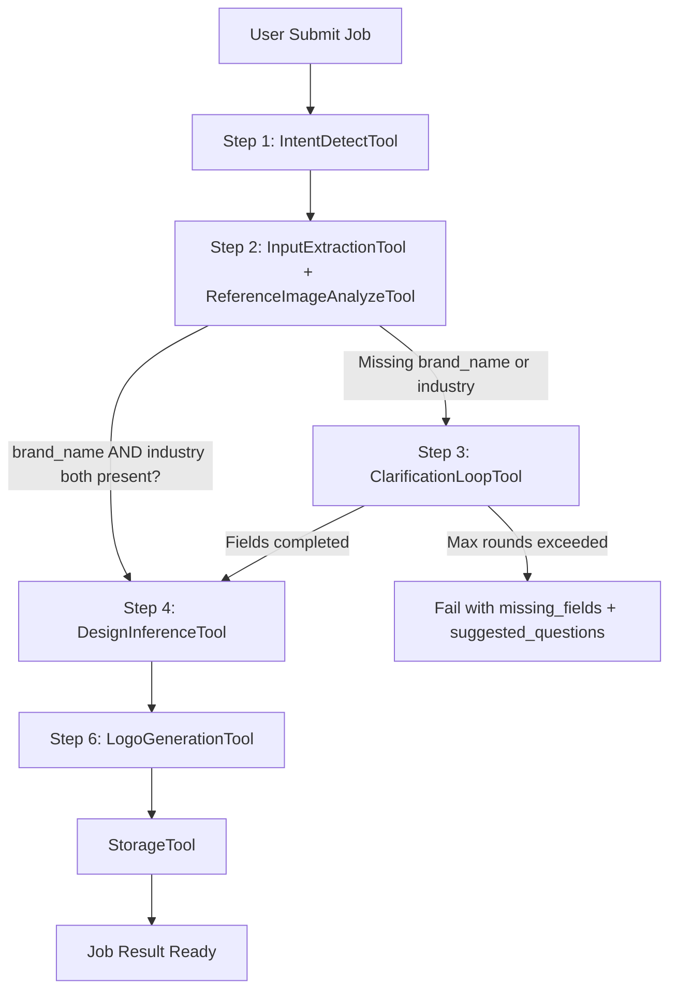
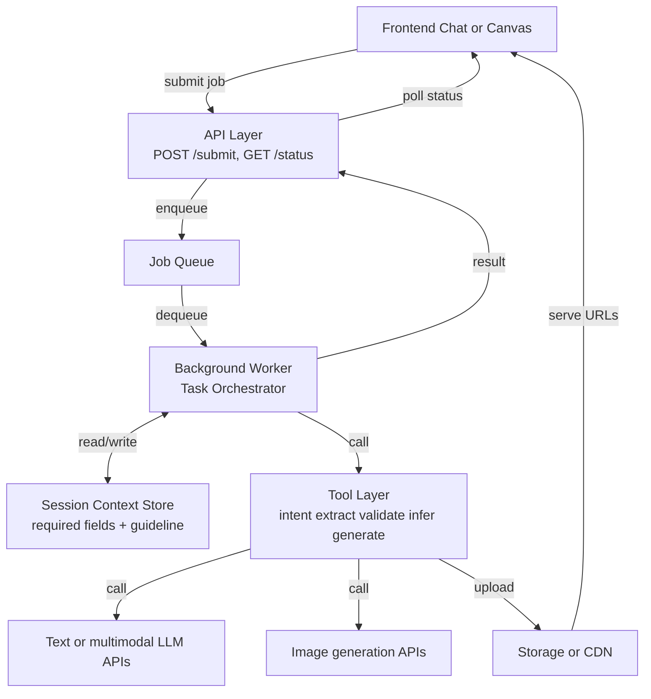
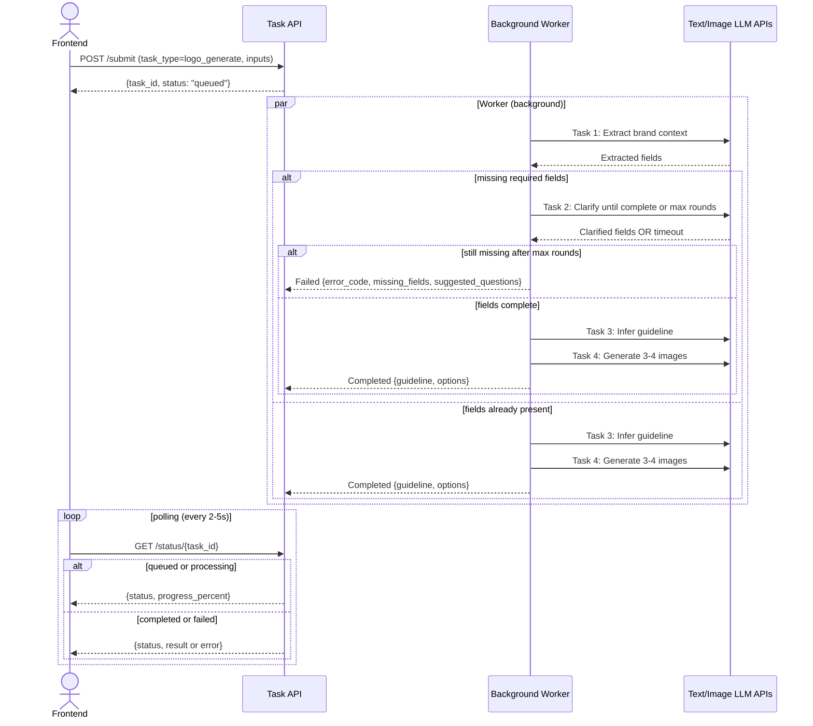

# Logo Design AI POC

## 1. Overview

### 1.1 POC objective

This POC builds a backend-driven Logo Design Service using an async job-based workflow and only covers Step 1 -> Step 6 from spec.

POC in-scope flow:

- Step 1: Detect logo design intent.
- Step 2: Extract and analyze user inputs (text/reference image).
- Step 3: Validate required fields with fail-fast clarification hints.
- Step 4: Analyze request and infer design guideline.
- Step 6: Generate 3-4 logo options.

Out of scope for this POC:

- Step 7: Prompt-based logo editing.
- Step 8: Follow-up suggestions.

Business validation goals:

- Prove users can submit a request and receive complete output (guideline + options) in one async job.
- Prove fail-fast required-field validation improves output quality consistency.
- Prove async execution provides simple input-output contract for FE integration.

### 1.2 Success metrics (POC acceptance targets)

These are committed Phase 1 POC targets for Step 1 -> Step 6 only (2 required fields: brand_name, industry).

- >= 90% requests extract brand_name and industry from user query.
- >= 90% requests that pass required-field gate produce valid `guideline` before image generation starts.
- >= 85% requests return 3-4 valid logo options.
- p95 job completion time <= 30s (from submit to completed).
- p95 time to first status transition (queued -> processing) <= 5s.
- On failure, actionable error and retry hint returned <= 5s.

### 1.3 Technical constraints

- Primary endpoints: async `POST /internal/v1/tasks/submit` and `GET /internal/v1/tasks/{task_id}/status`.
- Primary task type for this POC: `logo_generate`.
- Fail-fast validation is strict: generation must not run until required fields are complete.
- Required fields (mandatory before generation):
  - `brand_name` (company/product name)
  - `industry` (business category or context)
- Optional fields (non-blocking if not provided):
  - `style_preference` (e.g., minimalist, modern, playful)
  - `color_preference` (e.g., blue, grayscale, vibrant)
- Single request per job; input may be partial when `use_session_context` is enabled.
- Required-field precedence is fixed: explicit fields in request > extracted fields from new query > stored session context.
- Session scope is per `session_id` with optional short-term memory reuse across multiple job submissions.
- No separate rule engine; behavior is schema-driven + prompt-driven + tool-adapter driven.
- Provider switching must not change task semantics or output contract.

---

## 2. POC Scope

### 2.1 Build vs Defer

| Area | Build (POC) | Defer (Next Phase) |
| :--- | :--- | :--- |
| Intent + input | Logo intent detection, text/reference parsing, brand extraction | Multi-domain intent classifier |
| Clarification | Required-field validation (brand_name, industry) with suggestions | Adaptive personalized questioning |
| Guideline generation | Structured design guideline inference | Guideline optimization loop |
| Logo generation | 3-4 PNG options from guideline | Auto model-routing and ranking |
| Session management | Persist context and URLs per session_id | Project library, version history |
| Editing & follow-up | Deferred | Steps 7-8 |

---

## 3. System Architecture

### 3.1 Overview

#### 3.1.1 Why this solution

This architecture is designed for strict quality gating in POC with simple async job semantics: submit once, get complete output.

Key reasons:

1. Fail-fast required-field validation enforces required design inputs before generation begins.
2. Async execution keeps FE simple: submit job, poll status, render output when ready.
3. All processing happens server-side; FE does not hold the connection.
4. Session context is explicit and propagated between tools for deterministic behavior.

#### 3.1.2 Diagram 1 - Agent pipeline (flowchart)



#### 3.1.3 Diagram 2 - System components (layered)



### 3.2 Architecture principles

- Task-first:
  - Business capability exposed as `logo_generate` in this phase.
  - Routing by `task_type`, no endpoint-specific business hardcoding.
- Schema-first:
  - All contracts validated by Pydantic.
  - Required-field gate is encoded as schema and validator rules.
- Async job-based:
  - `POST /internal/v1/tasks/submit` accepts complete input once.
  - `GET /internal/v1/tasks/{task_id}/status` polls for result.
  - FE receives deterministic JSON output when ready, no streaming chunks.
- Context-first tool handoff:
  - Every step must access a consistent context state (by snapshot or context reference).
  - Tool swap must preserve context I/O contract, not implicit memory.

### 3.3 Work orchestration pattern (Exa-inspired)

System follows a **Planner → Tasks → Observer** pattern for deterministic multi-step agent execution:

```
┌─────────────────────────────────────────────────────────┐
│                  TaskOrchestrator                        │
│              (Planner + Task Distributor)               │
│  - Accepts LogoGenerateInput once                        │
│  - Distributes work to parallel extraction tasks         │
│  - Manages state transitions and failures                │
└────────────────┬────────────────────────────────────────┘
                 │
    ┌────────────┼────────────┐
    ↓            ↓            ↓
  Task 1       Task 2       Task 3
(Intake)    (Validate)   (Guideline)
    │            │            │
    └────────────┼────────────┘
                 ↓
        ┌─────────────────┐
        │   Observer      │
        │  (SessionState) │
        │  Maintains full │
        │  context across │
        │  all tasks      │
        └────────┬────────┘
                 ↓
    ┌─────────────────────┐
    │ Image Generation    │
    │ Task (4 options)    │
    └─────────────────────┘
```

**Work phases**:

| Phase | Owner Task | Role | Parallel? | Output |
| :--- | :--- | :--- | :--- | :--- |
| **Task 1: Intake** | IntentDetectTool + InputExtractionTool + ReferenceImageAnalyzeTool | Detect intent, parse inputs, extract brand context | ✓ Can extract in parallel | `BrandContext` (partial or complete) |
| **Task 2: Validate** | ClarificationLoopTool | If brand_name or industry missing, clarify until complete or max rounds | ✗ Sequential | `BrandContext` (complete) OR fail with suggested_questions |
| **Task 3: Guideline** | DesignInferenceTool | Infer design rules from complete context | ✗ After validate | `DesignGuideline` |
| **Generation** | LogoGenerationTool + StorageTool | Generate 3-4 PNG options from guideline | ✓ Parallel per image | List of image URLs |

**Observer role** (SessionContextTool):

- Maintains full `SessionContextState` visible to all tasks
- Does NOT pass detailed reasoning state between tasks; only final outputs
- Tasks read context snapshot once; return delta updates
- Observer merges deltas and advances task state
- Uses `context_version` to prevent stale writes in concurrent scenarios

### 3.4 End-to-end pipeline

POC exposes one external task type: `logo_generate`.

#### 3.4.1 Async job execution flow (simplified)



#### 3.4.2 Pipeline stages and targets

| Stage | Input | Tools | Output | Target |
| :--- | :--- | :--- | :--- | :--- |
| Intake + Clarification | User query ± explicit fields ± references | Intent, Extract, Analyze, Clarify | brand_name + industry (merged) OR error | 10s, >=90% extraction |
| Guideline Inference | Merged required fields + context | DesignInferenceTool | DesignGuideline JSON | >=90% guideline coverage |
| Logo Generation | Guideline + variation_count | LogoGenerationTool, StorageTool | 3-4 PNG option URLs | <=30s, >=85% valid output |

#### 3.4.3 Context handoff contract

- Field merge precedence: explicit request > extracted query > stored session context.
- Tool swap allowed only if input/output context contract unchanged.
- SessionContextTool maintains consistent state; tools read snapshot, return delta updates.
- Use `context_version` to prevent stale writes in concurrent scenarios.
- Required fields: `session_id`, `required_field_state`, `BrandContext`, `DesignGuideline` (if available), `context_version`.

---

## 4. Data Schema and API Integration

### 4.1 Pydantic models by stage

```python
from typing import Any, Dict, List, Literal, Optional
from pydantic import BaseModel, Field, HttpUrl


class ReferenceImage(BaseModel):
    source_url: Optional[HttpUrl] = None
    storage_key: Optional[str] = None


class BrandContext(BaseModel):
    brand_name: Optional[str] = None
    industry: Optional[str] = None
    style_preference: List[str] = Field(default_factory=list)
    color_preference: List[str] = Field(default_factory=list)
    symbol_preference: List[str] = Field(default_factory=list)


class SuggestedQuestion(BaseModel):
    key: Literal["brand_name", "industry"]
    question: str


class RequiredFieldState(BaseModel):
    # Only 2 required fields for POC
    required_keys: List[str] = Field(default_factory=lambda: [
        "brand_name",      # Company or product name (MANDATORY)
        "industry",        # Business category or context (MANDATORY)
    ])
    missing_keys: List[str] = Field(default_factory=list)
    passed: bool = False


class DesignGuideline(BaseModel):
    concept_statement: str
    style_direction: List[str]
    color_palette: List[str]
    typography_direction: List[str]
    icon_direction: List[str]
    constraints: List[str]


class SessionContextState(BaseModel):
    session_id: str
    latest_brand_context: Optional[BrandContext] = None
    latest_guideline: Optional[DesignGuideline] = None
    required_field_state: RequiredFieldState = Field(default_factory=RequiredFieldState)
    generated_option_ids: List[str] = Field(default_factory=list)


class LogoGenerateInput(BaseModel):
    session_id: str
    query: str
    brand_name: Optional[str] = None
    industry: Optional[str] = None
    style_preference: List[str] = Field(default_factory=list)
    color_preference: List[str] = Field(default_factory=list)
    symbol_preference: List[str] = Field(default_factory=list)
    references: List[ReferenceImage] = Field(default_factory=list)
    use_session_context: bool = True
    variation_count: int = Field(default=4, ge=3, le=4)
    output_format: Literal["png"] = "png"
    output_size: Literal["1024x1024"] = "1024x1024"


class LogoOption(BaseModel):
    option_id: str
    image_url: HttpUrl
    prompt_used: Optional[str] = None
    seed: Optional[int] = None
    quality_flags: List[str] = Field(default_factory=list)


class LogoGenerateOutput(BaseModel):
    guideline: DesignGuideline
    required_field_state: RequiredFieldState
    options: List[LogoOption]


class JobSubmitResponse(BaseModel):
    task_id: str
    status: Literal["queued"]
    created_at: str  # ISO8601


class JobStatusResponse(BaseModel):
    task_id: str
    status: Literal["queued", "processing", "completed", "failed"]
    progress_percent: Optional[int] = None  # 0-100 if processing
    result: Optional[LogoGenerateOutput] = None  # populated when completed
    error_code: Optional[str] = None  # populated when failed (e.g., MISSING_REQUIRED_FIELDS)
    error: Optional[str] = None  # populated when failed
    missing_fields: List[str] = Field(default_factory=list)  # populated when failed
    suggested_questions: List[SuggestedQuestion] = Field(default_factory=list)  # populated when failed
    retry_after_seconds: Optional[int] = None  # populated when failed
```

Validation rules:

- `query` is required and non-empty after trim.
- `variation_count` must be 3 or 4.
- Required-field gate: brand_name AND industry must both be present before guideline generation.
- Merge precedence is fixed: explicit fields in request > extracted fields from new query > stored context for same `session_id`.
- Empty-value precedence policy:
  - explicit empty string (e.g., `brand_name=""`) is treated as missing and does not override non-empty extracted/session value.
  - explicit `null` is treated as "not provided" and falls through to lower-precedence sources.
  - explicit empty optional lists (e.g., `style_preference=[]`) are valid explicit overrides.
- If `use_session_context=true`, backend may use stored context as the last precedence layer.
- If required fields are still missing after merge, return failed job with `error_code`, `missing_fields`, and `suggested_questions`.
- On `status="failed"` with `error_code="MISSING_REQUIRED_FIELDS"`, `missing_fields` and `suggested_questions` must be populated.

### 4.2 External APIs and model selection

Criteria:
- Text models: latency, reasoning quality, cost
- Image models: generation speed, quality, throughput
- Fallback path: secondary provider for reliability and resilience

### 4.3 Concrete endpoint I/O

- `POST /internal/v1/tasks/submit` (submit job)
  - Input:
    - `task_type` (required: `logo_generate`)
    - `session_id` (required)
    - `query` (required: user request for extraction)
    - `brand_name` (optional explicit override)
    - `industry` (optional explicit override)
    - `style_preference` (optional explicit override)
    - `color_preference` (optional explicit override)
    - `symbol_preference` (optional explicit override)
    - `references` (optional: list of ReferenceImage)
    - `use_session_context` (optional, default true)
    - `variation_count` (optional, default 4, range 3-4)
    - `output_format` (optional, default "png")
    - `output_size` (optional, default "1024x1024")
  - Output (JobSubmitResponse):
    ```json
    {
      "task_id": "uuid",
      "status": "queued",
      "created_at": "2026-03-24T12:00:00Z"
    }
    ```

- `GET /internal/v1/tasks/{task_id}/status` (check job status)
  - Path params: `task_id`
  - Output (JobStatusResponse, while processing):
    ```json
    {
      "task_id": "uuid",
      "status": "processing",
      "progress_percent": 45
    }
    ```
  - Output (JobStatusResponse, when completed):
    ```json
    {
      "task_id": "uuid",
      "status": "completed",
      "result": {
        "guideline": { /* DesignGuideline */ },
        "required_field_state": { /* RequiredFieldState */ },
        "options": [ /* List[LogoOption] */ ]
      }
    }
    ```
  - Output (JobStatusResponse, if failed):
    ```json
    {
      "task_id": "uuid",
      "status": "failed",
      "error_code": "MISSING_REQUIRED_FIELDS",
      "error": "Missing required fields after merge precedence",
      "missing_fields": ["brand_name", "industry"],
      "suggested_questions": [
        {
          "key": "brand_name",
          "question": "What is your company or product name?"
        },
        {
          "key": "industry",
          "question": "What industry is your business in?"
        }
      ],
      "retry_after_seconds": 60
    }
    ```
  - Context behavior:
    - merge precedence is fixed: explicit request fields > extracted query fields > stored context in same `session_id`
    - fail-fast for required fields: if brand_name or industry is missing after merge, return failed job immediately
    - result metadata includes final `required_field_state`

### 4.4 Model benchmark by vendor (POC-oriented)

Important: prices and latency below are for planning and must be re-checked before release.

#### 4.4.1 Google models

Text Models

| Model | Input ($/ 1M tokens) | Output ($/ 1M tokens) | TTFB (typical) | Full response (typical) | Best for |
| :--- | :--- | :--- | :--- | :--- | :--- |
| `gemini-2.5-flash` | $0.30 | $2.50 | 0.5-1.2s | 2-6s | POC default for extraction, clarification, inference |
| `gemini-2.5-pro` | $1.25 (<=200k) | $10.00 (<=200k) | 1.0-2.5s | 4-12s | Higher-depth reasoning fallback |

Image Models

| Model | Pricing type | Unit price | Latency (per image) | Best for |
| :--- | :--- | :--- | :--- | :--- |
| `gemini-2.5-flash-image` | Per 1M tokens | $0.039 per 1024x1024 | 8-18s | Baseline fast generation |
| `gemini-3.1-flash-image-preview` | Per 1M tokens | ~$0.067 per 1024x1024 | 6-14s | POC primary for 3-4 option generation |
| `imagen-4.0-fast-generate-001` | Per image | $0.02 | 7-15s | Alternative fast path |
| `imagen-4.0-generate-001` | Per image | $0.04 | 10-20s | Alternative quality path |

#### 4.4.2 OpenAI models

Text Models

| Model | Input ($/ 1M tokens) | Output ($/ 1M tokens) | TTFB (typical) | Full response (typical) | Best for |
| :--- | :--- | :--- | :--- | :--- | :--- |
| `gpt-5.4-nano` | $0.20 | $1.25 | 0.3-0.9s | 1.5-5s | Cost-sensitive extraction |
| `gpt-5.4-mini` | $0.750 | $4.500 | 0.6-1.5s | 2-7s | POC fallback with strong structured output |
| `gpt-5.4` | $2.50 | $15.00 | 1.0-3.0s | 4-14s | High quality, high cost |

Image Models

| Model | Pricing type | Unit price | Latency (per image) | Best for |
| :--- | :--- | :--- | :--- | :--- |
| `gpt-image-1.5` | Output tokens | $32 per 1M tokens | 10-25s | Fallback image provider |

#### 4.4.3 POC model selection rationale and benchmark validation

**Actual POC benchmark results** (NovaStack AI startup, image_count=3, March 2026):

| Provider | Model | Latency (3 images) | Status | Recommendation |
| :--- | :--- | :--- | :--- | :--- |
| Google | imagen-4.0-fast-generate-001 | 3.96s | ✓ Success | **PRIMARY** - Fastest, cost-effective ($0.02/image) |
| Google | imagen-4.0-generate-001 | 19.67s | ✓ Success | Fallback - Higher quality, slower |
| Google | gemini-2.5-flash-image | 20.49s | ✓ Success | Reliable multimodal option |
| Google | gemini-3.1-flash-image-preview | 47.04s | ✓ Success | Slower, higher reasoning |
| Google | gemini-3-pro-image-preview | 122.66s | ✓ Success | Slowest, deferred to next phase |
| OpenAI | gpt-image-1.5 | 30.12s | ✓ Success | Backup provider for resilience |

**Recommended primary path (validated by benchmark)**:

- Text: `gemini-2.5-flash` (proven: 2.9s for extraction + clarification)
- Image generation: `imagen-4.0-fast-generate-001` (proven: 3.96s for 3 images)

**Recommended fallback path**:

- Text: `gpt-5.4-mini` (proven: fastest OpenAI at 2.1s)
- Image generation: `imagen-4.0-generate-001` or `gpt-image-1.5`

**Key findings**:

1. imagen-4.0-fast-generate-001 **exceeds p95 target** (3.96s << 30s total) with 5-10x faster generation than alternatives.
2. Gemini text models validated for fast extraction; image models are secondary option.
3. OpenAI fallback path available and tested; no single-vendor lock-in.
4. Session-based caching (Step 2) can reuse extracted context, further reducing latency on retry.
5. *Note: Imagen multi-image behavior (n=3) generates contact sheet; recommended fix: call separately n=1 × 3 or update prompt to singular "one logo concept" for next iteration.

---

## 5. Risks and open issues

### 5.1 Latency

Risk: Job completion may exceed p95 target depending on provider queue.

Mitigation:
- Primary path (imagen-4.0-fast-generate-001) validated at 3.96s for 3 images; well below 30s target.
- Parallel image generation where provider permits.
- Timeout + retry for transient provider failures.

### 5.2 Required-field validation quality

Risk: User intent may not include brand_name or industry; clarification loop may add latency or fail.

Mitigation:
- Extract early with high-confidence NLP; return structured failure for FE-guided resubmission.
- Prioritize targeted questions (e.g., "What is your company name?").
- Allow inference from context (e.g., "fintech startup" → industry=fintech).

### 5.3 Cost

Risk: Failed attempts and 3-4 image outputs increase cost per request.

Mitigation: Track cost per task_id and session_id; cache extracted context to avoid redundant re-analysis on retry.

### 5.4 Open technical decisions (for next phase)

- Polling mechanism: simple HTTP polling vs webhook vs Server-Sent Events (SSE) for result notification.
- Fallback generation model if primary `imagen-4.0-fast-generate-001` fails mid-job (recommend: `imagen-4.0-generate-001`).
- Image URL TTL and expiration policy; session context TTL.
