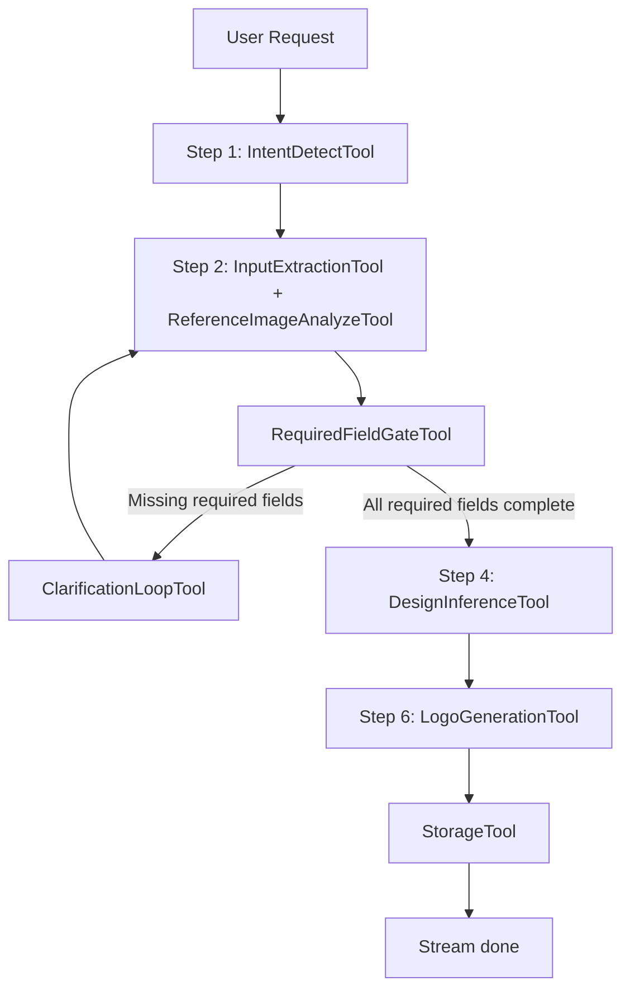
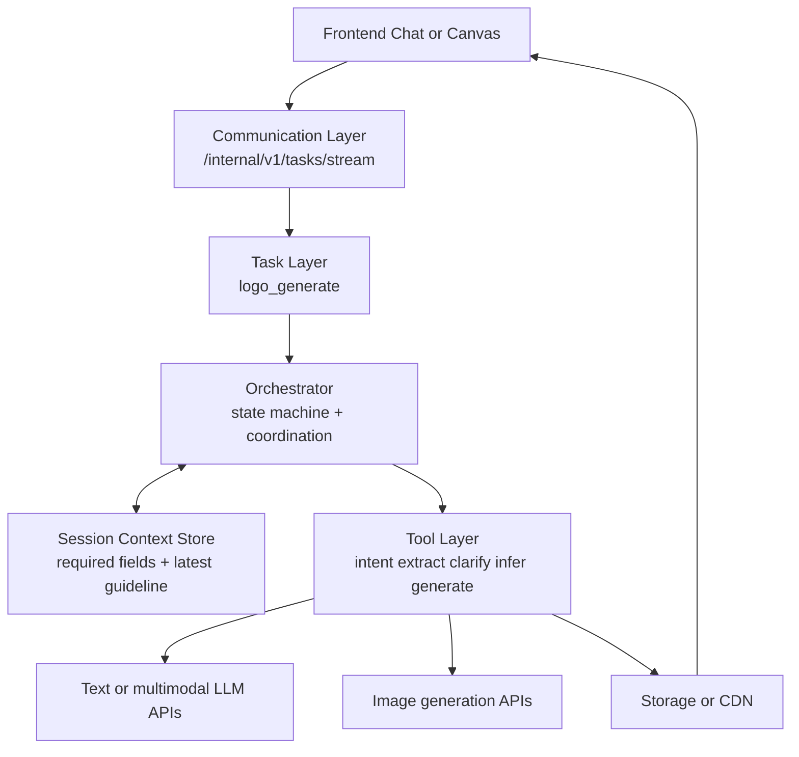
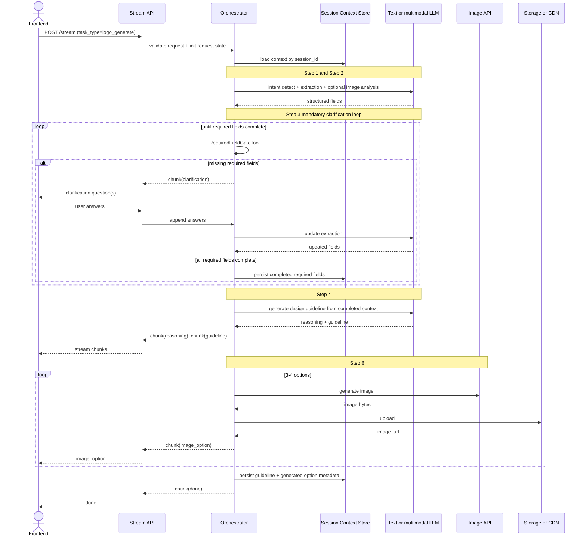

# Logo Design AI POC

## 1. Overview

### 1.1 POC objective

This POC builds a backend-driven Logo Design Service using a chat-first workflow and only covers Step 1 -> Step 6 from spec.

POC in-scope flow:

- Step 1: Detect logo design intent.
- Step 2: Extract and analyze user inputs (text/reference image).
- Step 3: Clarify in loop until required fields are complete.
- Step 4: Analyze request and infer design guideline.
- Step 6: Generate 3-4 logo options.

Out of scope for this POC:

- Step 7: Prompt-based logo editing.
- Step 8: Follow-up suggestions.

Business validation goals:

- Prove users can complete request -> clarify -> guideline -> generate in one session.
- Prove strict clarification loop improves output quality consistency.
- Prove stream-first UX remains responsive for multi-image generation.

### 1.2 Success metrics (POC acceptance targets)

These are committed Phase 1 POC targets for Step 1 -> Step 6 only.

- >= 90% requests produce valid `guideline` before image generation starts.
- >= 90% requests satisfy must-have fields before generation.
- >= 85% requests return 3-4 valid logo options.
- p95 time to first stream chunk <= 2.0s.
- p95 time to complete 3-4 logo outputs <= 35s.
- On failure, actionable error and retry hint returned <= 5s.

### 1.3 Technical constraints

- Primary endpoint remains stream: `POST /internal/v1/tasks/stream`.
- Primary task type for this POC: `logo_generate`.
- Clarification is strict: generation must not run until required fields are complete.
- Required fields (POC): `brand_name`, at least one `style_preference`, at least one `color_preference`.
- Session scope is single `session_id` timeline with short-term memory reuse.
- No separate rule engine; behavior is schema-driven + prompt-driven + tool-adapter driven.
- Provider switching must not change FE stream contract.

---

## 2. POC Scope

### 2.1 Build vs Defer

| Area | Build (POC) | Defer |
| :--- | :--- | :--- |
| Intent + input | Detect logo intent, parse text/references, extract brand context | Multi-domain intent classifier |
| Clarification | Mandatory clarification loop until required fields are complete | Adaptive personalized questioning policy |
| Reasoning | Stream reasoning blocks for extraction and inference | Multi-agent self-critique loops |
| Guideline | Generate structured design guideline before generation | Automatic guideline optimization loop |
| Generation | Generate 3-4 PNG options from guideline | Auto model-routing and ranking |
| Storage/session | Persist output URLs + session context per `session_id` | Project library, version history, long-term memory |
| Editing | Deferred | Step 7 in next phase |
| Follow-up suggestion | Deferred | Step 8 in next phase |

---

## 3. System Architecture

### 3.1 Overview

#### 3.1.1 Why this solution

This architecture is designed for strict quality gating in POC: no generation without complete required context.

Key reasons:

1. Clarification loop enforces required design inputs before generation.
2. Stream-first keeps UX responsive while long image generation is running.
3. Task and endpoint contract stay stable if later switching to async execution mode.
4. Session context is explicit and propagated between tools for deterministic behavior.

#### 3.1.2 Diagram 1 - Agent pipeline (flowchart)



#### 3.1.3 Diagram 2 - System components (layered)



### 3.2 Architecture principles

- Task-first:
  - Business capability exposed as `logo_generate` in this phase.
  - Routing by `task_type`, no endpoint-specific business hardcoding.
- Schema-first:
  - All contracts validated by Pydantic.
  - Required-field gate is encoded as schema and validator rules.
- Stream-first (default):
  - `POST /internal/v1/tasks/stream` is default UX path.
  - FE renders by chunk contract, independent from provider internals.
- Context-first tool handoff:
  - Every tool invocation receives the same `SessionContextState` snapshot.
  - Tool swap must preserve context I/O contract, not implicit memory.

### 3.3 Component breakdown (tool-level)

| Component or Tool | Spec step | Role | Model Type | Notes |
| :--- | :--- | :--- | :--- | :--- |
| IntentDetectTool | Step 1 | Detect logo design intent and route flow | Low-latency text LLM | Emits early `reasoning` chunk |
| InputExtractionTool | Step 2 | Extract brand_name, industry, style, color, symbol from text | Text LLM with structured output | Returns structured JSON |
| ReferenceImageAnalyzeTool | Step 2 | Analyze reference image style/color/typography/iconography | Multimodal LLM | Optional when references provided |
| RequiredFieldGateTool | Step 3 | Validate required fields completeness before generation | Deterministic validator | Emits missing field list |
| ClarificationLoopTool | Step 3 | Ask targeted questions only for missing required fields | Text LLM | Loop until gate passes or max rounds reached |
| DesignInferenceTool | Step 4 | Infer final guideline from completed context | Text LLM for design reasoning | Emits `reasoning` and `guideline` |
| LogoGenerationTool | Step 6 | Generate 3-4 logo options | Fast image generation model | Throughput-optimized |
| StorageTool | Shared | Upload images and return URLs | Cloud storage API | Used by generation |
| SessionContextTool | Shared | Read/update context snapshot per sequence | Context adapter over cache or DB | Required for deterministic tool swap |

### 3.4 End-to-end pipeline

POC exposes one external task type: `logo_generate`.

#### 3.4.1 Full sequence (Step 1 -> Step 6)



#### 3.4.2 Stage A - Intake and mandatory clarification loop (Step 1-3)

| Item | Detail |
| :--- | :--- |
| Input | `LogoGenerateInput` (query, references, session_id) |
| Tools used | IntentDetectTool, InputExtractionTool, ReferenceImageAnalyzeTool, RequiredFieldGateTool, ClarificationLoopTool |
| Output chunks | `reasoning` (early), `clarification` (loop when missing fields) |
| Gate | Must pass required-field gate before Step 4 |
| Target | First chunk <= 2.0s p95 |

#### 3.4.3 Stage B - Request analysis and guideline inference (Step 4)

| Item | Detail |
| :--- | :--- |
| Input | Completed required fields + optional context |
| Tools used | DesignInferenceTool |
| Output chunks | `reasoning`, `guideline` |
| Target | Guideline coverage >= 90% |

#### 3.4.4 Stage C - Logo generation (Step 6)

| Item | Detail |
| :--- | :--- |
| Input | guideline + variation_count |
| Tools used | LogoGenerationTool, StorageTool |
| Output chunks | `image_option` x 3-4, `done` |
| Target | 3-4 valid outputs >= 85%, generation <= 35s p95 |

#### 3.4.5 Stream vs async strategy (design recommendation)

Recommended in POC:

- Keep stream as primary: `POST /internal/v1/tasks/stream` with `task_type=logo_generate`.
- Keep async as optional fallback for overload: `POST /internal/v1/tasks/submit` and `GET /internal/v1/tasks/{task_id}/status`.

Why this is optimal:

1. Clarification loop is inherently conversational and benefits from stream chunks.
2. Step 6 has user-visible wait time; stream gives progress instead of a silent wait.
3. Endpoint and task contract stay the same even when execution mode changes.
4. Async can be activated by policy (queue pressure or timeout risk) without changing FE business semantics.

Execution policy suggestion:

- Default: stream mode.
- Switch to async automatically when expected runtime exceeds threshold or provider is throttled.
- Return unified envelope schema in both modes to keep FE renderer unchanged.

#### 3.4.6 Session memory and tool swap contract

Design rule:

- Tool swap is allowed only if input/output context contract is unchanged.

Mandatory context handoff on every tool call:

- `session_id`
- `required_field_state`
- latest extracted `BrandContext`
- latest approved `DesignGuideline` (if available)
- `clarification_round`
- `sequence`

Implementation notes:

- Orchestrator owns canonical state.
- SessionContextTool persists snapshot after each meaningful step.
- Each tool reads context snapshot and returns delta updates.
- Orchestrator merges deltas and emits updated metadata in stream envelope.

### 3.5 Reuse and extensibility

- Add fields in extraction or guideline:
  - Extend schema and prompt templates only.
  - FE stream contract stays unchanged.
- Add edit phase in next release:
  - Register `logo_edit` task type and add Stage D for Step 7.
  - Reuse same context and stream envelope design.
- Add provider:
  - Replace generation adapter only.
  - No change in orchestrator state machine.

---

## 4. Data Schema and API Integration

### 4.1 Pydantic models by stage

```python
from typing import Any, Dict, List, Literal, Optional
from pydantic import BaseModel, Field, HttpUrl


class ReferenceImage(BaseModel):
    source_url: Optional[HttpUrl] = None
    storage_key: Optional[str] = None


class BrandContext(BaseModel):
    brand_name: Optional[str] = None
    industry: Optional[str] = None
    style_preference: List[str] = Field(default_factory=list)
    color_preference: List[str] = Field(default_factory=list)
    symbol_preference: List[str] = Field(default_factory=list)


class ClarificationQuestion(BaseModel):
    key: str
    question: str
    required: bool = True


class RequiredFieldState(BaseModel):
    required_keys: List[str] = Field(default_factory=lambda: [
        "brand_name",
        "style_preference",
        "color_preference",
    ])
    missing_keys: List[str] = Field(default_factory=list)
    passed: bool = False
    clarification_round: int = 0


class DesignGuideline(BaseModel):
    concept_statement: str
    style_direction: List[str]
    color_palette: List[str]
    typography_direction: List[str]
    icon_direction: List[str]
    constraints: List[str]


class SessionContextState(BaseModel):
    session_id: str
    latest_brand_context: Optional[BrandContext] = None
    latest_guideline: Optional[DesignGuideline] = None
    required_field_state: RequiredFieldState = Field(default_factory=RequiredFieldState)
    generated_option_ids: List[str] = Field(default_factory=list)


class LogoGenerateInput(BaseModel):
    session_id: str
    query: str
    references: List[ReferenceImage] = Field(default_factory=list)
    use_session_context: bool = True
    max_clarification_rounds: int = Field(default=3, ge=1, le=5)
    variation_count: int = Field(default=4, ge=3, le=4)
    output_format: Literal["png"] = "png"
    output_size: Literal["1024x1024"] = "1024x1024"


class LogoOption(BaseModel):
    option_id: str
    image_url: HttpUrl
    prompt_used: Optional[str] = None
    seed: Optional[int] = None
    quality_flags: List[str] = Field(default_factory=list)


class LogoGenerateOutput(BaseModel):
    guideline: DesignGuideline
    required_field_state: RequiredFieldState
    options: List[LogoOption]


class StreamEnvelope(BaseModel):
    request_id: str
    session_id: str
    task_type: Literal["logo_generate"]
    status: Literal["processing", "completed", "failed"]
    chunk_type: Literal[
        "reasoning", "clarification", "guideline", "image_option",
        "warning", "error", "done"
    ]
    sequence: int
    payload: Dict[str, Any] = Field(default_factory=dict)
    metadata: Dict[str, Any] = Field(default_factory=dict)
```

Validation rules:

- `query` is required and non-empty after trim.
- `variation_count` must be 3 or 4.
- Required-field gate must pass before `guideline` and `image_option` are emitted.
- If `use_session_context=true`, backend merges request with stored context for same `session_id`.
- If `max_clarification_rounds` is reached and required fields still missing, return actionable error.

### 4.2 External APIs and model selection

Model selection strategy:

- Text models: choose by latency, reasoning quality, and cost.
- Image models: choose by generation speed, quality fidelity, and throughput.
- Fallback path: maintain secondary provider to reduce lock-in and improve reliability.

Reference docs:

- Google Gemini API docs: https://ai.google.dev/gemini-api/docs
- Google Imagen docs: https://ai.google.dev/gemini-api/docs/imagen
- Google Nano Banana docs: https://ai.google.dev/gemini-api/docs/image-generation
- Google pricing docs: https://ai.google.dev/gemini-api/docs/pricing
- OpenAI pricing docs: https://openai.com/api/pricing/
- OpenAI models docs: https://platform.openai.com/docs/models

### 4.3 Concrete endpoint I/O

- `POST /internal/v1/tasks/stream` (`task_type=logo_generate`)
  - Input:
    - `query`
    - `session_id`
    - `use_session_context` (optional, default true)
    - `references` (optional)
    - `max_clarification_rounds` (optional)
    - `variation_count` (optional, 3-4)
  - Output stream:
    - `reasoning`
    - `clarification` (loop if required fields missing)
    - `guideline`
    - `image_option` x 3-4
    - `done`
  - Context behavior:
    - if `use_session_context=true`, merge new query with stored context in same `session_id`
    - every chunk metadata contains current `required_field_state`

- Optional async fallback (same task semantics):
  - `POST /internal/v1/tasks/submit` with `task_type=logo_generate`
  - `GET /internal/v1/tasks/{task_id}/status`
  - async result envelope must reuse same payload/chunk schema for FE compatibility

### 4.4 Model benchmark by vendor (POC-oriented)

Important: prices and latency below are for planning and must be re-checked before release.

#### 4.4.1 Google models

Text Models

| Model | Input ($/ 1M tokens) | Output ($/ 1M tokens) | TTFB (typical) | Full response (typical) | Best for |
| :--- | :--- | :--- | :--- | :--- | :--- |
| `gemini-2.5-flash` | $0.30 | $2.50 | 0.5-1.2s | 2-6s | POC default for extraction, clarification, inference |
| `gemini-2.5-pro` | $1.25 (<=200k) | $10.00 (<=200k) | 1.0-2.5s | 4-12s | Higher-depth reasoning fallback |

Image Models

| Model | Pricing type | Unit price | Latency (per image) | Best for |
| :--- | :--- | :--- | :--- | :--- |
| `gemini-2.5-flash-image` | Per 1M tokens | $0.039 per 1024x1024 | 8-18s | Baseline fast generation |
| `gemini-3.1-flash-image-preview` | Per 1M tokens | ~$0.067 per 1024x1024 | 6-14s | POC primary for 3-4 option generation |
| `imagen-4.0-fast-generate-001` | Per image | $0.02 | 7-15s | Alternative fast path |
| `imagen-4.0-generate-001` | Per image | $0.04 | 10-20s | Alternative quality path |

#### 4.4.2 OpenAI models

Text Models

| Model | Input ($/ 1M tokens) | Output ($/ 1M tokens) | TTFB (typical) | Full response (typical) | Best for |
| :--- | :--- | :--- | :--- | :--- | :--- |
| `gpt-5.4-nano` | $0.20 | $1.25 | 0.3-0.9s | 1.5-5s | Cost-sensitive extraction |
| `gpt-5.4-mini` | $0.750 | $4.500 | 0.6-1.5s | 2-7s | POC fallback with strong structured output |
| `gpt-5.4` | $2.50 | $15.00 | 1.0-3.0s | 4-14s | High quality, high cost |

Image Models

| Model | Pricing type | Unit price | Latency (per image) | Best for |
| :--- | :--- | :--- | :--- | :--- |
| `gpt-image-1.5` | Output tokens | $32 per 1M tokens | 10-25s | Fallback image provider |

#### 4.4.3 POC model selection rationale

Recommended primary path:

- Text: `gemini-2.5-flash`
- Image generation: `gemini-3.1-flash-image-preview`

Recommended fallback path:

- Text: `gpt-5.4-mini`
- Image generation: `gpt-image-1.5`

Why this combination:

1. Stream + low-latency text model supports fast clarification loop.
2. Main image model balances speed and quality for 3-4 options.
3. Fallback path provides resilience and reduces vendor lock-in.
4. This path aligns with p95 timing targets in Section 1.2.

---

## 5. Risks and open issues

### 5.1 Latency

Risk:

- Clarification loop and multi-image generation may exceed p95 in peak load.

Mitigation:

- Emit early reasoning chunks.
- Parallel generation where provider permits.
- Timeout + retry for transient provider failures.
- Automatic stream to async degrade path when queue pressure is high.

### 5.2 Clarification loop quality

Risk:

- Questions may be verbose or repetitive, causing user drop-off.

Mitigation:

- Ask only for missing required fields.
- Keep each clarification round concise and bounded.
- Cap rounds by `max_clarification_rounds` and return actionable guidance.

### 5.3 Cost

Risk:

- Repeated clarification rounds and 3-4 image outputs increase cost per request.

Mitigation:

- Track cost per `request_id` and `session_id`.
- Cache extracted context in session and avoid redundant re-analysis.
- Keep benchmark table refreshed each milestone.

### 5.4 Open technical decisions

- Final required-field set for production (`brand_name`, `style_preference`, `color_preference` only vs adding `industry`).
- Clarification fallback after max rounds (hard fail vs default template fill).
- Stream protocol finalization: NDJSON vs gRPC stream.
- Signed URL TTL policy by asset type.
- Async auto-switch thresholds and queue policy.
- Session context TTL and reset policy (auto expiry only vs manual reset endpoint).
