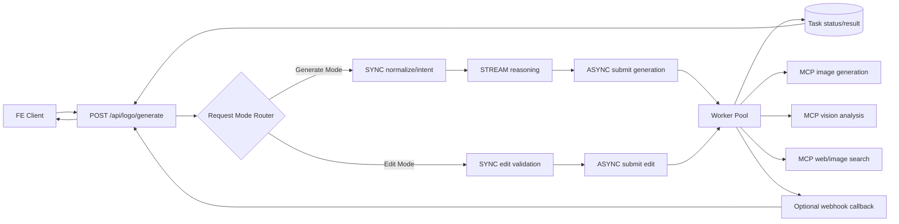
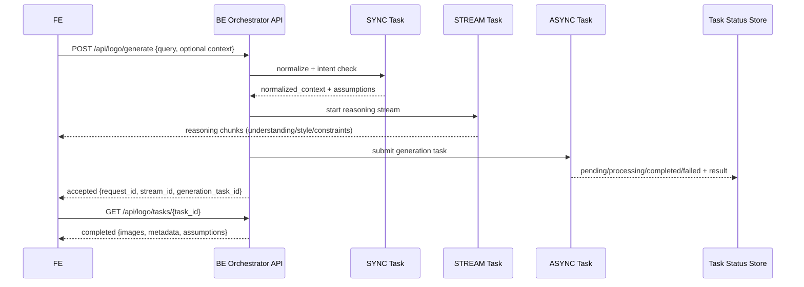
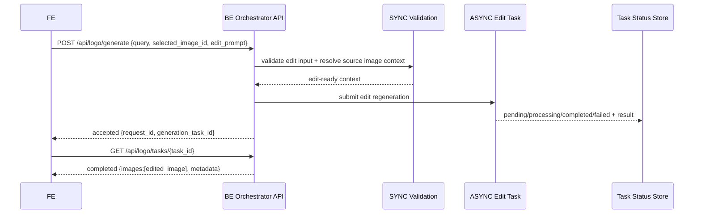

# Technical Design (POC v1) - AI Logo Design Agent

Feature: 001-logo-design-agent  
Status: POC design reset (overview-first, flexible flow)

## 1. Overview

### 1.1 POC Goal
Build a backend flow that is easy for FE to collaborate with:
- FE sends one main request with `query` (+ optional context).
- BE handles intent parsing -> reasoning stream -> image generation -> optional edit loop.
- FE receives final image outputs and can continue iteration by sending more inputs.

Target mindset for this document:
- Build a strong frame, not rigid rules.
- Keep extensibility open (fields can be added without breaking core flow).
- Make integration with ai-hub-sdk explicit and implementation-friendly.

### 1.2 Success Metrics (POC)
- API usability: FE can complete end-to-end flow with one main endpoint and predictable task status checks.
- Time to first reasoning chunk: <= 3s in normal load.
- Time to first generated batch (3-4 images): <= 45s for default provider profile.
- Completion success rate (no manual operator intervention): >= 90% in staging runs.
- Edit success usability: user can regenerate from selected image with prompt-only edit in one roundtrip.

### 1.3 Technical Constraints
- Use ai-hub-sdk serving modes as designed:
  - SYNC for fast intent/context checks.
  - STREAM for reasoning visibility.
  - ASYNC for generation/edit workloads.
- Use MCPTool for external providers (generation, vision, search).
- Do not hard-code strict state-machine transitions in API contract.
- Keep session handling optional and lightweight (context-friendly, not state-heavy).
- Prefer transparent errors and retry guidance over hidden fallback behavior.

---

## 2. POC Scope (Build vs Defer)

| Area | Build in POC | Defer after POC |
|---|---|---|
| API surface | One main orchestrator API for query -> image, plus task status/reasoning channels | Multi-workflow API families, complex workflow routing |
| Generation strategy | Single default provider profile per request/session | Dynamic multi-model router, parallel provider A/B |
| Editing | Prompt-based edit from selected output | Mask-based inpainting, smart-mark canvas tools |
| Reasoning UX | Streamed reasoning blocks before generation | Advanced interactive reasoning controls |
| Quality control | Basic validation (size/format + minimal quality checks) | Full auto-evaluator and learned scoring loop |
| Persistence | Lightweight context storage for continuity | Full history/versioning/project library |
| Governance | Basic tracing + structured errors | Cost governance, quotas, enterprise policy layers |

---

## 3. System Architecture (Most Important)

### 3.1 BE-first architecture that FE can read and integrate quickly

Goal of this architecture is not to force FE into a rigid state machine. Instead, FE sends one request shape, and only adds optional fields when needed.

FE-facing contract:
- Input: `query` plus optional context/edit fields.
- Output: accepted task envelope first, then final image outputs through status API (or webhook).

Core endpoint:
- `POST /api/logo/generate`

Operational endpoints around it:
- `GET /api/logo/tasks/{task_id}` for async status/result.
- `GET /api/logo/streams/{stream_id}` (or SSE/NDJSON bridge) for reasoning chunks.



### 3.2 Why FE and BE can both understand this doc

FE reads:
- One entry endpoint.
- Which fields to add when switching from initial generation to edit.
- Where to get reasoning and where to get final result.

BE reads:
- Router logic and two execution modes.
- Which steps are SYNC, STREAM, ASYNC.
- Where each external tool is called and where status/result is persisted.

### 3.3 One API for whole flow: is it okay?

Short answer: yes for POC, with a guardrail.

Recommended pattern:
- Keep one orchestration endpoint for command intake: `POST /api/logo/generate`.
- Keep separate read endpoints for observability/result retrieval.

Why this is better in POC:
- FE implementation is simpler: one payload model, optional fields for branch.
- BE can evolve internals without breaking FE integration.
- Reuse is easy: adding a new optional input should not force FE endpoint migration.

When one API becomes problematic:
- Request payload becomes overloaded with too many unrelated concerns.
- Branch logic becomes hard to validate and hard to reason about.

Guardrail:
- Keep explicit `mode` internally (`generate` or `edit`) inferred from fields.
- Reject ambiguous payloads with clear 4xx errors.
- Version payload shape before introducing major new branches.

### 3.4 Internal handle flow (concrete, step-by-step)

#### A) Generate mode (initial request)



#### B) Edit mode (continue from selected image)



### 3.5 Tool execution map (inside BE)

| Step | Tool/API | Called by | Purpose |
|---|---|---|---|
| Normalize/intent | ai-hub SYNC (`/compute`) | Orchestrator | Parse `query`, build normalized context, assumptions |
| Reasoning | ai-hub STREAM (`/stream`) | Orchestrator | Emit progressive reasoning chunks for FE visibility |
| Generate | ai-hub ASYNC (`/submit`) + MCP image tool | Worker | Generate 3-4 outputs |
| Edit | ai-hub ASYNC (`/submit`) + MCP image tool | Worker | Regenerate selected image with edit prompt |
| Optional enrich | MCP vision/search | Worker | Analyze reference image, pull inspiration context |
| Status/result | Redis task status | Worker + API | Persist and expose task lifecycle/results |

### 3.6 Short competitor note (practical direction)

- DALL-E style providers: stable prompt adherence, integration-friendly in product flow.
- Ideogram-style providers: strong logo/text consistency in branding cases.
- Midjourney-like stacks: strong visual output, but often higher orchestration overhead.

POC recommendation:
- Start single provider profile.
- Collect logs/quality/cost metrics.
- Decide provider routing only after evidence.

---

## 4. Data Schema and API Integration

Below are flexible Pydantic frames for each step. These are scaffolds, not rigid workflow locks.

### 4.0 Payload contract policy (important for FE collaboration)

- FE always sends one base model (`GenerateLogoRequest`).
- BE infers mode from optional fields.
- No forced client state enum is required.

Mode inference rule:
- `edit mode` when both `selected_image_id` and `edit_prompt` are present.
- `generate mode` otherwise.

Validation rule:
- If only one of (`selected_image_id`, `edit_prompt`) is provided, return 422 with actionable message.

### 4.1 Main request/response (FE-facing)

```python
from typing import Optional, List, Dict, Any, Literal
from pydantic import BaseModel, Field, HttpUrl


class GenerateLogoRequest(BaseModel):
    query: str = Field(..., min_length=1)

    # Optional context for collaboration with FE
    reference_image_url: Optional[HttpUrl] = None
    brand_name: Optional[str] = None
    style_hints: List[str] = Field(default_factory=list)
    audience_hints: List[str] = Field(default_factory=list)

    # Optional continuation/edit inputs
    selected_image_id: Optional[str] = None
    edit_prompt: Optional[str] = None

    # Optional tracing/context (not mandatory)
    session_id: Optional[str] = None
    trace_id: Optional[str] = None
    metadata: Dict[str, Any] = Field(default_factory=dict)


class ApiError(BaseModel):
    code: str
    message: str
    retryable: bool = False
    details: Dict[str, Any] = Field(default_factory=dict)


class GeneratedImage(BaseModel):
    image_id: str
    image_url: HttpUrl
    width: int
    height: int
    provider: str
    metadata: Dict[str, Any] = Field(default_factory=dict)


class GenerateLogoResponse(BaseModel):
    request_id: str
    mode: Literal["generate", "edit"]
    status: Literal["accepted", "processing", "completed", "failed"]
    reasoning_stream_id: Optional[str] = None
    generation_task_id: Optional[str] = None
    images: List[GeneratedImage] = Field(default_factory=list)
    assumptions: List[str] = Field(default_factory=list)
    error: Optional[ApiError] = None
```

### 4.2 Sub-flow schemas (internal orchestration)

```python
from typing import Literal
from pydantic import BaseModel, Field


class IntentCheckInput(BaseModel):
    query: str
    reference_image_url: Optional[HttpUrl] = None
    hints: Dict[str, Any] = Field(default_factory=dict)


class IntentCheckOutput(BaseModel):
    is_logo_request: bool
    confidence: float
    normalized_context: Dict[str, Any] = Field(default_factory=dict)
    assumptions: List[str] = Field(default_factory=list)


class ReasoningChunk(BaseModel):
    stage: Literal["input_understanding", "style_inference", "constraints", "done"]
    message: str
    bullets: List[str] = Field(default_factory=list)


class GenerationInput(BaseModel):
    normalized_context: Dict[str, Any] = Field(default_factory=dict)
    reference_image_url: Optional[HttpUrl] = None
    variation_count: int = Field(default=4, ge=1, le=4)


class GenerationOutput(BaseModel):
    images: List[GeneratedImage] = Field(default_factory=list)
    quality_notes: List[str] = Field(default_factory=list)
    usage: Dict[str, Any] = Field(default_factory=dict)


class EditInput(BaseModel):
    selected_image_id: str
    edit_prompt: str
    normalized_context: Dict[str, Any] = Field(default_factory=dict)


class EditOutput(BaseModel):
    image: GeneratedImage
    edit_notes: List[str] = Field(default_factory=list)


class HandleFlowEnvelope(BaseModel):
    mode: Literal["generate", "edit"]
    normalized_context: Dict[str, Any] = Field(default_factory=dict)
    assumptions: List[str] = Field(default_factory=list)
    stream_id: Optional[str] = None
    task_id: Optional[str] = None
```

### 4.3 API into handle flow (input/output per phase)

| Handle phase | Input model | Output model | Sync/Stream/Async |
|---|---|---|---|
| Parse + normalize | `IntentCheckInput` | `IntentCheckOutput` | SYNC |
| Start reasoning | normalized context + assumptions | `ReasoningChunk` stream | STREAM |
| Submit generation | `GenerationInput` | task id + eventual `GenerationOutput` | ASYNC |
| Submit edit | `EditInput` | task id + eventual `EditOutput` | ASYNC |
| Build API response | `HandleFlowEnvelope` + task result | `GenerateLogoResponse` | API layer |

### 4.4 Where external APIs are called

1. Intent check (SYNC)
- Call: ai-hub-sdk compute endpoint or AIHubSyncService.
- Purpose: parse request semantics and normalize context.

2. Reasoning stream (STREAM)
- Call: ai-hub-sdk stream endpoint or AIHubStreamService.
- Purpose: push progressive reasoning chunks to FE.

3. Generation/edit (ASYNC)
- Call: ai-hub-sdk submit endpoint or AIHubAsyncService.
- Worker calls MCP tools for generation/vision/search.
- Result retrieval: task status API and optional webhook callback.

### 4.5 Suggested FE-facing API set (POC)

- `POST /api/logo/generate`
    - Single command endpoint for both initial generate and optional edit continuation.
    - Returns `accepted` quickly with `task_id` and optional `stream_id`.

- `GET /api/logo/tasks/{task_id}`
    - Read endpoint for polling task status and final result payload.

- `GET /api/logo/streams/{stream_id}` or SSE channel
    - Read endpoint/channel to deliver reasoning chunks.

These keep one-command simplicity while preserving clear read channels for FE.

---

## 5. Risks and Open Issues

### 5.1 Main risks

1. Latency variability
- Cause: provider queueing, network, heavy prompts, reference analysis.
- Mitigation: strict timeout budgets per tool call, early reasoning stream, explicit status updates.

2. Generation quality inconsistency
- Cause: prompt ambiguity and provider variance.
- Mitigation: normalized context + assumptions surfaced, lightweight quality checks, retry policy with clear user feedback.

3. Cost unpredictability
- Cause: repeated iteration loops and multi-call pipeline.
- Mitigation: cap variation count, cap search depth, add usage metadata to each task.

4. Tool/schema drift
- Cause: external MCP server updates.
- Mitigation: strict adapter layers and schema validation at each boundary.

### 5.2 Open technical decisions (need team alignment)

1. Default provider profile for POC launch
- Decide one default first; evaluate router only after log-based evidence.

2. Reasoning transport for FE
- Choose NDJSON stream vs SSE bridge based on frontend infra preference.

3. Persistence depth
- Decide minimum context retention window for practical edit iterations.

4. Quality gate threshold
- Define pass/fail criteria strictness for initial release.

5. Cost guardrail policy
- Decide per-request budget and handling behavior when budget is exceeded.

---

This version intentionally focuses on an overview-first, flexible backend architecture so FE can collaborate by adding inputs progressively without being blocked by rigid state contracts.
