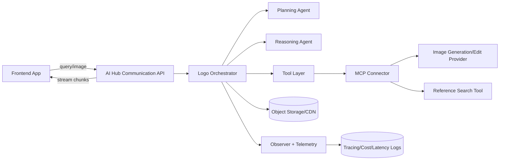
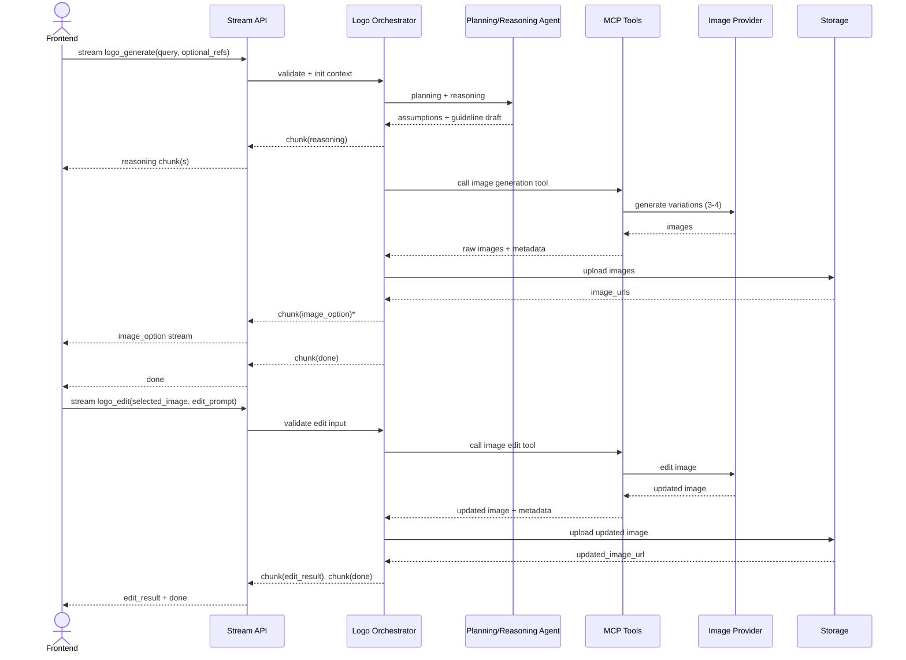

# Technical Design Document (TDD): Logo Design Service POC

## 1. Program Goals

### 1.1 Objectives

Engineering Practices:

- Chuyển từ coding theo từng project nhỏ sang xây dựng service có thể maintain theo team.
- Ưu tiên clean code, validation rõ ràng, và refactoring có cấu trúc.

Agent-based System Design:

- Thiết kế agent có khả năng Planning, Reasoning, Tool Usage thông qua Logo Design POC.

Integration with Team Infrastructure:

- Đóng gói và vận hành service bằng ai-hub-sdk.
- Tích hợp service vào hệ sinh thái hiện tại của team theo chuẩn chung.

### 1.2 Key Deliverables

- Claude Code Skills & Commands:
  - Bộ slash commands hỗ trợ coding, debugging, reviewing và tăng tốc phát triển.
- Logo Design Service (POC):
  - Service hoàn chỉnh nhận logo request, phân tích query, điều phối agent và trả output image.
- Technical Documentation:
  - Tài liệu kiến trúc, vận hành, quality gate, và kế hoạch cải tiến vòng sau.

### 1.3 Success Criteria

- Service Stability:
  - Xử lý ổn định common requests, lỗi thấp, retry có kiểm soát.
- Code Quality:
  - Đạt chuẩn review của team và tuân theo Agent Foundation architecture.
- Ownership:
  - Chủ động điều tra issue, đề xuất edge-case handling, và đóng góp cải tiến.

---

## 2. Scope & Non-goals

### 2.1 Scope

- Agent Logic:
  - Thiết kế workflow Planning, Reasoning, Tool Use cho Logo Agent.
- Tooling:
  - Xây dựng slash commands cho Claude Code để tăng năng suất team.
- Service Integration:
  - Package service qua ai-hub-sdk, validation mạnh bằng Pydantic.
- Refactoring:
  - Nâng code từ mức MVP lên production-grade theo chuẩn team.
- Documentation:
  - Viết technical guides + operational manual cho toàn bộ deliverables.

### 2.2 Non-goals

- UI/UX phức tạp không nằm trong phạm vi chính.
- Không quản lý hạ tầng server/cloud/CI-CD hệ thống.
- Không training/fine-tuning base model.
- Không làm data labeling thủ công quy mô lớn.

---

## 3. Technical Stack & Environment

- Core Framework:
  - ai-hub-sdk là orchestration + packaging layer chính.
- Connectivity:
  - MCP (Model Context Protocol) cho agent-tool integration chuẩn hóa.
- AI Models:
  - Claude cho vibe coding/dev workflow.
  - Gemini/GPT cho reasoning, vision/image understanding và generation pipeline.
- Data Validation:
  - Pydantic bắt buộc cho mọi I/O schema.
- Development Environment:
  - Claude Code là môi trường chính để build/test/chạy slash commands.
- Coding Standards:
  - PEP8 bắt buộc.
  - Type hints bắt buộc cho function signature và biến quan trọng.
- Commit Strategy:
  - Conventional Commits: feat, fix, refactor, docs, test, chore.
- Engineering Quality:
  - Thiết kế module hóa.
  - Unit tests cho core logic, MCP tool integration, và reasoning flow.
- Runtime Infrastructure:
  - Docker + Git workflow.
- Git Workflow:
  - Feature branching + pull request + code review trước merge.
- Documentation:
  - Viết Markdown trong repo, có section Refactor in next stage bắt buộc.

---

## 4. Product Spec Synthesis

Nguồn yêu cầu chính lấy từ [spec.md](spec.md):

- Core flow POC đã chốt:
  - request -> analyze -> guideline -> generate 3-4 logos -> select -> edit -> regenerate.
- Clarification là conditional, user được skip và hệ thống phải công khai assumptions.
- Reasoning cần hiển thị theo từng bước (Input Understanding, Style Inference, Image Analysis khi có).
- Output ảnh tối thiểu PNG 1024x1024, quality đủ tốt để review.

Ánh xạ vào ai-hub-sdk:

- Task-first architecture: mỗi stage triển khai như task độc lập.
- Stream mode là kênh chính để FE nhận reasoning và kết quả incremental.
- Schema-driven validation qua TaskInputBaseModel/TaskOutputBaseModel.

---

## 5. Proposed System Architecture

### 5.1 High-Level Architecture



### 5.2 Workflow Logic (Agent Pipeline)

1. Intent Gate:
   - Detect logo-design intent từ query.
2. Input Parsing:
   - Parse text + optional image reference.
3. Clarification Gate:
   - Nếu thiếu dữ liệu, hỏi clarification.
   - Nếu skip, tạo assumptions có cấu trúc.
4. Planning:
   - Lập kế hoạch generation path và tool calls.
5. Reasoning:
   - Xuất reasoning chunks cho FE.
6. Guideline Synthesis:
   - Tạo design guideline rõ ràng trước generate.
7. Image Generation:
   - Generate 3-4 logo options, stream từng option.
8. Selection & Edit:
   - User chọn option, gửi edit prompt.
9. Regeneration:
   - Regenerate 1 output mặc định + edit summary.
10. Follow-up Suggestions:
   - Trả quick-action suggestions.

### 5.3 Orchestrator Design

Logo Orchestrator chịu trách nhiệm:

- Quản lý state theo request/session.
- Điều phối Planning Agent, Reasoning Agent, và tools.
- Bảo đảm order của stream chunks (sequence tăng dần).
- Chuẩn hóa error mapping và retry policy.
- Ghi telemetry cho latency/cost/quality flags.

Mô hình triển khai trong ai-hub-sdk:

- Task 1: logo_analyze
- Task 2: logo_generate
- Task 3: logo_edit
- Serving mode: STREAM-first, fallback ASYNC/SYNC tùy use case.

### 5.4 Request Sequence (Generate + Edit)



---

## 6. Data Schema (Pydantic)

```python
from typing import Any, Dict, List, Literal, Optional
from pydantic import BaseModel, Field, HttpUrl


class ReferenceImage(BaseModel):
    source_url: Optional[HttpUrl] = None
    storage_key: Optional[str] = None
    note: Optional[str] = None


class BrandContext(BaseModel):
    brand_name: Optional[str] = None
    industry: Optional[str] = None
    target_audience: Optional[str] = None
    style_preference: List[str] = Field(default_factory=list)
    color_preference: List[str] = Field(default_factory=list)
    symbol_preference: List[str] = Field(default_factory=list)


class Assumption(BaseModel):
    key: str
    value: str
    reason: str


class ClarificationQuestion(BaseModel):
    key: str
    question: str
    required: bool = False


class LogoGenerateInput(BaseModel):
    session_id: str
    query: str
    references: List[ReferenceImage] = Field(default_factory=list)
    allow_skip_clarification: bool = True
    variation_count: int = Field(default=4, ge=3, le=4)
    output_format: Literal["png"] = "png"
    output_size: Literal["1024x1024"] = "1024x1024"


class DesignGuideline(BaseModel):
    concept_statement: str
    style_direction: List[str]
    color_palette: List[str]
    typography_direction: List[str]
    icon_direction: List[str]
    constraints: List[str]
    assumptions: List[Assumption] = Field(default_factory=list)


class LogoOption(BaseModel):
    option_id: str
    image_url: HttpUrl
    prompt_used: Optional[str] = None
    seed: Optional[int] = None
    quality_flags: List[str] = Field(default_factory=list)


class LogoGenerateOutput(BaseModel):
    guideline: DesignGuideline
    options: List[LogoOption]


class LogoEditInput(BaseModel):
    session_id: str
    selected_option_id: str
    selected_image_url: HttpUrl
    edit_prompt: str
    guideline: DesignGuideline


class LogoEditOutput(BaseModel):
    updated_image_url: HttpUrl
    edit_summary: str
    preserved_elements: List[str] = Field(default_factory=list)


class StreamEnvelope(BaseModel):
    request_id: str
    session_id: str
    task_type: Literal["logo_analyze", "logo_generate", "logo_edit"]
    status: Literal["processing", "completed", "failed"]
    chunk_type: Literal[
        "reasoning", "clarification", "guideline", "image_option",
        "edit_result", "suggestion", "warning", "error", "done"
    ]
    sequence: int
    payload: Dict[str, Any] = Field(default_factory=dict)
    metadata: Dict[str, Any] = Field(default_factory=dict)
```

Validation rules bắt buộc:

- Query không rỗng, trim whitespace.
- variation_count chỉ 3 hoặc 4.
- Edit bắt buộc có selected image + edit prompt.
- Khi skip clarification, assumptions phải có ít nhất 1 phần tử.

---

## 7. API & Service Integration

### 7.1 Backend Endpoints

- Stream Generate:
  - POST /internal/v1/tasks/stream với task_type logo_generate.
- Stream Edit:
  - POST /internal/v1/tasks/stream với task_type logo_edit.
- Async fallback:
  - POST /internal/v1/tasks/submit
  - GET /internal/v1/tasks/{task_id}/status

### 7.2 External API Calls

- LLM API:
  - Intent detection, planning, reasoning, guideline synthesis.
- Vision API (optional in POC stretch):
  - Analyze reference image style/color/iconography.
- Image API:
  - Generate 3-4 logo options.
  - Edit selected logo theo prompt.

### 7.3 MCP Integration

MCP tools chuẩn hóa gọi ra ngoài:

- mcp_logo_generate_tool
- mcp_logo_edit_tool
- mcp_reference_search_tool

Mỗi tool phải có:

- Input schema rõ ràng.
- Timeout + retry policy.
- Structured error mapping về error_code nội bộ.

---

## 8. Frontend Stack Proposal

Mục tiêu FE cho POC là light-weight, tập trung vào render stream + canvas preview:

- Framework:
  - Next.js hoặc React + TypeScript.
- State:
  - TanStack Query cho request lifecycle.
  - Zustand hoặc Redux Toolkit cho session UI state.
- Streaming:
  - Ưu tiên NDJSON stream qua HTTP gateway.
  - Fallback gRPC-web nếu cần hiệu năng cao.
- UI Blocks tối thiểu:
  - Chat timeline (reasoning chunks)
  - Guideline panel
  - Logo gallery 3-4 options
  - Canvas preview (pan/zoom)
  - Edit prompt input + follow-up quick actions

Contract BE-FE là StreamEnvelope; FE không phụ thuộc logic nội bộ của task.

---

## 9. Engineering Practices & Quality Gates

### 9.1 Code Standards

- PEP8 bắt buộc.
- Type hints bắt buộc cho function signatures.
- Mỗi module giữ phạm vi rõ ràng, tránh god-object.

### 9.2 Testing Strategy

- Unit tests:
  - Validation logic
  - Agent planning/reasoning pipeline
  - Tool adapters qua MCP
  - Error mapping
- Integration tests:
  - stream generate
  - stream edit
  - async fallback flow

### 9.3 Git & Review

- Feature branch theo ticket.
- Conventional Commits.
- PR bắt buộc có test evidence + checklist QA.

### 9.4 Slash Commands Deliverable

Bộ command đề xuất cho Claude Code:

- /logo-intent-check
- /logo-schema-validate
- /logo-debug-stream
- /logo-review
- /logo-refactor-suggest

Mục tiêu là chuẩn hóa workflow coding, debug và review của team.

---

## 10. Build vs Defer (Implementation Scope)

| Area | Build in POC | Defer |
| :--- | :--- | :--- |
| Intent + planning | Intent detection + planning skeleton | Multi-agent planner competition |
| Reasoning | Structured streaming reasoning | Advanced self-critique loops |
| Image generation | Single provider, 3-4 outputs | Multi-model routing and ranking |
| Editing | Prompt-based edit on selected logo | Region-level edit, smart mark |
| Reference image | Basic support input + optional analysis | Full multimodal deep analysis |
| FE | Stream render, gallery, canvas basic | Complex UI design system |
| Ops | Docker run + logs + basic tracing | Infra scaling and CI/CD ownership |

---

## 11. Risks & Open Issues

### 11.1 Key Risks

- Latency vượt ngưỡng khi tạo 3-4 ảnh.
- Quality biến động giữa các lần generate.
- Chi phí tăng mạnh nếu edit lặp nhiều lần.
- Race condition khi user gửi nhiều edit song song.

### 11.2 Mitigation

- Stream reasoning sớm để giữ UX.
- Hard timeout cho từng external call.
- Retry giới hạn 1 lần cho lỗi transient.
- Rate limit theo session + queue edit requests.

### 11.3 Open Decisions

- Chốt chuẩn stream chính: NDJSON hay gRPC stream cho FE production.
- Chính sách TTL/signed URL cho ảnh.
- Rule deterministic seed cho edit consistency.
- Mức quality gate: hard fail hay soft warning.

---

## 12. Refactor in Next Stage

- Tách Orchestrator thành layer độc lập theo use case (generate/edit/follow-up).
- Trừu tượng hóa tool adapters thành plugin registry.
- Bổ sung model router cho A/B quality-cost optimization.
- Chuẩn hóa domain error catalog + retry class.
- Bổ sung contract tests giữa BE stream envelope và FE parser.
- Tối ưu observability:
  - dashboard cho latency, cost, success rate theo stage.

---

## 13. Expected Outcome

- Approved Technical Design Document.
- Clear, implementation-ready architecture cho team BE/FE.
- Foundation phù hợp để bắt đầu coding phase ngay trong feature branch.

Definition of ready for implementation:

- Schema đã chốt.
- API contract đã chốt.
- Build/defer boundaries rõ ràng.
- Test strategy và quality gates rõ ràng.
